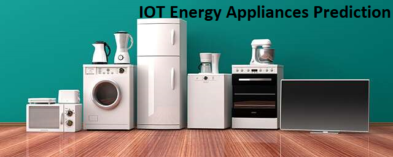
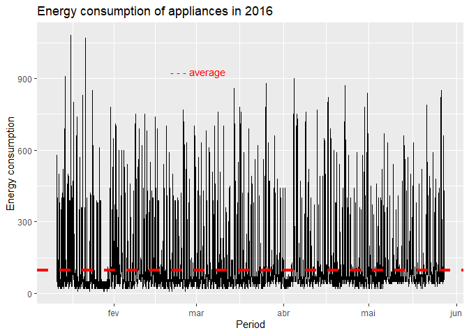
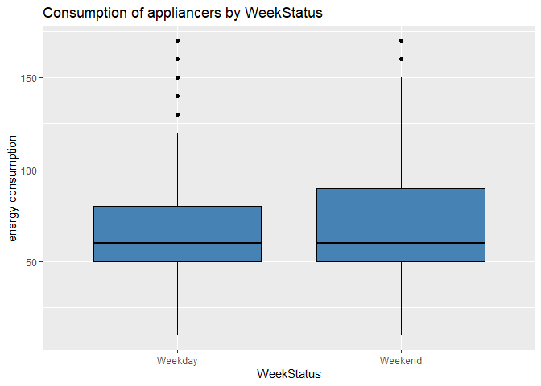
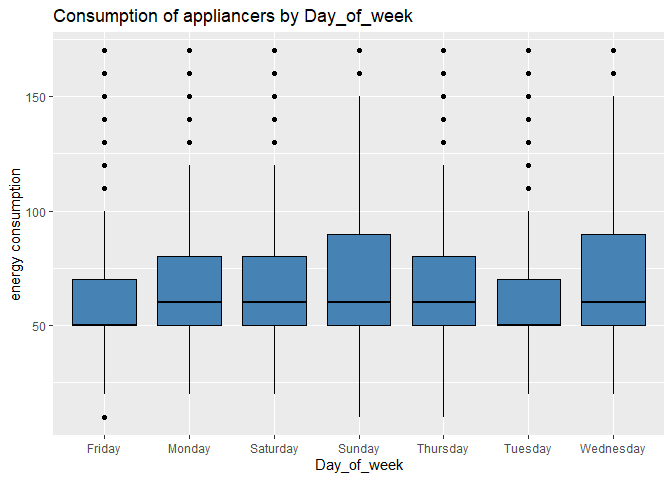
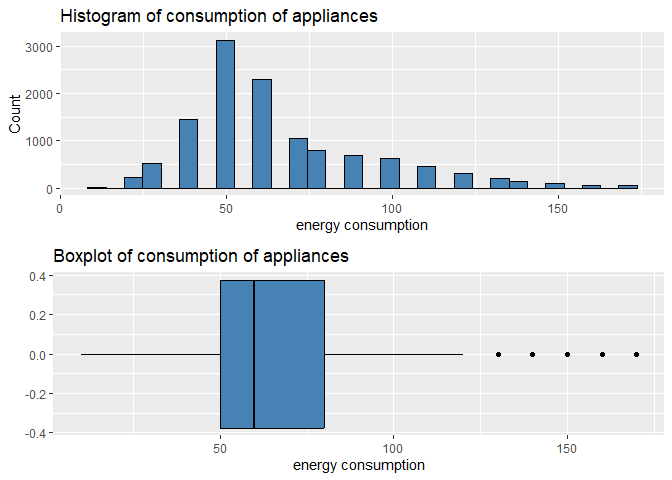
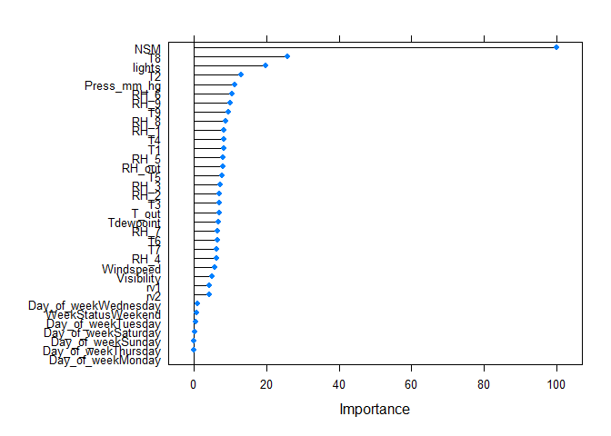
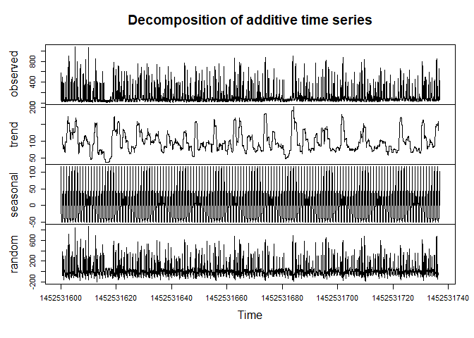
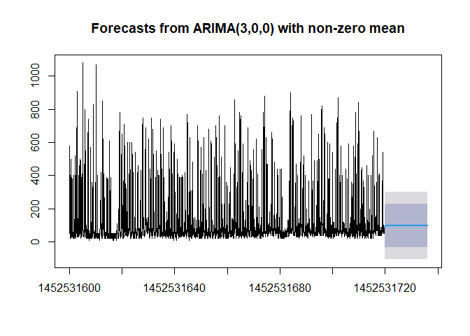
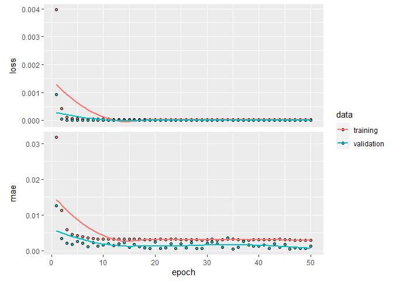
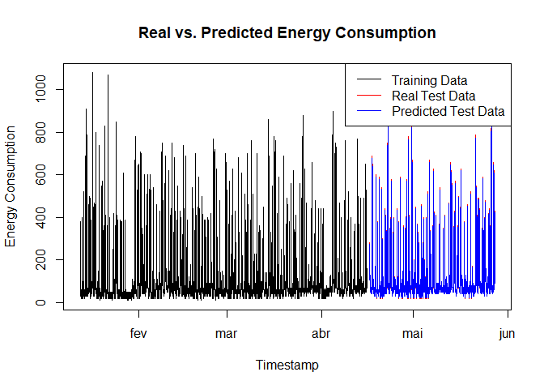

 

# IOT Energy Consumption Home Appliances Prediction

**This is part of the fourth training course of https://www.datascienceacademy.com.br/ Data Scientist program.**

 

# Definition

This project aims to create a model for forecasting the **energy consumption of home appliances** using data from IOT sensors.

# Dataset

Data were collected through IOT temperature and humidity sensors
installed in a house every 10 minutes, and were complemented with
weather forecast data from a nearby airport station and with light
consumption data.

| **Feature Name** | **Description**                          |
|------------------|------------------------------------------|
| **date**         | Time of the data collection              |
| **Appliances**   | Consumption of appliances, in Wh         |
| **lights**       | Light consumption in the house, in Wh    |
| **T1…T9**        | Temperature in the sensors, in °C        |
| **RH_1…RH_9**    | Relative humidity in the sensors, in %   |
| **T_out**        | Temperature outside the house, in °C     |
| **Press_mm_hg**  | Air pressure, in mm Hg                   |
| **RH_out**       | Relative humidity ouside the house, in % |
| **Windspeed**    | Wind Speed, in m/s                       |
| **Visibility**   | Visibility, in km                        |
| **Tdewpoint**    | Dew point temperature, in °C             |
| **rv1**          | Random variable 1, nondimensional        |
| **rv2**          | Random variable 2, nondimensional        |
| **NSM**          | Number of seconds from midnight          |
| **Day_of_week**  | Day of the week                          |
| **WeekStatus**   | Weekday or weekend                       |

# First analysis: filtering outliers

## Exploratory analysis

### Plot of energy consumption

 

### Energy consumption by categorical features

 

 

- By these graph plots, there was probably a difference in the consumption among the days in which the data were measured and extracted, indicating that **`Week status`, `Day of week` or both could be used as predictive features**.

### Histogram and boxplot of energy consumption

 

- Despite some remaining outliers, seen in the boxplot, it was possible to understand the distribution of the feature `Appliance`, where **most of the data** were located around **50 Wh** and whose **median** was the same as before, **60 Wh**. In practice, We approximated the mean to the median.

## Splitting data for the first predictive model

From our exploratory analysis, we decided to choose the following features as **first inputs** to our regression models: `Lights`, `T2`, `T8`, `RH_out`, `NSM` and `WeekStatus`. As we previously concluded, the other features might conduct to multicollinearity or were already represented by the chosen ones. Since `WeekStatus` contained only categorical data, we made use of One Hot Encoding method to transform these data into numbers.

## Normalizing data

Before the process of training we needed to perform normalization of the features, so that we **prevented features with wider ranges from dominating others**. For this purpose, we took the minimum and maximum values from the training set and used them to normalize both, the training and test set.

## Choosing and training first models

For our regression project, we decided to first test the following machine learning models: **Linear Regression**, **KNN**, **SVM** and **XGBoost**.

For our first running, we considered the previously selected features trained across a 5-fold-cross validation method (in order to avoid randomness of evaluation).

## Evaluating first models

Our main objective for this project was to deliver a model that will be used to predict the Energy Consumption of home appliances.

In this case, we were concerned in reducing the error of our model. Three metrics were used to evaluate the result: **R²** or coefficient of determination, which is the proportion of the variance for a dependent variable that is explained by independend variables; **MAE** or mean absolute error, which is the average absolute error between actual and predicted values; **RMSE** or root mean square error, which is the starndard deviation of the residuals (prediction errors).

## Training second model

We also trained a **Random Forest model** using all the variables in our dataset and, afterwards, used feature optimization models to try to identify which of them could eventually be discarded.

 

- A **few features** were responsible for explaining much of the forecast model variance.
- Some variables had a high correlation with each other and could theoretically be **omitted**.
- Categorical features had **lower** explanatory power than random variables in the Random Forest model.

With Recursive Feature Elimination model using Random Forest as the estimator algorithm we saw that the **top 5 variables** (out of 37) were `NSM`, `lights`, `T8`, `Press_mm_hg` and `RH_5`.

## Training third model

Based on the results obtained previously through variable optimization and exploratory analysis, we trained our third model using the following features: `T2`, `T8`, `Press_mm_hg`, `RH_out` and `NSM`. Our goal was to improve, or at least maintain, the prediction efficiency, while reducing the dimensionality and, consequently, the complexity of the model.

## Evaluating optimized model

- Random Forest model **improved performance** in all metrics evaluated in relation to previous models.
- Even though there was a small drop in performance in the optimized features model, it was possible to drastically **reduce the complexity** of the predictive model, maintaining quality.
- There was a **significant improvement** in the quality of the model when confronted with the test data set.

# Second analysis: Keeping outliers

The next step was to evaluate our models with the original dataset, that is, without removing the outliers.

## Overview of the second analysis

In general, we could observe that the error scores of the forecast models created by **keeping the outliers** data in the original dataset were **lower** than that of the respective models in the first analysis. The **R²** coeficient, on the other hand, decreased in all the model (this score is better suited for linear regression than non-linear
models). However, when we bring the data into normal scale we see, in fact, that the scores got worse compared to before. This fact suggests that machine learning predictive models are **sensitive** to the presence of extreme data, justifying the performance of a careful prior exploratory analysis.

# Third analysis: time series prediction

The energy consumption data behave in the form of **time series**, with a supposedly seasonality, as would be expected for this type of observation. For this reason, it became opportune to compare the quality of forecasting models with time series to the models already created.

## Arima model

Decomposition of the time series for the target variable:

 

Final result:

 

Our conclusion was that the model was **not statiscally conclusive**. In order to work around this problem, we must test other orders of the model including, possibly, the differencings that we performed or test other variations like Sarima model.

## RNN LSTM model

We created and trained our LSTM model, which consisted of **three different layers**: the lstm layer, responsible for acquring the patterns from the data, a dropout layer to prevent overfitting and a final dense layer with the activation function (linear activation function by default):

 

- The model was able to **converge quickly** to a very satisfactory score.
- Cross-validation data attested to model **consistency**.

After fitting the model, we were able to test it with the data saved in the test set. In order to compare with the models already created, we returned the data to the original scale before calculating the scores.

 

# Final Considerations

- By keeping the **outliers data**, surprisingly, there was a visible improvement in the ability of the models to adapt to the variances of the studied features. However, it was noticed that models with a linear kernel suffered worse explanatory quality.
- Among the machine learning models studied, **Random Forest** was the one that brought the best metrics to the test data, obtaining **R² = 0.69**, **RMSE = 15.54** and **MAE = 10.82**.
- The **Arima** forecasting model was not able to statistically explain the electricity consumption patterns.
- The **RNN LSTM** model obtained the best result among the studied models, training univariate data based only on the target variable and its time series behavior. The final scores were **MAE = 0.79** and **RMSE = 1.48**.
- Although some features studied in this project showed good explanatory capacity for the energy consumption of home appliances, such as the `T2` and `T8` sensors, and external `air pressure` and `humidity`, the **seasonal and characteristic time series behavior** of the target variable proved to be decisive for the quality of the model. This fact could also be checked in the multivariate machine learning models, where the `NSM` feature presented the best general prediction explainability.
- Some extra improvements can be studied, such as the use of other set of features, other algorithms and also by making feature engineering in the dataset.
