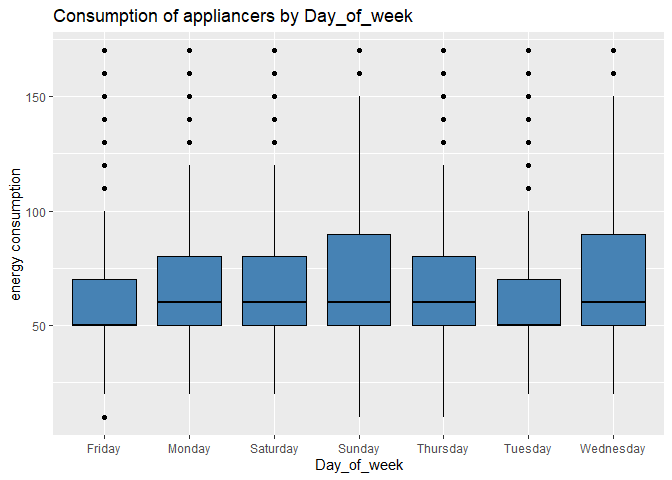

IOT Energy Consumption Home Appliances Prediction
================


# 1. Definition

This project aims to create a model for forecasting the **consumption of
home appliances** using data from IOT sensors.

# 2. Dataset

Data were collected through IOT temperature and humidity sensors
installed in a house every 10 minutes, and were complemented with
weather forecast data from a nearby airport station and with light
consumption data.

| **Feature Name** | **Description**                          |
|------------------|------------------------------------------|
| **date**         | Time of the data collection              |
| **Appliances**   | Consumption of appliances, in Wh         |
| **lights**       | Light consumption in the house, in Wh    |
| **T1…T9**        | Temperature in the sensors, in °C        |
| **RH_1…RH_9**    | Relative humidity in the sensors, in %   |
| **T_out**        | Temperature outside the house, in °C     |
| **Press_mm_hg**  | Air pressure, in mm Hg                   |
| **RH_out**       | Relative humidity ouside the house, in % |
| **Windspeed**    | Wind Speed, in m/s                       |
| **Visibility**   | Visibility, in km                        |
| **Tdewpoint**    | Dew point temperature, in °C             |
| **rv1**          | Random variable 1, nondimensional        |
| **rv2**          | Random variable 2, nondimensional        |
| **NSM**          | Number of seconds from midnight          |
| **Day_of_week**  | Day of the week                          |
| **WeekStatus**   | Weekday or weekend                       |

# 3. Setting working directory

``` r
setwd("C:/Users/fabiano/OneDrive/DSA/Machine_Learning/Projetos/projeto8-data_files/IOT_energy_prediction")
getwd()
```

    ## [1] "C:/Users/fabiano/OneDrive/DSA/Machine_Learning/Projetos/projeto8-data_files/IOT_energy_prediction"

# 4. Importing libraries

``` r
library('ggplot2', quietly = T)
library("readr", quietly = T)
library("dplyr", quietly = T)
library('gridExtra', quietly = T)
library('corrplot', quietly = T)
library('caret', quietly = T)
library('caTools', quietly = T)
library('tseries', quietly = T)
library('ramify', quietly = T)
library('mltools', quietly = T)
library('data.table', quietly = T)
library('ggcorrplot', quietly = T)
library('polycor', quietly = T)
library('Boruta', quietly = T)
library('doParallel', quietly = T)
library('knitr', quietly = T)
library(forecast, quietly = T)
library(tseries, quietly = T)
#library(keras, quietly = T)
#library(tensorflow, quietly = T)
```

# 5. Reading dataset

``` r
df_training <- read_csv('data/projeto8-training.csv')

df_testing <- read_csv('data/projeto8-testing.csv')
```

# 6. Data exploration

## 6.1 Combining datasets

For the purpose of this project we will **bind the two datasets** at
this point and split the final dataset later on.

``` r
df_final <- rbind(df_training, df_testing)

df_final$WeekStatus <- as.factor(df_final$WeekStatus)

df_final$Day_of_week <- as.factor(df_final$Day_of_week)
```

## 6.2 Summary

``` r
dim(df_final)
```

    ## [1] 19735    32

``` r
str(df_final)
```

    ## spc_tbl_ [19,735 × 32] (S3: spec_tbl_df/tbl_df/tbl/data.frame)
    ##  $ date       : POSIXct[1:19735], format: "2016-01-11 17:00:00" "2016-01-11 17:10:00" ...
    ##  $ Appliances : num [1:19735] 60 60 50 60 50 60 60 70 430 250 ...
    ##  $ lights     : num [1:19735] 30 30 30 40 40 50 40 40 50 40 ...
    ##  $ T1         : num [1:19735] 19.9 19.9 19.9 19.9 19.9 ...
    ##  $ RH_1       : num [1:19735] 47.6 46.7 46.3 46.3 46 ...
    ##  $ T2         : num [1:19735] 19.2 19.2 19.2 19.2 19.2 ...
    ##  $ RH_2       : num [1:19735] 44.8 44.7 44.6 44.5 44.5 ...
    ##  $ T3         : num [1:19735] 19.8 19.8 19.8 19.8 19.8 ...
    ##  $ RH_3       : num [1:19735] 44.7 44.8 44.9 45 44.9 ...
    ##  $ T4         : num [1:19735] 19 19 18.9 18.9 18.9 ...
    ##  $ RH_4       : num [1:19735] 45.6 46 45.9 45.5 45.7 ...
    ##  $ T5         : num [1:19735] 17.2 17.2 17.2 17.2 17.1 ...
    ##  $ RH_5       : num [1:19735] 55.2 55.2 55.1 55.1 55 ...
    ##  $ T6         : num [1:19735] 7.03 6.83 6.56 6.37 6.3 ...
    ##  $ RH_6       : num [1:19735] 84.3 84.1 83.2 84.9 85.8 ...
    ##  $ T7         : num [1:19735] 17.2 17.2 17.2 17.2 17.1 ...
    ##  $ RH_7       : num [1:19735] 41.6 41.6 41.4 41.2 41.3 ...
    ##  $ T8         : num [1:19735] 18.2 18.2 18.2 18.1 18.1 ...
    ##  $ RH_8       : num [1:19735] 48.9 48.9 48.7 48.6 48.6 ...
    ##  $ T9         : num [1:19735] 17 17.1 17 17 17 ...
    ##  $ RH_9       : num [1:19735] 45.5 45.6 45.5 45.4 45.3 ...
    ##  $ T_out      : num [1:19735] 6.6 6.48 6.37 6.13 6.02 ...
    ##  $ Press_mm_hg: num [1:19735] 734 734 734 734 734 ...
    ##  $ RH_out     : num [1:19735] 92 92 92 92 92 ...
    ##  $ Windspeed  : num [1:19735] 7 6.67 6.33 5.67 5.33 ...
    ##  $ Visibility : num [1:19735] 63 59.2 55.3 47.7 43.8 ...
    ##  $ Tdewpoint  : num [1:19735] 5.3 5.2 5.1 4.9 4.8 ...
    ##  $ rv1        : num [1:19735] 13.3 18.6 28.6 10.1 44.9 ...
    ##  $ rv2        : num [1:19735] 13.3 18.6 28.6 10.1 44.9 ...
    ##  $ NSM        : num [1:19735] 61200 61800 62400 63600 64200 65400 66000 66600 68400 69000 ...
    ##  $ WeekStatus : Factor w/ 2 levels "Weekday","Weekend": 1 1 1 1 1 1 1 1 1 1 ...
    ##  $ Day_of_week: Factor w/ 7 levels "Friday","Monday",..: 2 2 2 2 2 2 2 2 2 2 ...
    ##  - attr(*, "spec")=
    ##   .. cols(
    ##   ..   date = col_datetime(format = ""),
    ##   ..   Appliances = col_double(),
    ##   ..   lights = col_double(),
    ##   ..   T1 = col_double(),
    ##   ..   RH_1 = col_double(),
    ##   ..   T2 = col_double(),
    ##   ..   RH_2 = col_double(),
    ##   ..   T3 = col_double(),
    ##   ..   RH_3 = col_double(),
    ##   ..   T4 = col_double(),
    ##   ..   RH_4 = col_double(),
    ##   ..   T5 = col_double(),
    ##   ..   RH_5 = col_double(),
    ##   ..   T6 = col_double(),
    ##   ..   RH_6 = col_double(),
    ##   ..   T7 = col_double(),
    ##   ..   RH_7 = col_double(),
    ##   ..   T8 = col_double(),
    ##   ..   RH_8 = col_double(),
    ##   ..   T9 = col_double(),
    ##   ..   RH_9 = col_double(),
    ##   ..   T_out = col_double(),
    ##   ..   Press_mm_hg = col_double(),
    ##   ..   RH_out = col_double(),
    ##   ..   Windspeed = col_double(),
    ##   ..   Visibility = col_double(),
    ##   ..   Tdewpoint = col_double(),
    ##   ..   rv1 = col_double(),
    ##   ..   rv2 = col_double(),
    ##   ..   NSM = col_double(),
    ##   ..   WeekStatus = col_character(),
    ##   ..   Day_of_week = col_character()
    ##   .. )
    ##  - attr(*, "problems")=<externalptr>

``` r
summary(df_final)
```

    ##       date                       Appliances          lights      
    ##  Min.   :2016-01-11 17:00:00   Min.   :  10.00   Min.   : 0.000  
    ##  1st Qu.:2016-02-14 23:15:00   1st Qu.:  50.00   1st Qu.: 0.000  
    ##  Median :2016-03-20 05:30:00   Median :  60.00   Median : 0.000  
    ##  Mean   :2016-03-20 05:30:00   Mean   :  97.69   Mean   : 3.802  
    ##  3rd Qu.:2016-04-23 11:45:00   3rd Qu.: 100.00   3rd Qu.: 0.000  
    ##  Max.   :2016-05-27 18:00:00   Max.   :1080.00   Max.   :70.000  
    ##                                                                  
    ##        T1             RH_1             T2             RH_2      
    ##  Min.   :16.79   Min.   :27.02   Min.   :16.10   Min.   :20.46  
    ##  1st Qu.:20.76   1st Qu.:37.33   1st Qu.:18.79   1st Qu.:37.90  
    ##  Median :21.60   Median :39.66   Median :20.00   Median :40.50  
    ##  Mean   :21.69   Mean   :40.26   Mean   :20.34   Mean   :40.42  
    ##  3rd Qu.:22.60   3rd Qu.:43.07   3rd Qu.:21.50   3rd Qu.:43.26  
    ##  Max.   :26.26   Max.   :63.36   Max.   :29.86   Max.   :56.03  
    ##                                                                 
    ##        T3             RH_3             T4             RH_4      
    ##  Min.   :17.20   Min.   :28.77   Min.   :15.10   Min.   :27.66  
    ##  1st Qu.:20.79   1st Qu.:36.90   1st Qu.:19.53   1st Qu.:35.53  
    ##  Median :22.10   Median :38.53   Median :20.67   Median :38.40  
    ##  Mean   :22.27   Mean   :39.24   Mean   :20.86   Mean   :39.03  
    ##  3rd Qu.:23.29   3rd Qu.:41.76   3rd Qu.:22.10   3rd Qu.:42.16  
    ##  Max.   :29.24   Max.   :50.16   Max.   :26.20   Max.   :51.09  
    ##                                                                 
    ##        T5             RH_5             T6              RH_6      
    ##  Min.   :15.33   Min.   :29.82   Min.   :-6.065   Min.   : 1.00  
    ##  1st Qu.:18.28   1st Qu.:45.40   1st Qu.: 3.627   1st Qu.:30.02  
    ##  Median :19.39   Median :49.09   Median : 7.300   Median :55.29  
    ##  Mean   :19.59   Mean   :50.95   Mean   : 7.911   Mean   :54.61  
    ##  3rd Qu.:20.62   3rd Qu.:53.66   3rd Qu.:11.256   3rd Qu.:83.23  
    ##  Max.   :25.80   Max.   :96.32   Max.   :28.290   Max.   :99.90  
    ##                                                                  
    ##        T7             RH_7             T8             RH_8      
    ##  Min.   :15.39   Min.   :23.20   Min.   :16.31   Min.   :29.60  
    ##  1st Qu.:18.70   1st Qu.:31.50   1st Qu.:20.79   1st Qu.:39.07  
    ##  Median :20.03   Median :34.86   Median :22.10   Median :42.38  
    ##  Mean   :20.27   Mean   :35.39   Mean   :22.03   Mean   :42.94  
    ##  3rd Qu.:21.60   3rd Qu.:39.00   3rd Qu.:23.39   3rd Qu.:46.54  
    ##  Max.   :26.00   Max.   :51.40   Max.   :27.23   Max.   :58.78  
    ##                                                                 
    ##        T9             RH_9           T_out         Press_mm_hg   
    ##  Min.   :14.89   Min.   :29.17   Min.   :-5.000   Min.   :729.3  
    ##  1st Qu.:18.00   1st Qu.:38.50   1st Qu.: 3.667   1st Qu.:750.9  
    ##  Median :19.39   Median :40.90   Median : 6.917   Median :756.1  
    ##  Mean   :19.49   Mean   :41.55   Mean   : 7.412   Mean   :755.5  
    ##  3rd Qu.:20.60   3rd Qu.:44.34   3rd Qu.:10.408   3rd Qu.:760.9  
    ##  Max.   :24.50   Max.   :53.33   Max.   :26.100   Max.   :772.3  
    ##                                                                  
    ##      RH_out         Windspeed        Visibility      Tdewpoint     
    ##  Min.   : 24.00   Min.   : 0.000   Min.   : 1.00   Min.   :-6.600  
    ##  1st Qu.: 70.33   1st Qu.: 2.000   1st Qu.:29.00   1st Qu.: 0.900  
    ##  Median : 83.67   Median : 3.667   Median :40.00   Median : 3.433  
    ##  Mean   : 79.75   Mean   : 4.040   Mean   :38.33   Mean   : 3.761  
    ##  3rd Qu.: 91.67   3rd Qu.: 5.500   3rd Qu.:40.00   3rd Qu.: 6.567  
    ##  Max.   :100.00   Max.   :14.000   Max.   :66.00   Max.   :15.500  
    ##                                                                    
    ##       rv1                rv2                NSM          WeekStatus   
    ##  Min.   : 0.00532   Min.   : 0.00532   Min.   :    0   Weekday:14263  
    ##  1st Qu.:12.49789   1st Qu.:12.49789   1st Qu.:21600   Weekend: 5472  
    ##  Median :24.89765   Median :24.89765   Median :43200                  
    ##  Mean   :24.98803   Mean   :24.98803   Mean   :42907                  
    ##  3rd Qu.:37.58377   3rd Qu.:37.58377   3rd Qu.:64200                  
    ##  Max.   :49.99653   Max.   :49.99653   Max.   :85800                  
    ##                                                                       
    ##     Day_of_week  
    ##  Friday   :2845  
    ##  Monday   :2778  
    ##  Saturday :2736  
    ##  Sunday   :2736  
    ##  Thursday :2880  
    ##  Tuesday  :2880  
    ##  Wednesday:2880

Let’s print out the final dataframe:

``` r
kable(head(df_final))
```

| date                | Appliances | lights |       T1 |     RH_1 |   T2 |     RH_2 |    T3 |     RH_3 |       T4 |     RH_4 |       T5 |  RH_5 |       T6 |     RH_6 |       T7 |     RH_7 |   T8 |     RH_8 |       T9 |  RH_9 |    T_out | Press_mm_hg |   RH_out | Windspeed | Visibility | Tdewpoint |      rv1 |      rv2 |   NSM | WeekStatus | Day_of_week |
|:--------------------|-----------:|-------:|---------:|---------:|-----:|---------:|------:|---------:|---------:|---------:|---------:|------:|---------:|---------:|---------:|---------:|-----:|---------:|---------:|------:|---------:|------------:|---------:|----------:|-----------:|----------:|---------:|---------:|------:|:-----------|:------------|
| 2016-01-11 17:00:00 |         60 |     30 | 19.89000 | 47.59667 | 19.2 | 44.79000 | 19.79 | 44.73000 | 19.00000 | 45.56667 | 17.16667 | 55.20 | 7.026667 | 84.25667 | 17.20000 | 41.62667 | 18.2 | 48.90000 | 17.03333 | 45.53 | 6.600000 |    733.5000 | 92.00000 |  7.000000 |   63.00000 |  5.300000 | 13.27543 | 13.27543 | 61200 | Weekday    | Monday      |
| 2016-01-11 17:10:00 |         60 |     30 | 19.89000 | 46.69333 | 19.2 | 44.72250 | 19.79 | 44.79000 | 19.00000 | 45.99250 | 17.16667 | 55.20 | 6.833333 | 84.06333 | 17.20000 | 41.56000 | 18.2 | 48.86333 | 17.06667 | 45.56 | 6.483333 |    733.6000 | 92.00000 |  6.666667 |   59.16667 |  5.200000 | 18.60619 | 18.60619 | 61800 | Weekday    | Monday      |
| 2016-01-11 17:20:00 |         50 |     30 | 19.89000 | 46.30000 | 19.2 | 44.62667 | 19.79 | 44.93333 | 18.92667 | 45.89000 | 17.16667 | 55.09 | 6.560000 | 83.15667 | 17.20000 | 41.43333 | 18.2 | 48.73000 | 17.00000 | 45.50 | 6.366667 |    733.7000 | 92.00000 |  6.333333 |   55.33333 |  5.100000 | 28.64267 | 28.64267 | 62400 | Weekday    | Monday      |
| 2016-01-11 17:40:00 |         60 |     40 | 19.89000 | 46.33333 | 19.2 | 44.53000 | 19.79 | 45.00000 | 18.89000 | 45.53000 | 17.20000 | 55.09 | 6.366667 | 84.89333 | 17.20000 | 41.23000 | 18.1 | 48.59000 | 17.00000 | 45.40 | 6.133333 |    733.9000 | 92.00000 |  5.666667 |   47.66667 |  4.900000 | 10.08410 | 10.08410 | 63600 | Weekday    | Monday      |
| 2016-01-11 17:50:00 |         50 |     40 | 19.89000 | 46.02667 | 19.2 | 44.50000 | 19.79 | 44.93333 | 18.89000 | 45.73000 | 17.13333 | 55.03 | 6.300000 | 85.76667 | 17.13333 | 41.26000 | 18.1 | 48.59000 | 17.00000 | 45.29 | 6.016667 |    734.0000 | 92.00000 |  5.333333 |   43.83333 |  4.800000 | 44.91948 | 44.91948 | 64200 | Weekday    | Monday      |
| 2016-01-11 18:10:00 |         60 |     50 | 19.85667 | 45.56000 | 19.2 | 44.50000 | 19.73 | 44.90000 | 18.89000 | 45.86333 | 17.10000 | 54.90 | 6.190000 | 86.42333 | 17.10000 | 41.20000 | 18.1 | 48.59000 | 17.00000 | 45.29 | 5.916667 |    734.1667 | 91.83333 |  5.166667 |   40.00000 |  4.683333 | 33.03989 | 33.03989 | 65400 | Weekday    | Monday      |

## 6.3 Arranging by date column

By binding both datasets we observe that the final dataframe became
unorganized in terms of the index (date column). Let’s **order the
rows** of the final dataframe by date:

``` r
df_final <- df_final %>% arrange(date)
```

## 6.4 Checking for missing values

``` r
column_names <- colnames(df_final)

missing_values <- c()

for (column in column_names){
  missing_values[column] <- sum(is.na(df_final[column]))
}

missing_values
```

    ##        date  Appliances      lights          T1        RH_1          T2 
    ##           0           0           0           0           0           0 
    ##        RH_2          T3        RH_3          T4        RH_4          T5 
    ##           0           0           0           0           0           0 
    ##        RH_5          T6        RH_6          T7        RH_7          T8 
    ##           0           0           0           0           0           0 
    ##        RH_8          T9        RH_9       T_out Press_mm_hg      RH_out 
    ##           0           0           0           0           0           0 
    ##   Windspeed  Visibility   Tdewpoint         rv1         rv2         NSM 
    ##           0           0           0           0           0           0 
    ##  WeekStatus Day_of_week 
    ##           0           0

- We don’t observe **any missing value in the dataset**.

## 6.5 Plot of energy consumption

We can now plot our target feature, `Appliances`, over time:

``` r
appliances_consumption <- ggplot(df_final, aes (x = .data[['date']], y = `Appliances`)) +
  geom_line() + 
  labs(title = "Energy consumption of appliances in 2016", x = "Period", y = "Energy consumption") +
  geom_hline(yintercept = mean(df_final$Appliances), linetype = "dashed", color = 'red', linewidth = 1.5) +
  annotate("text", x = as.POSIXct("2016-03-01 17:00:00"), y = 930, label = "- - - average", color = 'red')

print(appliances_consumption)
```

<!-- -->

- As already seen, the mean of Energy Consumption during the period of
  analysis is around **100 Wh**.
- Another interesting point to evaluate is that the data seem to have a
  **seasonal behavior**, which is a usual fact when considering house
  energy consumption. In order to check this we can choose random data
  in similar period of time, as follow.

## 6.6 Time series of certain periods

Let’s take daily, weekly and monthly data in both january and april:

``` r
cons_1_day_jan <- df_final %>% filter(between(date, as.POSIXct('2016-01-18 00:00:00', 'GMT'), as.POSIXct('2016-01-19 00:00:00', 'GMT')))

cons_1_week_jan <- df_final %>% filter(between(date, as.POSIXct('2016-01-18 00:00:00', 'GMT'), as.POSIXct('2016-01-25 00:00:00', 'GMT')))

cons_1_month_jan <- df_final %>% filter(between(date, as.POSIXct('2016-01-18 00:00:00', 'GMT'), as.POSIXct('2016-02-18 00:00:00', 'GMT')))

cons_1_day_apr <- df_final %>% filter(between(date, as.POSIXct('2016-04-18 00:00:00', 'GMT'), as.POSIXct('2016-04-19 00:00:00', 'GMT')))

cons_1_week_apr <- df_final %>% filter(between(date, as.POSIXct('2016-04-18 00:00:00', 'GMT'), as.POSIXct('2016-04-25 00:00:00', 'GMT')))

cons_1_month_apr <- df_final %>% filter(between(date, as.POSIXct('2016-04-18 00:00:00', 'GMT'), as.POSIXct('2016-05-18 00:00:00', 'GMT')))

p1 <- ggplot(cons_1_day_jan, aes (x = .data[['date']], y = `Appliances`)) +
  geom_line() +
  labs(title = "Energy consumption of appliances in 1 day", x = "Period", y = "Energy consumption")

p2 <- ggplot(cons_1_week_jan, aes (x = .data[['date']], y = `Appliances`)) +
  geom_line() +
  labs(title = "Energy consumption of appliances in 1 week", x = "Period", y = "Energy consumption")

p3 <- ggplot(cons_1_month_jan, aes (x = .data[['date']], y = `Appliances`)) +
  geom_line() +
  labs(title = "Energy consumption of appliances in 1 month", x = "Period", y = "Energy consumption")

p4 <- ggplot(cons_1_day_apr, aes (x = .data[['date']], y = `Appliances`)) +
  geom_line() +
  labs(title = "Energy consumption of appliances in 1 day", x = "Period", y = "Energy consumption")

p5 <- ggplot(cons_1_week_apr, aes (x = .data[['date']], y = `Appliances`)) +
  geom_line()+
  labs(title = "Energy consumption of appliances in 1 week", x = "Period", y = "Energy consumption")

p6 <- ggplot(cons_1_month_apr, aes (x = .data[['date']], y = `Appliances`)) +
  geom_line()+
  labs(title = "Energy consumption of appliances in 1 month", x = "Period", y = "Energy consumption")

grid.arrange(p1, p2, p3, p4, p5, p6, nrow = 2, ncol = 3)
```

<!-- -->

- It is possible to observe that, in fact, there might be a **high auto
  correlation** inside the different time series, that can be later
  better explored.

## 6.7 Histogram and boxplot of energy consumption

``` r
histogram_appliances <- ggplot(df_final, aes(x = Appliances), binwidth = 30) +
  geom_histogram(alpha = 1, bins=30, color="black",fill="steelblue") +
  labs(title = "Histogram of consumption of appliances", x = "energy consumption", y = "Count")

boxplot_appliances <- ggplot(df_final, aes(x = Appliances)) +
  geom_boxplot(color="black",fill="steelblue") + 
  labs(title = "Boxplot of consumption of appliances", x = "energy consumption", y = "")

grid.arrange(histogram_appliances, boxplot_appliances, ncol = 1)
```

<!-- -->

- Clearly there is a considerable high number of **outliers** in the
  dataset that might affect our predictive model. For this reason, we
  will create **two separate analysis** either dropping or kepping the
  outliers.

# 7. First analysis: filtering outliers

Let’s start by filtering outliers from numeric columns that exceed both
upper and lower limits as established as follows:

``` r
df_numeric <- df_final[, c(1:30)]

dim(df_numeric)
```

    ## [1] 19735    30

``` r
outliers <- function(x) {
  
  Q1 <- quantile(x, probs=.25)
  Q3 <- quantile(x, probs=.75)
  iqr = Q3-Q1
  
  upper_limit = Q3 + (iqr*1.5)
  lower_limit = Q1 - (iqr*1.5)
  
  x > upper_limit | x < lower_limit
}

remove_outliers <- function(df, cols = names(df)) {
  for (col in cols) {
    df <- df[!outliers(df[[col]]),]
  }
  df
}


df_numeric_no_outlier <- remove_outliers(df_numeric[, -3])

dim((df_numeric_no_outlier))
```

    ## [1] 12076    29

``` r
dates_aux <- c(df_numeric_no_outlier$date)


df_no_outlier <- df_final[df_final$date %in% dates_aux, ]

dim(df_no_outlier)
```

    ## [1] 12076    32

## 7.1 Exploratory analysis

### 7.1.1 Histogram and boxplot of energy consumption

After dropping outliers from our dataset, we can visualize once more the
distribution of our target variable `Appliances`.

``` r
histogram_appliances <- ggplot(df_no_outlier, aes(x = Appliances), binwidth = 30) +
  geom_histogram(alpha = 1, bins=30, color="black",fill="steelblue") +
  labs(title = "Histogram of consumption of appliances", x = "energy consumption", y = "Count")

boxplot_appliances <- ggplot(df_no_outlier, aes(x = Appliances)) +
  geom_boxplot(color="black",fill="steelblue") + 
  labs(title = "Boxplot of consumption of appliances", x = "energy consumption", y = "")

grid.arrange(histogram_appliances, boxplot_appliances, ncol = 1)
```

<!-- -->

``` r
summary(df_no_outlier$Appliances)
```

    ##    Min. 1st Qu.  Median    Mean 3rd Qu.    Max. 
    ##   10.00   50.00   60.00   66.12   80.00  170.00

- Despite some remaining outliers, seen in the boxplot, it is now
  possible to better understand the distribution of the feature
  `Appliance`, where **most of the data** are located around **50 Wh**
  and whose **median** is the same as before, **60 Wh**. In practice, We
  approximated the mean to the median.

### 7.1.2 Energy consumption by categorical features

``` r
df_categorical_no_outlier <- df_no_outlier[, c(31:32)]

for (column in colnames(df_categorical_no_outlier)){
  
  plot <- ggplot(df_no_outlier, aes(x = .data[[column]], y = `Appliances`)) +
    geom_boxplot(color = 'black', fill = 'steelblue') +
    labs(title = paste("Consumption of appliancers by", column), x = column, y = "energy consumption")
  
  print(plot)
  
}
```

<!-- --><!-- -->

- It seems there is a relevant difference in the consumption among the
  days in which the data were measured and extracted, indicating that
  **`Week status`, `Day of week` or both can be used as predictive
  features**.

### 7.1.3 Energy consumption by numerical features

``` r
for (column in colnames(df_numeric)){
  
  if (column != "Appliances" & column != 'date'){
    
    plot <- ggplot(df_no_outlier, aes(x = .data[[column]], y = `Appliances`)) +
      geom_point() + 
      labs(title = paste("Consumption of appliancers x", column), x = column, y = "energy consumption")
    
    print(plot)
  }
}
```

<!-- --><!-- --><!-- --><!-- --><!-- --><!-- --><!-- --><!-- --><!-- --><!-- --><!-- --><!-- --><!-- --><!-- --><!-- --><!-- --><!-- --><!-- --><!-- --><!-- --><!-- --><!-- --><!-- --><!-- --><!-- --><!-- --><!-- --><!-- -->

``` r
ggplot(df_no_outlier, aes(x = .data[['NSM']])) +
  geom_boxplot(color = 'black', fill = 'steelblue') +
  labs(title = "Boxplot of NSM", x = 'NSM')
```

<!-- -->

``` r
ggplot(df_no_outlier, aes(x = .data[['Press_mm_hg']])) +
  geom_boxplot(color = 'black', fill = 'steelblue') +
  labs(title = "Boxplot of Press_mm_hg", x = 'Pressure in mmHg')
```

<!-- -->

``` r
df_no_outlier %>% 
  select(-c('date', 'WeekStatus', 'Day_of_week', 'NSM', 'Press_mm_hg')) %>%
  boxplot(main = 'Boxplot of the numerical features', col = 'steelblue', xlab = 'feature')
```

<!-- -->

- By the last scatter plots, an interpretation of a **tendency** of any
  kind between our target feature and the other numerical variables is
  **inconclusive** or hard to identify. This possible relation will be
  verified in the sequence through a correlation plot.
- Finally, the boxplot of the numerical features indicates that there is
  a **considerable range** among them, whose normalization might be
  necessary prior to creation of some of the predictive models.

### 7.1.4 Feature correlation for numerical variables

``` r
corr_filter <- df_no_outlier[, c(2:27, 30)]

matrix_correlation <- cor(corr_filter)

cor.mtest <- function(mat, ...) {
  mat <- as.matrix(mat)
  n <- ncol(mat)
  p.mat<- matrix(NA, n, n)
  diag(p.mat) <- 0
  for (i in 1:(n - 1)) {
    for (j in (i + 1):n) {
      tmp <- cor.test(mat[, i], mat[, j], ...)
      p.mat[i, j] <- p.mat[j, i] <- tmp$p.value
    }
  }
  colnames(p.mat) <- rownames(p.mat) <- colnames(mat)
  p.mat
}

p.mat <- cor.mtest(corr_filter)

ggcorrplot(matrix_correlation, hc.order = TRUE, type = "lower",
           lab = TRUE, p.mat = p.mat, insig = "blank", lab_size= 2.5)
```

<!-- -->

- From the temperature features measured by the sensors in the house,
  **`T8` and `T2`** have the **higher positive correlation** with our
  target variable `Appliances`. There is a high positive correlation
  between some of the temperature variables.
- **`T_out`** has a **positive** but **not** so **high correlation**
  with `Appliances`.
- Considering the relative **humidity sensors**, it seems that some of
  them have considerable **negative correlation** (except `RH_1`) with
  `Appliances`. However, there is also a high correlation among them,
  which can cause multicollinearity and affect negatively the
  interpretation of some predictive models.
- **`Press_mm_hg`, `Windspeed`, `Tdewpoint` and `Visibility`** seem to
  have **no prediction power** for energy consumption.
- There is a relatively **high positive correlation** between the
  feature `NSM` and `Appliances`.

### 7.1.5 Statistical tests for categorical features

In the case of categorical features, we can apply statistical tests in
order to verify their significance.

Shapiro Test of normality for `WeekStatus`:

``` r
weekday_no_outlier <- subset(df_no_outlier, WeekStatus == 'Weekday')

sample_weekday <- sample(x = weekday_no_outlier$Appliances, size = 5000)

weekday_norm <- shapiro.test(sample_weekday)

weekday_norm
```

    ## 
    ##  Shapiro-Wilk normality test
    ## 
    ## data:  sample_weekday
    ## W = 0.88342, p-value < 2.2e-16

``` r
weekend_no_outlier <- subset(df_no_outlier, WeekStatus == 'Weekend')

sample_weekend <- weekend_no_outlier$Appliances

weekend_norm <- shapiro.test(sample_weekend)
weekend_norm
```

    ## 
    ##  Shapiro-Wilk normality test
    ## 
    ## data:  sample_weekend
    ## W = 0.90947, p-value < 2.2e-16

- The p-value indicates that the feature **`WeekStatus` does not follow
  a normal distribution**, which means we will have to use a
  non-parametric test of significanfe.

Non-parametric Kruskal-Wallis Test for `WeekStatus`:

``` r
kruskal_test_1 <- kruskal.test(Appliances ~ WeekStatus, data = df_no_outlier)

kruskal_test_1
```

    ## 
    ##  Kruskal-Wallis rank sum test
    ## 
    ## data:  Appliances by WeekStatus
    ## Kruskal-Wallis chi-squared = 49.175, df = 1, p-value = 2.341e-12

- As the p-value is less than the set significance level of 0.05, we can
  conclude that **there are significant differences in the consumption
  of the appliances considering the status of the day**.

Shapiro Test of normality for `Day of Week`:

``` r
day_of_week <- c(unique(df_no_outlier$Day_of_week))

for (day in day_of_week){
  
  df_subset <- subset(df_no_outlier, Day_of_week == day)
  
  df_day <- df_subset$Appliances
  
  day_test <- shapiro.test(df_day)
  
  print(day)
  
  print(day_test)
  
}
```

    ## [1] "Monday"
    ## 
    ##  Shapiro-Wilk normality test
    ## 
    ## data:  df_day
    ## W = 0.87937, p-value < 2.2e-16
    ## 
    ## [1] "Tuesday"
    ## 
    ##  Shapiro-Wilk normality test
    ## 
    ## data:  df_day
    ## W = 0.8442, p-value < 2.2e-16
    ## 
    ## [1] "Wednesday"
    ## 
    ##  Shapiro-Wilk normality test
    ## 
    ## data:  df_day
    ## W = 0.92221, p-value < 2.2e-16
    ## 
    ## [1] "Thursday"
    ## 
    ##  Shapiro-Wilk normality test
    ## 
    ## data:  df_day
    ## W = 0.8946, p-value < 2.2e-16
    ## 
    ## [1] "Friday"
    ## 
    ##  Shapiro-Wilk normality test
    ## 
    ## data:  df_day
    ## W = 0.88515, p-value < 2.2e-16
    ## 
    ## [1] "Saturday"
    ## 
    ##  Shapiro-Wilk normality test
    ## 
    ## data:  df_day
    ## W = 0.90613, p-value < 2.2e-16
    ## 
    ## [1] "Sunday"
    ## 
    ##  Shapiro-Wilk normality test
    ## 
    ## data:  df_day
    ## W = 0.91327, p-value < 2.2e-16

- The variable **`Day of Week` does not follow a normal distribution
  either**.

Kruskal-Wallis Test for `Day of Week`:

``` r
kruskal_test_2 <- kruskal.test(Appliances ~ Day_of_week, data = df_no_outlier)

kruskal_test_2
```

    ## 
    ##  Kruskal-Wallis rank sum test
    ## 
    ## data:  Appliances by Day_of_week
    ## Kruskal-Wallis chi-squared = 168.66, df = 6, p-value < 2.2e-16

- **There are significant differences in the days of the week**. We can
  conduct a Paired Samples Willcoxon Test to calculate pairwise
  comparisons between group levels with corrections for multiple
  testing.

Paired Samples Willcoxon Test for `Day of Week`:

``` r
wilcoxon_test_2 <- pairwise.wilcox.test(df_no_outlier$Appliances,
                                        df_no_outlier$Day_of_week,
                                        p.adjust.method="bonferroni", exact = FALSE)
wilcoxon_test_2
```

    ## 
    ##  Pairwise comparisons using Wilcoxon rank sum test with continuity correction 
    ## 
    ## data:  df_no_outlier$Appliances and df_no_outlier$Day_of_week 
    ## 
    ##           Friday  Monday  Saturday Sunday  Thursday Tuesday
    ## Monday    4.9e-05 -       -        -       -        -      
    ## Saturday  0.00010 1.00000 -        -       -        -      
    ## Sunday    < 2e-16 0.00039 0.00149  -       -        -      
    ## Thursday  1.00000 0.00565 0.00778  1.9e-12 -        -      
    ## Tuesday   1.00000 2.0e-07 1.4e-06  < 2e-16 1.00000  -      
    ## Wednesday 7.4e-13 0.03604 0.11050  1.00000 3.1e-09  < 2e-16
    ## 
    ## P value adjustment method: bonferroni

- We can see that **some of the pairs are significantly different (p\<
  0.05)**.

### 7.1.6 Correlation between the two categorical variables

We can also check, with the help of the function **Polychor**, the
correlation between the two categorical features.

``` r
polychor(df_no_outlier$WeekStatus, df_no_outlier$Day_of_week)
```

    ## [1] -0.2274961

- There’s a **negative correlation** between the two categorical
  features that might affect the effiency of the predictive model if
  both are used.

## 7.2 Checking the best features with Boruta function

Boruta function can select the most important features by using a subset
of features and training a model with them. Based on the inferences that
it draws from the previous model, it decides to add or remove features
from the subset.

``` r
features_boruta <- Boruta(Appliances~., data = df_no_outlier[, c(2:32)], doTrace = 2)

plot(features_boruta)
```

<!-- -->

``` r
importance_history <- features_boruta$ImpHistory

sorted_importance <- sort(colMeans(importance_history, na.rm = TRUE), decreasing = TRUE)

sorted_importance
```

    ##         NSM      lights Press_mm_hg        RH_1          T8          T2 
    ## 49.80095505 38.14533508 37.38425279 35.29534649 32.43722834 32.37113501 
    ##        RH_9   Tdewpoint          T9        RH_3          T5        RH_2 
    ## 30.06930407 29.51208494 29.38096801 29.24484276 28.80479652 28.13021860 
    ##        RH_5          T4        RH_4 Day_of_week        RH_8       T_out 
    ## 28.04516238 27.85611254 27.73561031 27.22796929 27.01406456 26.47561265 
    ##          T1   Windspeed          T6          T3        RH_7      RH_out 
    ## 26.39798570 26.38511239 26.19925461 25.70638730 25.06249561 24.67678712 
    ##          T7        RH_6  Visibility  WeekStatus         rv1         rv2 
    ## 24.66665595 23.73590587 21.56238973 14.36955702  4.42582762  4.19025429 
    ##   shadowMax  shadowMean   shadowMin 
    ##  2.37551070  0.02416745 -2.43285430

- Although Boruta **didn’t find any unimportant feature**, it gives us
  an important overview of the features and can be used together with
  our previous assumptions to determine which variables affect most our
  predictive model.

## 7.3 Splitting data for the first predictive model

From our exploratory analysis, we decided to choose the following
features as **first inputs** to our regression models: `Lights`, `T2`,
`T8`, `RH_out`, `NSM` and `WeekStatus`. As we previously concluded, the
other features might conduct to multicollinearity or were already
represented by the chosen ones. Since `WeekStatus` contains only
categorical data, we’ll make use of One Hot Encoding method to transform
these data into numbers.

``` r
model_1 <- df_no_outlier[, c(2, 3, 6, 18, 24, 30, 31)]

model_1 <- one_hot(as.data.table(model_1))

model_1 <- model_1[, c(-7)]

set.seed(57)

sample <- sample.split(model_1$Appliances, SplitRatio = 0.85)

train_validation  <- data.frame(subset(model_1, sample == TRUE))

test   <- data.frame(subset(model_1, sample == FALSE))
```

``` r
dim(train_validation)
```

    ## [1] 10263     7

``` r
dim(test)
```

    ## [1] 1813    7

## 7.4 Normalizing data

Before the process of training we need to perform normalization of the
features, so that we **prevent features with wider ranges from
dominating others**. For this purpose, we’ll take the minimum and
maximum values from the training set and use them to normalize both, the
training and test set.

``` r
train_min <- data.frame(as.list(train_validation[, c(-7)] %>% apply(2, min)))

train_max <- data.frame(as.list(train_validation[, c(-7)] %>% apply(2, max)))

col_names <- names(train_validation[, c(-7)])

for (i in col_names){
  train_validation[, i] <- (train_validation[, i] - train_min[, i])/(train_max[, i] - train_min[, i])
  test[, i] <-  (test[, i] - train_min[, i])/(train_max[, i] - train_min[, i])
}
```

## 7.5 Choosing and training first models

For our regression project, we decided to first test the following
machine learning models: **Linear Regression**, **KNN**, **SVM** and
**XGBoost**.

For our first running, we will consider the previously selected features
trained across a 5-fold-cross validation method (in order to avoid
randomness of evaluation).

``` r
models = c("lm", "knn", 'svmLinear',"xgbLinear")

model_trained_1 <- c()

set.seed(57) 

train.control <- trainControl(method = "cv", number = 5)

for (model in models){
  model_trained_1[[model]] <- train(`Appliances` ~ ., data = train_validation, 
                                    method = model,
                                    trControl = train.control,
                                    metric = 'Rsquared', 
                                    verbosity = 0)
}

print(model_trained_1)
```

    ## $lm
    ## Linear Regression 
    ## 
    ## 10263 samples
    ##     6 predictor
    ## 
    ## No pre-processing
    ## Resampling: Cross-Validated (5 fold) 
    ## Summary of sample sizes: 8210, 8210, 8209, 8213, 8210 
    ## Resampling results:
    ## 
    ##   RMSE       Rsquared   MAE      
    ##   0.1479924  0.2791812  0.1092302
    ## 
    ## Tuning parameter 'intercept' was held constant at a value of TRUE
    ## 
    ## $knn
    ## k-Nearest Neighbors 
    ## 
    ## 10263 samples
    ##     6 predictor
    ## 
    ## No pre-processing
    ## Resampling: Cross-Validated (5 fold) 
    ## Summary of sample sizes: 8212, 8209, 8210, 8210, 8211 
    ## Resampling results across tuning parameters:
    ## 
    ##   k  RMSE       Rsquared   MAE       
    ##   5  0.1157794  0.5619675  0.07926207
    ##   7  0.1172926  0.5485457  0.08121315
    ##   9  0.1187889  0.5363359  0.08285610
    ## 
    ## Rsquared was used to select the optimal model using the largest value.
    ## The final value used for the model was k = 5.
    ## 
    ## $svmLinear
    ## Support Vector Machines with Linear Kernel 
    ## 
    ## 10263 samples
    ##     6 predictor
    ## 
    ## No pre-processing
    ## Resampling: Cross-Validated (5 fold) 
    ## Summary of sample sizes: 8211, 8209, 8211, 8211, 8210 
    ## Resampling results:
    ## 
    ##   RMSE       Rsquared   MAE      
    ##   0.1503616  0.2764112  0.1075377
    ## 
    ## Tuning parameter 'C' was held constant at a value of 1
    ## 
    ## $xgbLinear
    ## eXtreme Gradient Boosting 
    ## 
    ## 10263 samples
    ##     6 predictor
    ## 
    ## No pre-processing
    ## Resampling: Cross-Validated (5 fold) 
    ## Summary of sample sizes: 8209, 8211, 8210, 8212, 8210 
    ## Resampling results across tuning parameters:
    ## 
    ##   lambda  alpha  nrounds  RMSE       Rsquared   MAE       
    ##   0e+00   0e+00   50      0.1167227  0.5523267  0.08227713
    ##   0e+00   0e+00  100      0.1168758  0.5534695  0.08195447
    ##   0e+00   0e+00  150      0.1172993  0.5525440  0.08225432
    ##   0e+00   1e-04   50      0.1165191  0.5537490  0.08198579
    ##   0e+00   1e-04  100      0.1160032  0.5595677  0.08134506
    ##   0e+00   1e-04  150      0.1164742  0.5581050  0.08155193
    ##   0e+00   1e-01   50      0.1152734  0.5631114  0.08094952
    ##   0e+00   1e-01  100      0.1140000  0.5736685  0.07976247
    ##   0e+00   1e-01  150      0.1138383  0.5759151  0.07953964
    ##   1e-04   0e+00   50      0.1166881  0.5525006  0.08211813
    ##   1e-04   0e+00  100      0.1165293  0.5558624  0.08146476
    ##   1e-04   0e+00  150      0.1167364  0.5564243  0.08153433
    ##   1e-04   1e-04   50      0.1165189  0.5537505  0.08198556
    ##   1e-04   1e-04  100      0.1161305  0.5586725  0.08157504
    ##   1e-04   1e-04  150      0.1164790  0.5583344  0.08178217
    ##   1e-04   1e-01   50      0.1152733  0.5631122  0.08094946
    ##   1e-04   1e-01  100      0.1138881  0.5744907  0.07970164
    ##   1e-04   1e-01  150      0.1136286  0.5775623  0.07943396
    ##   1e-01   0e+00   50      0.1163065  0.5555176  0.08199377
    ##   1e-01   0e+00  100      0.1160700  0.5588478  0.08169075
    ##   1e-01   0e+00  150      0.1161984  0.5595300  0.08177865
    ##   1e-01   1e-04   50      0.1167184  0.5525137  0.08222637
    ##   1e-01   1e-04  100      0.1164837  0.5559378  0.08170936
    ##   1e-01   1e-04  150      0.1166705  0.5565405  0.08184406
    ##   1e-01   1e-01   50      0.1152645  0.5629928  0.08117935
    ##   1e-01   1e-01  100      0.1140900  0.5730573  0.08018693
    ##   1e-01   1e-01  150      0.1137124  0.5769931  0.07970536
    ## 
    ## Tuning parameter 'eta' was held constant at a value of 0.3
    ## Rsquared was used to select the optimal model using the largest value.
    ## The final values used for the model were nrounds = 150, lambda = 1e-04, alpha
    ##  = 0.1 and eta = 0.3.

Let’s detail the results of **Linear Regression**:

``` r
lm_summary <- (summary(model_trained_1$lm))

print(lm_summary)
```

    ## 
    ## Call:
    ## lm(formula = .outcome ~ ., data = dat, verbosity = 0)
    ## 
    ## Residuals:
    ##      Min       1Q   Median       3Q      Max 
    ## -0.44431 -0.09263 -0.01901  0.06523  0.75322 
    ## 
    ## Coefficients:
    ##                     Estimate Std. Error t value Pr(>|t|)    
    ## (Intercept)         0.181892   0.008329  21.838  < 2e-16 ***
    ## lights              0.302328   0.010610  28.493  < 2e-16 ***
    ## T2                  0.056143   0.009716   5.779 7.75e-09 ***
    ## T8                  0.176336   0.008562  20.595  < 2e-16 ***
    ## RH_out             -0.068892   0.007339  -9.387  < 2e-16 ***
    ## NSM                 0.158092   0.005555  28.458  < 2e-16 ***
    ## WeekStatus_Weekend  0.015881   0.003344   4.749 2.07e-06 ***
    ## ---
    ## Signif. codes:  0 '***' 0.001 '**' 0.01 '*' 0.05 '.' 0.1 ' ' 1
    ## 
    ## Residual standard error: 0.148 on 10256 degrees of freedom
    ## Multiple R-squared:  0.2788, Adjusted R-squared:  0.2784 
    ## F-statistic: 660.9 on 6 and 10256 DF,  p-value: < 2.2e-16

And check the assumption of normality of the residuals:

``` r
shapiro.test(sample(x = lm_summary$residuals, size = 5000))
```

    ## 
    ##  Shapiro-Wilk normality test
    ## 
    ## data:  sample(x = lm_summary$residuals, size = 5000)
    ## W = 0.94926, p-value < 2.2e-16

## 7.6 Evaluating first models

Our main objective for this project is to deliver a model that will be
used to predict the Energy Consumption of home appliances.

In this case, we are concerned in reducing the error of our model. Three
metrics will be used to evaluate the result: **R²** or coefficient of
determination, which is the proportion of the variance for a dependent
variable that is explained by independend variables; **MAE** or mean
absolute error, which is the average absolute error between actual and
predicted values; **RMSE** or root mean square error, which is the
starndard deviation of the residuals (prediction errors).

``` r
predict_models_1 <- predict(model_trained_1, newdata = test)

for (i in 1:length(predict_models_1)){
  
  print(names(predict_models_1[i]))
  
  result <- postResample(pred = predict_models_1[[i]], obs = test$Appliances)
  
  print(result)
  
  print("------------------------------------------------------------------------------")
}
```

    ## [1] "lm"
    ##      RMSE  Rsquared       MAE 
    ## 0.1482890 0.2796337 0.1103003 
    ## [1] "------------------------------------------------------------------------------"
    ## [1] "knn"
    ##       RMSE   Rsquared        MAE 
    ## 0.10689394 0.62655199 0.07307065 
    ## [1] "------------------------------------------------------------------------------"
    ## [1] "svmLinear"
    ##      RMSE  Rsquared       MAE 
    ## 0.1503206 0.2760766 0.1083917 
    ## [1] "------------------------------------------------------------------------------"
    ## [1] "xgbLinear"
    ##       RMSE   Rsquared        MAE 
    ## 0.10913460 0.61129080 0.07760618 
    ## [1] "------------------------------------------------------------------------------"

- **Linear regression model**: The model is statistically significant (p
  value of the F test \< defined significance level of 5%), and the
  chosen explanatory variables are also statistically significant.
  However, the necessary assumption of normality of the residuals was
  not verified .The model was able to keep its results in the test set,
  but presented comparatively lower metrics than its peers.
- **KNN model**: The model improved the results in the test set to an
  optimized k-value of 5 and presented the second best result among the
  models studied for the training set.
- **SVM model**: Support Vector Machine model did not present a
  satisfactory result, getting its evaluation metrics worse than the
  Linear Regression model, and kept the performance in the test set.
- **XGBoost model**: Among the studied predictive models, it was the one
  that presented the best metrics for the training set, using the
  following optimized hyperparameters, nrounds = 150, lambda = 0.0001,
  alpha = 0.1 and eta = 0.3. There was a relevant improvement in
  efficiency in the test set.

## 7.7 Training second model

We will also train a **Random Forest model** using all the variables in
our dataset and, afterwards, use feature optimization models to try to
identify which of them could eventually be discarded:

``` r
model_2 <- df_no_outlier[, c(2:32)]

set.seed(57)

sample_2 <- sample.split(model_2$Appliances, SplitRatio = 0.85)

train_validation_2  <- data.frame(subset(model_2, sample_2 == TRUE))
test_2   <- data.frame(subset(model_2, sample_2 == FALSE))

train_min <- data.frame(as.list(train_validation_2[, c(-30, -31)] %>% apply(2, min)))

train_max <- data.frame(as.list(train_validation_2[, c(-30, -31)] %>% apply(2, max)))

col_names <- names(train_validation_2[, c(-30, -31)])

for (i in col_names){
  train_validation_2[, i] <- (train_validation_2[, i] - train_min[, i])/(train_max[, i] - train_min[, i])
  test_2[, i] <-  (test_2[, i] - train_min[, i])/(train_max[, i] - train_min[, i])
}

model_trained_2 <- train(`Appliances` ~ ., data = train_validation_2, 
                                  method = 'rf',
                                  trControl = train.control,
                                  metric = 'Rsquared', 
                                  verbosity = 0)

print(model_trained_2)
```

    ## Random Forest 
    ## 
    ## 10263 samples
    ##    30 predictor
    ## 
    ## No pre-processing
    ## Resampling: Cross-Validated (5 fold) 
    ## Summary of sample sizes: 8210, 8211, 8211, 8211, 8209 
    ## Resampling results across tuning parameters:
    ## 
    ##   mtry  RMSE        Rsquared   MAE       
    ##    2    0.10280521  0.6646537  0.06983681
    ##   18    0.09985869  0.6729798  0.06763241
    ##   35    0.10002956  0.6710486  0.06764993
    ## 
    ## Rsquared was used to select the optimal model using the largest value.
    ## The final value used for the model was mtry = 18.

Feature Importance model based on the model previously trained:

``` r
importance <- varImp(model_trained_2, scale=TRUE)

plot(importance)
```

<!-- -->

- A **few features** are responsible for explaining much of the forecast
  model variance.
- Some variables have a high correlation with each other and can
  theoretically be **omitted**.
- Categorical features have **lower** explanatory power than random
  variables in the Random Forest model.

Recursive Feature Elimination model using Random Forest as the estimator
algorithm:

``` r
set.seed(10)

ctrl <- rfeControl(functions = rfFuncs,
                   method = "repeatedcv",
                   repeats = 5,
                   verbose = FALSE)

model_rfe <- one_hot(as.data.table(train_validation_2))

cl <- makeCluster(detectCores(), type='PSOCK')

registerDoParallel(cl)

subsets <- c(1:5, 10, 15, 20, 25, 30, 38)
subsets <- c(1:7)

rfe_model <- rfe(model_rfe[, c(2:38)], c(model_rfe$Appliances),
                 sizes = subsets,
                 rfeControl = ctrl)

rfe_model
```

    ## 
    ## Recursive feature selection
    ## 
    ## Outer resampling method: Cross-Validated (10 fold, repeated 5 times) 
    ## 
    ## Resampling performance over subset size:
    ## 
    ##  Variables    RMSE Rsquared     MAE   RMSESD RsquaredSD    MAESD Selected
    ##          1 0.14497   0.3089 0.10413 0.003987    0.02324 0.002533         
    ##          2 0.14264   0.3377 0.10437 0.006019    0.04671 0.005463         
    ##          3 0.13210   0.4434 0.09538 0.007514    0.05347 0.005980         
    ##          4 0.12620   0.5087 0.09032 0.004071    0.02262 0.002178         
    ##          5 0.12148   0.5539 0.08609 0.004032    0.02009 0.002131         
    ##          6 0.10181   0.6608 0.06907 0.004047    0.02018 0.001964         
    ##          7 0.10095   0.6672 0.06848 0.003983    0.01995 0.001931         
    ##         37 0.09874   0.6808 0.06671 0.003814    0.01885 0.001806        *
    ## 
    ## The top 5 variables (out of 37):
    ##    NSM, lights, T8, Press_mm_hg, RH_5

- The **top 5 variables** (out of 37) were `NSM`, `lights`, `T8`,
  `Press_mm_hg` and `RH_5`.

## 7.8 Training third model

Based on the results obtained previously through variable optimization
and exploratory analysis, we will train our third model using the
following features: `T2`, `T8`, `Press_mm_hg`, `RH_out` and `NSM`. Our
goal is to improve, or at least maintain, the prediction efficiency,
while reducing the dimensionality and, consequently, the complexity of
the model:

``` r
model_3 <- df_no_outlier[, c(2, 6, 18, 23, 24, 30)]

set.seed(57)

sample_3 <- sample.split(model_3$Appliances, SplitRatio = 0.85)
train_validation_3  <- data.frame(subset(model_3, sample_3 == TRUE))
test_3   <- data.frame(subset(model_3, sample_3 == FALSE))


train_min <- data.frame(as.list(train_validation_3 %>% apply(2, min)))

train_max <- data.frame(as.list(train_validation_3 %>% apply(2, max)))

col_names <- names(train_validation_3)

for (i in col_names){
  train_validation_3[, i] <- (train_validation_3[, i] - train_min[, i])/(train_max[, i] - train_min[, i])
  test_3[, i] <-  (test_3[, i] - train_min[, i])/(train_max[, i] - train_min[, i])
}


model_trained_3 <- train(`Appliances` ~ ., data = train_validation_3, 
                         method = 'rf',
                         trControl = train.control,
                         metric = 'Rsquared', 
                         verbosity = 0)

print(model_trained_3)
```

    ## Random Forest 
    ## 
    ## 10263 samples
    ##     5 predictor
    ## 
    ## No pre-processing
    ## Resampling: Cross-Validated (5 fold) 
    ## Summary of sample sizes: 8210, 8211, 8211, 8211, 8209 
    ## Resampling results across tuning parameters:
    ## 
    ##   mtry  RMSE       Rsquared   MAE       
    ##   2     0.1017621  0.6608546  0.06910739
    ##   3     0.1017228  0.6601488  0.06899292
    ##   5     0.1022744  0.6559337  0.06941316
    ## 
    ## Rsquared was used to select the optimal model using the largest value.
    ## The final value used for the model was mtry = 2.

## 7.9 Evaluating optimized model

``` r
predict_models_3 <- predict(model_trained_3, newdata = test_3)

result_3 <- postResample(pred = predict_models_3, obs = test_3$Appliances)
  
print(result_3)
```

    ##       RMSE   Rsquared        MAE 
    ## 0.09714207 0.69282218 0.06760515

- Random Forest model **improved performance** in all metrics evaluated
  in relation to previous models.
- Even though there was a small drop in performance in the optimized
  features model, it was possible to drastically **reduce the
  complexity** of the predictive model, maintaining quality.
- There was a **significant improvement** in the quality of the model
  when confronted with the test data set.

As a way of evaluating the error in the **original scale** and making
subsequent comparisons possible, we will recalculate the last step,
returning the data to its previous form.

``` r
predict_models_adj <- (predict_models_3 * (train_max$Appliances - train_min$Appliances)) + train_min$Appliances

test_adj <- (test_3$Appliances * (train_max$Appliances - train_min$Appliances)) + train_min$Appliances

result_adj <- postResample(pred = predict_models_adj, obs = test_adj)

print(result_adj)
```

    ##       RMSE   Rsquared        MAE 
    ## 15.5427308  0.6928222 10.8168242

# 8. Second analysis: Keeping outliers

The next step is to evaluate our models with the original dataset, that
is, without removing the outliers.

## 8.1 Training fourth model

``` r
model_4 <- df_final[, c(2, 3, 18, 24, 30, 31)]

model_4 <- one_hot(as.data.table(model_4))

model_4 <- model_4[, c(-7)]

set.seed(57)

sample_4 <- sample.split(model_4$Appliances, SplitRatio = 0.85)
train_validation_4  <- data.frame(subset(model_4, sample_4 == TRUE))
test_4   <- data.frame(subset(model_4, sample_4 == FALSE))

train_min <- data.frame(as.list(train_validation_4[, c(-6)] %>% apply(2, min)))

train_max <- data.frame(as.list(train_validation_4[, c(-6)] %>% apply(2, max)))

col_names <- names(train_validation_4[, c(-6)])

for (i in col_names){
  train_validation_4[, i] <- (train_validation_4[, i] - train_min[, i])/(train_max[, i] - train_min[, i])
  test_4[, i] <-  (test_4[, i] - train_min[, i])/(train_max[, i] - train_min[, i])
}

models = c("lm", "knn", 'svmLinear',"xgbLinear")

model_trained_4 <- c()

set.seed(57) 

train.control <- trainControl(method = "cv", number = 5)

for (model in models){
  model_trained_4[[model]] <- train(`Appliances` ~ ., data = train_validation_4, 
                                    method = model,
                                    trControl = train.control,
                                    metric = 'Rsquared', 
                                    verbosity = 0)
}

print(model_trained_4)
```

    ## $lm
    ## Linear Regression 
    ## 
    ## 16778 samples
    ##     5 predictor
    ## 
    ## No pre-processing
    ## Resampling: Cross-Validated (5 fold) 
    ## Summary of sample sizes: 13422, 13423, 13422, 13423, 13422 
    ## Resampling results:
    ## 
    ##   RMSE        Rsquared   MAE       
    ##   0.09207625  0.0814686  0.05150717
    ## 
    ## Tuning parameter 'intercept' was held constant at a value of TRUE
    ## 
    ## $knn
    ## k-Nearest Neighbors 
    ## 
    ## 16778 samples
    ##     5 predictor
    ## 
    ## No pre-processing
    ## Resampling: Cross-Validated (5 fold) 
    ## Summary of sample sizes: 13422, 13424, 13422, 13422, 13422 
    ## Resampling results across tuning parameters:
    ## 
    ##   k  RMSE        Rsquared   MAE       
    ##   5  0.08019250  0.3162186  0.03944389
    ##   7  0.08072622  0.3002569  0.04065439
    ##   9  0.08118416  0.2894444  0.04152103
    ## 
    ## Rsquared was used to select the optimal model using the largest value.
    ## The final value used for the model was k = 5.
    ## 
    ## $svmLinear
    ## Support Vector Machines with Linear Kernel 
    ## 
    ## 16778 samples
    ##     5 predictor
    ## 
    ## No pre-processing
    ## Resampling: Cross-Validated (5 fold) 
    ## Summary of sample sizes: 13423, 13422, 13422, 13423, 13422 
    ## Resampling results:
    ## 
    ##   RMSE        Rsquared    MAE       
    ##   0.09654005  0.07205749  0.04271175
    ## 
    ## Tuning parameter 'C' was held constant at a value of 1
    ## 
    ## $xgbLinear
    ## eXtreme Gradient Boosting 
    ## 
    ## 16778 samples
    ##     5 predictor
    ## 
    ## No pre-processing
    ## Resampling: Cross-Validated (5 fold) 
    ## Summary of sample sizes: 13422, 13423, 13423, 13422, 13422 
    ## Resampling results across tuning parameters:
    ## 
    ##   lambda  alpha  nrounds  RMSE        Rsquared   MAE       
    ##   0e+00   0e+00   50      0.08159775  0.2821616  0.04337120
    ##   0e+00   0e+00  100      0.08190865  0.2841068  0.04350147
    ##   0e+00   0e+00  150      0.08236118  0.2831293  0.04370443
    ##   0e+00   1e-04   50      0.08133070  0.2866788  0.04329851
    ##   0e+00   1e-04  100      0.08168751  0.2874706  0.04339513
    ##   0e+00   1e-04  150      0.08204970  0.2884606  0.04374866
    ##   0e+00   1e-01   50      0.08070360  0.2960283  0.04288401
    ##   0e+00   1e-01  100      0.08042275  0.3048252  0.04260441
    ##   0e+00   1e-01  150      0.08049071  0.3082946  0.04264089
    ##   1e-04   0e+00   50      0.08147953  0.2841703  0.04331556
    ##   1e-04   0e+00  100      0.08174174  0.2866904  0.04342192
    ##   1e-04   0e+00  150      0.08215270  0.2871452  0.04368557
    ##   1e-04   1e-04   50      0.08149893  0.2837804  0.04326632
    ##   1e-04   1e-04  100      0.08175514  0.2859278  0.04337190
    ##   1e-04   1e-04  150      0.08227122  0.2838379  0.04356843
    ##   1e-04   1e-01   50      0.08070354  0.2960293  0.04288399
    ##   1e-04   1e-01  100      0.08042262  0.3048268  0.04260436
    ##   1e-04   1e-01  150      0.08049055  0.3082965  0.04264083
    ##   1e-01   0e+00   50      0.08117875  0.2890436  0.04319377
    ##   1e-01   0e+00  100      0.08127247  0.2946035  0.04326636
    ##   1e-01   0e+00  150      0.08185433  0.2922782  0.04365022
    ##   1e-01   1e-04   50      0.08126556  0.2877915  0.04328667
    ##   1e-01   1e-04  100      0.08162669  0.2886014  0.04333290
    ##   1e-01   1e-04  150      0.08203453  0.2882881  0.04364142
    ##   1e-01   1e-01   50      0.08048161  0.2996220  0.04279674
    ##   1e-01   1e-01  100      0.07994076  0.3124090  0.04254086
    ##   1e-01   1e-01  150      0.07967141  0.3203765  0.04240925
    ## 
    ## Tuning parameter 'eta' was held constant at a value of 0.3
    ## Rsquared was used to select the optimal model using the largest value.
    ## The final values used for the model were nrounds = 150, lambda = 0.1, alpha
    ##  = 0.1 and eta = 0.3.

## 8.2 Evaluating fourth models

``` r
predict_models_4 <- predict(model_trained_4, newdata = test_4)

for (i in 1:length(predict_models_4)){
  
  print(names(predict_models_4[i]))
  
  result <- postResample(pred = predict_models_4[[i]], obs = test_4$Appliances)
  
  print(result)
  
  print("------------------------------------------------------------------------------")
}
```

    ## [1] "lm"
    ##       RMSE   Rsquared        MAE 
    ## 0.09030067 0.07963485 0.05090556 
    ## [1] "------------------------------------------------------------------------------"
    ## [1] "knn"
    ##       RMSE   Rsquared        MAE 
    ## 0.07539857 0.37042193 0.03735165 
    ## [1] "------------------------------------------------------------------------------"
    ## [1] "svmLinear"
    ##       RMSE   Rsquared        MAE 
    ## 0.09452495 0.07372575 0.04216656 
    ## [1] "------------------------------------------------------------------------------"
    ## [1] "xgbLinear"
    ##       RMSE   Rsquared        MAE 
    ## 0.07611200 0.35113164 0.04144193 
    ## [1] "------------------------------------------------------------------------------"

## 8.3 Training fifth model

``` r
model_5 <- df_final[, c(2, 6, 18, 23, 24, 30)]

set.seed(57)

sample_5 <- sample.split(model_5$Appliances, SplitRatio = 0.85)
train_validation_5  <- data.frame(subset(model_5, sample_5 == TRUE))
test_5   <- data.frame(subset(model_5, sample_5 == FALSE))


train_min <- data.frame(as.list(train_validation_5 %>% apply(2, min)))

train_max <- data.frame(as.list(train_validation_5 %>% apply(2, max)))

col_names <- names(train_validation_5)

for (i in col_names){
  train_validation_5[, i] <- (train_validation_5[, i] - train_min[, i])/(train_max[, i] - train_min[, i])
  test_5[, i] <-  (test_5[, i] - train_min[, i])/(train_max[, i] - train_min[, i])
}


model_trained_5 <- train(`Appliances` ~ ., data = train_validation_5, 
                         method = 'rf',
                         trControl = train.control,
                         metric = 'Rsquared', 
                         verbosity = 0)

print(model_trained_5)
```

    ## Random Forest 
    ## 
    ## 16778 samples
    ##     5 predictor
    ## 
    ## No pre-processing
    ## Resampling: Cross-Validated (5 fold) 
    ## Summary of sample sizes: 13422, 13422, 13422, 13422, 13424 
    ## Resampling results across tuning parameters:
    ## 
    ##   mtry  RMSE        Rsquared   MAE       
    ##   2     0.06453566  0.5597094  0.03125570
    ##   3     0.06403074  0.5632674  0.03098392
    ##   5     0.06418006  0.5574281  0.03091217
    ## 
    ## Rsquared was used to select the optimal model using the largest value.
    ## The final value used for the model was mtry = 3.

## 8.4 Evaluating fith model

``` r
predict_models_5 <- predict(model_trained_5, newdata = test_5)

result_5 <- postResample(pred = predict_models_5, obs = test_5$Appliances)

print(result_5)
```

    ##       RMSE   Rsquared        MAE 
    ## 0.05722632 0.63873930 0.02830605

``` r
predict_models_adj <- (predict_models_5 * (train_max$Appliances - train_min$Appliances)) + train_min$Appliances

test_adj <- (test_5$Appliances * (train_max$Appliances - train_min$Appliances)) + train_min$Appliances

result_adj <- postResample(pred = predict_models_adj, obs = test_adj)

print(result_adj)
```

    ##       RMSE   Rsquared        MAE 
    ## 61.2321589  0.6387393 30.2874684

## 8.5 Overview of the second analysis

In general, we could observe that the error scores of the forecast
models created by **keeping the outliers** data in the original dataset
were **lower** than that of the respective models in the first analysis.
The **R²** coeficient, on the other hand, decreased in all the models
(this score is better suited for linear regression than non-linear
models). However, when we bring the data into normal scale we see, in
fact, that the scores got worse compared to before. This fact suggests
that machine learning predictive models are **sensitive** to the
presence of extreme data, justifying the performance of a careful prior
exploratory analysis.

# 9 Third analysis: time series prediction

As previously anticipated, energy consumption data behave in the form of
**time series**, with a supposedly seasonality, as would be expected for
this type of observation. For this reason, it becomes opportune to
compare the quality of forecasting models with time series to the models
already created and discussed earlier.

## 9.1 Arima model

ARIMA (AutoRegressive Integrated Moving Average) is a time series
forecasting model used to predict future values based on past
observations.

We will start by creating a ts object (time series in R), which will be
the input for our forecast models: Obs.: The X axis is in a Timestamp
format. The frequency parameter is 6 (number of observations in one
hour) x 24 hours.

``` r
appliances_ts <- ts(df_final$Appliances, frequency = 144,
                    start = as.POSIXct('2016-01-11 17:00:00', 'GMT'))

plot(appliances_ts, main = "Energy consumption of appliances in 2016", xlab = "Period", ylab = "Energy consumption")
```

<!-- -->

We can now decompose our variable into the components that make up the
time series: trend, seasonality and the irregular component:

``` r
decompose_ts <- decompose(appliances_ts, 'additive')

plot(decompose_ts)
```

<!-- -->

- There is a tendency for a **slight increase** in consumption over the
  months.
- There is an apparent **seasonality** in the data.

We can now check the Autocorrelation Function (ACF) and the Partial
Autocorrelation Function (PACF) of our time series:

``` r
acf(appliances_ts, main = 'Autocorrelation of energy consumption of appliances', lag = 300)
```

<!-- -->

``` r
pacf(appliances_ts, main = 'Partial Autocorrelation of energy consumption of appliances', lag = 300)
```

<!-- -->

- By both plots, it seems that our data behaves as a **stationary time
  series**, which is a requirement for the forecast models.

We can check the stationarity of the data through the Augmented
Dickey-Fuller test:

``` r
adf.test(appliances_ts)
```

    ## Warning in adf.test(appliances_ts): p-value smaller than printed p-value

    ## 
    ##  Augmented Dickey-Fuller Test
    ## 
    ## data:  appliances_ts
    ## Dickey-Fuller = -19.626, Lag order = 27, p-value = 0.01
    ## alternative hypothesis: stationary

Statistically speaking (level of sigfnificance = 5%), the data are
stationary. If this were not the case, as a simple solution for
transforming data into stationary, we could use **differencing** and
evaluate whether the autocorrelation and partial autocorrelation graphs
converge to the significance bounds, as follows.

Differencing of 1 period:

``` r
diff_1 <- diff(appliances_ts, differences = 1)

plot(diff_1)
```

<!-- -->

``` r
acf(diff_1, lag = 400)
```

<!-- -->

``` r
pacf(diff_1, lag = 400)
```

<!-- -->

Augmented Dickey-Fuller test for stationarity:

``` r
adf.test(diff_1)
```

    ## Warning in adf.test(diff_1): p-value smaller than printed p-value

    ## 
    ##  Augmented Dickey-Fuller Test
    ## 
    ## data:  diff_1
    ## Dickey-Fuller = -35.785, Lag order = 27, p-value = 0.01
    ## alternative hypothesis: stationary

Differencing of 2 period:

``` r
diff_2 <- diff(appliances_ts, differences = 2)

plot(diff_2)
```

<!-- -->

``` r
acf(diff_2, lag = 400)
```

<!-- -->

``` r
pacf(diff_2, lag = 400)
```

<!-- -->

Augmented Dickey-Fuller test for stationarity:

``` r
adf.test(diff_2)
```

    ## Warning in adf.test(diff_2): p-value smaller than printed p-value

    ## 
    ##  Augmented Dickey-Fuller Test
    ## 
    ## data:  diff_2
    ## Dickey-Fuller = -51.428, Lag order = 27, p-value = 0.01
    ## alternative hypothesis: stationary

- Both differencings are **stationary **.
- Both differencing tends to converge after aproximatelly 0 lag in
  autocorrelation and 1 or 2 lags in partial autocorrelation plots.

In order to check the recommended order to be used in ARIMA models, we
can use the **auto.arima** function:

``` r
auto.arima(appliances_ts)
```

    ## Series: appliances_ts 
    ## ARIMA(3,0,0) with non-zero mean 
    ## 
    ## Coefficients:
    ##          ar1      ar2     ar3     mean
    ##       0.8216  -0.1932  0.1445  97.6954
    ## s.e.  0.0070   0.0091  0.0070   2.0858
    ## 
    ## sigma^2 = 4429:  log likelihood = -110847.2
    ## AIC=221704.5   AICc=221704.5   BIC=221744

- The model that best fitted the data was the **ARIMA(3, 0, 0)** with no
  seasonality component and no need for differencing.

We can now make use of the previous information and create our forecast
model. Let’s start by splitting part of the data for test set:

``` r
train_data_ts <- window(appliances_ts, end = 1452531720)

test_data_ts <- window(appliances_ts, start = 1452531721)
```

``` r
length(train_data_ts)
```

    ## [1] 17281

``` r
length(test_data_ts)
```

    ## [1] 2311

In order to evaluate the quality of the model, we will create `MAE` and
`RMSE` score functions, as well as a function to plot a histogram of the
residuals of the prediction.

``` r
mae_ts <- function(predictions){
  score <- mean(abs(test_data_ts - predictions$mean))
  return(score)
}  
  
rmse_ts <- function(predictions){
  score <- sqrt(mean((test_data_ts - predictions$mean)^2))
  return(score)
}

plotForecastErrors <- function(forecasterrors){
  
  mybinsize <- IQR(forecasterrors)/4
  mysd   <- sd(forecasterrors)
  mymin  <- min(forecasterrors) - mysd*5
  mymax  <- max(forecasterrors) + mysd*3
  
  mynorm <- rnorm(10000, mean=0, sd=mysd)
  mymin2 <- min(mynorm)
  mymax2 <- max(mynorm)
  if (mymin2 < mymin) { mymin <- mymin2 }
  if (mymax2 > mymax) { mymax <- mymax2 }
  
  mybins <- seq(mymin, mymax, mybinsize)
  hist(forecasterrors, col="red", freq=FALSE, breaks=mybins)
  
  
  myhist <- hist(mynorm, plot=FALSE, breaks=mybins)
  
  points(myhist$mids, myhist$density, type="l", col="blue", lwd=2)
}
```

We can now train our model:

``` r
model_1_ts <- arima(train_data_ts, order = c(3,0,0))
```

And make forecasts having the test data as target:

``` r
model_1_ts_forecast <- forecast(model_1_ts, h = length(test_data_ts))
```

After fitting and testing our model, let’s print out the scores:

``` r
mae_ts(model_1_ts_forecast)
```

    ## [1] 53.52134

``` r
rmse_ts(model_1_ts_forecast)
```

    ## [1] 95.01623

- Our scores were **worst** than those obtained with the **Randon
  Forest** model.

Let’s plot both the predictions and the residuals of our model:

``` r
plot(model_1_ts_forecast)
```

<!-- -->

``` r
acf(model_1_ts_forecast$residuals, lag.max=100)
```

<!-- -->

``` r
plot.ts(model_1_ts_forecast$residuals)
```

<!-- -->

- As we can observe from the first plot, our model **wasn’t able** to
  predict accuarly the pattern of the data.
- Apparently, the residuals have mean close to 0 and are stationary.

Let’s now use Ljung-Box test to check if the residuals are random and
independent:

``` r
Box.test(model_1_ts_forecast$residuals, lag=100, type="Ljung-Box")
```

    ## 
    ##  Box-Ljung test
    ## 
    ## data:  model_1_ts_forecast$residuals
    ## X-squared = 636.3, df = 100, p-value < 2.2e-16

- We **can not reject** the null hypothesis of independence.

Finally, we plot the histogram of the residuals.

``` r
plotForecastErrors(model_1_ts_forecast$residuals)
```

<!-- -->

- The residuals in fact seem **not to follow a normal distribution**.

### 9.1.1 Overview of the Arima model

Our conclusion is that the model is **not statiscally conclusive**. In
order to work around this problem, we must test other orders of the
model including, possibly, the differencings that we performed or test
other variations like Sarima model.

## 9.2 RNN LSTM model

**Recurrent Neural Network (RNN)** is a generalization of feedforward
neural network that has an internal memory. **Long Short-Term Memory
(LSTM)** networks are a modified version of recurrent neural networks,
which makes it easier to remember past data in memory, and is very
suitable for time series forecast.

We will start by splitting the data, saving the final six weeks for the
test set:

``` r
six_weeks_time_steps <- 6 * 7 * 24 * 6  # 6 weeks * 7 days * 24 hours * 6 (10-minute intervals)

split_index <- nrow(df_final) - six_weeks_time_steps

train_data <- df_final[1:split_index, ]

test_data <- df_final[(split_index + 1):nrow(df_final), ]
```

The LSTM model requires the input data to be **normalized**. The main
reasons for this are to improve convergence, optimize the gradient
descent algorithm, provide numerical stability to the activation
function, regularization so that large input values don’t dominate the
learning process and to improve interpretability. We perform the
normalization after splitting the data in order to prevent data leakage.

``` r
max_consumption <- max(train_data$Appliances)

min_consumption <- min(train_data$Appliances)

train_data$normalized_consumption <- (train_data$Appliances - min_consumption) / (max_consumption - min_consumption)

test_data$normalized_consumption <- (test_data$Appliances - min_consumption) / (max_consumption - min_consumption)
```

We must now create the **sequences input**, which are a transformation
in our input data, consisting of creating input sequences of fixed
length, where each sequence contains a certain number of time steps.
Training LSTM models involves feeding multiple sequences as batches.

``` r
sequence_length <- 24 * 6  # 24 hours * 6 (10-minute intervals)

train_sequences <- array(0, dim = c(nrow(train_data) - sequence_length + 1, sequence_length, 1))
for (i in 1:(nrow(train_data) - sequence_length + 1)) {
  train_sequences[i, , ] <- train_data$normalized_consumption[i:(i + sequence_length - 1)]
}

test_sequences <- array(0, dim = c(nrow(test_data) - sequence_length + 1, sequence_length, 1))
for (i in 1:(nrow(test_data) - sequence_length + 1)) {
  test_sequences[i, , ] <- test_data$normalized_consumption[i:(i + sequence_length - 1)]
}
```

Let’s then create and train our LSTM model, which will be consisted of
**three different layers**: the lstm layer, responsible for acquring the
patterns from the data, a dropout layer to prevent overfitting and a
final dense layer with the activation function (linear activation
function by default):

``` r
model_2_ts <- keras_model_sequential()

model_2_ts %>%
  layer_lstm(units = 50, input_shape = c(sequence_length, 1)) %>%
  layer_dropout(rate = 0.1) %>%
  layer_dense(units = 1)

model_2_ts %>% compile(
  loss = 'mean_squared_error',
  optimizer = optimizer_adam(),
  metrics = c('mae')
)

history <- model_2_ts %>% fit(
  x = train_sequences,
  y = train_data$normalized_consumption[(sequence_length):nrow(train_data)],
  epochs = 50,
  batch_size = 32,
  validation_split = 0.2,
  verbose = 1
)
```

- The model was able to **converge quickly** to a very satisfactory
  score.
- Cross-validation data attests to model **consistency**.

Let’s plot these results to get a more comprehensive view of the
training.:

``` r
plot(history)
```

<!-- -->

After fitting the model, we are able to test it with the data saved in
the test set. In order to compare with the models already created, we
will return the data to the original scale before calculating the
scores.

``` r
test_predictions <- model_2_ts %>% predict(test_sequences)
```

    ## 185/185 - 3s - 3s/epoch - 16ms/step

``` r
test_predictions <- (test_predictions * (max_consumption - min_consumption)) + min_consumption
```

Let’s print out the scores of the tested model:

``` r
mae <- mean(abs(test_data$Appliances[(sequence_length):nrow(test_data)] - test_predictions))

rmse <- sqrt(mean((test_data$Appliances[(sequence_length):nrow(test_data)] - test_predictions)^2))

cat("MAE:", mae, "\n")
```

    ## MAE: 1.281979

``` r
cat("RMSE:", rmse, "\n")
```

    ## RMSE: 1.951067

Our forecasting model achieved an **excellent result**, being able to
predict with relative accuracy the temporal patterns existing in our
dataset. Finally, let’s graphically visualize the prediction quality of
our model, with the training, testing and prediction data:

``` r
timestamp_range_train <- train_data$date[(sequence_length):nrow(train_data)]

timestamp_range_test <- test_data$date[(sequence_length):nrow(test_data)]

plot(timestamp_range_train, train_data$Appliances[(sequence_length):nrow(train_data)], 
     type = "l", col = "black", 
     ylim = c(min(df_final$Appliances), max(df_final$Appliances)), 
     xlim = c(min(c(timestamp_range_train, timestamp_range_test)), max(c(timestamp_range_train, timestamp_range_test))),
     xlab = "Timestamp", ylab = "Energy Consumption", 
     main = "Real vs. Predicted Energy Consumption")

lines(timestamp_range_test, test_data$Appliances[(sequence_length):nrow(test_data)], col = "red")
lines(timestamp_range_test, test_predictions, col = "blue")
legend("topright", legend = c("Training Data", "Real Test Data", "Predicted Test Data"), 
       col = c("black", "red", "blue"), lty = 1)
```

<!-- -->

- We can see that the prediction data (blue) practically **overlap**
  with the test data (red), again indicating the **quality of the
  forecast model created**.

### 9.2.1 Overview of the LSTM model

Our energy consumption predictive model created using the **LSTM**
technique was able to obtain the **best score** values among the models
tested in this project.

# 10 Final Considerations

- By keeping the **outliers data**, surprisingly, there was a visible
  improvement in the ability of the models to adapt to the variances of
  the studied features. However, it was noticed that models with a
  linear kernel suffered worse explanatory quality.
- Among the machine learning models studied, **Random Forest** was the
  one that brought the best metrics to the test data, obtaining **R² =
  0.69**, **RMSE = 15.54** and **MAE = 10.82**.
- The **Arima** forecasting model was not able to statistically explain
  the electricity consumption patterns.
- The **RNN LSTM** model obtained the best result among the studied
  models, training univariate data based only on the target variable and
  its time series behavior. The final scores were **MAE = 0.79** and
  **RMSE = 1.48**.
- Although some features studied in this project showed good explanatory
  capacity for the energy consumption of home appliances, such as the
  `T2` and `T8` sensors, and external `air pressure` and `humidity`, the
  **seasonal and characteristic time series behavior** of the target
  variable proved to be decisive for the quality of the model. This fact
  could also be checked in the multivariate machine learning models,
  where the `NSM` feature presented the best general prediction
  explainability.
- Some extra improvements can be studied, such as the use of other set
  of features, other algorithms and also by making feature engineering
  in the dataset.
