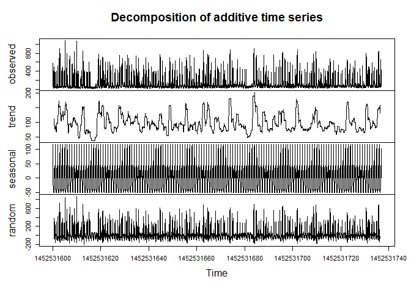

IOT Energy Appliances Prediction
================


# 1. Definition

This project aims to create a model for forecasting the **consumption of
home appliances** using data from IOT sensors.

# 2. Dataset

Data were collected through IOT temperature and humidity sensors
installed in a house every 10 minutes, and were complemented with
weather forecast data from a nearby airport station and with light
consumption data.

| **Feature Name** | **Description**                          |
|------------------|------------------------------------------|
| **date**         | Time of the data collection              |
| **Appliances**   | Consumption of appliances, in Wh         |
| **lights**       | Light consumption in the house, in Wh    |
| **T1…T9**        | Temperature in the sensors, in °C        |
| **RH_1…RH_9**    | Relative humidity in the sensors, in %   |
| **T_out**        | Temperature outside the house, in °C     |
| **Press_mm_hg**  | Air pressure, in mm Hg                   |
| **RH_out**       | Relative humidity ouside the house, in % |
| **Windspeed**    | Wind Speed, in m/s                       |
| **Visibility**   | Visibility, in km                        |
| **Tdewpoint**    | Dew point temperature, in °C             |
| **rv1**          | Random variable 1, nondimensional        |
| **rv2**          | Random variable 2, nondimensional        |
| **NSM**          | Number of seconds from midnight          |
| **Day_of_week**  | Day of the week                          |
| **WeekStatus**   | Weekday or weekend                       |

# 3. Setting working directory

``` r
setwd("C:/Users/fabiano/OneDrive/DSA/Machine_Learning/Projetos/projeto8-data_files/IOT_energy_prediction")
getwd()
```

    ## [1] "C:/Users/fabiano/OneDrive/DSA/Machine_Learning/Projetos/projeto8-data_files/IOT_energy_prediction"

# 4. Importing libraries

``` r
library('ggplot2', quietly = T)
library("readr", quietly = T)
library("dplyr", quietly = T)
library('gridExtra', quietly = T)
library('corrplot', quietly = T)
library('caret', quietly = T)
library('caTools', quietly = T)
library('tseries', quietly = T)
library('ramify', quietly = T)
library('mltools', quietly = T)
library('data.table', quietly = T)
library('ggcorrplot', quietly = T)
library('polycor', quietly = T)
library('Boruta', quietly = T)
library('doParallel', quietly = T)
library('knitr', quietly = T)
library(forecast, quietly = T)
library(tseries, quietly = T)
#library(keras, quietly = T)
#library(tensorflow, quietly = T)
```

# 5. Reading dataset

``` r
df_training <- read_csv('data/projeto8-training.csv')

df_testing <- read_csv('data/projeto8-testing.csv')
```

# 6. Data exploration

## 6.1 Combining datasets

For the purpose of this project we will **bind the two datasets** at
this point and split the final dataset later on.

``` r
df_final <- rbind(df_training, df_testing)

df_final$WeekStatus <- as.factor(df_final$WeekStatus)

df_final$Day_of_week <- as.factor(df_final$Day_of_week)
```

## 6.2 Summary

``` r
dim(df_final)
```

    ## [1] 19735    32

``` r
str(df_final)
```

    ## spc_tbl_ [19,735 × 32] (S3: spec_tbl_df/tbl_df/tbl/data.frame)
    ##  $ date       : POSIXct[1:19735], format: "2016-01-11 17:00:00" "2016-01-11 17:10:00" ...
    ##  $ Appliances : num [1:19735] 60 60 50 60 50 60 60 70 430 250 ...
    ##  $ lights     : num [1:19735] 30 30 30 40 40 50 40 40 50 40 ...
    ##  $ T1         : num [1:19735] 19.9 19.9 19.9 19.9 19.9 ...
    ##  $ RH_1       : num [1:19735] 47.6 46.7 46.3 46.3 46 ...
    ##  $ T2         : num [1:19735] 19.2 19.2 19.2 19.2 19.2 ...
    ##  $ RH_2       : num [1:19735] 44.8 44.7 44.6 44.5 44.5 ...
    ##  $ T3         : num [1:19735] 19.8 19.8 19.8 19.8 19.8 ...
    ##  $ RH_3       : num [1:19735] 44.7 44.8 44.9 45 44.9 ...
    ##  $ T4         : num [1:19735] 19 19 18.9 18.9 18.9 ...
    ##  $ RH_4       : num [1:19735] 45.6 46 45.9 45.5 45.7 ...
    ##  $ T5         : num [1:19735] 17.2 17.2 17.2 17.2 17.1 ...
    ##  $ RH_5       : num [1:19735] 55.2 55.2 55.1 55.1 55 ...
    ##  $ T6         : num [1:19735] 7.03 6.83 6.56 6.37 6.3 ...
    ##  $ RH_6       : num [1:19735] 84.3 84.1 83.2 84.9 85.8 ...
    ##  $ T7         : num [1:19735] 17.2 17.2 17.2 17.2 17.1 ...
    ##  $ RH_7       : num [1:19735] 41.6 41.6 41.4 41.2 41.3 ...
    ##  $ T8         : num [1:19735] 18.2 18.2 18.2 18.1 18.1 ...
    ##  $ RH_8       : num [1:19735] 48.9 48.9 48.7 48.6 48.6 ...
    ##  $ T9         : num [1:19735] 17 17.1 17 17 17 ...
    ##  $ RH_9       : num [1:19735] 45.5 45.6 45.5 45.4 45.3 ...
    ##  $ T_out      : num [1:19735] 6.6 6.48 6.37 6.13 6.02 ...
    ##  $ Press_mm_hg: num [1:19735] 734 734 734 734 734 ...
    ##  $ RH_out     : num [1:19735] 92 92 92 92 92 ...
    ##  $ Windspeed  : num [1:19735] 7 6.67 6.33 5.67 5.33 ...
    ##  $ Visibility : num [1:19735] 63 59.2 55.3 47.7 43.8 ...
    ##  $ Tdewpoint  : num [1:19735] 5.3 5.2 5.1 4.9 4.8 ...
    ##  $ rv1        : num [1:19735] 13.3 18.6 28.6 10.1 44.9 ...
    ##  $ rv2        : num [1:19735] 13.3 18.6 28.6 10.1 44.9 ...
    ##  $ NSM        : num [1:19735] 61200 61800 62400 63600 64200 65400 66000 66600 68400 69000 ...
    ##  $ WeekStatus : Factor w/ 2 levels "Weekday","Weekend": 1 1 1 1 1 1 1 1 1 1 ...
    ##  $ Day_of_week: Factor w/ 7 levels "Friday","Monday",..: 2 2 2 2 2 2 2 2 2 2 ...
    ##  - attr(*, "spec")=
    ##   .. cols(
    ##   ..   date = col_datetime(format = ""),
    ##   ..   Appliances = col_double(),
    ##   ..   lights = col_double(),
    ##   ..   T1 = col_double(),
    ##   ..   RH_1 = col_double(),
    ##   ..   T2 = col_double(),
    ##   ..   RH_2 = col_double(),
    ##   ..   T3 = col_double(),
    ##   ..   RH_3 = col_double(),
    ##   ..   T4 = col_double(),
    ##   ..   RH_4 = col_double(),
    ##   ..   T5 = col_double(),
    ##   ..   RH_5 = col_double(),
    ##   ..   T6 = col_double(),
    ##   ..   RH_6 = col_double(),
    ##   ..   T7 = col_double(),
    ##   ..   RH_7 = col_double(),
    ##   ..   T8 = col_double(),
    ##   ..   RH_8 = col_double(),
    ##   ..   T9 = col_double(),
    ##   ..   RH_9 = col_double(),
    ##   ..   T_out = col_double(),
    ##   ..   Press_mm_hg = col_double(),
    ##   ..   RH_out = col_double(),
    ##   ..   Windspeed = col_double(),
    ##   ..   Visibility = col_double(),
    ##   ..   Tdewpoint = col_double(),
    ##   ..   rv1 = col_double(),
    ##   ..   rv2 = col_double(),
    ##   ..   NSM = col_double(),
    ##   ..   WeekStatus = col_character(),
    ##   ..   Day_of_week = col_character()
    ##   .. )
    ##  - attr(*, "problems")=<externalptr>

``` r
summary(df_final)
```

    ##       date                       Appliances          lights      
    ##  Min.   :2016-01-11 17:00:00   Min.   :  10.00   Min.   : 0.000  
    ##  1st Qu.:2016-02-14 23:15:00   1st Qu.:  50.00   1st Qu.: 0.000  
    ##  Median :2016-03-20 05:30:00   Median :  60.00   Median : 0.000  
    ##  Mean   :2016-03-20 05:30:00   Mean   :  97.69   Mean   : 3.802  
    ##  3rd Qu.:2016-04-23 11:45:00   3rd Qu.: 100.00   3rd Qu.: 0.000  
    ##  Max.   :2016-05-27 18:00:00   Max.   :1080.00   Max.   :70.000  
    ##                                                                  
    ##        T1             RH_1             T2             RH_2      
    ##  Min.   :16.79   Min.   :27.02   Min.   :16.10   Min.   :20.46  
    ##  1st Qu.:20.76   1st Qu.:37.33   1st Qu.:18.79   1st Qu.:37.90  
    ##  Median :21.60   Median :39.66   Median :20.00   Median :40.50  
    ##  Mean   :21.69   Mean   :40.26   Mean   :20.34   Mean   :40.42  
    ##  3rd Qu.:22.60   3rd Qu.:43.07   3rd Qu.:21.50   3rd Qu.:43.26  
    ##  Max.   :26.26   Max.   :63.36   Max.   :29.86   Max.   :56.03  
    ##                                                                 
    ##        T3             RH_3             T4             RH_4      
    ##  Min.   :17.20   Min.   :28.77   Min.   :15.10   Min.   :27.66  
    ##  1st Qu.:20.79   1st Qu.:36.90   1st Qu.:19.53   1st Qu.:35.53  
    ##  Median :22.10   Median :38.53   Median :20.67   Median :38.40  
    ##  Mean   :22.27   Mean   :39.24   Mean   :20.86   Mean   :39.03  
    ##  3rd Qu.:23.29   3rd Qu.:41.76   3rd Qu.:22.10   3rd Qu.:42.16  
    ##  Max.   :29.24   Max.   :50.16   Max.   :26.20   Max.   :51.09  
    ##                                                                 
    ##        T5             RH_5             T6              RH_6      
    ##  Min.   :15.33   Min.   :29.82   Min.   :-6.065   Min.   : 1.00  
    ##  1st Qu.:18.28   1st Qu.:45.40   1st Qu.: 3.627   1st Qu.:30.02  
    ##  Median :19.39   Median :49.09   Median : 7.300   Median :55.29  
    ##  Mean   :19.59   Mean   :50.95   Mean   : 7.911   Mean   :54.61  
    ##  3rd Qu.:20.62   3rd Qu.:53.66   3rd Qu.:11.256   3rd Qu.:83.23  
    ##  Max.   :25.80   Max.   :96.32   Max.   :28.290   Max.   :99.90  
    ##                                                                  
    ##        T7             RH_7             T8             RH_8      
    ##  Min.   :15.39   Min.   :23.20   Min.   :16.31   Min.   :29.60  
    ##  1st Qu.:18.70   1st Qu.:31.50   1st Qu.:20.79   1st Qu.:39.07  
    ##  Median :20.03   Median :34.86   Median :22.10   Median :42.38  
    ##  Mean   :20.27   Mean   :35.39   Mean   :22.03   Mean   :42.94  
    ##  3rd Qu.:21.60   3rd Qu.:39.00   3rd Qu.:23.39   3rd Qu.:46.54  
    ##  Max.   :26.00   Max.   :51.40   Max.   :27.23   Max.   :58.78  
    ##                                                                 
    ##        T9             RH_9           T_out         Press_mm_hg   
    ##  Min.   :14.89   Min.   :29.17   Min.   :-5.000   Min.   :729.3  
    ##  1st Qu.:18.00   1st Qu.:38.50   1st Qu.: 3.667   1st Qu.:750.9  
    ##  Median :19.39   Median :40.90   Median : 6.917   Median :756.1  
    ##  Mean   :19.49   Mean   :41.55   Mean   : 7.412   Mean   :755.5  
    ##  3rd Qu.:20.60   3rd Qu.:44.34   3rd Qu.:10.408   3rd Qu.:760.9  
    ##  Max.   :24.50   Max.   :53.33   Max.   :26.100   Max.   :772.3  
    ##                                                                  
    ##      RH_out         Windspeed        Visibility      Tdewpoint     
    ##  Min.   : 24.00   Min.   : 0.000   Min.   : 1.00   Min.   :-6.600  
    ##  1st Qu.: 70.33   1st Qu.: 2.000   1st Qu.:29.00   1st Qu.: 0.900  
    ##  Median : 83.67   Median : 3.667   Median :40.00   Median : 3.433  
    ##  Mean   : 79.75   Mean   : 4.040   Mean   :38.33   Mean   : 3.761  
    ##  3rd Qu.: 91.67   3rd Qu.: 5.500   3rd Qu.:40.00   3rd Qu.: 6.567  
    ##  Max.   :100.00   Max.   :14.000   Max.   :66.00   Max.   :15.500  
    ##                                                                    
    ##       rv1                rv2                NSM          WeekStatus   
    ##  Min.   : 0.00532   Min.   : 0.00532   Min.   :    0   Weekday:14263  
    ##  1st Qu.:12.49789   1st Qu.:12.49789   1st Qu.:21600   Weekend: 5472  
    ##  Median :24.89765   Median :24.89765   Median :43200                  
    ##  Mean   :24.98803   Mean   :24.98803   Mean   :42907                  
    ##  3rd Qu.:37.58377   3rd Qu.:37.58377   3rd Qu.:64200                  
    ##  Max.   :49.99653   Max.   :49.99653   Max.   :85800                  
    ##                                                                       
    ##     Day_of_week  
    ##  Friday   :2845  
    ##  Monday   :2778  
    ##  Saturday :2736  
    ##  Sunday   :2736  
    ##  Thursday :2880  
    ##  Tuesday  :2880  
    ##  Wednesday:2880

Let’s print out the final dataframe:

``` r
kable(head(df_final))
```

| date                | Appliances | lights |       T1 |     RH_1 |   T2 |     RH_2 |    T3 |     RH_3 |       T4 |     RH_4 |       T5 |  RH_5 |       T6 |     RH_6 |       T7 |     RH_7 |   T8 |     RH_8 |       T9 |  RH_9 |    T_out | Press_mm_hg |   RH_out | Windspeed | Visibility | Tdewpoint |      rv1 |      rv2 |   NSM | WeekStatus | Day_of_week |
|:--------------------|-----------:|-------:|---------:|---------:|-----:|---------:|------:|---------:|---------:|---------:|---------:|------:|---------:|---------:|---------:|---------:|-----:|---------:|---------:|------:|---------:|------------:|---------:|----------:|-----------:|----------:|---------:|---------:|------:|:-----------|:------------|
| 2016-01-11 17:00:00 |         60 |     30 | 19.89000 | 47.59667 | 19.2 | 44.79000 | 19.79 | 44.73000 | 19.00000 | 45.56667 | 17.16667 | 55.20 | 7.026667 | 84.25667 | 17.20000 | 41.62667 | 18.2 | 48.90000 | 17.03333 | 45.53 | 6.600000 |    733.5000 | 92.00000 |  7.000000 |   63.00000 |  5.300000 | 13.27543 | 13.27543 | 61200 | Weekday    | Monday      |
| 2016-01-11 17:10:00 |         60 |     30 | 19.89000 | 46.69333 | 19.2 | 44.72250 | 19.79 | 44.79000 | 19.00000 | 45.99250 | 17.16667 | 55.20 | 6.833333 | 84.06333 | 17.20000 | 41.56000 | 18.2 | 48.86333 | 17.06667 | 45.56 | 6.483333 |    733.6000 | 92.00000 |  6.666667 |   59.16667 |  5.200000 | 18.60619 | 18.60619 | 61800 | Weekday    | Monday      |
| 2016-01-11 17:20:00 |         50 |     30 | 19.89000 | 46.30000 | 19.2 | 44.62667 | 19.79 | 44.93333 | 18.92667 | 45.89000 | 17.16667 | 55.09 | 6.560000 | 83.15667 | 17.20000 | 41.43333 | 18.2 | 48.73000 | 17.00000 | 45.50 | 6.366667 |    733.7000 | 92.00000 |  6.333333 |   55.33333 |  5.100000 | 28.64267 | 28.64267 | 62400 | Weekday    | Monday      |
| 2016-01-11 17:40:00 |         60 |     40 | 19.89000 | 46.33333 | 19.2 | 44.53000 | 19.79 | 45.00000 | 18.89000 | 45.53000 | 17.20000 | 55.09 | 6.366667 | 84.89333 | 17.20000 | 41.23000 | 18.1 | 48.59000 | 17.00000 | 45.40 | 6.133333 |    733.9000 | 92.00000 |  5.666667 |   47.66667 |  4.900000 | 10.08410 | 10.08410 | 63600 | Weekday    | Monday      |
| 2016-01-11 17:50:00 |         50 |     40 | 19.89000 | 46.02667 | 19.2 | 44.50000 | 19.79 | 44.93333 | 18.89000 | 45.73000 | 17.13333 | 55.03 | 6.300000 | 85.76667 | 17.13333 | 41.26000 | 18.1 | 48.59000 | 17.00000 | 45.29 | 6.016667 |    734.0000 | 92.00000 |  5.333333 |   43.83333 |  4.800000 | 44.91948 | 44.91948 | 64200 | Weekday    | Monday      |
| 2016-01-11 18:10:00 |         60 |     50 | 19.85667 | 45.56000 | 19.2 | 44.50000 | 19.73 | 44.90000 | 18.89000 | 45.86333 | 17.10000 | 54.90 | 6.190000 | 86.42333 | 17.10000 | 41.20000 | 18.1 | 48.59000 | 17.00000 | 45.29 | 5.916667 |    734.1667 | 91.83333 |  5.166667 |   40.00000 |  4.683333 | 33.03989 | 33.03989 | 65400 | Weekday    | Monday      |

## 6.3 Arranging by date column

By binding both datasets we observe that the final dataframe became
unorganized in terms of the index (date column). Let’s **order the
rows** of the final dataframe by date:

``` r
df_final <- df_final %>% arrange(date)
```

## 6.4 Checking for missing values

``` r
column_names <- colnames(df_final)

missing_values <- c()

for (column in column_names){
  missing_values[column] <- sum(is.na(df_final[column]))
}

missing_values
```

    ##        date  Appliances      lights          T1        RH_1          T2 
    ##           0           0           0           0           0           0 
    ##        RH_2          T3        RH_3          T4        RH_4          T5 
    ##           0           0           0           0           0           0 
    ##        RH_5          T6        RH_6          T7        RH_7          T8 
    ##           0           0           0           0           0           0 
    ##        RH_8          T9        RH_9       T_out Press_mm_hg      RH_out 
    ##           0           0           0           0           0           0 
    ##   Windspeed  Visibility   Tdewpoint         rv1         rv2         NSM 
    ##           0           0           0           0           0           0 
    ##  WeekStatus Day_of_week 
    ##           0           0

- We don’t observe **any missing value in the dataset**.

## 6.5 Plot of energy consumption

We can now plot our target feature, `Appliances`, over time:

``` r
appliances_consumption <- ggplot(df_final, aes (x = .data[['date']], y = `Appliances`)) +
  geom_line() + 
  labs(title = "Energy consumption of appliances in 2016", x = "Period", y = "Energy consumption") +
  geom_hline(yintercept = mean(df_final$Appliances), linetype = "dashed", color = 'red', linewidth = 1.5) +
  annotate("text", x = as.POSIXct("2016-03-01 17:00:00"), y = 930, label = "- - - average", color = 'red')

print(appliances_consumption)
```

<!-- -->

- As already seen, the mean of Energy Consumption during the period of
  analysis is around **100 Wh**.
- Another interesting point to evaluate is that the data seem to have a
  **seasonal behavior**, which is a usual fact when considering house
  energy consumption. In order to check this we can choose random data
  in similar period of time, as follow.

## 6.6 Time series of certain periods

Let’s take daily, weekly and monthly data in both january and april:

``` r
cons_1_day_jan <- df_final %>% filter(between(date, as.POSIXct('2016-01-18 00:00:00', 'GMT'), as.POSIXct('2016-01-19 00:00:00', 'GMT')))

cons_1_week_jan <- df_final %>% filter(between(date, as.POSIXct('2016-01-18 00:00:00', 'GMT'), as.POSIXct('2016-01-25 00:00:00', 'GMT')))

cons_1_month_jan <- df_final %>% filter(between(date, as.POSIXct('2016-01-18 00:00:00', 'GMT'), as.POSIXct('2016-02-18 00:00:00', 'GMT')))

cons_1_day_apr <- df_final %>% filter(between(date, as.POSIXct('2016-04-18 00:00:00', 'GMT'), as.POSIXct('2016-04-19 00:00:00', 'GMT')))

cons_1_week_apr <- df_final %>% filter(between(date, as.POSIXct('2016-04-18 00:00:00', 'GMT'), as.POSIXct('2016-04-25 00:00:00', 'GMT')))

cons_1_month_apr <- df_final %>% filter(between(date, as.POSIXct('2016-04-18 00:00:00', 'GMT'), as.POSIXct('2016-05-18 00:00:00', 'GMT')))

p1 <- ggplot(cons_1_day_jan, aes (x = .data[['date']], y = `Appliances`)) +
  geom_line() +
  labs(title = "Energy consumption of appliances in 1 day", x = "Period", y = "Energy consumption")

p2 <- ggplot(cons_1_week_jan, aes (x = .data[['date']], y = `Appliances`)) +
  geom_line() +
  labs(title = "Energy consumption of appliances in 1 week", x = "Period", y = "Energy consumption")

p3 <- ggplot(cons_1_month_jan, aes (x = .data[['date']], y = `Appliances`)) +
  geom_line() +
  labs(title = "Energy consumption of appliances in 1 month", x = "Period", y = "Energy consumption")

p4 <- ggplot(cons_1_day_apr, aes (x = .data[['date']], y = `Appliances`)) +
  geom_line() +
  labs(title = "Energy consumption of appliances in 1 day", x = "Period", y = "Energy consumption")

p5 <- ggplot(cons_1_week_apr, aes (x = .data[['date']], y = `Appliances`)) +
  geom_line()+
  labs(title = "Energy consumption of appliances in 1 week", x = "Period", y = "Energy consumption")

p6 <- ggplot(cons_1_month_apr, aes (x = .data[['date']], y = `Appliances`)) +
  geom_line()+
  labs(title = "Energy consumption of appliances in 1 month", x = "Period", y = "Energy consumption")

grid.arrange(p1, p2, p3, p4, p5, p6, nrow = 2, ncol = 3)
```

<!-- -->

- It is possible to observe that, in fact, there might be a **high auto
  correlation** inside the different time series, that can be later
  better explored.

## 6.7 Histogram and boxplot of energy consumption

``` r
histogram_appliances <- ggplot(df_final, aes(x = Appliances), binwidth = 30) +
  geom_histogram(alpha = 1, bins=30, color="black",fill="steelblue") +
  labs(title = "Histogram of consumption of appliances", x = "energy consumption", y = "Count")

boxplot_appliances <- ggplot(df_final, aes(x = Appliances)) +
  geom_boxplot(color="black",fill="steelblue") + 
  labs(title = "Boxplot of consumption of appliances", x = "energy consumption", y = "")

grid.arrange(histogram_appliances, boxplot_appliances, ncol = 1)
```

<!-- -->

- Clearly there is a considerable high number of **outliers** in the
  dataset that might affect our predictive model. For this reason, we
  will create **two separate analysis** either dropping or kepping the
  outliers.

# 7. First analysis: filtering outliers

Let’s start by filtering outliers from numeric columns that exceed both
upper and lower limits as established as follows:

``` r
df_numeric <- df_final[, c(1:30)]

dim(df_numeric)
```

    ## [1] 19735    30

``` r
outliers <- function(x) {
  
  Q1 <- quantile(x, probs=.25)
  Q3 <- quantile(x, probs=.75)
  iqr = Q3-Q1
  
  upper_limit = Q3 + (iqr*1.5)
  lower_limit = Q1 - (iqr*1.5)
  
  x > upper_limit | x < lower_limit
}

remove_outliers <- function(df, cols = names(df)) {
  for (col in cols) {
    df <- df[!outliers(df[[col]]),]
  }
  df
}


df_numeric_no_outlier <- remove_outliers(df_numeric[, -3])

dim((df_numeric_no_outlier))
```

    ## [1] 12076    29

``` r
dates_aux <- c(df_numeric_no_outlier$date)


df_no_outlier <- df_final[df_final$date %in% dates_aux, ]

dim(df_no_outlier)
```

    ## [1] 12076    32

## 7.1 Exploratory analysis

### 7.1.1 Histogram and boxplot of energy consumption

After dropping outliers from our dataset, we can visualize once more the
distribution of our target variable `Appliances`.

``` r
histogram_appliances <- ggplot(df_no_outlier, aes(x = Appliances), binwidth = 30) +
  geom_histogram(alpha = 1, bins=30, color="black",fill="steelblue") +
  labs(title = "Histogram of consumption of appliances", x = "energy consumption", y = "Count")

boxplot_appliances <- ggplot(df_no_outlier, aes(x = Appliances)) +
  geom_boxplot(color="black",fill="steelblue") + 
  labs(title = "Boxplot of consumption of appliances", x = "energy consumption", y = "")

grid.arrange(histogram_appliances, boxplot_appliances, ncol = 1)
```

<!-- -->

``` r
summary(df_no_outlier$Appliances)
```

    ##    Min. 1st Qu.  Median    Mean 3rd Qu.    Max. 
    ##   10.00   50.00   60.00   66.12   80.00  170.00

- Despite some remaining outliers, seen in the boxplot, it is now
  possible to better understand the distribution of the feature
  `Appliance`, where **most of the data** are located around **50 Wh**
  and whose **median** is the same as before, **60 Wh**. In practice, We
  approximated the mean to the median.

### 7.1.2 Energy consumption by categorical features

``` r
df_categorical_no_outlier <- df_no_outlier[, c(31:32)]

for (column in colnames(df_categorical_no_outlier)){
  
  plot <- ggplot(df_no_outlier, aes(x = .data[[column]], y = `Appliances`)) +
    geom_boxplot(color = 'black', fill = 'steelblue') +
    labs(title = paste("Consumption of appliancers by", column), x = column, y = "energy consumption")
  
  print(plot)
  
}
```

<!-- --><!-- -->

- It seems there is a relevant difference in the consumption among the
  days in which the data were measured and extracted, indicating that
  **`Week status`, `Day of week` or both can be used as predictive
  features**.

### 7.1.3 Energy consumption by numerical features

``` r
for (column in colnames(df_numeric)){
  
  if (column != "Appliances" & column != 'date'){
    
    plot <- ggplot(df_no_outlier, aes(x = .data[[column]], y = `Appliances`)) +
      geom_point() + 
      labs(title = paste("Consumption of appliancers x", column), x = column, y = "energy consumption")
    
    print(plot)
  }
}
```

<!-- --><!-- --><!-- --><!-- --><!-- --><!-- --><!-- --><!-- --><!-- --><!-- --><!-- --><!-- --><!-- --><!-- --><!-- --><!-- --><!-- --><!-- --><!-- --><!-- --><!-- --><!-- --><!-- --><!-- --><!-- --><!-- --><!-- --><!-- -->

``` r
ggplot(df_no_outlier, aes(x = .data[['NSM']])) +
  geom_boxplot(color = 'black', fill = 'steelblue') +
  labs(title = "Boxplot of NSM", x = 'NSM')
```

<!-- -->

``` r
ggplot(df_no_outlier, aes(x = .data[['Press_mm_hg']])) +
  geom_boxplot(color = 'black', fill = 'steelblue') +
  labs(title = "Boxplot of Press_mm_hg", x = 'Pressure in mmHg')
```

<!-- -->

``` r
df_no_outlier %>% 
  select(-c('date', 'WeekStatus', 'Day_of_week', 'NSM', 'Press_mm_hg')) %>%
  boxplot(main = 'Boxplot of the numerical features', col = 'steelblue', xlab = 'feature')
```

<!-- -->

- By the last scatter plots, an interpretation of a **tendency** of any
  kind between our target feature and the other numerical variables is
  **inconclusive** or hard to identify. This possible relation will be
  verified in the sequence through a correlation plot.
- Finally, the boxplot of the numerical features indicates that there is
  a **considerable range** among them, whose normalization might be
  necessary prior to creation of some of the predictive models.

### 7.1.4 Feature correlation for numerical variables

``` r
corr_filter <- df_no_outlier[, c(2:27, 30)]

matrix_correlation <- cor(corr_filter)

cor.mtest <- function(mat, ...) {
  mat <- as.matrix(mat)
  n <- ncol(mat)
  p.mat<- matrix(NA, n, n)
  diag(p.mat) <- 0
  for (i in 1:(n - 1)) {
    for (j in (i + 1):n) {
      tmp <- cor.test(mat[, i], mat[, j], ...)
      p.mat[i, j] <- p.mat[j, i] <- tmp$p.value
    }
  }
  colnames(p.mat) <- rownames(p.mat) <- colnames(mat)
  p.mat
}

p.mat <- cor.mtest(corr_filter)

ggcorrplot(matrix_correlation, hc.order = TRUE, type = "lower",
           lab = TRUE, p.mat = p.mat, insig = "blank", lab_size= 2.5)
```

<!-- -->

- From the temperature features measured by the sensors in the house,
  **`T8` and `T2`** have the **higher positive correlation** with our
  target variable `Appliances`. There is a high positive correlation
  between some of the temperature variables.
- **`T_out`** has a **positive** but **not** so **high correlation**
  with `Appliances`.
- Considering the relative **humidity sensors**, it seems that some of
  them have considerable **negative correlation** (except `RH_1`) with
  `Appliances`. However, there is also a high correlation among them,
  which can cause multicollinearity and affect negatively the
  interpretation of some predictive models.
- **`Press_mm_hg`, `Windspeed`, `Tdewpoint` and `Visibility`** seem to
  have **no prediction power** for energy consumption.
- There is a relatively **high positive correlation** between the
  feature `NSM` and `Appliances`.

### 7.1.5 Statistical tests for categorical features

In the case of categorical features, we can apply statistical tests in
order to verify their significance.

Shapiro Test of normality for `WeekStatus`:

``` r
weekday_no_outlier <- subset(df_no_outlier, WeekStatus == 'Weekday')

sample_weekday <- sample(x = weekday_no_outlier$Appliances, size = 5000)

weekday_norm <- shapiro.test(sample_weekday)

weekday_norm
```

    ## 
    ##  Shapiro-Wilk normality test
    ## 
    ## data:  sample_weekday
    ## W = 0.88342, p-value < 2.2e-16

``` r
weekend_no_outlier <- subset(df_no_outlier, WeekStatus == 'Weekend')

sample_weekend <- weekend_no_outlier$Appliances

weekend_norm <- shapiro.test(sample_weekend)
weekend_norm
```

    ## 
    ##  Shapiro-Wilk normality test
    ## 
    ## data:  sample_weekend
    ## W = 0.90947, p-value < 2.2e-16

- The p-value indicates that the feature **`WeekStatus` does not follow
  a normal distribution**, which means we will have to use a
  non-parametric test of significanfe.

Non-parametric Kruskal-Wallis Test for `WeekStatus`:

``` r
kruskal_test_1 <- kruskal.test(Appliances ~ WeekStatus, data = df_no_outlier)

kruskal_test_1
```

    ## 
    ##  Kruskal-Wallis rank sum test
    ## 
    ## data:  Appliances by WeekStatus
    ## Kruskal-Wallis chi-squared = 49.175, df = 1, p-value = 2.341e-12

- As the p-value is less than the set significance level of 0.05, we can
  conclude that **there are significant differences in the consumption
  of the appliances considering the status of the day**.

Shapiro Test of normality for `Day of Week`:

``` r
day_of_week <- c(unique(df_no_outlier$Day_of_week))

for (day in day_of_week){
  
  df_subset <- subset(df_no_outlier, Day_of_week == day)
  
  df_day <- df_subset$Appliances
  
  day_test <- shapiro.test(df_day)
  
  print(day)
  
  print(day_test)
  
}
```

    ## [1] "Monday"
    ## 
    ##  Shapiro-Wilk normality test
    ## 
    ## data:  df_day
    ## W = 0.87937, p-value < 2.2e-16
    ## 
    ## [1] "Tuesday"
    ## 
    ##  Shapiro-Wilk normality test
    ## 
    ## data:  df_day
    ## W = 0.8442, p-value < 2.2e-16
    ## 
    ## [1] "Wednesday"
    ## 
    ##  Shapiro-Wilk normality test
    ## 
    ## data:  df_day
    ## W = 0.92221, p-value < 2.2e-16
    ## 
    ## [1] "Thursday"
    ## 
    ##  Shapiro-Wilk normality test
    ## 
    ## data:  df_day
    ## W = 0.8946, p-value < 2.2e-16
    ## 
    ## [1] "Friday"
    ## 
    ##  Shapiro-Wilk normality test
    ## 
    ## data:  df_day
    ## W = 0.88515, p-value < 2.2e-16
    ## 
    ## [1] "Saturday"
    ## 
    ##  Shapiro-Wilk normality test
    ## 
    ## data:  df_day
    ## W = 0.90613, p-value < 2.2e-16
    ## 
    ## [1] "Sunday"
    ## 
    ##  Shapiro-Wilk normality test
    ## 
    ## data:  df_day
    ## W = 0.91327, p-value < 2.2e-16

- The variable **`Day of Week` does not follow a normal distribution
  either**.

Kruskal-Wallis Test for `Day of Week`:

``` r
kruskal_test_2 <- kruskal.test(Appliances ~ Day_of_week, data = df_no_outlier)

kruskal_test_2
```

    ## 
    ##  Kruskal-Wallis rank sum test
    ## 
    ## data:  Appliances by Day_of_week
    ## Kruskal-Wallis chi-squared = 168.66, df = 6, p-value < 2.2e-16

- **There are significant differences in the days of the week**. We can
  conduct a Paired Samples Willcoxon Test to calculate pairwise
  comparisons between group levels with corrections for multiple
  testing.

Paired Samples Willcoxon Test for `Day of Week`:

``` r
wilcoxon_test_2 <- pairwise.wilcox.test(df_no_outlier$Appliances,
                                        df_no_outlier$Day_of_week,
                                        p.adjust.method="bonferroni", exact = FALSE)
wilcoxon_test_2
```

    ## 
    ##  Pairwise comparisons using Wilcoxon rank sum test with continuity correction 
    ## 
    ## data:  df_no_outlier$Appliances and df_no_outlier$Day_of_week 
    ## 
    ##           Friday  Monday  Saturday Sunday  Thursday Tuesday
    ## Monday    4.9e-05 -       -        -       -        -      
    ## Saturday  0.00010 1.00000 -        -       -        -      
    ## Sunday    < 2e-16 0.00039 0.00149  -       -        -      
    ## Thursday  1.00000 0.00565 0.00778  1.9e-12 -        -      
    ## Tuesday   1.00000 2.0e-07 1.4e-06  < 2e-16 1.00000  -      
    ## Wednesday 7.4e-13 0.03604 0.11050  1.00000 3.1e-09  < 2e-16
    ## 
    ## P value adjustment method: bonferroni

- We can see that **some of the pairs are significantly different (p\<
  0.05)**.

### 7.1.6 Correlation between the two categorical variables

We can also check, with the help of the function **Polychor**, the
correlation between the two categorical features.

``` r
polychor(df_no_outlier$WeekStatus, df_no_outlier$Day_of_week)
```

    ## [1] -0.2274961

- There’s a **negative correlation** between the two categorical
  features that might affect the effiency of the predictive model if
  both are used.

## 7.2 Checking the best features with Boruta function

Boruta function can select the most important features by using a subset
of features and training a model with them. Based on the inferences that
it draws from the previous model, it decides to add or remove features
from the subset.

``` r
features_boruta <- Boruta(Appliances~., data = df_no_outlier[, c(2:32)], doTrace = 2)

plot(features_boruta)
```

<!-- -->

``` r
importance_history <- features_boruta$ImpHistory

sorted_importance <- sort(colMeans(importance_history, na.rm = TRUE), decreasing = TRUE)

sorted_importance
```

    ##         NSM      lights Press_mm_hg        RH_1          T8          T2 
    ## 49.80095505 38.14533508 37.38425279 35.29534649 32.43722834 32.37113501 
    ##        RH_9   Tdewpoint          T9        RH_3          T5        RH_2 
    ## 30.06930407 29.51208494 29.38096801 29.24484276 28.80479652 28.13021860 
    ##        RH_5          T4        RH_4 Day_of_week        RH_8       T_out 
    ## 28.04516238 27.85611254 27.73561031 27.22796929 27.01406456 26.47561265 
    ##          T1   Windspeed          T6          T3        RH_7      RH_out 
    ## 26.39798570 26.38511239 26.19925461 25.70638730 25.06249561 24.67678712 
    ##          T7        RH_6  Visibility  WeekStatus         rv1         rv2 
    ## 24.66665595 23.73590587 21.56238973 14.36955702  4.42582762  4.19025429 
    ##   shadowMax  shadowMean   shadowMin 
    ##  2.37551070  0.02416745 -2.43285430

- Although Boruta **didn’t find any unimportant feature**, it gives us
  an important overview of the features and can be used together with
  our previous assumptions to determine which variables affect most our
  predictive model.

## 7.3 Splitting data for the first predictive model

From our exploratory analysis, we decided to choose the following
features as **first inputs** to our regression models: `Lights`, `T2`,
`T8`, `RH_out`, `NSM` and `WeekStatus`. As we previously concluded, the
other features might conduct to multicollinearity or were already
represented by the chosen ones. Since `WeekStatus` contains only
categorical data, we’ll make use of One Hot Encoding method to transform
these data into numbers.

``` r
model_1 <- df_no_outlier[, c(2, 3, 6, 18, 24, 30, 31)]

model_1 <- one_hot(as.data.table(model_1))

model_1 <- model_1[, c(-7)]

set.seed(57)

sample <- sample.split(model_1$Appliances, SplitRatio = 0.85)

train_validation  <- data.frame(subset(model_1, sample == TRUE))

test   <- data.frame(subset(model_1, sample == FALSE))
```

``` r
dim(train_validation)
```

    ## [1] 10263     7

``` r
dim(test)
```

    ## [1] 1813    7

## 7.4 Normalizing data

Before the process of training we need to perform normalization of the
features, so that we **prevent features with wider ranges from
dominating others**. For this purpose, we’ll take the minimum and
maximum values from the training set and use them to normalize both, the
training and test set.

``` r
train_min <- data.frame(as.list(train_validation[, c(-7)] %>% apply(2, min)))

train_max <- data.frame(as.list(train_validation[, c(-7)] %>% apply(2, max)))

col_names <- names(train_validation[, c(-7)])

for (i in col_names){
  train_validation[, i] <- (train_validation[, i] - train_min[, i])/(train_max[, i] - train_min[, i])
  test[, i] <-  (test[, i] - train_min[, i])/(train_max[, i] - train_min[, i])
}
```

## 7.5 Choosing and training first models

For our regression project, we decided to first test the following
machine learning models: **Linear Regression**, **KNN**, **SVM** and
**XGBoost**.

For our first running, we will consider the previously selected features
trained across a 5-fold-cross validation method (in order to avoid
randomness of evaluation).

``` r
models = c("lm", "knn", 'svmLinear',"xgbLinear")

model_trained_1 <- c()

set.seed(57) 

train.control <- trainControl(method = "cv", number = 5)

for (model in models){
  model_trained_1[[model]] <- train(`Appliances` ~ ., data = train_validation, 
                                    method = model,
                                    trControl = train.control,
                                    metric = 'Rsquared', 
                                    verbosity = 0)
}

print(model_trained_1)
```

    ## $lm
    ## Linear Regression 
    ## 
    ## 10263 samples
    ##     6 predictor
    ## 
    ## No pre-processing
    ## Resampling: Cross-Validated (5 fold) 
    ## Summary of sample sizes: 8210, 8210, 8209, 8213, 8210 
    ## Resampling results:
    ## 
    ##   RMSE       Rsquared   MAE      
    ##   0.1479924  0.2791812  0.1092302
    ## 
    ## Tuning parameter 'intercept' was held constant at a value of TRUE
    ## 
    ## $knn
    ## k-Nearest Neighbors 
    ## 
    ## 10263 samples
    ##     6 predictor
    ## 
    ## No pre-processing
    ## Resampling: Cross-Validated (5 fold) 
    ## Summary of sample sizes: 8212, 8209, 8210, 8210, 8211 
    ## Resampling results across tuning parameters:
    ## 
    ##   k  RMSE       Rsquared   MAE       
    ##   5  0.1157794  0.5619675  0.07926207
    ##   7  0.1172926  0.5485457  0.08121315
    ##   9  0.1187889  0.5363359  0.08285610
    ## 
    ## Rsquared was used to select the optimal model using the largest value.
    ## The final value used for the model was k = 5.
    ## 
    ## $svmLinear
    ## Support Vector Machines with Linear Kernel 
    ## 
    ## 10263 samples
    ##     6 predictor
    ## 
    ## No pre-processing
    ## Resampling: Cross-Validated (5 fold) 
    ## Summary of sample sizes: 8211, 8209, 8211, 8211, 8210 
    ## Resampling results:
    ## 
    ##   RMSE       Rsquared   MAE      
    ##   0.1503616  0.2764112  0.1075377
    ## 
    ## Tuning parameter 'C' was held constant at a value of 1
    ## 
    ## $xgbLinear
    ## eXtreme Gradient Boosting 
    ## 
    ## 10263 samples
    ##     6 predictor
    ## 
    ## No pre-processing
    ## Resampling: Cross-Validated (5 fold) 
    ## Summary of sample sizes: 8209, 8211, 8210, 8212, 8210 
    ## Resampling results across tuning parameters:
    ## 
    ##   lambda  alpha  nrounds  RMSE       Rsquared   MAE       
    ##   0e+00   0e+00   50      0.1167227  0.5523267  0.08227713
    ##   0e+00   0e+00  100      0.1168758  0.5534695  0.08195447
    ##   0e+00   0e+00  150      0.1172993  0.5525440  0.08225432
    ##   0e+00   1e-04   50      0.1165191  0.5537490  0.08198579
    ##   0e+00   1e-04  100      0.1160032  0.5595677  0.08134506
    ##   0e+00   1e-04  150      0.1164742  0.5581050  0.08155193
    ##   0e+00   1e-01   50      0.1152734  0.5631114  0.08094952
    ##   0e+00   1e-01  100      0.1140000  0.5736685  0.07976247
    ##   0e+00   1e-01  150      0.1138383  0.5759151  0.07953964
    ##   1e-04   0e+00   50      0.1166881  0.5525006  0.08211813
    ##   1e-04   0e+00  100      0.1165293  0.5558624  0.08146476
    ##   1e-04   0e+00  150      0.1167364  0.5564243  0.08153433
    ##   1e-04   1e-04   50      0.1165189  0.5537505  0.08198556
    ##   1e-04   1e-04  100      0.1161305  0.5586725  0.08157504
    ##   1e-04   1e-04  150      0.1164790  0.5583344  0.08178217
    ##   1e-04   1e-01   50      0.1152733  0.5631122  0.08094946
    ##   1e-04   1e-01  100      0.1138881  0.5744907  0.07970164
    ##   1e-04   1e-01  150      0.1136286  0.5775623  0.07943396
    ##   1e-01   0e+00   50      0.1163065  0.5555176  0.08199377
    ##   1e-01   0e+00  100      0.1160700  0.5588478  0.08169075
    ##   1e-01   0e+00  150      0.1161984  0.5595300  0.08177865
    ##   1e-01   1e-04   50      0.1167184  0.5525137  0.08222637
    ##   1e-01   1e-04  100      0.1164837  0.5559378  0.08170936
    ##   1e-01   1e-04  150      0.1166705  0.5565405  0.08184406
    ##   1e-01   1e-01   50      0.1152645  0.5629928  0.08117935
    ##   1e-01   1e-01  100      0.1140900  0.5730573  0.08018693
    ##   1e-01   1e-01  150      0.1137124  0.5769931  0.07970536
    ## 
    ## Tuning parameter 'eta' was held constant at a value of 0.3
    ## Rsquared was used to select the optimal model using the largest value.
    ## The final values used for the model were nrounds = 150, lambda = 1e-04, alpha
    ##  = 0.1 and eta = 0.3.

Let’s detail the results of **Linear Regression**:

``` r
lm_summary <- (summary(model_trained_1$lm))

print(lm_summary)
```

    ## 
    ## Call:
    ## lm(formula = .outcome ~ ., data = dat, verbosity = 0)
    ## 
    ## Residuals:
    ##      Min       1Q   Median       3Q      Max 
    ## -0.44431 -0.09263 -0.01901  0.06523  0.75322 
    ## 
    ## Coefficients:
    ##                     Estimate Std. Error t value Pr(>|t|)    
    ## (Intercept)         0.181892   0.008329  21.838  < 2e-16 ***
    ## lights              0.302328   0.010610  28.493  < 2e-16 ***
    ## T2                  0.056143   0.009716   5.779 7.75e-09 ***
    ## T8                  0.176336   0.008562  20.595  < 2e-16 ***
    ## RH_out             -0.068892   0.007339  -9.387  < 2e-16 ***
    ## NSM                 0.158092   0.005555  28.458  < 2e-16 ***
    ## WeekStatus_Weekend  0.015881   0.003344   4.749 2.07e-06 ***
    ## ---
    ## Signif. codes:  0 '***' 0.001 '**' 0.01 '*' 0.05 '.' 0.1 ' ' 1
    ## 
    ## Residual standard error: 0.148 on 10256 degrees of freedom
    ## Multiple R-squared:  0.2788, Adjusted R-squared:  0.2784 
    ## F-statistic: 660.9 on 6 and 10256 DF,  p-value: < 2.2e-16

And check the assumption of normality of the residuals:

``` r
shapiro.test(sample(x = lm_summary$residuals, size = 5000))
```

    ## 
    ##  Shapiro-Wilk normality test
    ## 
    ## data:  sample(x = lm_summary$residuals, size = 5000)
    ## W = 0.94926, p-value < 2.2e-16

## 7.6 Evaluating first models

Our main objective for this project is to deliver a model that will be
used to predict the Energy Consumption of home appliances.

In this case, we are concerned in reducing the error of our model. Three
metrics will be used to evaluate the result: **R²** or coefficient of
determination, which is the proportion of the variance for a dependent
variable that is explained by independend variables; **MAE** or mean
absolute error, which is the average absolute error between actual and
predicted values; **RMSE** or root mean square error, which is the
starndard deviation of the residuals (prediction errors).

``` r
predict_models_1 <- predict(model_trained_1, newdata = test)

for (i in 1:length(predict_models_1)){
  
  print(names(predict_models_1[i]))
  
  result <- postResample(pred = predict_models_1[[i]], obs = test$Appliances)
  
  print(result)
  
  print("------------------------------------------------------------------------------")
}
```

    ## [1] "lm"
    ##      RMSE  Rsquared       MAE 
    ## 0.1482890 0.2796337 0.1103003 
    ## [1] "------------------------------------------------------------------------------"
    ## [1] "knn"
    ##       RMSE   Rsquared        MAE 
    ## 0.10689394 0.62655199 0.07307065 
    ## [1] "------------------------------------------------------------------------------"
    ## [1] "svmLinear"
    ##      RMSE  Rsquared       MAE 
    ## 0.1503206 0.2760766 0.1083917 
    ## [1] "------------------------------------------------------------------------------"
    ## [1] "xgbLinear"
    ##       RMSE   Rsquared        MAE 
    ## 0.10913460 0.61129080 0.07760618 
    ## [1] "------------------------------------------------------------------------------"

- **Linear regression model**: The model is statistically significant (p
  value of the F test \< defined significance level of 5%), and the
  chosen explanatory variables are also statistically significant.
  However, the necessary assumption of normality of the residuals was
  not verified .The model was able to keep its results in the test set,
  but presented comparatively lower metrics than its peers.
- **KNN model**: The model improved the results in the test set to an
  optimized k-value of 5 and presented the second best result among the
  models studied for the training set.
- **SVM model**: Support Vector Machine model did not present a
  satisfactory result, getting its evaluation metrics worse than the
  Linear Regression model, and kept the performance in the test set.
- **XGBoost model**: Among the studied predictive models, it was the one
  that presented the best metrics for the training set, using the
  following optimized hyperparameters, nrounds = 150, lambda = 0.0001,
  alpha = 0.1 and eta = 0.3. There was a relevant improvement in
  efficiency in the test set.

## 7.7 Training second model

We will also train a **Random Forest model** using all the variables in
our dataset and, afterwards, use feature optimization models to try to
identify which of them could eventually be discarded:

``` r
model_2 <- df_no_outlier[, c(2:32)]

set.seed(57)

sample_2 <- sample.split(model_2$Appliances, SplitRatio = 0.85)

train_validation_2  <- data.frame(subset(model_2, sample_2 == TRUE))
test_2   <- data.frame(subset(model_2, sample_2 == FALSE))

train_min <- data.frame(as.list(train_validation_2[, c(-30, -31)] %>% apply(2, min)))

train_max <- data.frame(as.list(train_validation_2[, c(-30, -31)] %>% apply(2, max)))

col_names <- names(train_validation_2[, c(-30, -31)])

for (i in col_names){
  train_validation_2[, i] <- (train_validation_2[, i] - train_min[, i])/(train_max[, i] - train_min[, i])
  test_2[, i] <-  (test_2[, i] - train_min[, i])/(train_max[, i] - train_min[, i])
}

model_trained_2 <- train(`Appliances` ~ ., data = train_validation_2, 
                                  method = 'rf',
                                  trControl = train.control,
                                  metric = 'Rsquared', 
                                  verbosity = 0)

print(model_trained_2)
```

    ## Random Forest 
    ## 
    ## 10263 samples
    ##    30 predictor
    ## 
    ## No pre-processing
    ## Resampling: Cross-Validated (5 fold) 
    ## Summary of sample sizes: 8210, 8211, 8211, 8211, 8209 
    ## Resampling results across tuning parameters:
    ## 
    ##   mtry  RMSE        Rsquared   MAE       
    ##    2    0.10280521  0.6646537  0.06983681
    ##   18    0.09985869  0.6729798  0.06763241
    ##   35    0.10002956  0.6710486  0.06764993
    ## 
    ## Rsquared was used to select the optimal model using the largest value.
    ## The final value used for the model was mtry = 18.

Feature Importance model based on the model previously trained:

``` r
importance <- varImp(model_trained_2, scale=TRUE)

plot(importance)
```

<!-- -->

- A **few features** are responsible for explaining much of the forecast
  model variance.
- Some variables have a high correlation with each other and can
  theoretically be **omitted**.
- Categorical features have **lower** explanatory power than random
  variables in the Random Forest model.

Recursive Feature Elimination model using Random Forest as the estimator
algorithm:

``` r
set.seed(10)

ctrl <- rfeControl(functions = rfFuncs,
                   method = "repeatedcv",
                   repeats = 5,
                   verbose = FALSE)

model_rfe <- one_hot(as.data.table(train_validation_2))

cl <- makeCluster(detectCores(), type='PSOCK')

registerDoParallel(cl)

subsets <- c(1:5, 10, 15, 20, 25, 30, 38)
subsets <- c(1:7)

rfe_model <- rfe(model_rfe[, c(2:38)], c(model_rfe$Appliances),
                 sizes = subsets,
                 rfeControl = ctrl)

rfe_model
```

    ## 
    ## Recursive feature selection
    ## 
    ## Outer resampling method: Cross-Validated (10 fold, repeated 5 times) 
    ## 
    ## Resampling performance over subset size:
    ## 
    ##  Variables    RMSE Rsquared     MAE   RMSESD RsquaredSD    MAESD Selected
    ##          1 0.14497   0.3089 0.10413 0.003987    0.02324 0.002533         
    ##          2 0.14264   0.3377 0.10437 0.006019    0.04671 0.005463         
    ##          3 0.13210   0.4434 0.09538 0.007514    0.05347 0.005980         
    ##          4 0.12620   0.5087 0.09032 0.004071    0.02262 0.002178         
    ##          5 0.12148   0.5539 0.08609 0.004032    0.02009 0.002131         
    ##          6 0.10181   0.6608 0.06907 0.004047    0.02018 0.001964         
    ##          7 0.10095   0.6672 0.06848 0.003983    0.01995 0.001931         
    ##         37 0.09874   0.6808 0.06671 0.003814    0.01885 0.001806        *
    ## 
    ## The top 5 variables (out of 37):
    ##    NSM, lights, T8, Press_mm_hg, RH_5

``` r
print(rfe_model$variables)
```

    ##        Overall                   var Variables    Resample
    ## 1    88.527399                   NSM        37 Fold01.Rep1
    ## 2    48.366395                lights        37 Fold01.Rep1
    ## 3    46.444389                    T8        37 Fold01.Rep1
    ## 4    45.696697           Press_mm_hg        37 Fold01.Rep1
    ## 5    40.569898                  RH_1        37 Fold01.Rep1
    ## 6    40.568008                  RH_5        37 Fold01.Rep1
    ## 7    37.431669                 T_out        37 Fold01.Rep1
    ## 8    37.391173                  RH_2        37 Fold01.Rep1
    ## 9    35.703850             Tdewpoint        37 Fold01.Rep1
    ## 10   35.481919                    T7        37 Fold01.Rep1
    ## 11   33.568869                  RH_9        37 Fold01.Rep1
    ## 12   33.341459                    T4        37 Fold01.Rep1
    ## 13   33.194476            Visibility        37 Fold01.Rep1
    ## 14   32.148844                  RH_4        37 Fold01.Rep1
    ## 15   31.791698                    T6        37 Fold01.Rep1
    ## 16   31.034816                    T2        37 Fold01.Rep1
    ## 17   30.702742                  RH_3        37 Fold01.Rep1
    ## 18   30.296102                    T5        37 Fold01.Rep1
    ## 19   30.141399             Windspeed        37 Fold01.Rep1
    ## 20   29.274461                    T9        37 Fold01.Rep1
    ## 21   27.593279                    T3        37 Fold01.Rep1
    ## 22   26.546731                    T1        37 Fold01.Rep1
    ## 23   25.424849                  RH_7        37 Fold01.Rep1
    ## 24   24.254486                  RH_8        37 Fold01.Rep1
    ## 25   24.205051                  RH_6        37 Fold01.Rep1
    ## 26   22.913092                RH_out        37 Fold01.Rep1
    ## 27   20.593375 Day_of_week_Wednesday        37 Fold01.Rep1
    ## 28   15.085304  Day_of_week_Thursday        37 Fold01.Rep1
    ## 29   14.178333  Day_of_week_Saturday        37 Fold01.Rep1
    ## 30   13.945199    Day_of_week_Friday        37 Fold01.Rep1
    ## 31   13.857216   Day_of_week_Tuesday        37 Fold01.Rep1
    ## 32   13.728396    WeekStatus_Weekend        37 Fold01.Rep1
    ## 33   12.589309    Day_of_week_Monday        37 Fold01.Rep1
    ## 34   12.540848    WeekStatus_Weekday        37 Fold01.Rep1
    ## 35   10.725127    Day_of_week_Sunday        37 Fold01.Rep1
    ## 36    9.412672                   rv1        37 Fold01.Rep1
    ## 37    8.419399                   rv2        37 Fold01.Rep1
    ## 38   88.527399                   NSM         7 Fold01.Rep1
    ## 39   48.366395                lights         7 Fold01.Rep1
    ## 40   46.444389                    T8         7 Fold01.Rep1
    ## 41   45.696697           Press_mm_hg         7 Fold01.Rep1
    ## 42   40.569898                  RH_1         7 Fold01.Rep1
    ## 43   40.568008                  RH_5         7 Fold01.Rep1
    ## 44   37.431669                 T_out         7 Fold01.Rep1
    ## 45   88.527399                   NSM         6 Fold01.Rep1
    ## 46   48.366395                lights         6 Fold01.Rep1
    ## 47   46.444389                    T8         6 Fold01.Rep1
    ## 48   45.696697           Press_mm_hg         6 Fold01.Rep1
    ## 49   40.569898                  RH_1         6 Fold01.Rep1
    ## 50   40.568008                  RH_5         6 Fold01.Rep1
    ## 51   88.527399                   NSM         5 Fold01.Rep1
    ## 52   48.366395                lights         5 Fold01.Rep1
    ## 53   46.444389                    T8         5 Fold01.Rep1
    ## 54   45.696697           Press_mm_hg         5 Fold01.Rep1
    ## 55   40.569898                  RH_1         5 Fold01.Rep1
    ## 56   88.527399                   NSM         4 Fold01.Rep1
    ## 57   48.366395                lights         4 Fold01.Rep1
    ## 58   46.444389                    T8         4 Fold01.Rep1
    ## 59   45.696697           Press_mm_hg         4 Fold01.Rep1
    ## 60   88.527399                   NSM         3 Fold01.Rep1
    ## 61   48.366395                lights         3 Fold01.Rep1
    ## 62   46.444389                    T8         3 Fold01.Rep1
    ## 63   88.527399                   NSM         2 Fold01.Rep1
    ## 64   48.366395                lights         2 Fold01.Rep1
    ## 65   88.527399                   NSM         1 Fold01.Rep1
    ## 66   86.853336                   NSM        37 Fold02.Rep1
    ## 67   49.997896                lights        37 Fold02.Rep1
    ## 68   46.115049           Press_mm_hg        37 Fold02.Rep1
    ## 69   44.781732                    T8        37 Fold02.Rep1
    ## 70   42.783795                  RH_5        37 Fold02.Rep1
    ## 71   38.275891                  RH_1        37 Fold02.Rep1
    ## 72   37.525130                  RH_2        37 Fold02.Rep1
    ## 73   36.045975                  RH_3        37 Fold02.Rep1
    ## 74   35.705358                 T_out        37 Fold02.Rep1
    ## 75   34.743780             Tdewpoint        37 Fold02.Rep1
    ## 76   34.499681                    T5        37 Fold02.Rep1
    ## 77   34.258937                    T4        37 Fold02.Rep1
    ## 78   33.390145                    T9        37 Fold02.Rep1
    ## 79   32.828316                    T2        37 Fold02.Rep1
    ## 80   32.058104            Visibility        37 Fold02.Rep1
    ## 81   30.415375             Windspeed        37 Fold02.Rep1
    ## 82   30.094958                  RH_9        37 Fold02.Rep1
    ## 83   29.799490                    T3        37 Fold02.Rep1
    ## 84   29.276849                    T6        37 Fold02.Rep1
    ## 85   29.088437                    T7        37 Fold02.Rep1
    ## 86   28.592201                  RH_7        37 Fold02.Rep1
    ## 87   28.326239                  RH_4        37 Fold02.Rep1
    ## 88   27.044659                    T1        37 Fold02.Rep1
    ## 89   24.657057                  RH_6        37 Fold02.Rep1
    ## 90   23.638256                  RH_8        37 Fold02.Rep1
    ## 91   23.549252                RH_out        37 Fold02.Rep1
    ## 92   20.949024 Day_of_week_Wednesday        37 Fold02.Rep1
    ## 93   15.194324   Day_of_week_Tuesday        37 Fold02.Rep1
    ## 94   14.942061    Day_of_week_Friday        37 Fold02.Rep1
    ## 95   13.884139  Day_of_week_Thursday        37 Fold02.Rep1
    ## 96   13.686145  Day_of_week_Saturday        37 Fold02.Rep1
    ## 97   12.636344    Day_of_week_Sunday        37 Fold02.Rep1
    ## 98   12.112813    WeekStatus_Weekday        37 Fold02.Rep1
    ## 99   11.346450    Day_of_week_Monday        37 Fold02.Rep1
    ## 100  11.331207    WeekStatus_Weekend        37 Fold02.Rep1
    ## 101   9.660070                   rv2        37 Fold02.Rep1
    ## 102   8.555128                   rv1        37 Fold02.Rep1
    ## 103  86.853336                   NSM         7 Fold02.Rep1
    ## 104  49.997896                lights         7 Fold02.Rep1
    ## 105  46.115049           Press_mm_hg         7 Fold02.Rep1
    ## 106  44.781732                    T8         7 Fold02.Rep1
    ## 107  42.783795                  RH_5         7 Fold02.Rep1
    ## 108  38.275891                  RH_1         7 Fold02.Rep1
    ## 109  37.525130                  RH_2         7 Fold02.Rep1
    ## 110  86.853336                   NSM         6 Fold02.Rep1
    ## 111  49.997896                lights         6 Fold02.Rep1
    ## 112  46.115049           Press_mm_hg         6 Fold02.Rep1
    ## 113  44.781732                    T8         6 Fold02.Rep1
    ## 114  42.783795                  RH_5         6 Fold02.Rep1
    ## 115  38.275891                  RH_1         6 Fold02.Rep1
    ## 116  86.853336                   NSM         5 Fold02.Rep1
    ## 117  49.997896                lights         5 Fold02.Rep1
    ## 118  46.115049           Press_mm_hg         5 Fold02.Rep1
    ## 119  44.781732                    T8         5 Fold02.Rep1
    ## 120  42.783795                  RH_5         5 Fold02.Rep1
    ## 121  86.853336                   NSM         4 Fold02.Rep1
    ## 122  49.997896                lights         4 Fold02.Rep1
    ## 123  46.115049           Press_mm_hg         4 Fold02.Rep1
    ## 124  44.781732                    T8         4 Fold02.Rep1
    ## 125  86.853336                   NSM         3 Fold02.Rep1
    ## 126  49.997896                lights         3 Fold02.Rep1
    ## 127  46.115049           Press_mm_hg         3 Fold02.Rep1
    ## 128  86.853336                   NSM         2 Fold02.Rep1
    ## 129  49.997896                lights         2 Fold02.Rep1
    ## 130  86.853336                   NSM         1 Fold02.Rep1
    ## 131  93.826230                   NSM        37 Fold03.Rep1
    ## 132  48.969800                    T8        37 Fold03.Rep1
    ## 133  46.734400                lights        37 Fold03.Rep1
    ## 134  43.357292           Press_mm_hg        37 Fold03.Rep1
    ## 135  40.853788                  RH_5        37 Fold03.Rep1
    ## 136  40.182078                  RH_2        37 Fold03.Rep1
    ## 137  40.124226                  RH_1        37 Fold03.Rep1
    ## 138  39.395971                 T_out        37 Fold03.Rep1
    ## 139  36.323373                    T5        37 Fold03.Rep1
    ## 140  35.850953                  RH_3        37 Fold03.Rep1
    ## 141  33.409966            Visibility        37 Fold03.Rep1
    ## 142  33.242115                  RH_9        37 Fold03.Rep1
    ## 143  33.000402                  RH_4        37 Fold03.Rep1
    ## 144  32.464962                    T2        37 Fold03.Rep1
    ## 145  32.447550                    T4        37 Fold03.Rep1
    ## 146  31.651560             Tdewpoint        37 Fold03.Rep1
    ## 147  31.597330                    T9        37 Fold03.Rep1
    ## 148  31.464754                    T6        37 Fold03.Rep1
    ## 149  31.020856                  RH_7        37 Fold03.Rep1
    ## 150  30.535930             Windspeed        37 Fold03.Rep1
    ## 151  30.439534                    T7        37 Fold03.Rep1
    ## 152  29.419090                    T3        37 Fold03.Rep1
    ## 153  27.521065                    T1        37 Fold03.Rep1
    ## 154  24.032405                  RH_6        37 Fold03.Rep1
    ## 155  23.191910                RH_out        37 Fold03.Rep1
    ## 156  22.981889                  RH_8        37 Fold03.Rep1
    ## 157  19.744162 Day_of_week_Wednesday        37 Fold03.Rep1
    ## 158  17.184067    Day_of_week_Friday        37 Fold03.Rep1
    ## 159  13.791047  Day_of_week_Thursday        37 Fold03.Rep1
    ## 160  13.115709   Day_of_week_Tuesday        37 Fold03.Rep1
    ## 161  12.929790  Day_of_week_Saturday        37 Fold03.Rep1
    ## 162  12.687429    WeekStatus_Weekend        37 Fold03.Rep1
    ## 163  12.252174    Day_of_week_Sunday        37 Fold03.Rep1
    ## 164  11.506151    WeekStatus_Weekday        37 Fold03.Rep1
    ## 165   9.842046    Day_of_week_Monday        37 Fold03.Rep1
    ## 166   8.461930                   rv1        37 Fold03.Rep1
    ## 167   8.406694                   rv2        37 Fold03.Rep1
    ## 168  93.826230                   NSM         7 Fold03.Rep1
    ## 169  48.969800                    T8         7 Fold03.Rep1
    ## 170  46.734400                lights         7 Fold03.Rep1
    ## 171  43.357292           Press_mm_hg         7 Fold03.Rep1
    ## 172  40.853788                  RH_5         7 Fold03.Rep1
    ## 173  40.182078                  RH_2         7 Fold03.Rep1
    ## 174  40.124226                  RH_1         7 Fold03.Rep1
    ## 175  93.826230                   NSM         6 Fold03.Rep1
    ## 176  48.969800                    T8         6 Fold03.Rep1
    ## 177  46.734400                lights         6 Fold03.Rep1
    ## 178  43.357292           Press_mm_hg         6 Fold03.Rep1
    ## 179  40.853788                  RH_5         6 Fold03.Rep1
    ## 180  40.182078                  RH_2         6 Fold03.Rep1
    ## 181  93.826230                   NSM         5 Fold03.Rep1
    ## 182  48.969800                    T8         5 Fold03.Rep1
    ## 183  46.734400                lights         5 Fold03.Rep1
    ## 184  43.357292           Press_mm_hg         5 Fold03.Rep1
    ## 185  40.853788                  RH_5         5 Fold03.Rep1
    ## 186  93.826230                   NSM         4 Fold03.Rep1
    ## 187  48.969800                    T8         4 Fold03.Rep1
    ## 188  46.734400                lights         4 Fold03.Rep1
    ## 189  43.357292           Press_mm_hg         4 Fold03.Rep1
    ## 190  93.826230                   NSM         3 Fold03.Rep1
    ## 191  48.969800                    T8         3 Fold03.Rep1
    ## 192  46.734400                lights         3 Fold03.Rep1
    ## 193  93.826230                   NSM         2 Fold03.Rep1
    ## 194  48.969800                    T8         2 Fold03.Rep1
    ## 195  93.826230                   NSM         1 Fold03.Rep1
    ## 196  93.231166                   NSM        37 Fold04.Rep1
    ## 197  48.923370                lights        37 Fold04.Rep1
    ## 198  48.546053                    T8        37 Fold04.Rep1
    ## 199  45.214492           Press_mm_hg        37 Fold04.Rep1
    ## 200  43.336132                  RH_5        37 Fold04.Rep1
    ## 201  42.016808                 T_out        37 Fold04.Rep1
    ## 202  40.253724                  RH_2        37 Fold04.Rep1
    ## 203  37.467351                  RH_1        37 Fold04.Rep1
    ## 204  36.271670                  RH_9        37 Fold04.Rep1
    ## 205  34.445218                    T5        37 Fold04.Rep1
    ## 206  34.294935                    T2        37 Fold04.Rep1
    ## 207  34.238489             Tdewpoint        37 Fold04.Rep1
    ## 208  33.746016                  RH_3        37 Fold04.Rep1
    ## 209  33.660576                    T7        37 Fold04.Rep1
    ## 210  32.918547            Visibility        37 Fold04.Rep1
    ## 211  32.594833                    T4        37 Fold04.Rep1
    ## 212  32.253077                    T9        37 Fold04.Rep1
    ## 213  31.651647             Windspeed        37 Fold04.Rep1
    ## 214  29.295633                  RH_4        37 Fold04.Rep1
    ## 215  28.066713                    T3        37 Fold04.Rep1
    ## 216  27.424339                    T6        37 Fold04.Rep1
    ## 217  27.107989                    T1        37 Fold04.Rep1
    ## 218  25.147532                  RH_7        37 Fold04.Rep1
    ## 219  24.298757                  RH_6        37 Fold04.Rep1
    ## 220  23.576331                  RH_8        37 Fold04.Rep1
    ## 221  22.864735                RH_out        37 Fold04.Rep1
    ## 222  19.396612 Day_of_week_Wednesday        37 Fold04.Rep1
    ## 223  15.024977   Day_of_week_Tuesday        37 Fold04.Rep1
    ## 224  14.369744    Day_of_week_Friday        37 Fold04.Rep1
    ## 225  13.403467    Day_of_week_Sunday        37 Fold04.Rep1
    ## 226  12.998666  Day_of_week_Saturday        37 Fold04.Rep1
    ## 227  12.500528    WeekStatus_Weekend        37 Fold04.Rep1
    ## 228  12.452655    WeekStatus_Weekday        37 Fold04.Rep1
    ## 229  12.265439  Day_of_week_Thursday        37 Fold04.Rep1
    ## 230  11.949485    Day_of_week_Monday        37 Fold04.Rep1
    ## 231   8.079853                   rv2        37 Fold04.Rep1
    ## 232   6.641280                   rv1        37 Fold04.Rep1
    ## 233  93.231166                   NSM         7 Fold04.Rep1
    ## 234  48.923370                lights         7 Fold04.Rep1
    ## 235  48.546053                    T8         7 Fold04.Rep1
    ## 236  45.214492           Press_mm_hg         7 Fold04.Rep1
    ## 237  43.336132                  RH_5         7 Fold04.Rep1
    ## 238  42.016808                 T_out         7 Fold04.Rep1
    ## 239  40.253724                  RH_2         7 Fold04.Rep1
    ## 240  93.231166                   NSM         6 Fold04.Rep1
    ## 241  48.923370                lights         6 Fold04.Rep1
    ## 242  48.546053                    T8         6 Fold04.Rep1
    ## 243  45.214492           Press_mm_hg         6 Fold04.Rep1
    ## 244  43.336132                  RH_5         6 Fold04.Rep1
    ## 245  42.016808                 T_out         6 Fold04.Rep1
    ## 246  93.231166                   NSM         5 Fold04.Rep1
    ## 247  48.923370                lights         5 Fold04.Rep1
    ## 248  48.546053                    T8         5 Fold04.Rep1
    ## 249  45.214492           Press_mm_hg         5 Fold04.Rep1
    ## 250  43.336132                  RH_5         5 Fold04.Rep1
    ## 251  93.231166                   NSM         4 Fold04.Rep1
    ## 252  48.923370                lights         4 Fold04.Rep1
    ## 253  48.546053                    T8         4 Fold04.Rep1
    ## 254  45.214492           Press_mm_hg         4 Fold04.Rep1
    ## 255  93.231166                   NSM         3 Fold04.Rep1
    ## 256  48.923370                lights         3 Fold04.Rep1
    ## 257  48.546053                    T8         3 Fold04.Rep1
    ## 258  93.231166                   NSM         2 Fold04.Rep1
    ## 259  48.923370                lights         2 Fold04.Rep1
    ## 260  93.231166                   NSM         1 Fold04.Rep1
    ## 261  95.328175                   NSM        37 Fold05.Rep1
    ## 262  51.826582                lights        37 Fold05.Rep1
    ## 263  46.049980                    T8        37 Fold05.Rep1
    ## 264  45.202592           Press_mm_hg        37 Fold05.Rep1
    ## 265  40.170080                  RH_1        37 Fold05.Rep1
    ## 266  39.942486                  RH_5        37 Fold05.Rep1
    ## 267  36.429323                  RH_2        37 Fold05.Rep1
    ## 268  36.105612                  RH_9        37 Fold05.Rep1
    ## 269  35.673843                    T7        37 Fold05.Rep1
    ## 270  35.531609                    T6        37 Fold05.Rep1
    ## 271  35.177831             Tdewpoint        37 Fold05.Rep1
    ## 272  34.301414                    T2        37 Fold05.Rep1
    ## 273  34.265067                 T_out        37 Fold05.Rep1
    ## 274  33.644378                    T5        37 Fold05.Rep1
    ## 275  33.342735                  RH_3        37 Fold05.Rep1
    ## 276  33.322064                    T4        37 Fold05.Rep1
    ## 277  33.133973                  RH_7        37 Fold05.Rep1
    ## 278  32.940117             Windspeed        37 Fold05.Rep1
    ## 279  32.732830            Visibility        37 Fold05.Rep1
    ## 280  31.785780                    T9        37 Fold05.Rep1
    ## 281  30.146032                  RH_4        37 Fold05.Rep1
    ## 282  29.826124                    T3        37 Fold05.Rep1
    ## 283  27.163086                    T1        37 Fold05.Rep1
    ## 284  24.075723                  RH_6        37 Fold05.Rep1
    ## 285  23.273853                  RH_8        37 Fold05.Rep1
    ## 286  23.139849                RH_out        37 Fold05.Rep1
    ## 287  19.611486 Day_of_week_Wednesday        37 Fold05.Rep1
    ## 288  14.454774   Day_of_week_Tuesday        37 Fold05.Rep1
    ## 289  14.390166    Day_of_week_Friday        37 Fold05.Rep1
    ## 290  14.349262  Day_of_week_Thursday        37 Fold05.Rep1
    ## 291  13.270845    Day_of_week_Monday        37 Fold05.Rep1
    ## 292  12.496580    WeekStatus_Weekday        37 Fold05.Rep1
    ## 293  12.290609  Day_of_week_Saturday        37 Fold05.Rep1
    ## 294  11.451597    WeekStatus_Weekend        37 Fold05.Rep1
    ## 295  11.144200    Day_of_week_Sunday        37 Fold05.Rep1
    ## 296   7.723139                   rv1        37 Fold05.Rep1
    ## 297   7.594868                   rv2        37 Fold05.Rep1
    ## 298  95.328175                   NSM         7 Fold05.Rep1
    ## 299  51.826582                lights         7 Fold05.Rep1
    ## 300  46.049980                    T8         7 Fold05.Rep1
    ## 301  45.202592           Press_mm_hg         7 Fold05.Rep1
    ## 302  40.170080                  RH_1         7 Fold05.Rep1
    ## 303  39.942486                  RH_5         7 Fold05.Rep1
    ## 304  36.429323                  RH_2         7 Fold05.Rep1
    ## 305  95.328175                   NSM         6 Fold05.Rep1
    ## 306  51.826582                lights         6 Fold05.Rep1
    ## 307  46.049980                    T8         6 Fold05.Rep1
    ## 308  45.202592           Press_mm_hg         6 Fold05.Rep1
    ## 309  40.170080                  RH_1         6 Fold05.Rep1
    ## 310  39.942486                  RH_5         6 Fold05.Rep1
    ## 311  95.328175                   NSM         5 Fold05.Rep1
    ## 312  51.826582                lights         5 Fold05.Rep1
    ## 313  46.049980                    T8         5 Fold05.Rep1
    ## 314  45.202592           Press_mm_hg         5 Fold05.Rep1
    ## 315  40.170080                  RH_1         5 Fold05.Rep1
    ## 316  95.328175                   NSM         4 Fold05.Rep1
    ## 317  51.826582                lights         4 Fold05.Rep1
    ## 318  46.049980                    T8         4 Fold05.Rep1
    ## 319  45.202592           Press_mm_hg         4 Fold05.Rep1
    ## 320  95.328175                   NSM         3 Fold05.Rep1
    ## 321  51.826582                lights         3 Fold05.Rep1
    ## 322  46.049980                    T8         3 Fold05.Rep1
    ## 323  95.328175                   NSM         2 Fold05.Rep1
    ## 324  51.826582                lights         2 Fold05.Rep1
    ## 325  95.328175                   NSM         1 Fold05.Rep1
    ## 326  88.554757                   NSM        37 Fold06.Rep1
    ## 327  50.393025                lights        37 Fold06.Rep1
    ## 328  45.426964                    T8        37 Fold06.Rep1
    ## 329  45.423141           Press_mm_hg        37 Fold06.Rep1
    ## 330  38.475260                  RH_1        37 Fold06.Rep1
    ## 331  37.930671                  RH_5        37 Fold06.Rep1
    ## 332  37.418999                 T_out        37 Fold06.Rep1
    ## 333  36.962575                  RH_2        37 Fold06.Rep1
    ## 334  33.961805             Tdewpoint        37 Fold06.Rep1
    ## 335  33.631853                    T5        37 Fold06.Rep1
    ## 336  33.600244                    T2        37 Fold06.Rep1
    ## 337  33.398554                  RH_3        37 Fold06.Rep1
    ## 338  33.214268                    T7        37 Fold06.Rep1
    ## 339  32.334613            Visibility        37 Fold06.Rep1
    ## 340  32.230351                    T9        37 Fold06.Rep1
    ## 341  32.194438                  RH_9        37 Fold06.Rep1
    ## 342  31.927646                  RH_4        37 Fold06.Rep1
    ## 343  31.359927             Windspeed        37 Fold06.Rep1
    ## 344  30.689395                    T4        37 Fold06.Rep1
    ## 345  29.804415                    T6        37 Fold06.Rep1
    ## 346  27.780531                  RH_7        37 Fold06.Rep1
    ## 347  26.771281                    T3        37 Fold06.Rep1
    ## 348  26.117385                    T1        37 Fold06.Rep1
    ## 349  24.751047                  RH_6        37 Fold06.Rep1
    ## 350  24.407553                RH_out        37 Fold06.Rep1
    ## 351  23.142574                  RH_8        37 Fold06.Rep1
    ## 352  21.477930 Day_of_week_Wednesday        37 Fold06.Rep1
    ## 353  15.809329    Day_of_week_Friday        37 Fold06.Rep1
    ## 354  13.589089   Day_of_week_Tuesday        37 Fold06.Rep1
    ## 355  13.137843  Day_of_week_Saturday        37 Fold06.Rep1
    ## 356  12.857553    WeekStatus_Weekend        37 Fold06.Rep1
    ## 357  12.785670    Day_of_week_Monday        37 Fold06.Rep1
    ## 358  12.640075    Day_of_week_Sunday        37 Fold06.Rep1
    ## 359  12.446410    WeekStatus_Weekday        37 Fold06.Rep1
    ## 360  12.379839  Day_of_week_Thursday        37 Fold06.Rep1
    ## 361   7.090006                   rv1        37 Fold06.Rep1
    ## 362   5.748273                   rv2        37 Fold06.Rep1
    ## 363  88.554757                   NSM         7 Fold06.Rep1
    ## 364  50.393025                lights         7 Fold06.Rep1
    ## 365  45.426964                    T8         7 Fold06.Rep1
    ## 366  45.423141           Press_mm_hg         7 Fold06.Rep1
    ## 367  38.475260                  RH_1         7 Fold06.Rep1
    ## 368  37.930671                  RH_5         7 Fold06.Rep1
    ## 369  37.418999                 T_out         7 Fold06.Rep1
    ## 370  88.554757                   NSM         6 Fold06.Rep1
    ## 371  50.393025                lights         6 Fold06.Rep1
    ## 372  45.426964                    T8         6 Fold06.Rep1
    ## 373  45.423141           Press_mm_hg         6 Fold06.Rep1
    ## 374  38.475260                  RH_1         6 Fold06.Rep1
    ## 375  37.930671                  RH_5         6 Fold06.Rep1
    ## 376  88.554757                   NSM         5 Fold06.Rep1
    ## 377  50.393025                lights         5 Fold06.Rep1
    ## 378  45.426964                    T8         5 Fold06.Rep1
    ## 379  45.423141           Press_mm_hg         5 Fold06.Rep1
    ## 380  38.475260                  RH_1         5 Fold06.Rep1
    ## 381  88.554757                   NSM         4 Fold06.Rep1
    ## 382  50.393025                lights         4 Fold06.Rep1
    ## 383  45.426964                    T8         4 Fold06.Rep1
    ## 384  45.423141           Press_mm_hg         4 Fold06.Rep1
    ## 385  88.554757                   NSM         3 Fold06.Rep1
    ## 386  50.393025                lights         3 Fold06.Rep1
    ## 387  45.426964                    T8         3 Fold06.Rep1
    ## 388  88.554757                   NSM         2 Fold06.Rep1
    ## 389  50.393025                lights         2 Fold06.Rep1
    ## 390  88.554757                   NSM         1 Fold06.Rep1
    ## 391  94.005654                   NSM        37 Fold07.Rep1
    ## 392  48.767358                lights        37 Fold07.Rep1
    ## 393  45.050009                    T8        37 Fold07.Rep1
    ## 394  44.623244           Press_mm_hg        37 Fold07.Rep1
    ## 395  44.610695                  RH_5        37 Fold07.Rep1
    ## 396  41.717907                 T_out        37 Fold07.Rep1
    ## 397  40.448092                  RH_1        37 Fold07.Rep1
    ## 398  38.599796                  RH_2        37 Fold07.Rep1
    ## 399  37.296357                    T7        37 Fold07.Rep1
    ## 400  34.475922                  RH_9        37 Fold07.Rep1
    ## 401  33.673093            Visibility        37 Fold07.Rep1
    ## 402  33.423887                    T6        37 Fold07.Rep1
    ## 403  33.145484                    T2        37 Fold07.Rep1
    ## 404  32.706962                  RH_3        37 Fold07.Rep1
    ## 405  31.925906                    T4        37 Fold07.Rep1
    ## 406  31.795217                    T5        37 Fold07.Rep1
    ## 407  31.461258             Tdewpoint        37 Fold07.Rep1
    ## 408  29.954571                    T3        37 Fold07.Rep1
    ## 409  29.654638             Windspeed        37 Fold07.Rep1
    ## 410  29.514170                  RH_4        37 Fold07.Rep1
    ## 411  28.951814                    T9        37 Fold07.Rep1
    ## 412  27.974724                  RH_7        37 Fold07.Rep1
    ## 413  25.850518                    T1        37 Fold07.Rep1
    ## 414  24.725838                  RH_6        37 Fold07.Rep1
    ## 415  24.567625                RH_out        37 Fold07.Rep1
    ## 416  24.495616                  RH_8        37 Fold07.Rep1
    ## 417  19.378087 Day_of_week_Wednesday        37 Fold07.Rep1
    ## 418  15.139337   Day_of_week_Tuesday        37 Fold07.Rep1
    ## 419  15.120532    Day_of_week_Friday        37 Fold07.Rep1
    ## 420  13.772654  Day_of_week_Thursday        37 Fold07.Rep1
    ## 421  12.703299    WeekStatus_Weekend        37 Fold07.Rep1
    ## 422  11.996427  Day_of_week_Saturday        37 Fold07.Rep1
    ## 423  11.310065    WeekStatus_Weekday        37 Fold07.Rep1
    ## 424  11.251475    Day_of_week_Sunday        37 Fold07.Rep1
    ## 425  10.896742    Day_of_week_Monday        37 Fold07.Rep1
    ## 426   7.683965                   rv2        37 Fold07.Rep1
    ## 427   6.707310                   rv1        37 Fold07.Rep1
    ## 428  94.005654                   NSM         7 Fold07.Rep1
    ## 429  48.767358                lights         7 Fold07.Rep1
    ## 430  45.050009                    T8         7 Fold07.Rep1
    ## 431  44.623244           Press_mm_hg         7 Fold07.Rep1
    ## 432  44.610695                  RH_5         7 Fold07.Rep1
    ## 433  41.717907                 T_out         7 Fold07.Rep1
    ## 434  40.448092                  RH_1         7 Fold07.Rep1
    ## 435  94.005654                   NSM         6 Fold07.Rep1
    ## 436  48.767358                lights         6 Fold07.Rep1
    ## 437  45.050009                    T8         6 Fold07.Rep1
    ## 438  44.623244           Press_mm_hg         6 Fold07.Rep1
    ## 439  44.610695                  RH_5         6 Fold07.Rep1
    ## 440  41.717907                 T_out         6 Fold07.Rep1
    ## 441  94.005654                   NSM         5 Fold07.Rep1
    ## 442  48.767358                lights         5 Fold07.Rep1
    ## 443  45.050009                    T8         5 Fold07.Rep1
    ## 444  44.623244           Press_mm_hg         5 Fold07.Rep1
    ## 445  44.610695                  RH_5         5 Fold07.Rep1
    ## 446  94.005654                   NSM         4 Fold07.Rep1
    ## 447  48.767358                lights         4 Fold07.Rep1
    ## 448  45.050009                    T8         4 Fold07.Rep1
    ## 449  44.623244           Press_mm_hg         4 Fold07.Rep1
    ## 450  94.005654                   NSM         3 Fold07.Rep1
    ## 451  48.767358                lights         3 Fold07.Rep1
    ## 452  45.050009                    T8         3 Fold07.Rep1
    ## 453  94.005654                   NSM         2 Fold07.Rep1
    ## 454  48.767358                lights         2 Fold07.Rep1
    ## 455  94.005654                   NSM         1 Fold07.Rep1
    ## 456  85.639842                   NSM        37 Fold08.Rep1
    ## 457  54.302082                lights        37 Fold08.Rep1
    ## 458  45.450932                    T8        37 Fold08.Rep1
    ## 459  43.175560           Press_mm_hg        37 Fold08.Rep1
    ## 460  41.282376                  RH_5        37 Fold08.Rep1
    ## 461  39.516454                 T_out        37 Fold08.Rep1
    ## 462  39.068076                  RH_2        37 Fold08.Rep1
    ## 463  38.672933                  RH_1        37 Fold08.Rep1
    ## 464  35.694531            Visibility        37 Fold08.Rep1
    ## 465  34.833425                    T4        37 Fold08.Rep1
    ## 466  33.112941                    T7        37 Fold08.Rep1
    ## 467  33.044529                    T5        37 Fold08.Rep1
    ## 468  32.254656             Windspeed        37 Fold08.Rep1
    ## 469  32.076401                  RH_7        37 Fold08.Rep1
    ## 470  30.714187                  RH_3        37 Fold08.Rep1
    ## 471  30.674439                    T6        37 Fold08.Rep1
    ## 472  30.119479                  RH_9        37 Fold08.Rep1
    ## 473  30.115533                    T2        37 Fold08.Rep1
    ## 474  29.756384                    T9        37 Fold08.Rep1
    ## 475  29.499349                  RH_4        37 Fold08.Rep1
    ## 476  28.015587             Tdewpoint        37 Fold08.Rep1
    ## 477  26.329771                    T1        37 Fold08.Rep1
    ## 478  25.167943                    T3        37 Fold08.Rep1
    ## 479  23.868076                  RH_8        37 Fold08.Rep1
    ## 480  23.405421                  RH_6        37 Fold08.Rep1
    ## 481  22.520897                RH_out        37 Fold08.Rep1
    ## 482  21.143770 Day_of_week_Wednesday        37 Fold08.Rep1
    ## 483  15.701705    Day_of_week_Friday        37 Fold08.Rep1
    ## 484  14.145256  Day_of_week_Saturday        37 Fold08.Rep1
    ## 485  13.852065   Day_of_week_Tuesday        37 Fold08.Rep1
    ## 486  13.600408    Day_of_week_Sunday        37 Fold08.Rep1
    ## 487  12.926519    WeekStatus_Weekday        37 Fold08.Rep1
    ## 488  11.986713    WeekStatus_Weekend        37 Fold08.Rep1
    ## 489  11.493998    Day_of_week_Monday        37 Fold08.Rep1
    ## 490  11.352110  Day_of_week_Thursday        37 Fold08.Rep1
    ## 491   8.756216                   rv2        37 Fold08.Rep1
    ## 492   7.419025                   rv1        37 Fold08.Rep1
    ## 493  85.639842                   NSM         7 Fold08.Rep1
    ## 494  54.302082                lights         7 Fold08.Rep1
    ## 495  45.450932                    T8         7 Fold08.Rep1
    ## 496  43.175560           Press_mm_hg         7 Fold08.Rep1
    ## 497  41.282376                  RH_5         7 Fold08.Rep1
    ## 498  39.516454                 T_out         7 Fold08.Rep1
    ## 499  39.068076                  RH_2         7 Fold08.Rep1
    ## 500  85.639842                   NSM         6 Fold08.Rep1
    ## 501  54.302082                lights         6 Fold08.Rep1
    ## 502  45.450932                    T8         6 Fold08.Rep1
    ## 503  43.175560           Press_mm_hg         6 Fold08.Rep1
    ## 504  41.282376                  RH_5         6 Fold08.Rep1
    ## 505  39.516454                 T_out         6 Fold08.Rep1
    ## 506  85.639842                   NSM         5 Fold08.Rep1
    ## 507  54.302082                lights         5 Fold08.Rep1
    ## 508  45.450932                    T8         5 Fold08.Rep1
    ## 509  43.175560           Press_mm_hg         5 Fold08.Rep1
    ## 510  41.282376                  RH_5         5 Fold08.Rep1
    ## 511  85.639842                   NSM         4 Fold08.Rep1
    ## 512  54.302082                lights         4 Fold08.Rep1
    ## 513  45.450932                    T8         4 Fold08.Rep1
    ## 514  43.175560           Press_mm_hg         4 Fold08.Rep1
    ## 515  85.639842                   NSM         3 Fold08.Rep1
    ## 516  54.302082                lights         3 Fold08.Rep1
    ## 517  45.450932                    T8         3 Fold08.Rep1
    ## 518  85.639842                   NSM         2 Fold08.Rep1
    ## 519  54.302082                lights         2 Fold08.Rep1
    ## 520  85.639842                   NSM         1 Fold08.Rep1
    ## 521  91.753590                   NSM        37 Fold09.Rep1
    ## 522  49.149647                lights        37 Fold09.Rep1
    ## 523  47.912194                    T8        37 Fold09.Rep1
    ## 524  44.874667           Press_mm_hg        37 Fold09.Rep1
    ## 525  41.170725                 T_out        37 Fold09.Rep1
    ## 526  39.443413                  RH_1        37 Fold09.Rep1
    ## 527  39.199331                  RH_5        37 Fold09.Rep1
    ## 528  38.790379                  RH_2        37 Fold09.Rep1
    ## 529  36.233184                  RH_3        37 Fold09.Rep1
    ## 530  34.761513                  RH_9        37 Fold09.Rep1
    ## 531  34.319336                    T6        37 Fold09.Rep1
    ## 532  33.947086                    T4        37 Fold09.Rep1
    ## 533  33.885418            Visibility        37 Fold09.Rep1
    ## 534  33.708153                    T5        37 Fold09.Rep1
    ## 535  33.520031                    T2        37 Fold09.Rep1
    ## 536  32.073965                    T9        37 Fold09.Rep1
    ## 537  32.013883                    T7        37 Fold09.Rep1
    ## 538  30.923709             Windspeed        37 Fold09.Rep1
    ## 539  30.408598                  RH_4        37 Fold09.Rep1
    ## 540  29.879881                  RH_7        37 Fold09.Rep1
    ## 541  29.409900             Tdewpoint        37 Fold09.Rep1
    ## 542  26.768702                    T3        37 Fold09.Rep1
    ## 543  25.655081                    T1        37 Fold09.Rep1
    ## 544  24.767838                RH_out        37 Fold09.Rep1
    ## 545  24.485049                  RH_6        37 Fold09.Rep1
    ## 546  23.469245                  RH_8        37 Fold09.Rep1
    ## 547  19.555964 Day_of_week_Wednesday        37 Fold09.Rep1
    ## 548  15.210902   Day_of_week_Tuesday        37 Fold09.Rep1
    ## 549  14.973497    Day_of_week_Friday        37 Fold09.Rep1
    ## 550  13.435283  Day_of_week_Saturday        37 Fold09.Rep1
    ## 551  12.445591    Day_of_week_Sunday        37 Fold09.Rep1
    ## 552  12.404599    WeekStatus_Weekend        37 Fold09.Rep1
    ## 553  12.356336  Day_of_week_Thursday        37 Fold09.Rep1
    ## 554  11.582702    WeekStatus_Weekday        37 Fold09.Rep1
    ## 555  10.507684    Day_of_week_Monday        37 Fold09.Rep1
    ## 556   8.297857                   rv2        37 Fold09.Rep1
    ## 557   7.911167                   rv1        37 Fold09.Rep1
    ## 558  91.753590                   NSM         7 Fold09.Rep1
    ## 559  49.149647                lights         7 Fold09.Rep1
    ## 560  47.912194                    T8         7 Fold09.Rep1
    ## 561  44.874667           Press_mm_hg         7 Fold09.Rep1
    ## 562  41.170725                 T_out         7 Fold09.Rep1
    ## 563  39.443413                  RH_1         7 Fold09.Rep1
    ## 564  39.199331                  RH_5         7 Fold09.Rep1
    ## 565  91.753590                   NSM         6 Fold09.Rep1
    ## 566  49.149647                lights         6 Fold09.Rep1
    ## 567  47.912194                    T8         6 Fold09.Rep1
    ## 568  44.874667           Press_mm_hg         6 Fold09.Rep1
    ## 569  41.170725                 T_out         6 Fold09.Rep1
    ## 570  39.443413                  RH_1         6 Fold09.Rep1
    ## 571  91.753590                   NSM         5 Fold09.Rep1
    ## 572  49.149647                lights         5 Fold09.Rep1
    ## 573  47.912194                    T8         5 Fold09.Rep1
    ## 574  44.874667           Press_mm_hg         5 Fold09.Rep1
    ## 575  41.170725                 T_out         5 Fold09.Rep1
    ## 576  91.753590                   NSM         4 Fold09.Rep1
    ## 577  49.149647                lights         4 Fold09.Rep1
    ## 578  47.912194                    T8         4 Fold09.Rep1
    ## 579  44.874667           Press_mm_hg         4 Fold09.Rep1
    ## 580  91.753590                   NSM         3 Fold09.Rep1
    ## 581  49.149647                lights         3 Fold09.Rep1
    ## 582  47.912194                    T8         3 Fold09.Rep1
    ## 583  91.753590                   NSM         2 Fold09.Rep1
    ## 584  49.149647                lights         2 Fold09.Rep1
    ## 585  91.753590                   NSM         1 Fold09.Rep1
    ## 586  89.876961                   NSM        37 Fold10.Rep1
    ## 587  50.308437                lights        37 Fold10.Rep1
    ## 588  49.281284                    T8        37 Fold10.Rep1
    ## 589  44.141911           Press_mm_hg        37 Fold10.Rep1
    ## 590  42.526794                  RH_5        37 Fold10.Rep1
    ## 591  40.219109                  RH_2        37 Fold10.Rep1
    ## 592  39.149245                  RH_1        37 Fold10.Rep1
    ## 593  37.850738                 T_out        37 Fold10.Rep1
    ## 594  35.762898            Visibility        37 Fold10.Rep1
    ## 595  35.454438                    T6        37 Fold10.Rep1
    ## 596  33.566504                  RH_9        37 Fold10.Rep1
    ## 597  33.428859             Tdewpoint        37 Fold10.Rep1
    ## 598  33.036417                    T5        37 Fold10.Rep1
    ## 599  32.801743                    T2        37 Fold10.Rep1
    ## 600  32.674490                    T7        37 Fold10.Rep1
    ## 601  32.472968                  RH_3        37 Fold10.Rep1
    ## 602  32.421550                    T9        37 Fold10.Rep1
    ## 603  32.076924                    T4        37 Fold10.Rep1
    ## 604  30.971681                  RH_4        37 Fold10.Rep1
    ## 605  30.067517             Windspeed        37 Fold10.Rep1
    ## 606  29.788130                    T3        37 Fold10.Rep1
    ## 607  28.577730                  RH_7        37 Fold10.Rep1
    ## 608  27.725426                    T1        37 Fold10.Rep1
    ## 609  24.179596                RH_out        37 Fold10.Rep1
    ## 610  22.700898                  RH_8        37 Fold10.Rep1
    ## 611  22.283498                  RH_6        37 Fold10.Rep1
    ## 612  21.052298 Day_of_week_Wednesday        37 Fold10.Rep1
    ## 613  14.953009    Day_of_week_Friday        37 Fold10.Rep1
    ## 614  13.869870  Day_of_week_Saturday        37 Fold10.Rep1
    ## 615  13.757459   Day_of_week_Tuesday        37 Fold10.Rep1
    ## 616  12.272851    Day_of_week_Monday        37 Fold10.Rep1
    ## 617  12.149534    WeekStatus_Weekend        37 Fold10.Rep1
    ## 618  11.986051    WeekStatus_Weekday        37 Fold10.Rep1
    ## 619  11.416857  Day_of_week_Thursday        37 Fold10.Rep1
    ## 620  10.535347    Day_of_week_Sunday        37 Fold10.Rep1
    ## 621   8.553231                   rv2        37 Fold10.Rep1
    ## 622   7.143749                   rv1        37 Fold10.Rep1
    ## 623  89.876961                   NSM         7 Fold10.Rep1
    ## 624  50.308437                lights         7 Fold10.Rep1
    ## 625  49.281284                    T8         7 Fold10.Rep1
    ## 626  44.141911           Press_mm_hg         7 Fold10.Rep1
    ## 627  42.526794                  RH_5         7 Fold10.Rep1
    ## 628  40.219109                  RH_2         7 Fold10.Rep1
    ## 629  39.149245                  RH_1         7 Fold10.Rep1
    ## 630  89.876961                   NSM         6 Fold10.Rep1
    ## 631  50.308437                lights         6 Fold10.Rep1
    ## 632  49.281284                    T8         6 Fold10.Rep1
    ## 633  44.141911           Press_mm_hg         6 Fold10.Rep1
    ## 634  42.526794                  RH_5         6 Fold10.Rep1
    ## 635  40.219109                  RH_2         6 Fold10.Rep1
    ## 636  89.876961                   NSM         5 Fold10.Rep1
    ## 637  50.308437                lights         5 Fold10.Rep1
    ## 638  49.281284                    T8         5 Fold10.Rep1
    ## 639  44.141911           Press_mm_hg         5 Fold10.Rep1
    ## 640  42.526794                  RH_5         5 Fold10.Rep1
    ## 641  89.876961                   NSM         4 Fold10.Rep1
    ## 642  50.308437                lights         4 Fold10.Rep1
    ## 643  49.281284                    T8         4 Fold10.Rep1
    ## 644  44.141911           Press_mm_hg         4 Fold10.Rep1
    ## 645  89.876961                   NSM         3 Fold10.Rep1
    ## 646  50.308437                lights         3 Fold10.Rep1
    ## 647  49.281284                    T8         3 Fold10.Rep1
    ## 648  89.876961                   NSM         2 Fold10.Rep1
    ## 649  50.308437                lights         2 Fold10.Rep1
    ## 650  89.876961                   NSM         1 Fold10.Rep1
    ## 651  90.958495                   NSM        37 Fold01.Rep2
    ## 652  48.649913           Press_mm_hg        37 Fold01.Rep2
    ## 653  48.419827                    T8        37 Fold01.Rep2
    ## 654  47.893599                lights        37 Fold01.Rep2
    ## 655  42.489228                  RH_5        37 Fold01.Rep2
    ## 656  41.942115                 T_out        37 Fold01.Rep2
    ## 657  38.985130                  RH_1        37 Fold01.Rep2
    ## 658  37.697950             Tdewpoint        37 Fold01.Rep2
    ## 659  35.545282                  RH_9        37 Fold01.Rep2
    ## 660  35.470443                  RH_2        37 Fold01.Rep2
    ## 661  33.587660                  RH_3        37 Fold01.Rep2
    ## 662  32.527939                    T4        37 Fold01.Rep2
    ## 663  32.123501                    T2        37 Fold01.Rep2
    ## 664  31.686165            Visibility        37 Fold01.Rep2
    ## 665  31.635566             Windspeed        37 Fold01.Rep2
    ## 666  31.426922                    T5        37 Fold01.Rep2
    ## 667  31.360136                    T7        37 Fold01.Rep2
    ## 668  31.104251                    T9        37 Fold01.Rep2
    ## 669  30.915474                    T6        37 Fold01.Rep2
    ## 670  30.518580                  RH_4        37 Fold01.Rep2
    ## 671  29.395860                  RH_7        37 Fold01.Rep2
    ## 672  27.994606                    T1        37 Fold01.Rep2
    ## 673  27.524271                    T3        37 Fold01.Rep2
    ## 674  23.971432                  RH_6        37 Fold01.Rep2
    ## 675  23.286855                RH_out        37 Fold01.Rep2
    ## 676  23.016685                  RH_8        37 Fold01.Rep2
    ## 677  19.993789 Day_of_week_Wednesday        37 Fold01.Rep2
    ## 678  15.114653  Day_of_week_Saturday        37 Fold01.Rep2
    ## 679  14.889678   Day_of_week_Tuesday        37 Fold01.Rep2
    ## 680  14.883473    Day_of_week_Friday        37 Fold01.Rep2
    ## 681  12.985169    WeekStatus_Weekend        37 Fold01.Rep2
    ## 682  12.924391  Day_of_week_Thursday        37 Fold01.Rep2
    ## 683  12.737566    WeekStatus_Weekday        37 Fold01.Rep2
    ## 684  12.071964    Day_of_week_Monday        37 Fold01.Rep2
    ## 685  11.418772    Day_of_week_Sunday        37 Fold01.Rep2
    ## 686   8.320203                   rv1        37 Fold01.Rep2
    ## 687   7.519411                   rv2        37 Fold01.Rep2
    ## 688  90.958495                   NSM         7 Fold01.Rep2
    ## 689  48.649913           Press_mm_hg         7 Fold01.Rep2
    ## 690  48.419827                    T8         7 Fold01.Rep2
    ## 691  47.893599                lights         7 Fold01.Rep2
    ## 692  42.489228                  RH_5         7 Fold01.Rep2
    ## 693  41.942115                 T_out         7 Fold01.Rep2
    ## 694  38.985130                  RH_1         7 Fold01.Rep2
    ## 695  90.958495                   NSM         6 Fold01.Rep2
    ## 696  48.649913           Press_mm_hg         6 Fold01.Rep2
    ## 697  48.419827                    T8         6 Fold01.Rep2
    ## 698  47.893599                lights         6 Fold01.Rep2
    ## 699  42.489228                  RH_5         6 Fold01.Rep2
    ## 700  41.942115                 T_out         6 Fold01.Rep2
    ## 701  90.958495                   NSM         5 Fold01.Rep2
    ## 702  48.649913           Press_mm_hg         5 Fold01.Rep2
    ## 703  48.419827                    T8         5 Fold01.Rep2
    ## 704  47.893599                lights         5 Fold01.Rep2
    ## 705  42.489228                  RH_5         5 Fold01.Rep2
    ## 706  90.958495                   NSM         4 Fold01.Rep2
    ## 707  48.649913           Press_mm_hg         4 Fold01.Rep2
    ## 708  48.419827                    T8         4 Fold01.Rep2
    ## 709  47.893599                lights         4 Fold01.Rep2
    ## 710  90.958495                   NSM         3 Fold01.Rep2
    ## 711  48.649913           Press_mm_hg         3 Fold01.Rep2
    ## 712  48.419827                    T8         3 Fold01.Rep2
    ## 713  90.958495                   NSM         2 Fold01.Rep2
    ## 714  48.649913           Press_mm_hg         2 Fold01.Rep2
    ## 715  90.958495                   NSM         1 Fold01.Rep2
    ## 716  96.505487                   NSM        37 Fold02.Rep2
    ## 717  50.676568                lights        37 Fold02.Rep2
    ## 718  47.218947                    T8        37 Fold02.Rep2
    ## 719  45.412530           Press_mm_hg        37 Fold02.Rep2
    ## 720  39.284730                 T_out        37 Fold02.Rep2
    ## 721  38.838940                  RH_5        37 Fold02.Rep2
    ## 722  37.859738                  RH_1        37 Fold02.Rep2
    ## 723  37.718858                  RH_2        37 Fold02.Rep2
    ## 724  33.475205                    T2        37 Fold02.Rep2
    ## 725  33.208964                  RH_9        37 Fold02.Rep2
    ## 726  33.003817            Visibility        37 Fold02.Rep2
    ## 727  32.922747                    T6        37 Fold02.Rep2
    ## 728  32.665153                    T4        37 Fold02.Rep2
    ## 729  32.336439                    T5        37 Fold02.Rep2
    ## 730  32.313017                  RH_4        37 Fold02.Rep2
    ## 731  32.030001                    T7        37 Fold02.Rep2
    ## 732  31.529643                  RH_3        37 Fold02.Rep2
    ## 733  31.170944                    T9        37 Fold02.Rep2
    ## 734  30.868359             Tdewpoint        37 Fold02.Rep2
    ## 735  30.865827             Windspeed        37 Fold02.Rep2
    ## 736  30.119897                  RH_7        37 Fold02.Rep2
    ## 737  28.984135                    T3        37 Fold02.Rep2
    ## 738  25.945557                    T1        37 Fold02.Rep2
    ## 739  24.687078                  RH_6        37 Fold02.Rep2
    ## 740  23.611220                  RH_8        37 Fold02.Rep2
    ## 741  23.336090                RH_out        37 Fold02.Rep2
    ## 742  21.372699 Day_of_week_Wednesday        37 Fold02.Rep2
    ## 743  13.827630   Day_of_week_Tuesday        37 Fold02.Rep2
    ## 744  13.589500  Day_of_week_Saturday        37 Fold02.Rep2
    ## 745  13.302427  Day_of_week_Thursday        37 Fold02.Rep2
    ## 746  12.862686    Day_of_week_Friday        37 Fold02.Rep2
    ## 747  12.633158    WeekStatus_Weekend        37 Fold02.Rep2
    ## 748  12.584063    Day_of_week_Monday        37 Fold02.Rep2
    ## 749  12.564390    WeekStatus_Weekday        37 Fold02.Rep2
    ## 750  11.777318    Day_of_week_Sunday        37 Fold02.Rep2
    ## 751   9.394081                   rv1        37 Fold02.Rep2
    ## 752   8.798783                   rv2        37 Fold02.Rep2
    ## 753  96.505487                   NSM         7 Fold02.Rep2
    ## 754  50.676568                lights         7 Fold02.Rep2
    ## 755  47.218947                    T8         7 Fold02.Rep2
    ## 756  45.412530           Press_mm_hg         7 Fold02.Rep2
    ## 757  39.284730                 T_out         7 Fold02.Rep2
    ## 758  38.838940                  RH_5         7 Fold02.Rep2
    ## 759  37.859738                  RH_1         7 Fold02.Rep2
    ## 760  96.505487                   NSM         6 Fold02.Rep2
    ## 761  50.676568                lights         6 Fold02.Rep2
    ## 762  47.218947                    T8         6 Fold02.Rep2
    ## 763  45.412530           Press_mm_hg         6 Fold02.Rep2
    ## 764  39.284730                 T_out         6 Fold02.Rep2
    ## 765  38.838940                  RH_5         6 Fold02.Rep2
    ## 766  96.505487                   NSM         5 Fold02.Rep2
    ## 767  50.676568                lights         5 Fold02.Rep2
    ## 768  47.218947                    T8         5 Fold02.Rep2
    ## 769  45.412530           Press_mm_hg         5 Fold02.Rep2
    ## 770  39.284730                 T_out         5 Fold02.Rep2
    ## 771  96.505487                   NSM         4 Fold02.Rep2
    ## 772  50.676568                lights         4 Fold02.Rep2
    ## 773  47.218947                    T8         4 Fold02.Rep2
    ## 774  45.412530           Press_mm_hg         4 Fold02.Rep2
    ## 775  96.505487                   NSM         3 Fold02.Rep2
    ## 776  50.676568                lights         3 Fold02.Rep2
    ## 777  47.218947                    T8         3 Fold02.Rep2
    ## 778  96.505487                   NSM         2 Fold02.Rep2
    ## 779  50.676568                lights         2 Fold02.Rep2
    ## 780  96.505487                   NSM         1 Fold02.Rep2
    ## 781  91.728935                   NSM        37 Fold03.Rep2
    ## 782  52.124195                lights        37 Fold03.Rep2
    ## 783  47.301123                    T8        37 Fold03.Rep2
    ## 784  42.605153           Press_mm_hg        37 Fold03.Rep2
    ## 785  42.130965                  RH_5        37 Fold03.Rep2
    ## 786  38.818420                  RH_1        37 Fold03.Rep2
    ## 787  37.382937                 T_out        37 Fold03.Rep2
    ## 788  35.806929                  RH_2        37 Fold03.Rep2
    ## 789  34.290308                    T5        37 Fold03.Rep2
    ## 790  33.938148                    T7        37 Fold03.Rep2
    ## 791  33.937662                  RH_9        37 Fold03.Rep2
    ## 792  33.642294                    T2        37 Fold03.Rep2
    ## 793  32.926387            Visibility        37 Fold03.Rep2
    ## 794  32.898674                  RH_3        37 Fold03.Rep2
    ## 795  32.591758             Windspeed        37 Fold03.Rep2
    ## 796  31.744387                    T4        37 Fold03.Rep2
    ## 797  31.232254                  RH_4        37 Fold03.Rep2
    ## 798  31.088903                    T6        37 Fold03.Rep2
    ## 799  29.391752             Tdewpoint        37 Fold03.Rep2
    ## 800  28.363673                    T9        37 Fold03.Rep2
    ## 801  26.687805                    T1        37 Fold03.Rep2
    ## 802  25.514511                    T3        37 Fold03.Rep2
    ## 803  24.684929                  RH_7        37 Fold03.Rep2
    ## 804  23.678355                RH_out        37 Fold03.Rep2
    ## 805  23.487776                  RH_6        37 Fold03.Rep2
    ## 806  23.258276                  RH_8        37 Fold03.Rep2
    ## 807  19.175667 Day_of_week_Wednesday        37 Fold03.Rep2
    ## 808  14.981774   Day_of_week_Tuesday        37 Fold03.Rep2
    ## 809  14.597189    Day_of_week_Friday        37 Fold03.Rep2
    ## 810  13.772847  Day_of_week_Saturday        37 Fold03.Rep2
    ## 811  12.698063    WeekStatus_Weekend        37 Fold03.Rep2
    ## 812  12.488596    Day_of_week_Sunday        37 Fold03.Rep2
    ## 813  12.040167    Day_of_week_Monday        37 Fold03.Rep2
    ## 814  11.740917    WeekStatus_Weekday        37 Fold03.Rep2
    ## 815  11.218874  Day_of_week_Thursday        37 Fold03.Rep2
    ## 816   7.987903                   rv2        37 Fold03.Rep2
    ## 817   7.985429                   rv1        37 Fold03.Rep2
    ## 818  91.728935                   NSM         7 Fold03.Rep2
    ## 819  52.124195                lights         7 Fold03.Rep2
    ## 820  47.301123                    T8         7 Fold03.Rep2
    ## 821  42.605153           Press_mm_hg         7 Fold03.Rep2
    ## 822  42.130965                  RH_5         7 Fold03.Rep2
    ## 823  38.818420                  RH_1         7 Fold03.Rep2
    ## 824  37.382937                 T_out         7 Fold03.Rep2
    ## 825  91.728935                   NSM         6 Fold03.Rep2
    ## 826  52.124195                lights         6 Fold03.Rep2
    ## 827  47.301123                    T8         6 Fold03.Rep2
    ## 828  42.605153           Press_mm_hg         6 Fold03.Rep2
    ## 829  42.130965                  RH_5         6 Fold03.Rep2
    ## 830  38.818420                  RH_1         6 Fold03.Rep2
    ## 831  91.728935                   NSM         5 Fold03.Rep2
    ## 832  52.124195                lights         5 Fold03.Rep2
    ## 833  47.301123                    T8         5 Fold03.Rep2
    ## 834  42.605153           Press_mm_hg         5 Fold03.Rep2
    ## 835  42.130965                  RH_5         5 Fold03.Rep2
    ## 836  91.728935                   NSM         4 Fold03.Rep2
    ## 837  52.124195                lights         4 Fold03.Rep2
    ## 838  47.301123                    T8         4 Fold03.Rep2
    ## 839  42.605153           Press_mm_hg         4 Fold03.Rep2
    ## 840  91.728935                   NSM         3 Fold03.Rep2
    ## 841  52.124195                lights         3 Fold03.Rep2
    ## 842  47.301123                    T8         3 Fold03.Rep2
    ## 843  91.728935                   NSM         2 Fold03.Rep2
    ## 844  52.124195                lights         2 Fold03.Rep2
    ## 845  91.728935                   NSM         1 Fold03.Rep2
    ## 846  93.930640                   NSM        37 Fold04.Rep2
    ## 847  49.505061                lights        37 Fold04.Rep2
    ## 848  48.151400                    T8        37 Fold04.Rep2
    ## 849  44.373414                  RH_5        37 Fold04.Rep2
    ## 850  44.305580           Press_mm_hg        37 Fold04.Rep2
    ## 851  41.181722                 T_out        37 Fold04.Rep2
    ## 852  40.804862                  RH_1        37 Fold04.Rep2
    ## 853  34.645591                  RH_2        37 Fold04.Rep2
    ## 854  34.434764                  RH_9        37 Fold04.Rep2
    ## 855  34.163829             Tdewpoint        37 Fold04.Rep2
    ## 856  33.939181                    T9        37 Fold04.Rep2
    ## 857  33.600574            Visibility        37 Fold04.Rep2
    ## 858  33.540302                    T2        37 Fold04.Rep2
    ## 859  32.966147             Windspeed        37 Fold04.Rep2
    ## 860  32.892395                    T5        37 Fold04.Rep2
    ## 861  32.709865                  RH_3        37 Fold04.Rep2
    ## 862  32.210422                    T7        37 Fold04.Rep2
    ## 863  31.981119                    T4        37 Fold04.Rep2
    ## 864  29.468454                  RH_4        37 Fold04.Rep2
    ## 865  28.063365                    T1        37 Fold04.Rep2
    ## 866  27.718722                    T3        37 Fold04.Rep2
    ## 867  27.470946                    T6        37 Fold04.Rep2
    ## 868  26.749565                  RH_7        37 Fold04.Rep2
    ## 869  24.700232                  RH_6        37 Fold04.Rep2
    ## 870  23.447796                  RH_8        37 Fold04.Rep2
    ## 871  22.087691                RH_out        37 Fold04.Rep2
    ## 872  21.396766 Day_of_week_Wednesday        37 Fold04.Rep2
    ## 873  16.219044    Day_of_week_Friday        37 Fold04.Rep2
    ## 874  14.748823   Day_of_week_Tuesday        37 Fold04.Rep2
    ## 875  13.701861  Day_of_week_Thursday        37 Fold04.Rep2
    ## 876  12.322639    WeekStatus_Weekend        37 Fold04.Rep2
    ## 877  12.081010    Day_of_week_Sunday        37 Fold04.Rep2
    ## 878  11.381579    Day_of_week_Monday        37 Fold04.Rep2
    ## 879  11.177547  Day_of_week_Saturday        37 Fold04.Rep2
    ## 880  10.464156    WeekStatus_Weekday        37 Fold04.Rep2
    ## 881   8.194857                   rv1        37 Fold04.Rep2
    ## 882   8.103561                   rv2        37 Fold04.Rep2
    ## 883  93.930640                   NSM         7 Fold04.Rep2
    ## 884  49.505061                lights         7 Fold04.Rep2
    ## 885  48.151400                    T8         7 Fold04.Rep2
    ## 886  44.373414                  RH_5         7 Fold04.Rep2
    ## 887  44.305580           Press_mm_hg         7 Fold04.Rep2
    ## 888  41.181722                 T_out         7 Fold04.Rep2
    ## 889  40.804862                  RH_1         7 Fold04.Rep2
    ## 890  93.930640                   NSM         6 Fold04.Rep2
    ## 891  49.505061                lights         6 Fold04.Rep2
    ## 892  48.151400                    T8         6 Fold04.Rep2
    ## 893  44.373414                  RH_5         6 Fold04.Rep2
    ## 894  44.305580           Press_mm_hg         6 Fold04.Rep2
    ## 895  41.181722                 T_out         6 Fold04.Rep2
    ## 896  93.930640                   NSM         5 Fold04.Rep2
    ## 897  49.505061                lights         5 Fold04.Rep2
    ## 898  48.151400                    T8         5 Fold04.Rep2
    ## 899  44.373414                  RH_5         5 Fold04.Rep2
    ## 900  44.305580           Press_mm_hg         5 Fold04.Rep2
    ## 901  93.930640                   NSM         4 Fold04.Rep2
    ## 902  49.505061                lights         4 Fold04.Rep2
    ## 903  48.151400                    T8         4 Fold04.Rep2
    ## 904  44.373414                  RH_5         4 Fold04.Rep2
    ## 905  93.930640                   NSM         3 Fold04.Rep2
    ## 906  49.505061                lights         3 Fold04.Rep2
    ## 907  48.151400                    T8         3 Fold04.Rep2
    ## 908  93.930640                   NSM         2 Fold04.Rep2
    ## 909  49.505061                lights         2 Fold04.Rep2
    ## 910  93.930640                   NSM         1 Fold04.Rep2
    ## 911  87.568908                   NSM        37 Fold05.Rep2
    ## 912  48.709490           Press_mm_hg        37 Fold05.Rep2
    ## 913  48.355124                lights        37 Fold05.Rep2
    ## 914  46.253165                    T8        37 Fold05.Rep2
    ## 915  42.619819                  RH_5        37 Fold05.Rep2
    ## 916  41.128803                  RH_1        37 Fold05.Rep2
    ## 917  38.810006                 T_out        37 Fold05.Rep2
    ## 918  34.832190                  RH_3        37 Fold05.Rep2
    ## 919  34.030412                    T5        37 Fold05.Rep2
    ## 920  33.775444                  RH_2        37 Fold05.Rep2
    ## 921  33.643367                  RH_9        37 Fold05.Rep2
    ## 922  33.389591                    T7        37 Fold05.Rep2
    ## 923  32.140898            Visibility        37 Fold05.Rep2
    ## 924  31.965563                    T2        37 Fold05.Rep2
    ## 925  30.774095                    T4        37 Fold05.Rep2
    ## 926  30.579435             Windspeed        37 Fold05.Rep2
    ## 927  30.517137                  RH_4        37 Fold05.Rep2
    ## 928  29.936766                    T9        37 Fold05.Rep2
    ## 929  29.835329             Tdewpoint        37 Fold05.Rep2
    ## 930  29.466534                    T6        37 Fold05.Rep2
    ## 931  27.705903                    T1        37 Fold05.Rep2
    ## 932  25.525663                    T3        37 Fold05.Rep2
    ## 933  24.893669                  RH_7        37 Fold05.Rep2
    ## 934  24.457543                RH_out        37 Fold05.Rep2
    ## 935  23.618065                  RH_8        37 Fold05.Rep2
    ## 936  22.955637                  RH_6        37 Fold05.Rep2
    ## 937  17.229335 Day_of_week_Wednesday        37 Fold05.Rep2
    ## 938  14.205327    Day_of_week_Friday        37 Fold05.Rep2
    ## 939  13.714181   Day_of_week_Tuesday        37 Fold05.Rep2
    ## 940  13.563851  Day_of_week_Saturday        37 Fold05.Rep2
    ## 941  12.987061    Day_of_week_Sunday        37 Fold05.Rep2
    ## 942  12.929027    WeekStatus_Weekend        37 Fold05.Rep2
    ## 943  12.904852    WeekStatus_Weekday        37 Fold05.Rep2
    ## 944  12.825856    Day_of_week_Monday        37 Fold05.Rep2
    ## 945  10.511429  Day_of_week_Thursday        37 Fold05.Rep2
    ## 946   9.756218                   rv1        37 Fold05.Rep2
    ## 947   8.196492                   rv2        37 Fold05.Rep2
    ## 948  87.568908                   NSM         7 Fold05.Rep2
    ## 949  48.709490           Press_mm_hg         7 Fold05.Rep2
    ## 950  48.355124                lights         7 Fold05.Rep2
    ## 951  46.253165                    T8         7 Fold05.Rep2
    ## 952  42.619819                  RH_5         7 Fold05.Rep2
    ## 953  41.128803                  RH_1         7 Fold05.Rep2
    ## 954  38.810006                 T_out         7 Fold05.Rep2
    ## 955  87.568908                   NSM         6 Fold05.Rep2
    ## 956  48.709490           Press_mm_hg         6 Fold05.Rep2
    ## 957  48.355124                lights         6 Fold05.Rep2
    ## 958  46.253165                    T8         6 Fold05.Rep2
    ## 959  42.619819                  RH_5         6 Fold05.Rep2
    ## 960  41.128803                  RH_1         6 Fold05.Rep2
    ## 961  87.568908                   NSM         5 Fold05.Rep2
    ## 962  48.709490           Press_mm_hg         5 Fold05.Rep2
    ## 963  48.355124                lights         5 Fold05.Rep2
    ## 964  46.253165                    T8         5 Fold05.Rep2
    ## 965  42.619819                  RH_5         5 Fold05.Rep2
    ## 966  87.568908                   NSM         4 Fold05.Rep2
    ## 967  48.709490           Press_mm_hg         4 Fold05.Rep2
    ## 968  48.355124                lights         4 Fold05.Rep2
    ## 969  46.253165                    T8         4 Fold05.Rep2
    ## 970  87.568908                   NSM         3 Fold05.Rep2
    ## 971  48.709490           Press_mm_hg         3 Fold05.Rep2
    ## 972  48.355124                lights         3 Fold05.Rep2
    ## 973  87.568908                   NSM         2 Fold05.Rep2
    ## 974  48.709490           Press_mm_hg         2 Fold05.Rep2
    ## 975  87.568908                   NSM         1 Fold05.Rep2
    ## 976  95.736769                   NSM        37 Fold06.Rep2
    ## 977  51.189953                lights        37 Fold06.Rep2
    ## 978  49.873167                    T8        37 Fold06.Rep2
    ## 979  43.691878           Press_mm_hg        37 Fold06.Rep2
    ## 980  42.983224                  RH_5        37 Fold06.Rep2
    ## 981  39.899794                  RH_1        37 Fold06.Rep2
    ## 982  38.942317                  RH_2        37 Fold06.Rep2
    ## 983  35.182995                    T5        37 Fold06.Rep2
    ## 984  35.043228                  RH_9        37 Fold06.Rep2
    ## 985  34.972184                  RH_4        37 Fold06.Rep2
    ## 986  34.658871                 T_out        37 Fold06.Rep2
    ## 987  33.520362            Visibility        37 Fold06.Rep2
    ## 988  33.361325                    T7        37 Fold06.Rep2
    ## 989  33.344334                  RH_3        37 Fold06.Rep2
    ## 990  33.276824                  RH_7        37 Fold06.Rep2
    ## 991  32.009631                    T4        37 Fold06.Rep2
    ## 992  31.880706                    T9        37 Fold06.Rep2
    ## 993  31.820487             Tdewpoint        37 Fold06.Rep2
    ## 994  31.415732             Windspeed        37 Fold06.Rep2
    ## 995  31.049601                    T2        37 Fold06.Rep2
    ## 996  28.539414                    T6        37 Fold06.Rep2
    ## 997  27.798896                    T3        37 Fold06.Rep2
    ## 998  27.002616                    T1        37 Fold06.Rep2
    ## 999  23.664393                RH_out        37 Fold06.Rep2
    ## 1000 23.244052                  RH_6        37 Fold06.Rep2
    ## 1001 22.908372                  RH_8        37 Fold06.Rep2
    ## 1002 20.233903 Day_of_week_Wednesday        37 Fold06.Rep2
    ## 1003 14.919942    Day_of_week_Friday        37 Fold06.Rep2
    ## 1004 13.822881   Day_of_week_Tuesday        37 Fold06.Rep2
    ## 1005 13.701214  Day_of_week_Thursday        37 Fold06.Rep2
    ## 1006 13.612668    Day_of_week_Monday        37 Fold06.Rep2
    ## 1007 12.613513  Day_of_week_Saturday        37 Fold06.Rep2
    ## 1008 12.142870    WeekStatus_Weekday        37 Fold06.Rep2
    ## 1009 12.043901    Day_of_week_Sunday        37 Fold06.Rep2
    ## 1010 11.138758    WeekStatus_Weekend        37 Fold06.Rep2
    ## 1011 10.108911                   rv1        37 Fold06.Rep2
    ## 1012  8.544340                   rv2        37 Fold06.Rep2
    ## 1013 95.736769                   NSM         7 Fold06.Rep2
    ## 1014 51.189953                lights         7 Fold06.Rep2
    ## 1015 49.873167                    T8         7 Fold06.Rep2
    ## 1016 43.691878           Press_mm_hg         7 Fold06.Rep2
    ## 1017 42.983224                  RH_5         7 Fold06.Rep2
    ## 1018 39.899794                  RH_1         7 Fold06.Rep2
    ## 1019 38.942317                  RH_2         7 Fold06.Rep2
    ## 1020 95.736769                   NSM         6 Fold06.Rep2
    ## 1021 51.189953                lights         6 Fold06.Rep2
    ## 1022 49.873167                    T8         6 Fold06.Rep2
    ## 1023 43.691878           Press_mm_hg         6 Fold06.Rep2
    ## 1024 42.983224                  RH_5         6 Fold06.Rep2
    ## 1025 39.899794                  RH_1         6 Fold06.Rep2
    ## 1026 95.736769                   NSM         5 Fold06.Rep2
    ## 1027 51.189953                lights         5 Fold06.Rep2
    ## 1028 49.873167                    T8         5 Fold06.Rep2
    ## 1029 43.691878           Press_mm_hg         5 Fold06.Rep2
    ## 1030 42.983224                  RH_5         5 Fold06.Rep2
    ## 1031 95.736769                   NSM         4 Fold06.Rep2
    ## 1032 51.189953                lights         4 Fold06.Rep2
    ## 1033 49.873167                    T8         4 Fold06.Rep2
    ## 1034 43.691878           Press_mm_hg         4 Fold06.Rep2
    ## 1035 95.736769                   NSM         3 Fold06.Rep2
    ## 1036 51.189953                lights         3 Fold06.Rep2
    ## 1037 49.873167                    T8         3 Fold06.Rep2
    ## 1038 95.736769                   NSM         2 Fold06.Rep2
    ## 1039 51.189953                lights         2 Fold06.Rep2
    ## 1040 95.736769                   NSM         1 Fold06.Rep2
    ## 1041 97.270608                   NSM        37 Fold07.Rep2
    ## 1042 49.261067                lights        37 Fold07.Rep2
    ## 1043 47.174172                    T8        37 Fold07.Rep2
    ## 1044 44.912084           Press_mm_hg        37 Fold07.Rep2
    ## 1045 42.309994                  RH_5        37 Fold07.Rep2
    ## 1046 41.819039                  RH_1        37 Fold07.Rep2
    ## 1047 39.919304                 T_out        37 Fold07.Rep2
    ## 1048 37.452579                  RH_2        37 Fold07.Rep2
    ## 1049 35.063577            Visibility        37 Fold07.Rep2
    ## 1050 34.814710                    T6        37 Fold07.Rep2
    ## 1051 34.530896             Tdewpoint        37 Fold07.Rep2
    ## 1052 34.514065                    T7        37 Fold07.Rep2
    ## 1053 34.240221                  RH_9        37 Fold07.Rep2
    ## 1054 33.839306                  RH_4        37 Fold07.Rep2
    ## 1055 33.493413                    T5        37 Fold07.Rep2
    ## 1056 32.029165                    T4        37 Fold07.Rep2
    ## 1057 31.534269                    T9        37 Fold07.Rep2
    ## 1058 31.415945                    T2        37 Fold07.Rep2
    ## 1059 30.847721             Windspeed        37 Fold07.Rep2
    ## 1060 30.781997                  RH_3        37 Fold07.Rep2
    ## 1061 28.131424                    T3        37 Fold07.Rep2
    ## 1062 27.984659                  RH_7        37 Fold07.Rep2
    ## 1063 25.446661                    T1        37 Fold07.Rep2
    ## 1064 23.978457                  RH_8        37 Fold07.Rep2
    ## 1065 23.503067                RH_out        37 Fold07.Rep2
    ## 1066 22.502444                  RH_6        37 Fold07.Rep2
    ## 1067 20.494329 Day_of_week_Wednesday        37 Fold07.Rep2
    ## 1068 16.501563    Day_of_week_Friday        37 Fold07.Rep2
    ## 1069 16.299923   Day_of_week_Tuesday        37 Fold07.Rep2
    ## 1070 14.134141  Day_of_week_Thursday        37 Fold07.Rep2
    ## 1071 13.864695    Day_of_week_Sunday        37 Fold07.Rep2
    ## 1072 12.120960    Day_of_week_Monday        37 Fold07.Rep2
    ## 1073 12.037428  Day_of_week_Saturday        37 Fold07.Rep2
    ## 1074 11.850796    WeekStatus_Weekend        37 Fold07.Rep2
    ## 1075 11.611738    WeekStatus_Weekday        37 Fold07.Rep2
    ## 1076  7.732168                   rv2        37 Fold07.Rep2
    ## 1077  7.212993                   rv1        37 Fold07.Rep2
    ## 1078 97.270608                   NSM         7 Fold07.Rep2
    ## 1079 49.261067                lights         7 Fold07.Rep2
    ## 1080 47.174172                    T8         7 Fold07.Rep2
    ## 1081 44.912084           Press_mm_hg         7 Fold07.Rep2
    ## 1082 42.309994                  RH_5         7 Fold07.Rep2
    ## 1083 41.819039                  RH_1         7 Fold07.Rep2
    ## 1084 39.919304                 T_out         7 Fold07.Rep2
    ## 1085 97.270608                   NSM         6 Fold07.Rep2
    ## 1086 49.261067                lights         6 Fold07.Rep2
    ## 1087 47.174172                    T8         6 Fold07.Rep2
    ## 1088 44.912084           Press_mm_hg         6 Fold07.Rep2
    ## 1089 42.309994                  RH_5         6 Fold07.Rep2
    ## 1090 41.819039                  RH_1         6 Fold07.Rep2
    ## 1091 97.270608                   NSM         5 Fold07.Rep2
    ## 1092 49.261067                lights         5 Fold07.Rep2
    ## 1093 47.174172                    T8         5 Fold07.Rep2
    ## 1094 44.912084           Press_mm_hg         5 Fold07.Rep2
    ## 1095 42.309994                  RH_5         5 Fold07.Rep2
    ## 1096 97.270608                   NSM         4 Fold07.Rep2
    ## 1097 49.261067                lights         4 Fold07.Rep2
    ## 1098 47.174172                    T8         4 Fold07.Rep2
    ## 1099 44.912084           Press_mm_hg         4 Fold07.Rep2
    ## 1100 97.270608                   NSM         3 Fold07.Rep2
    ## 1101 49.261067                lights         3 Fold07.Rep2
    ## 1102 47.174172                    T8         3 Fold07.Rep2
    ## 1103 97.270608                   NSM         2 Fold07.Rep2
    ## 1104 49.261067                lights         2 Fold07.Rep2
    ## 1105 97.270608                   NSM         1 Fold07.Rep2
    ## 1106 89.310264                   NSM        37 Fold08.Rep2
    ## 1107 48.716336                lights        37 Fold08.Rep2
    ## 1108 45.693479                    T8        37 Fold08.Rep2
    ## 1109 43.372758                  RH_5        37 Fold08.Rep2
    ## 1110 43.106160           Press_mm_hg        37 Fold08.Rep2
    ## 1111 39.813612                  RH_1        37 Fold08.Rep2
    ## 1112 34.582887                  RH_2        37 Fold08.Rep2
    ## 1113 33.684023             Tdewpoint        37 Fold08.Rep2
    ## 1114 33.562815                 T_out        37 Fold08.Rep2
    ## 1115 33.306152            Visibility        37 Fold08.Rep2
    ## 1116 33.098971                  RH_9        37 Fold08.Rep2
    ## 1117 32.902598                    T7        37 Fold08.Rep2
    ## 1118 32.849567                    T5        37 Fold08.Rep2
    ## 1119 32.545829                    T4        37 Fold08.Rep2
    ## 1120 32.391177                    T2        37 Fold08.Rep2
    ## 1121 31.805960                    T6        37 Fold08.Rep2
    ## 1122 30.643535                    T9        37 Fold08.Rep2
    ## 1123 29.853348                  RH_3        37 Fold08.Rep2
    ## 1124 29.836734                  RH_4        37 Fold08.Rep2
    ## 1125 29.758050                  RH_7        37 Fold08.Rep2
    ## 1126 28.912596                    T3        37 Fold08.Rep2
    ## 1127 28.455244             Windspeed        37 Fold08.Rep2
    ## 1128 26.929474                    T1        37 Fold08.Rep2
    ## 1129 23.444283                  RH_8        37 Fold08.Rep2
    ## 1130 23.245143                  RH_6        37 Fold08.Rep2
    ## 1131 22.727647                RH_out        37 Fold08.Rep2
    ## 1132 20.378749 Day_of_week_Wednesday        37 Fold08.Rep2
    ## 1133 14.503547    Day_of_week_Friday        37 Fold08.Rep2
    ## 1134 13.892129  Day_of_week_Saturday        37 Fold08.Rep2
    ## 1135 13.880261  Day_of_week_Thursday        37 Fold08.Rep2
    ## 1136 13.822676   Day_of_week_Tuesday        37 Fold08.Rep2
    ## 1137 12.959635    Day_of_week_Sunday        37 Fold08.Rep2
    ## 1138 12.867165    WeekStatus_Weekday        37 Fold08.Rep2
    ## 1139 11.949273    WeekStatus_Weekend        37 Fold08.Rep2
    ## 1140 11.529345    Day_of_week_Monday        37 Fold08.Rep2
    ## 1141  7.473947                   rv2        37 Fold08.Rep2
    ## 1142  7.321901                   rv1        37 Fold08.Rep2
    ## 1143 89.310264                   NSM         7 Fold08.Rep2
    ## 1144 48.716336                lights         7 Fold08.Rep2
    ## 1145 45.693479                    T8         7 Fold08.Rep2
    ## 1146 43.372758                  RH_5         7 Fold08.Rep2
    ## 1147 43.106160           Press_mm_hg         7 Fold08.Rep2
    ## 1148 39.813612                  RH_1         7 Fold08.Rep2
    ## 1149 34.582887                  RH_2         7 Fold08.Rep2
    ## 1150 89.310264                   NSM         6 Fold08.Rep2
    ## 1151 48.716336                lights         6 Fold08.Rep2
    ## 1152 45.693479                    T8         6 Fold08.Rep2
    ## 1153 43.372758                  RH_5         6 Fold08.Rep2
    ## 1154 43.106160           Press_mm_hg         6 Fold08.Rep2
    ## 1155 39.813612                  RH_1         6 Fold08.Rep2
    ## 1156 89.310264                   NSM         5 Fold08.Rep2
    ## 1157 48.716336                lights         5 Fold08.Rep2
    ## 1158 45.693479                    T8         5 Fold08.Rep2
    ## 1159 43.372758                  RH_5         5 Fold08.Rep2
    ## 1160 43.106160           Press_mm_hg         5 Fold08.Rep2
    ## 1161 89.310264                   NSM         4 Fold08.Rep2
    ## 1162 48.716336                lights         4 Fold08.Rep2
    ## 1163 45.693479                    T8         4 Fold08.Rep2
    ## 1164 43.372758                  RH_5         4 Fold08.Rep2
    ## 1165 89.310264                   NSM         3 Fold08.Rep2
    ## 1166 48.716336                lights         3 Fold08.Rep2
    ## 1167 45.693479                    T8         3 Fold08.Rep2
    ## 1168 89.310264                   NSM         2 Fold08.Rep2
    ## 1169 48.716336                lights         2 Fold08.Rep2
    ## 1170 89.310264                   NSM         1 Fold08.Rep2
    ## 1171 86.534914                   NSM        37 Fold09.Rep2
    ## 1172 49.693370                lights        37 Fold09.Rep2
    ## 1173 46.803008                    T8        37 Fold09.Rep2
    ## 1174 46.406566           Press_mm_hg        37 Fold09.Rep2
    ## 1175 41.848158                  RH_5        37 Fold09.Rep2
    ## 1176 40.063018                  RH_1        37 Fold09.Rep2
    ## 1177 37.386404                 T_out        37 Fold09.Rep2
    ## 1178 36.980350                  RH_2        37 Fold09.Rep2
    ## 1179 34.590065            Visibility        37 Fold09.Rep2
    ## 1180 33.513003                  RH_3        37 Fold09.Rep2
    ## 1181 32.523485                    T2        37 Fold09.Rep2
    ## 1182 32.132353                  RH_4        37 Fold09.Rep2
    ## 1183 32.045219                    T4        37 Fold09.Rep2
    ## 1184 31.998858                  RH_9        37 Fold09.Rep2
    ## 1185 31.510330                    T9        37 Fold09.Rep2
    ## 1186 31.474532             Windspeed        37 Fold09.Rep2
    ## 1187 31.225753             Tdewpoint        37 Fold09.Rep2
    ## 1188 30.536352                    T5        37 Fold09.Rep2
    ## 1189 30.047745                    T3        37 Fold09.Rep2
    ## 1190 29.784295                    T6        37 Fold09.Rep2
    ## 1191 29.599995                  RH_7        37 Fold09.Rep2
    ## 1192 29.383372                    T7        37 Fold09.Rep2
    ## 1193 26.020810                    T1        37 Fold09.Rep2
    ## 1194 24.689527                RH_out        37 Fold09.Rep2
    ## 1195 23.933783                  RH_6        37 Fold09.Rep2
    ## 1196 23.454385                  RH_8        37 Fold09.Rep2
    ## 1197 19.726196 Day_of_week_Wednesday        37 Fold09.Rep2
    ## 1198 15.242420  Day_of_week_Saturday        37 Fold09.Rep2
    ## 1199 15.049063   Day_of_week_Tuesday        37 Fold09.Rep2
    ## 1200 14.327401    Day_of_week_Friday        37 Fold09.Rep2
    ## 1201 13.477116  Day_of_week_Thursday        37 Fold09.Rep2
    ## 1202 12.742619    Day_of_week_Sunday        37 Fold09.Rep2
    ## 1203 12.409847    WeekStatus_Weekend        37 Fold09.Rep2
    ## 1204 12.135414    WeekStatus_Weekday        37 Fold09.Rep2
    ## 1205 10.802579    Day_of_week_Monday        37 Fold09.Rep2
    ## 1206  9.461170                   rv2        37 Fold09.Rep2
    ## 1207  9.041423                   rv1        37 Fold09.Rep2
    ## 1208 86.534914                   NSM         7 Fold09.Rep2
    ## 1209 49.693370                lights         7 Fold09.Rep2
    ## 1210 46.803008                    T8         7 Fold09.Rep2
    ## 1211 46.406566           Press_mm_hg         7 Fold09.Rep2
    ## 1212 41.848158                  RH_5         7 Fold09.Rep2
    ## 1213 40.063018                  RH_1         7 Fold09.Rep2
    ## 1214 37.386404                 T_out         7 Fold09.Rep2
    ## 1215 86.534914                   NSM         6 Fold09.Rep2
    ## 1216 49.693370                lights         6 Fold09.Rep2
    ## 1217 46.803008                    T8         6 Fold09.Rep2
    ## 1218 46.406566           Press_mm_hg         6 Fold09.Rep2
    ## 1219 41.848158                  RH_5         6 Fold09.Rep2
    ## 1220 40.063018                  RH_1         6 Fold09.Rep2
    ## 1221 86.534914                   NSM         5 Fold09.Rep2
    ## 1222 49.693370                lights         5 Fold09.Rep2
    ## 1223 46.803008                    T8         5 Fold09.Rep2
    ## 1224 46.406566           Press_mm_hg         5 Fold09.Rep2
    ## 1225 41.848158                  RH_5         5 Fold09.Rep2
    ## 1226 86.534914                   NSM         4 Fold09.Rep2
    ## 1227 49.693370                lights         4 Fold09.Rep2
    ## 1228 46.803008                    T8         4 Fold09.Rep2
    ## 1229 46.406566           Press_mm_hg         4 Fold09.Rep2
    ## 1230 86.534914                   NSM         3 Fold09.Rep2
    ## 1231 49.693370                lights         3 Fold09.Rep2
    ## 1232 46.803008                    T8         3 Fold09.Rep2
    ## 1233 86.534914                   NSM         2 Fold09.Rep2
    ## 1234 49.693370                lights         2 Fold09.Rep2
    ## 1235 86.534914                   NSM         1 Fold09.Rep2
    ## 1236 89.928365                   NSM        37 Fold10.Rep2
    ## 1237 48.969801                lights        37 Fold10.Rep2
    ## 1238 47.074092                    T8        37 Fold10.Rep2
    ## 1239 44.158289           Press_mm_hg        37 Fold10.Rep2
    ## 1240 42.188538                  RH_5        37 Fold10.Rep2
    ## 1241 41.447553                  RH_2        37 Fold10.Rep2
    ## 1242 39.696825                 T_out        37 Fold10.Rep2
    ## 1243 37.852044                  RH_1        37 Fold10.Rep2
    ## 1244 36.230788             Tdewpoint        37 Fold10.Rep2
    ## 1245 35.809463            Visibility        37 Fold10.Rep2
    ## 1246 35.638074                    T5        37 Fold10.Rep2
    ## 1247 33.336474                    T4        37 Fold10.Rep2
    ## 1248 33.181472                  RH_3        37 Fold10.Rep2
    ## 1249 32.481170                    T9        37 Fold10.Rep2
    ## 1250 32.356988                  RH_9        37 Fold10.Rep2
    ## 1251 31.920209                    T7        37 Fold10.Rep2
    ## 1252 31.624363                  RH_4        37 Fold10.Rep2
    ## 1253 31.294107                    T2        37 Fold10.Rep2
    ## 1254 30.963724             Windspeed        37 Fold10.Rep2
    ## 1255 30.566853                    T6        37 Fold10.Rep2
    ## 1256 30.167120                    T3        37 Fold10.Rep2
    ## 1257 29.072185                  RH_7        37 Fold10.Rep2
    ## 1258 28.314834                    T1        37 Fold10.Rep2
    ## 1259 23.540813                RH_out        37 Fold10.Rep2
    ## 1260 23.245378                  RH_8        37 Fold10.Rep2
    ## 1261 22.951284                  RH_6        37 Fold10.Rep2
    ## 1262 20.187583 Day_of_week_Wednesday        37 Fold10.Rep2
    ## 1263 14.755099    Day_of_week_Friday        37 Fold10.Rep2
    ## 1264 14.687202   Day_of_week_Tuesday        37 Fold10.Rep2
    ## 1265 14.030432  Day_of_week_Saturday        37 Fold10.Rep2
    ## 1266 13.343448    Day_of_week_Monday        37 Fold10.Rep2
    ## 1267 13.132473  Day_of_week_Thursday        37 Fold10.Rep2
    ## 1268 12.212627    WeekStatus_Weekday        37 Fold10.Rep2
    ## 1269 12.115753    WeekStatus_Weekend        37 Fold10.Rep2
    ## 1270 12.002824    Day_of_week_Sunday        37 Fold10.Rep2
    ## 1271  9.165218                   rv1        37 Fold10.Rep2
    ## 1272  9.011165                   rv2        37 Fold10.Rep2
    ## 1273 89.928365                   NSM         7 Fold10.Rep2
    ## 1274 48.969801                lights         7 Fold10.Rep2
    ## 1275 47.074092                    T8         7 Fold10.Rep2
    ## 1276 44.158289           Press_mm_hg         7 Fold10.Rep2
    ## 1277 42.188538                  RH_5         7 Fold10.Rep2
    ## 1278 41.447553                  RH_2         7 Fold10.Rep2
    ## 1279 39.696825                 T_out         7 Fold10.Rep2
    ## 1280 89.928365                   NSM         6 Fold10.Rep2
    ## 1281 48.969801                lights         6 Fold10.Rep2
    ## 1282 47.074092                    T8         6 Fold10.Rep2
    ## 1283 44.158289           Press_mm_hg         6 Fold10.Rep2
    ## 1284 42.188538                  RH_5         6 Fold10.Rep2
    ## 1285 41.447553                  RH_2         6 Fold10.Rep2
    ## 1286 89.928365                   NSM         5 Fold10.Rep2
    ## 1287 48.969801                lights         5 Fold10.Rep2
    ## 1288 47.074092                    T8         5 Fold10.Rep2
    ## 1289 44.158289           Press_mm_hg         5 Fold10.Rep2
    ## 1290 42.188538                  RH_5         5 Fold10.Rep2
    ## 1291 89.928365                   NSM         4 Fold10.Rep2
    ## 1292 48.969801                lights         4 Fold10.Rep2
    ## 1293 47.074092                    T8         4 Fold10.Rep2
    ## 1294 44.158289           Press_mm_hg         4 Fold10.Rep2
    ## 1295 89.928365                   NSM         3 Fold10.Rep2
    ## 1296 48.969801                lights         3 Fold10.Rep2
    ## 1297 47.074092                    T8         3 Fold10.Rep2
    ## 1298 89.928365                   NSM         2 Fold10.Rep2
    ## 1299 48.969801                lights         2 Fold10.Rep2
    ## 1300 89.928365                   NSM         1 Fold10.Rep2
    ## 1301 88.145290                   NSM        37 Fold01.Rep3
    ## 1302 51.977594                lights        37 Fold01.Rep3
    ## 1303 46.056103                    T8        37 Fold01.Rep3
    ## 1304 45.248845           Press_mm_hg        37 Fold01.Rep3
    ## 1305 41.048982                  RH_5        37 Fold01.Rep3
    ## 1306 40.973656                  RH_1        37 Fold01.Rep3
    ## 1307 40.366414                  RH_2        37 Fold01.Rep3
    ## 1308 38.580178                 T_out        37 Fold01.Rep3
    ## 1309 34.632927                  RH_3        37 Fold01.Rep3
    ## 1310 33.858985                  RH_9        37 Fold01.Rep3
    ## 1311 33.718233             Tdewpoint        37 Fold01.Rep3
    ## 1312 33.127311                    T7        37 Fold01.Rep3
    ## 1313 32.482816            Visibility        37 Fold01.Rep3
    ## 1314 32.363360                    T4        37 Fold01.Rep3
    ## 1315 31.329643                    T6        37 Fold01.Rep3
    ## 1316 31.091001                    T9        37 Fold01.Rep3
    ## 1317 30.481486                    T2        37 Fold01.Rep3
    ## 1318 29.684720                    T5        37 Fold01.Rep3
    ## 1319 29.117668                  RH_4        37 Fold01.Rep3
    ## 1320 28.978080             Windspeed        37 Fold01.Rep3
    ## 1321 28.564995                  RH_7        37 Fold01.Rep3
    ## 1322 27.914036                    T3        37 Fold01.Rep3
    ## 1323 26.860286                    T1        37 Fold01.Rep3
    ## 1324 25.273033                  RH_6        37 Fold01.Rep3
    ## 1325 24.577192                  RH_8        37 Fold01.Rep3
    ## 1326 24.241787                RH_out        37 Fold01.Rep3
    ## 1327 20.163807 Day_of_week_Wednesday        37 Fold01.Rep3
    ## 1328 15.841833    Day_of_week_Friday        37 Fold01.Rep3
    ## 1329 13.992466   Day_of_week_Tuesday        37 Fold01.Rep3
    ## 1330 13.400702    WeekStatus_Weekend        37 Fold01.Rep3
    ## 1331 13.085919    Day_of_week_Sunday        37 Fold01.Rep3
    ## 1332 12.807495  Day_of_week_Saturday        37 Fold01.Rep3
    ## 1333 12.603417  Day_of_week_Thursday        37 Fold01.Rep3
    ## 1334 12.585848    Day_of_week_Monday        37 Fold01.Rep3
    ## 1335 12.199549    WeekStatus_Weekday        37 Fold01.Rep3
    ## 1336  7.876988                   rv2        37 Fold01.Rep3
    ## 1337  6.595157                   rv1        37 Fold01.Rep3
    ## 1338 88.145290                   NSM         7 Fold01.Rep3
    ## 1339 51.977594                lights         7 Fold01.Rep3
    ## 1340 46.056103                    T8         7 Fold01.Rep3
    ## 1341 45.248845           Press_mm_hg         7 Fold01.Rep3
    ## 1342 41.048982                  RH_5         7 Fold01.Rep3
    ## 1343 40.973656                  RH_1         7 Fold01.Rep3
    ## 1344 40.366414                  RH_2         7 Fold01.Rep3
    ## 1345 88.145290                   NSM         6 Fold01.Rep3
    ## 1346 51.977594                lights         6 Fold01.Rep3
    ## 1347 46.056103                    T8         6 Fold01.Rep3
    ## 1348 45.248845           Press_mm_hg         6 Fold01.Rep3
    ## 1349 41.048982                  RH_5         6 Fold01.Rep3
    ## 1350 40.973656                  RH_1         6 Fold01.Rep3
    ## 1351 88.145290                   NSM         5 Fold01.Rep3
    ## 1352 51.977594                lights         5 Fold01.Rep3
    ## 1353 46.056103                    T8         5 Fold01.Rep3
    ## 1354 45.248845           Press_mm_hg         5 Fold01.Rep3
    ## 1355 41.048982                  RH_5         5 Fold01.Rep3
    ## 1356 88.145290                   NSM         4 Fold01.Rep3
    ## 1357 51.977594                lights         4 Fold01.Rep3
    ## 1358 46.056103                    T8         4 Fold01.Rep3
    ## 1359 45.248845           Press_mm_hg         4 Fold01.Rep3
    ## 1360 88.145290                   NSM         3 Fold01.Rep3
    ## 1361 51.977594                lights         3 Fold01.Rep3
    ## 1362 46.056103                    T8         3 Fold01.Rep3
    ## 1363 88.145290                   NSM         2 Fold01.Rep3
    ## 1364 51.977594                lights         2 Fold01.Rep3
    ## 1365 88.145290                   NSM         1 Fold01.Rep3
    ## 1366 91.815864                   NSM        37 Fold02.Rep3
    ## 1367 52.198460                lights        37 Fold02.Rep3
    ## 1368 48.818516                    T8        37 Fold02.Rep3
    ## 1369 47.583357           Press_mm_hg        37 Fold02.Rep3
    ## 1370 42.063471                  RH_5        37 Fold02.Rep3
    ## 1371 38.691352                  RH_2        37 Fold02.Rep3
    ## 1372 37.340724                  RH_1        37 Fold02.Rep3
    ## 1373 37.236032                 T_out        37 Fold02.Rep3
    ## 1374 35.187601                  RH_3        37 Fold02.Rep3
    ## 1375 34.813323            Visibility        37 Fold02.Rep3
    ## 1376 34.340813                    T5        37 Fold02.Rep3
    ## 1377 34.327794                    T7        37 Fold02.Rep3
    ## 1378 33.512167             Windspeed        37 Fold02.Rep3
    ## 1379 33.106970             Tdewpoint        37 Fold02.Rep3
    ## 1380 32.731675                    T2        37 Fold02.Rep3
    ## 1381 32.438533                  RH_4        37 Fold02.Rep3
    ## 1382 32.217026                    T6        37 Fold02.Rep3
    ## 1383 32.089488                    T4        37 Fold02.Rep3
    ## 1384 31.449269                  RH_9        37 Fold02.Rep3
    ## 1385 30.592467                  RH_7        37 Fold02.Rep3
    ## 1386 30.152495                    T9        37 Fold02.Rep3
    ## 1387 27.675801                    T3        37 Fold02.Rep3
    ## 1388 25.533650                    T1        37 Fold02.Rep3
    ## 1389 23.387218                  RH_8        37 Fold02.Rep3
    ## 1390 23.376913                RH_out        37 Fold02.Rep3
    ## 1391 23.251538                  RH_6        37 Fold02.Rep3
    ## 1392 19.116662 Day_of_week_Wednesday        37 Fold02.Rep3
    ## 1393 14.806505    Day_of_week_Friday        37 Fold02.Rep3
    ## 1394 14.340689   Day_of_week_Tuesday        37 Fold02.Rep3
    ## 1395 13.450095  Day_of_week_Saturday        37 Fold02.Rep3
    ## 1396 12.831509  Day_of_week_Thursday        37 Fold02.Rep3
    ## 1397 12.647472    WeekStatus_Weekday        37 Fold02.Rep3
    ## 1398 12.428527    Day_of_week_Sunday        37 Fold02.Rep3
    ## 1399 11.604026    Day_of_week_Monday        37 Fold02.Rep3
    ## 1400 11.360623    WeekStatus_Weekend        37 Fold02.Rep3
    ## 1401  8.151604                   rv1        37 Fold02.Rep3
    ## 1402  7.769388                   rv2        37 Fold02.Rep3
    ## 1403 91.815864                   NSM         7 Fold02.Rep3
    ## 1404 52.198460                lights         7 Fold02.Rep3
    ## 1405 48.818516                    T8         7 Fold02.Rep3
    ## 1406 47.583357           Press_mm_hg         7 Fold02.Rep3
    ## 1407 42.063471                  RH_5         7 Fold02.Rep3
    ## 1408 38.691352                  RH_2         7 Fold02.Rep3
    ## 1409 37.340724                  RH_1         7 Fold02.Rep3
    ## 1410 91.815864                   NSM         6 Fold02.Rep3
    ## 1411 52.198460                lights         6 Fold02.Rep3
    ## 1412 48.818516                    T8         6 Fold02.Rep3
    ## 1413 47.583357           Press_mm_hg         6 Fold02.Rep3
    ## 1414 42.063471                  RH_5         6 Fold02.Rep3
    ## 1415 38.691352                  RH_2         6 Fold02.Rep3
    ## 1416 91.815864                   NSM         5 Fold02.Rep3
    ## 1417 52.198460                lights         5 Fold02.Rep3
    ## 1418 48.818516                    T8         5 Fold02.Rep3
    ## 1419 47.583357           Press_mm_hg         5 Fold02.Rep3
    ## 1420 42.063471                  RH_5         5 Fold02.Rep3
    ## 1421 91.815864                   NSM         4 Fold02.Rep3
    ## 1422 52.198460                lights         4 Fold02.Rep3
    ## 1423 48.818516                    T8         4 Fold02.Rep3
    ## 1424 47.583357           Press_mm_hg         4 Fold02.Rep3
    ## 1425 91.815864                   NSM         3 Fold02.Rep3
    ## 1426 52.198460                lights         3 Fold02.Rep3
    ## 1427 48.818516                    T8         3 Fold02.Rep3
    ## 1428 91.815864                   NSM         2 Fold02.Rep3
    ## 1429 52.198460                lights         2 Fold02.Rep3
    ## 1430 91.815864                   NSM         1 Fold02.Rep3
    ## 1431 92.170988                   NSM        37 Fold03.Rep3
    ## 1432 50.637208                lights        37 Fold03.Rep3
    ## 1433 48.532844                    T8        37 Fold03.Rep3
    ## 1434 46.018363           Press_mm_hg        37 Fold03.Rep3
    ## 1435 39.084666                  RH_5        37 Fold03.Rep3
    ## 1436 37.921541                  RH_2        37 Fold03.Rep3
    ## 1437 37.920681                  RH_1        37 Fold03.Rep3
    ## 1438 36.659086                 T_out        37 Fold03.Rep3
    ## 1439 34.531895                    T7        37 Fold03.Rep3
    ## 1440 34.116001            Visibility        37 Fold03.Rep3
    ## 1441 34.017853                  RH_3        37 Fold03.Rep3
    ## 1442 33.454473                  RH_9        37 Fold03.Rep3
    ## 1443 32.917408                    T5        37 Fold03.Rep3
    ## 1444 32.757900                    T2        37 Fold03.Rep3
    ## 1445 31.889664                    T9        37 Fold03.Rep3
    ## 1446 31.251515                    T6        37 Fold03.Rep3
    ## 1447 30.864922                  RH_4        37 Fold03.Rep3
    ## 1448 30.693711             Windspeed        37 Fold03.Rep3
    ## 1449 30.413338                    T4        37 Fold03.Rep3
    ## 1450 29.354359             Tdewpoint        37 Fold03.Rep3
    ## 1451 28.520264                    T3        37 Fold03.Rep3
    ## 1452 26.452426                    T1        37 Fold03.Rep3
    ## 1453 24.628881                  RH_7        37 Fold03.Rep3
    ## 1454 24.602091                RH_out        37 Fold03.Rep3
    ## 1455 23.832474                  RH_6        37 Fold03.Rep3
    ## 1456 23.751404                  RH_8        37 Fold03.Rep3
    ## 1457 19.184420 Day_of_week_Wednesday        37 Fold03.Rep3
    ## 1458 14.310007    Day_of_week_Friday        37 Fold03.Rep3
    ## 1459 14.292085   Day_of_week_Tuesday        37 Fold03.Rep3
    ## 1460 13.770206  Day_of_week_Thursday        37 Fold03.Rep3
    ## 1461 13.002328    Day_of_week_Sunday        37 Fold03.Rep3
    ## 1462 12.675396  Day_of_week_Saturday        37 Fold03.Rep3
    ## 1463 12.498339    WeekStatus_Weekend        37 Fold03.Rep3
    ## 1464 11.576351    WeekStatus_Weekday        37 Fold03.Rep3
    ## 1465 10.197564    Day_of_week_Monday        37 Fold03.Rep3
    ## 1466  9.655041                   rv1        37 Fold03.Rep3
    ## 1467  8.210380                   rv2        37 Fold03.Rep3
    ## 1468 92.170988                   NSM         7 Fold03.Rep3
    ## 1469 50.637208                lights         7 Fold03.Rep3
    ## 1470 48.532844                    T8         7 Fold03.Rep3
    ## 1471 46.018363           Press_mm_hg         7 Fold03.Rep3
    ## 1472 39.084666                  RH_5         7 Fold03.Rep3
    ## 1473 37.921541                  RH_2         7 Fold03.Rep3
    ## 1474 37.920681                  RH_1         7 Fold03.Rep3
    ## 1475 92.170988                   NSM         6 Fold03.Rep3
    ## 1476 50.637208                lights         6 Fold03.Rep3
    ## 1477 48.532844                    T8         6 Fold03.Rep3
    ## 1478 46.018363           Press_mm_hg         6 Fold03.Rep3
    ## 1479 39.084666                  RH_5         6 Fold03.Rep3
    ## 1480 37.921541                  RH_2         6 Fold03.Rep3
    ## 1481 92.170988                   NSM         5 Fold03.Rep3
    ## 1482 50.637208                lights         5 Fold03.Rep3
    ## 1483 48.532844                    T8         5 Fold03.Rep3
    ## 1484 46.018363           Press_mm_hg         5 Fold03.Rep3
    ## 1485 39.084666                  RH_5         5 Fold03.Rep3
    ## 1486 92.170988                   NSM         4 Fold03.Rep3
    ## 1487 50.637208                lights         4 Fold03.Rep3
    ## 1488 48.532844                    T8         4 Fold03.Rep3
    ## 1489 46.018363           Press_mm_hg         4 Fold03.Rep3
    ## 1490 92.170988                   NSM         3 Fold03.Rep3
    ## 1491 50.637208                lights         3 Fold03.Rep3
    ## 1492 48.532844                    T8         3 Fold03.Rep3
    ## 1493 92.170988                   NSM         2 Fold03.Rep3
    ## 1494 50.637208                lights         2 Fold03.Rep3
    ## 1495 92.170988                   NSM         1 Fold03.Rep3
    ## 1496 96.572996                   NSM        37 Fold04.Rep3
    ## 1497 51.379495                lights        37 Fold04.Rep3
    ## 1498 47.073906                    T8        37 Fold04.Rep3
    ## 1499 42.362967           Press_mm_hg        37 Fold04.Rep3
    ## 1500 41.352008                  RH_5        37 Fold04.Rep3
    ## 1501 38.223218                  RH_1        37 Fold04.Rep3
    ## 1502 36.000708                 T_out        37 Fold04.Rep3
    ## 1503 34.859399                  RH_3        37 Fold04.Rep3
    ## 1504 34.442602             Tdewpoint        37 Fold04.Rep3
    ## 1505 34.273704                  RH_9        37 Fold04.Rep3
    ## 1506 34.217433            Visibility        37 Fold04.Rep3
    ## 1507 33.028913                    T2        37 Fold04.Rep3
    ## 1508 32.847307                  RH_2        37 Fold04.Rep3
    ## 1509 32.572627                  RH_4        37 Fold04.Rep3
    ## 1510 32.244832                    T4        37 Fold04.Rep3
    ## 1511 31.719910             Windspeed        37 Fold04.Rep3
    ## 1512 31.005527                    T6        37 Fold04.Rep3
    ## 1513 30.874831                    T7        37 Fold04.Rep3
    ## 1514 30.765321                    T5        37 Fold04.Rep3
    ## 1515 29.779537                    T9        37 Fold04.Rep3
    ## 1516 28.486317                    T3        37 Fold04.Rep3
    ## 1517 26.803941                  RH_7        37 Fold04.Rep3
    ## 1518 25.742166                    T1        37 Fold04.Rep3
    ## 1519 24.621999                RH_out        37 Fold04.Rep3
    ## 1520 23.089854                  RH_6        37 Fold04.Rep3
    ## 1521 22.531049                  RH_8        37 Fold04.Rep3
    ## 1522 20.767857 Day_of_week_Wednesday        37 Fold04.Rep3
    ## 1523 15.935561    Day_of_week_Friday        37 Fold04.Rep3
    ## 1524 14.741516   Day_of_week_Tuesday        37 Fold04.Rep3
    ## 1525 14.224693  Day_of_week_Saturday        37 Fold04.Rep3
    ## 1526 12.669610  Day_of_week_Thursday        37 Fold04.Rep3
    ## 1527 12.583429    Day_of_week_Monday        37 Fold04.Rep3
    ## 1528 12.352480    WeekStatus_Weekday        37 Fold04.Rep3
    ## 1529 12.126386    Day_of_week_Sunday        37 Fold04.Rep3
    ## 1530 12.076409    WeekStatus_Weekend        37 Fold04.Rep3
    ## 1531 10.565917                   rv1        37 Fold04.Rep3
    ## 1532  8.405123                   rv2        37 Fold04.Rep3
    ## 1533 96.572996                   NSM         7 Fold04.Rep3
    ## 1534 51.379495                lights         7 Fold04.Rep3
    ## 1535 47.073906                    T8         7 Fold04.Rep3
    ## 1536 42.362967           Press_mm_hg         7 Fold04.Rep3
    ## 1537 41.352008                  RH_5         7 Fold04.Rep3
    ## 1538 38.223218                  RH_1         7 Fold04.Rep3
    ## 1539 36.000708                 T_out         7 Fold04.Rep3
    ## 1540 96.572996                   NSM         6 Fold04.Rep3
    ## 1541 51.379495                lights         6 Fold04.Rep3
    ## 1542 47.073906                    T8         6 Fold04.Rep3
    ## 1543 42.362967           Press_mm_hg         6 Fold04.Rep3
    ## 1544 41.352008                  RH_5         6 Fold04.Rep3
    ## 1545 38.223218                  RH_1         6 Fold04.Rep3
    ## 1546 96.572996                   NSM         5 Fold04.Rep3
    ## 1547 51.379495                lights         5 Fold04.Rep3
    ## 1548 47.073906                    T8         5 Fold04.Rep3
    ## 1549 42.362967           Press_mm_hg         5 Fold04.Rep3
    ## 1550 41.352008                  RH_5         5 Fold04.Rep3
    ## 1551 96.572996                   NSM         4 Fold04.Rep3
    ## 1552 51.379495                lights         4 Fold04.Rep3
    ## 1553 47.073906                    T8         4 Fold04.Rep3
    ## 1554 42.362967           Press_mm_hg         4 Fold04.Rep3
    ## 1555 96.572996                   NSM         3 Fold04.Rep3
    ## 1556 51.379495                lights         3 Fold04.Rep3
    ## 1557 47.073906                    T8         3 Fold04.Rep3
    ## 1558 96.572996                   NSM         2 Fold04.Rep3
    ## 1559 51.379495                lights         2 Fold04.Rep3
    ## 1560 96.572996                   NSM         1 Fold04.Rep3
    ## 1561 87.232821                   NSM        37 Fold05.Rep3
    ## 1562 51.055867                lights        37 Fold05.Rep3
    ## 1563 47.678479                    T8        37 Fold05.Rep3
    ## 1564 43.808081           Press_mm_hg        37 Fold05.Rep3
    ## 1565 43.535052                  RH_5        37 Fold05.Rep3
    ## 1566 41.071089                  RH_1        37 Fold05.Rep3
    ## 1567 40.157179                  RH_2        37 Fold05.Rep3
    ## 1568 38.659347                    T7        37 Fold05.Rep3
    ## 1569 35.241864                 T_out        37 Fold05.Rep3
    ## 1570 34.600213             Tdewpoint        37 Fold05.Rep3
    ## 1571 33.881511                    T5        37 Fold05.Rep3
    ## 1572 33.427857                    T2        37 Fold05.Rep3
    ## 1573 33.058184                  RH_4        37 Fold05.Rep3
    ## 1574 32.872416                    T4        37 Fold05.Rep3
    ## 1575 32.727336                  RH_3        37 Fold05.Rep3
    ## 1576 32.643863            Visibility        37 Fold05.Rep3
    ## 1577 31.858691             Windspeed        37 Fold05.Rep3
    ## 1578 30.522219                  RH_9        37 Fold05.Rep3
    ## 1579 30.428721                    T9        37 Fold05.Rep3
    ## 1580 28.711264                    T3        37 Fold05.Rep3
    ## 1581 28.558880                    T6        37 Fold05.Rep3
    ## 1582 25.823176                    T1        37 Fold05.Rep3
    ## 1583 24.925864                  RH_7        37 Fold05.Rep3
    ## 1584 24.633950                  RH_8        37 Fold05.Rep3
    ## 1585 23.993015                  RH_6        37 Fold05.Rep3
    ## 1586 23.692139                RH_out        37 Fold05.Rep3
    ## 1587 19.813380 Day_of_week_Wednesday        37 Fold05.Rep3
    ## 1588 14.863908    Day_of_week_Friday        37 Fold05.Rep3
    ## 1589 14.178755   Day_of_week_Tuesday        37 Fold05.Rep3
    ## 1590 13.470136  Day_of_week_Saturday        37 Fold05.Rep3
    ## 1591 13.210117  Day_of_week_Thursday        37 Fold05.Rep3
    ## 1592 12.905546    WeekStatus_Weekday        37 Fold05.Rep3
    ## 1593 12.694839    Day_of_week_Sunday        37 Fold05.Rep3
    ## 1594 12.420046    Day_of_week_Monday        37 Fold05.Rep3
    ## 1595 12.137561    WeekStatus_Weekend        37 Fold05.Rep3
    ## 1596  8.578608                   rv1        37 Fold05.Rep3
    ## 1597  7.334321                   rv2        37 Fold05.Rep3
    ## 1598 87.232821                   NSM         7 Fold05.Rep3
    ## 1599 51.055867                lights         7 Fold05.Rep3
    ## 1600 47.678479                    T8         7 Fold05.Rep3
    ## 1601 43.808081           Press_mm_hg         7 Fold05.Rep3
    ## 1602 43.535052                  RH_5         7 Fold05.Rep3
    ## 1603 41.071089                  RH_1         7 Fold05.Rep3
    ## 1604 40.157179                  RH_2         7 Fold05.Rep3
    ## 1605 87.232821                   NSM         6 Fold05.Rep3
    ## 1606 51.055867                lights         6 Fold05.Rep3
    ## 1607 47.678479                    T8         6 Fold05.Rep3
    ## 1608 43.808081           Press_mm_hg         6 Fold05.Rep3
    ## 1609 43.535052                  RH_5         6 Fold05.Rep3
    ## 1610 41.071089                  RH_1         6 Fold05.Rep3
    ## 1611 87.232821                   NSM         5 Fold05.Rep3
    ## 1612 51.055867                lights         5 Fold05.Rep3
    ## 1613 47.678479                    T8         5 Fold05.Rep3
    ## 1614 43.808081           Press_mm_hg         5 Fold05.Rep3
    ## 1615 43.535052                  RH_5         5 Fold05.Rep3
    ## 1616 87.232821                   NSM         4 Fold05.Rep3
    ## 1617 51.055867                lights         4 Fold05.Rep3
    ## 1618 47.678479                    T8         4 Fold05.Rep3
    ## 1619 43.808081           Press_mm_hg         4 Fold05.Rep3
    ## 1620 87.232821                   NSM         3 Fold05.Rep3
    ## 1621 51.055867                lights         3 Fold05.Rep3
    ## 1622 47.678479                    T8         3 Fold05.Rep3
    ## 1623 87.232821                   NSM         2 Fold05.Rep3
    ## 1624 51.055867                lights         2 Fold05.Rep3
    ## 1625 87.232821                   NSM         1 Fold05.Rep3
    ## 1626 92.572346                   NSM        37 Fold06.Rep3
    ## 1627 51.229029                    T8        37 Fold06.Rep3
    ## 1628 47.488415                lights        37 Fold06.Rep3
    ## 1629 43.385343           Press_mm_hg        37 Fold06.Rep3
    ## 1630 42.042258                  RH_5        37 Fold06.Rep3
    ## 1631 39.942906                 T_out        37 Fold06.Rep3
    ## 1632 38.540653                  RH_1        37 Fold06.Rep3
    ## 1633 35.892551                  RH_3        37 Fold06.Rep3
    ## 1634 35.302352            Visibility        37 Fold06.Rep3
    ## 1635 34.856309             Tdewpoint        37 Fold06.Rep3
    ## 1636 34.340448                    T5        37 Fold06.Rep3
    ## 1637 34.280399                  RH_2        37 Fold06.Rep3
    ## 1638 33.247694                    T4        37 Fold06.Rep3
    ## 1639 32.535190                  RH_4        37 Fold06.Rep3
    ## 1640 31.575778                    T2        37 Fold06.Rep3
    ## 1641 31.454420             Windspeed        37 Fold06.Rep3
    ## 1642 31.149778                  RH_9        37 Fold06.Rep3
    ## 1643 30.943753                    T6        37 Fold06.Rep3
    ## 1644 30.207110                    T9        37 Fold06.Rep3
    ## 1645 29.413675                    T7        37 Fold06.Rep3
    ## 1646 28.661173                    T3        37 Fold06.Rep3
    ## 1647 28.094150                  RH_7        37 Fold06.Rep3
    ## 1648 26.746907                    T1        37 Fold06.Rep3
    ## 1649 25.047207                  RH_8        37 Fold06.Rep3
    ## 1650 23.735748                RH_out        37 Fold06.Rep3
    ## 1651 23.237781                  RH_6        37 Fold06.Rep3
    ## 1652 20.256932 Day_of_week_Wednesday        37 Fold06.Rep3
    ## 1653 15.278535   Day_of_week_Tuesday        37 Fold06.Rep3
    ## 1654 13.225049  Day_of_week_Saturday        37 Fold06.Rep3
    ## 1655 13.032767    Day_of_week_Friday        37 Fold06.Rep3
    ## 1656 12.831601    WeekStatus_Weekday        37 Fold06.Rep3
    ## 1657 12.777435    Day_of_week_Monday        37 Fold06.Rep3
    ## 1658 11.794400    Day_of_week_Sunday        37 Fold06.Rep3
    ## 1659 11.620601    WeekStatus_Weekend        37 Fold06.Rep3
    ## 1660 11.368973  Day_of_week_Thursday        37 Fold06.Rep3
    ## 1661  8.738477                   rv2        37 Fold06.Rep3
    ## 1662  8.431071                   rv1        37 Fold06.Rep3
    ## 1663 92.572346                   NSM         7 Fold06.Rep3
    ## 1664 51.229029                    T8         7 Fold06.Rep3
    ## 1665 47.488415                lights         7 Fold06.Rep3
    ## 1666 43.385343           Press_mm_hg         7 Fold06.Rep3
    ## 1667 42.042258                  RH_5         7 Fold06.Rep3
    ## 1668 39.942906                 T_out         7 Fold06.Rep3
    ## 1669 38.540653                  RH_1         7 Fold06.Rep3
    ## 1670 92.572346                   NSM         6 Fold06.Rep3
    ## 1671 51.229029                    T8         6 Fold06.Rep3
    ## 1672 47.488415                lights         6 Fold06.Rep3
    ## 1673 43.385343           Press_mm_hg         6 Fold06.Rep3
    ## 1674 42.042258                  RH_5         6 Fold06.Rep3
    ## 1675 39.942906                 T_out         6 Fold06.Rep3
    ## 1676 92.572346                   NSM         5 Fold06.Rep3
    ## 1677 51.229029                    T8         5 Fold06.Rep3
    ## 1678 47.488415                lights         5 Fold06.Rep3
    ## 1679 43.385343           Press_mm_hg         5 Fold06.Rep3
    ## 1680 42.042258                  RH_5         5 Fold06.Rep3
    ## 1681 92.572346                   NSM         4 Fold06.Rep3
    ## 1682 51.229029                    T8         4 Fold06.Rep3
    ## 1683 47.488415                lights         4 Fold06.Rep3
    ## 1684 43.385343           Press_mm_hg         4 Fold06.Rep3
    ## 1685 92.572346                   NSM         3 Fold06.Rep3
    ## 1686 51.229029                    T8         3 Fold06.Rep3
    ## 1687 47.488415                lights         3 Fold06.Rep3
    ## 1688 92.572346                   NSM         2 Fold06.Rep3
    ## 1689 51.229029                    T8         2 Fold06.Rep3
    ## 1690 92.572346                   NSM         1 Fold06.Rep3
    ## 1691 91.287089                   NSM        37 Fold07.Rep3
    ## 1692 51.352057                lights        37 Fold07.Rep3
    ## 1693 45.575221                    T8        37 Fold07.Rep3
    ## 1694 45.245684           Press_mm_hg        37 Fold07.Rep3
    ## 1695 42.386680                  RH_5        37 Fold07.Rep3
    ## 1696 39.380087                  RH_1        37 Fold07.Rep3
    ## 1697 37.361604                  RH_2        37 Fold07.Rep3
    ## 1698 35.907328                 T_out        37 Fold07.Rep3
    ## 1699 35.816415                  RH_3        37 Fold07.Rep3
    ## 1700 35.414084            Visibility        37 Fold07.Rep3
    ## 1701 34.396054                    T5        37 Fold07.Rep3
    ## 1702 34.263187             Tdewpoint        37 Fold07.Rep3
    ## 1703 34.235644                    T7        37 Fold07.Rep3
    ## 1704 33.605618                  RH_9        37 Fold07.Rep3
    ## 1705 33.090776                    T9        37 Fold07.Rep3
    ## 1706 32.689840                    T4        37 Fold07.Rep3
    ## 1707 31.587937                    T6        37 Fold07.Rep3
    ## 1708 30.750486                  RH_4        37 Fold07.Rep3
    ## 1709 30.145668             Windspeed        37 Fold07.Rep3
    ## 1710 29.993619                    T2        37 Fold07.Rep3
    ## 1711 29.600717                    T3        37 Fold07.Rep3
    ## 1712 26.648103                    T1        37 Fold07.Rep3
    ## 1713 25.169488                RH_out        37 Fold07.Rep3
    ## 1714 24.052959                  RH_8        37 Fold07.Rep3
    ## 1715 22.719161                  RH_6        37 Fold07.Rep3
    ## 1716 22.387219                  RH_7        37 Fold07.Rep3
    ## 1717 21.018503 Day_of_week_Wednesday        37 Fold07.Rep3
    ## 1718 14.336029    Day_of_week_Friday        37 Fold07.Rep3
    ## 1719 14.033813  Day_of_week_Saturday        37 Fold07.Rep3
    ## 1720 13.401679   Day_of_week_Tuesday        37 Fold07.Rep3
    ## 1721 13.093092    Day_of_week_Sunday        37 Fold07.Rep3
    ## 1722 11.877773  Day_of_week_Thursday        37 Fold07.Rep3
    ## 1723 11.683498    Day_of_week_Monday        37 Fold07.Rep3
    ## 1724 11.654667    WeekStatus_Weekday        37 Fold07.Rep3
    ## 1725 11.362863    WeekStatus_Weekend        37 Fold07.Rep3
    ## 1726  9.372124                   rv1        37 Fold07.Rep3
    ## 1727  8.278154                   rv2        37 Fold07.Rep3
    ## 1728 91.287089                   NSM         7 Fold07.Rep3
    ## 1729 51.352057                lights         7 Fold07.Rep3
    ## 1730 45.575221                    T8         7 Fold07.Rep3
    ## 1731 45.245684           Press_mm_hg         7 Fold07.Rep3
    ## 1732 42.386680                  RH_5         7 Fold07.Rep3
    ## 1733 39.380087                  RH_1         7 Fold07.Rep3
    ## 1734 37.361604                  RH_2         7 Fold07.Rep3
    ## 1735 91.287089                   NSM         6 Fold07.Rep3
    ## 1736 51.352057                lights         6 Fold07.Rep3
    ## 1737 45.575221                    T8         6 Fold07.Rep3
    ## 1738 45.245684           Press_mm_hg         6 Fold07.Rep3
    ## 1739 42.386680                  RH_5         6 Fold07.Rep3
    ## 1740 39.380087                  RH_1         6 Fold07.Rep3
    ## 1741 91.287089                   NSM         5 Fold07.Rep3
    ## 1742 51.352057                lights         5 Fold07.Rep3
    ## 1743 45.575221                    T8         5 Fold07.Rep3
    ## 1744 45.245684           Press_mm_hg         5 Fold07.Rep3
    ## 1745 42.386680                  RH_5         5 Fold07.Rep3
    ## 1746 91.287089                   NSM         4 Fold07.Rep3
    ## 1747 51.352057                lights         4 Fold07.Rep3
    ## 1748 45.575221                    T8         4 Fold07.Rep3
    ## 1749 45.245684           Press_mm_hg         4 Fold07.Rep3
    ## 1750 91.287089                   NSM         3 Fold07.Rep3
    ## 1751 51.352057                lights         3 Fold07.Rep3
    ## 1752 45.575221                    T8         3 Fold07.Rep3
    ## 1753 91.287089                   NSM         2 Fold07.Rep3
    ## 1754 51.352057                lights         2 Fold07.Rep3
    ## 1755 91.287089                   NSM         1 Fold07.Rep3
    ## 1756 93.638300                   NSM        37 Fold08.Rep3
    ## 1757 52.023381                lights        37 Fold08.Rep3
    ## 1758 49.457730                    T8        37 Fold08.Rep3
    ## 1759 44.560411                  RH_5        37 Fold08.Rep3
    ## 1760 43.428453           Press_mm_hg        37 Fold08.Rep3
    ## 1761 37.461056                  RH_1        37 Fold08.Rep3
    ## 1762 35.353748             Windspeed        37 Fold08.Rep3
    ## 1763 35.155803                 T_out        37 Fold08.Rep3
    ## 1764 34.972747                    T7        37 Fold08.Rep3
    ## 1765 34.779913                  RH_3        37 Fold08.Rep3
    ## 1766 34.327426                  RH_2        37 Fold08.Rep3
    ## 1767 33.587687            Visibility        37 Fold08.Rep3
    ## 1768 32.728709                  RH_9        37 Fold08.Rep3
    ## 1769 32.312325                    T2        37 Fold08.Rep3
    ## 1770 32.162113                    T6        37 Fold08.Rep3
    ## 1771 32.131038                    T5        37 Fold08.Rep3
    ## 1772 32.013220                    T4        37 Fold08.Rep3
    ## 1773 31.749283             Tdewpoint        37 Fold08.Rep3
    ## 1774 28.911424                    T9        37 Fold08.Rep3
    ## 1775 28.693435                  RH_7        37 Fold08.Rep3
    ## 1776 28.627809                    T3        37 Fold08.Rep3
    ## 1777 27.092977                  RH_4        37 Fold08.Rep3
    ## 1778 25.836790                    T1        37 Fold08.Rep3
    ## 1779 25.272545                  RH_6        37 Fold08.Rep3
    ## 1780 23.411133                  RH_8        37 Fold08.Rep3
    ## 1781 23.150216                RH_out        37 Fold08.Rep3
    ## 1782 20.055470 Day_of_week_Wednesday        37 Fold08.Rep3
    ## 1783 15.796741    Day_of_week_Friday        37 Fold08.Rep3
    ## 1784 14.302082   Day_of_week_Tuesday        37 Fold08.Rep3
    ## 1785 13.918201  Day_of_week_Saturday        37 Fold08.Rep3
    ## 1786 13.006445    WeekStatus_Weekend        37 Fold08.Rep3
    ## 1787 12.827675    Day_of_week_Sunday        37 Fold08.Rep3
    ## 1788 12.218387  Day_of_week_Thursday        37 Fold08.Rep3
    ## 1789 11.603054    WeekStatus_Weekday        37 Fold08.Rep3
    ## 1790 10.975051    Day_of_week_Monday        37 Fold08.Rep3
    ## 1791 10.087814                   rv1        37 Fold08.Rep3
    ## 1792  9.304081                   rv2        37 Fold08.Rep3
    ## 1793 93.638300                   NSM         7 Fold08.Rep3
    ## 1794 52.023381                lights         7 Fold08.Rep3
    ## 1795 49.457730                    T8         7 Fold08.Rep3
    ## 1796 44.560411                  RH_5         7 Fold08.Rep3
    ## 1797 43.428453           Press_mm_hg         7 Fold08.Rep3
    ## 1798 37.461056                  RH_1         7 Fold08.Rep3
    ## 1799 35.353748             Windspeed         7 Fold08.Rep3
    ## 1800 93.638300                   NSM         6 Fold08.Rep3
    ## 1801 52.023381                lights         6 Fold08.Rep3
    ## 1802 49.457730                    T8         6 Fold08.Rep3
    ## 1803 44.560411                  RH_5         6 Fold08.Rep3
    ## 1804 43.428453           Press_mm_hg         6 Fold08.Rep3
    ## 1805 37.461056                  RH_1         6 Fold08.Rep3
    ## 1806 93.638300                   NSM         5 Fold08.Rep3
    ## 1807 52.023381                lights         5 Fold08.Rep3
    ## 1808 49.457730                    T8         5 Fold08.Rep3
    ## 1809 44.560411                  RH_5         5 Fold08.Rep3
    ## 1810 43.428453           Press_mm_hg         5 Fold08.Rep3
    ## 1811 93.638300                   NSM         4 Fold08.Rep3
    ## 1812 52.023381                lights         4 Fold08.Rep3
    ## 1813 49.457730                    T8         4 Fold08.Rep3
    ## 1814 44.560411                  RH_5         4 Fold08.Rep3
    ## 1815 93.638300                   NSM         3 Fold08.Rep3
    ## 1816 52.023381                lights         3 Fold08.Rep3
    ## 1817 49.457730                    T8         3 Fold08.Rep3
    ## 1818 93.638300                   NSM         2 Fold08.Rep3
    ## 1819 52.023381                lights         2 Fold08.Rep3
    ## 1820 93.638300                   NSM         1 Fold08.Rep3
    ## 1821 90.083935                   NSM        37 Fold09.Rep3
    ## 1822 49.320423                lights        37 Fold09.Rep3
    ## 1823 46.299178                    T8        37 Fold09.Rep3
    ## 1824 45.795243           Press_mm_hg        37 Fold09.Rep3
    ## 1825 45.533903                  RH_5        37 Fold09.Rep3
    ## 1826 40.541400                  RH_1        37 Fold09.Rep3
    ## 1827 37.529300                 T_out        37 Fold09.Rep3
    ## 1828 37.128533                  RH_2        37 Fold09.Rep3
    ## 1829 34.198126                  RH_9        37 Fold09.Rep3
    ## 1830 33.624902                  RH_3        37 Fold09.Rep3
    ## 1831 33.531652            Visibility        37 Fold09.Rep3
    ## 1832 33.035975                    T4        37 Fold09.Rep3
    ## 1833 32.506441                    T5        37 Fold09.Rep3
    ## 1834 31.795473                    T2        37 Fold09.Rep3
    ## 1835 31.750327                  RH_4        37 Fold09.Rep3
    ## 1836 31.422770                    T7        37 Fold09.Rep3
    ## 1837 31.372199             Windspeed        37 Fold09.Rep3
    ## 1838 31.089896                    T9        37 Fold09.Rep3
    ## 1839 31.028161                    T6        37 Fold09.Rep3
    ## 1840 30.235306             Tdewpoint        37 Fold09.Rep3
    ## 1841 28.355236                    T3        37 Fold09.Rep3
    ## 1842 27.251033                    T1        37 Fold09.Rep3
    ## 1843 25.915872                  RH_7        37 Fold09.Rep3
    ## 1844 24.734481                RH_out        37 Fold09.Rep3
    ## 1845 24.196669                  RH_8        37 Fold09.Rep3
    ## 1846 23.183505                  RH_6        37 Fold09.Rep3
    ## 1847 21.059025 Day_of_week_Wednesday        37 Fold09.Rep3
    ## 1848 14.900145   Day_of_week_Tuesday        37 Fold09.Rep3
    ## 1849 14.104545    Day_of_week_Friday        37 Fold09.Rep3
    ## 1850 13.346944  Day_of_week_Thursday        37 Fold09.Rep3
    ## 1851 13.221261    Day_of_week_Monday        37 Fold09.Rep3
    ## 1852 13.168279    WeekStatus_Weekday        37 Fold09.Rep3
    ## 1853 12.674563  Day_of_week_Saturday        37 Fold09.Rep3
    ## 1854 12.644937    Day_of_week_Sunday        37 Fold09.Rep3
    ## 1855 12.313532    WeekStatus_Weekend        37 Fold09.Rep3
    ## 1856 10.850589                   rv1        37 Fold09.Rep3
    ## 1857 10.365782                   rv2        37 Fold09.Rep3
    ## 1858 90.083935                   NSM         7 Fold09.Rep3
    ## 1859 49.320423                lights         7 Fold09.Rep3
    ## 1860 46.299178                    T8         7 Fold09.Rep3
    ## 1861 45.795243           Press_mm_hg         7 Fold09.Rep3
    ## 1862 45.533903                  RH_5         7 Fold09.Rep3
    ## 1863 40.541400                  RH_1         7 Fold09.Rep3
    ## 1864 37.529300                 T_out         7 Fold09.Rep3
    ## 1865 90.083935                   NSM         6 Fold09.Rep3
    ## 1866 49.320423                lights         6 Fold09.Rep3
    ## 1867 46.299178                    T8         6 Fold09.Rep3
    ## 1868 45.795243           Press_mm_hg         6 Fold09.Rep3
    ## 1869 45.533903                  RH_5         6 Fold09.Rep3
    ## 1870 40.541400                  RH_1         6 Fold09.Rep3
    ## 1871 90.083935                   NSM         5 Fold09.Rep3
    ## 1872 49.320423                lights         5 Fold09.Rep3
    ## 1873 46.299178                    T8         5 Fold09.Rep3
    ## 1874 45.795243           Press_mm_hg         5 Fold09.Rep3
    ## 1875 45.533903                  RH_5         5 Fold09.Rep3
    ## 1876 90.083935                   NSM         4 Fold09.Rep3
    ## 1877 49.320423                lights         4 Fold09.Rep3
    ## 1878 46.299178                    T8         4 Fold09.Rep3
    ## 1879 45.795243           Press_mm_hg         4 Fold09.Rep3
    ## 1880 90.083935                   NSM         3 Fold09.Rep3
    ## 1881 49.320423                lights         3 Fold09.Rep3
    ## 1882 46.299178                    T8         3 Fold09.Rep3
    ## 1883 90.083935                   NSM         2 Fold09.Rep3
    ## 1884 49.320423                lights         2 Fold09.Rep3
    ## 1885 90.083935                   NSM         1 Fold09.Rep3
    ## 1886 93.464637                   NSM        37 Fold10.Rep3
    ## 1887 48.366542                    T8        37 Fold10.Rep3
    ## 1888 48.242772           Press_mm_hg        37 Fold10.Rep3
    ## 1889 47.082224                lights        37 Fold10.Rep3
    ## 1890 40.751086                  RH_5        37 Fold10.Rep3
    ## 1891 39.745928                  RH_1        37 Fold10.Rep3
    ## 1892 38.152264                 T_out        37 Fold10.Rep3
    ## 1893 36.256817                  RH_2        37 Fold10.Rep3
    ## 1894 35.754598                    T7        37 Fold10.Rep3
    ## 1895 35.742035                  RH_9        37 Fold10.Rep3
    ## 1896 35.421882                    T5        37 Fold10.Rep3
    ## 1897 34.805558                  RH_3        37 Fold10.Rep3
    ## 1898 33.619724             Tdewpoint        37 Fold10.Rep3
    ## 1899 33.240387                    T9        37 Fold10.Rep3
    ## 1900 32.294469                    T2        37 Fold10.Rep3
    ## 1901 31.640163             Windspeed        37 Fold10.Rep3
    ## 1902 31.587410                    T4        37 Fold10.Rep3
    ## 1903 31.157486            Visibility        37 Fold10.Rep3
    ## 1904 29.968514                    T3        37 Fold10.Rep3
    ## 1905 29.642474                  RH_4        37 Fold10.Rep3
    ## 1906 28.687275                  RH_7        37 Fold10.Rep3
    ## 1907 28.079832                    T6        37 Fold10.Rep3
    ## 1908 26.472966                    T1        37 Fold10.Rep3
    ## 1909 25.165090                  RH_6        37 Fold10.Rep3
    ## 1910 23.147122                  RH_8        37 Fold10.Rep3
    ## 1911 22.710000                RH_out        37 Fold10.Rep3
    ## 1912 20.403690 Day_of_week_Wednesday        37 Fold10.Rep3
    ## 1913 14.722762    Day_of_week_Friday        37 Fold10.Rep3
    ## 1914 14.452190  Day_of_week_Saturday        37 Fold10.Rep3
    ## 1915 14.175784   Day_of_week_Tuesday        37 Fold10.Rep3
    ## 1916 13.442135    WeekStatus_Weekday        37 Fold10.Rep3
    ## 1917 12.567450  Day_of_week_Thursday        37 Fold10.Rep3
    ## 1918 11.502093    Day_of_week_Monday        37 Fold10.Rep3
    ## 1919 11.497495    Day_of_week_Sunday        37 Fold10.Rep3
    ## 1920 11.429954    WeekStatus_Weekend        37 Fold10.Rep3
    ## 1921 10.347587                   rv1        37 Fold10.Rep3
    ## 1922  9.688673                   rv2        37 Fold10.Rep3
    ## 1923 93.464637                   NSM         7 Fold10.Rep3
    ## 1924 48.366542                    T8         7 Fold10.Rep3
    ## 1925 48.242772           Press_mm_hg         7 Fold10.Rep3
    ## 1926 47.082224                lights         7 Fold10.Rep3
    ## 1927 40.751086                  RH_5         7 Fold10.Rep3
    ## 1928 39.745928                  RH_1         7 Fold10.Rep3
    ## 1929 38.152264                 T_out         7 Fold10.Rep3
    ## 1930 93.464637                   NSM         6 Fold10.Rep3
    ## 1931 48.366542                    T8         6 Fold10.Rep3
    ## 1932 48.242772           Press_mm_hg         6 Fold10.Rep3
    ## 1933 47.082224                lights         6 Fold10.Rep3
    ## 1934 40.751086                  RH_5         6 Fold10.Rep3
    ## 1935 39.745928                  RH_1         6 Fold10.Rep3
    ## 1936 93.464637                   NSM         5 Fold10.Rep3
    ## 1937 48.366542                    T8         5 Fold10.Rep3
    ## 1938 48.242772           Press_mm_hg         5 Fold10.Rep3
    ## 1939 47.082224                lights         5 Fold10.Rep3
    ## 1940 40.751086                  RH_5         5 Fold10.Rep3
    ## 1941 93.464637                   NSM         4 Fold10.Rep3
    ## 1942 48.366542                    T8         4 Fold10.Rep3
    ## 1943 48.242772           Press_mm_hg         4 Fold10.Rep3
    ## 1944 47.082224                lights         4 Fold10.Rep3
    ## 1945 93.464637                   NSM         3 Fold10.Rep3
    ## 1946 48.366542                    T8         3 Fold10.Rep3
    ## 1947 48.242772           Press_mm_hg         3 Fold10.Rep3
    ## 1948 93.464637                   NSM         2 Fold10.Rep3
    ## 1949 48.366542                    T8         2 Fold10.Rep3
    ## 1950 93.464637                   NSM         1 Fold10.Rep3
    ## 1951 91.708349                   NSM        37 Fold01.Rep4
    ## 1952 50.708780                lights        37 Fold01.Rep4
    ## 1953 47.222096                    T8        37 Fold01.Rep4
    ## 1954 47.007391           Press_mm_hg        37 Fold01.Rep4
    ## 1955 40.610922                  RH_1        37 Fold01.Rep4
    ## 1956 39.295130                 T_out        37 Fold01.Rep4
    ## 1957 38.796723             Tdewpoint        37 Fold01.Rep4
    ## 1958 38.778139                  RH_5        37 Fold01.Rep4
    ## 1959 37.230549                  RH_2        37 Fold01.Rep4
    ## 1960 33.326947                    T9        37 Fold01.Rep4
    ## 1961 33.084095                    T5        37 Fold01.Rep4
    ## 1962 32.609840                  RH_9        37 Fold01.Rep4
    ## 1963 32.489688                  RH_3        37 Fold01.Rep4
    ## 1964 32.407174                    T2        37 Fold01.Rep4
    ## 1965 32.336632                    T7        37 Fold01.Rep4
    ## 1966 32.101248                    T6        37 Fold01.Rep4
    ## 1967 31.928837            Visibility        37 Fold01.Rep4
    ## 1968 31.420560                    T4        37 Fold01.Rep4
    ## 1969 31.001483                    T3        37 Fold01.Rep4
    ## 1970 30.302076             Windspeed        37 Fold01.Rep4
    ## 1971 29.012728                  RH_4        37 Fold01.Rep4
    ## 1972 27.892576                  RH_7        37 Fold01.Rep4
    ## 1973 26.693651                    T1        37 Fold01.Rep4
    ## 1974 23.789960                RH_out        37 Fold01.Rep4
    ## 1975 23.707622                  RH_8        37 Fold01.Rep4
    ## 1976 22.798200                  RH_6        37 Fold01.Rep4
    ## 1977 20.124952 Day_of_week_Wednesday        37 Fold01.Rep4
    ## 1978 13.885608  Day_of_week_Thursday        37 Fold01.Rep4
    ## 1979 13.869037   Day_of_week_Tuesday        37 Fold01.Rep4
    ## 1980 13.771185    Day_of_week_Friday        37 Fold01.Rep4
    ## 1981 13.234552  Day_of_week_Saturday        37 Fold01.Rep4
    ## 1982 13.133100    Day_of_week_Sunday        37 Fold01.Rep4
    ## 1983 12.403441    WeekStatus_Weekday        37 Fold01.Rep4
    ## 1984 12.094966    WeekStatus_Weekend        37 Fold01.Rep4
    ## 1985 11.915437    Day_of_week_Monday        37 Fold01.Rep4
    ## 1986  9.870034                   rv1        37 Fold01.Rep4
    ## 1987  7.955681                   rv2        37 Fold01.Rep4
    ## 1988 91.708349                   NSM         7 Fold01.Rep4
    ## 1989 50.708780                lights         7 Fold01.Rep4
    ## 1990 47.222096                    T8         7 Fold01.Rep4
    ## 1991 47.007391           Press_mm_hg         7 Fold01.Rep4
    ## 1992 40.610922                  RH_1         7 Fold01.Rep4
    ## 1993 39.295130                 T_out         7 Fold01.Rep4
    ## 1994 38.796723             Tdewpoint         7 Fold01.Rep4
    ## 1995 91.708349                   NSM         6 Fold01.Rep4
    ## 1996 50.708780                lights         6 Fold01.Rep4
    ## 1997 47.222096                    T8         6 Fold01.Rep4
    ## 1998 47.007391           Press_mm_hg         6 Fold01.Rep4
    ## 1999 40.610922                  RH_1         6 Fold01.Rep4
    ## 2000 39.295130                 T_out         6 Fold01.Rep4
    ## 2001 91.708349                   NSM         5 Fold01.Rep4
    ## 2002 50.708780                lights         5 Fold01.Rep4
    ## 2003 47.222096                    T8         5 Fold01.Rep4
    ## 2004 47.007391           Press_mm_hg         5 Fold01.Rep4
    ## 2005 40.610922                  RH_1         5 Fold01.Rep4
    ## 2006 91.708349                   NSM         4 Fold01.Rep4
    ## 2007 50.708780                lights         4 Fold01.Rep4
    ## 2008 47.222096                    T8         4 Fold01.Rep4
    ## 2009 47.007391           Press_mm_hg         4 Fold01.Rep4
    ## 2010 91.708349                   NSM         3 Fold01.Rep4
    ## 2011 50.708780                lights         3 Fold01.Rep4
    ## 2012 47.222096                    T8         3 Fold01.Rep4
    ## 2013 91.708349                   NSM         2 Fold01.Rep4
    ## 2014 50.708780                lights         2 Fold01.Rep4
    ## 2015 91.708349                   NSM         1 Fold01.Rep4
    ## 2016 86.197948                   NSM        37 Fold02.Rep4
    ## 2017 49.826431                    T8        37 Fold02.Rep4
    ## 2018 44.901603                lights        37 Fold02.Rep4
    ## 2019 41.487440           Press_mm_hg        37 Fold02.Rep4
    ## 2020 38.924591                  RH_2        37 Fold02.Rep4
    ## 2021 38.796391                  RH_5        37 Fold02.Rep4
    ## 2022 38.058119                  RH_1        37 Fold02.Rep4
    ## 2023 37.478573                 T_out        37 Fold02.Rep4
    ## 2024 34.566455                  RH_9        37 Fold02.Rep4
    ## 2025 34.501185                    T5        37 Fold02.Rep4
    ## 2026 34.413517             Tdewpoint        37 Fold02.Rep4
    ## 2027 33.067952                    T4        37 Fold02.Rep4
    ## 2028 32.727709                    T2        37 Fold02.Rep4
    ## 2029 32.612108            Visibility        37 Fold02.Rep4
    ## 2030 31.685294                  RH_3        37 Fold02.Rep4
    ## 2031 31.475131                    T9        37 Fold02.Rep4
    ## 2032 31.401819             Windspeed        37 Fold02.Rep4
    ## 2033 31.069557                    T6        37 Fold02.Rep4
    ## 2034 30.478574                  RH_4        37 Fold02.Rep4
    ## 2035 30.295571                    T7        37 Fold02.Rep4
    ## 2036 27.154173                  RH_7        37 Fold02.Rep4
    ## 2037 26.947225                    T3        37 Fold02.Rep4
    ## 2038 25.030827                    T1        37 Fold02.Rep4
    ## 2039 24.433580                  RH_8        37 Fold02.Rep4
    ## 2040 24.378322                RH_out        37 Fold02.Rep4
    ## 2041 24.058098                  RH_6        37 Fold02.Rep4
    ## 2042 21.486006 Day_of_week_Wednesday        37 Fold02.Rep4
    ## 2043 15.664176   Day_of_week_Tuesday        37 Fold02.Rep4
    ## 2044 15.510883    Day_of_week_Friday        37 Fold02.Rep4
    ## 2045 13.501304  Day_of_week_Thursday        37 Fold02.Rep4
    ## 2046 12.395255  Day_of_week_Saturday        37 Fold02.Rep4
    ## 2047 12.330168    WeekStatus_Weekend        37 Fold02.Rep4
    ## 2048 12.299849    WeekStatus_Weekday        37 Fold02.Rep4
    ## 2049 12.291232    Day_of_week_Sunday        37 Fold02.Rep4
    ## 2050 12.089845    Day_of_week_Monday        37 Fold02.Rep4
    ## 2051  7.315546                   rv1        37 Fold02.Rep4
    ## 2052  7.139382                   rv2        37 Fold02.Rep4
    ## 2053 86.197948                   NSM         7 Fold02.Rep4
    ## 2054 49.826431                    T8         7 Fold02.Rep4
    ## 2055 44.901603                lights         7 Fold02.Rep4
    ## 2056 41.487440           Press_mm_hg         7 Fold02.Rep4
    ## 2057 38.924591                  RH_2         7 Fold02.Rep4
    ## 2058 38.796391                  RH_5         7 Fold02.Rep4
    ## 2059 38.058119                  RH_1         7 Fold02.Rep4
    ## 2060 86.197948                   NSM         6 Fold02.Rep4
    ## 2061 49.826431                    T8         6 Fold02.Rep4
    ## 2062 44.901603                lights         6 Fold02.Rep4
    ## 2063 41.487440           Press_mm_hg         6 Fold02.Rep4
    ## 2064 38.924591                  RH_2         6 Fold02.Rep4
    ## 2065 38.796391                  RH_5         6 Fold02.Rep4
    ## 2066 86.197948                   NSM         5 Fold02.Rep4
    ## 2067 49.826431                    T8         5 Fold02.Rep4
    ## 2068 44.901603                lights         5 Fold02.Rep4
    ## 2069 41.487440           Press_mm_hg         5 Fold02.Rep4
    ## 2070 38.924591                  RH_2         5 Fold02.Rep4
    ## 2071 86.197948                   NSM         4 Fold02.Rep4
    ## 2072 49.826431                    T8         4 Fold02.Rep4
    ## 2073 44.901603                lights         4 Fold02.Rep4
    ## 2074 41.487440           Press_mm_hg         4 Fold02.Rep4
    ## 2075 86.197948                   NSM         3 Fold02.Rep4
    ## 2076 49.826431                    T8         3 Fold02.Rep4
    ## 2077 44.901603                lights         3 Fold02.Rep4
    ## 2078 86.197948                   NSM         2 Fold02.Rep4
    ## 2079 49.826431                    T8         2 Fold02.Rep4
    ## 2080 86.197948                   NSM         1 Fold02.Rep4
    ## 2081 91.962182                   NSM        37 Fold03.Rep4
    ## 2082 49.206289                lights        37 Fold03.Rep4
    ## 2083 48.328973                    T8        37 Fold03.Rep4
    ## 2084 46.507482           Press_mm_hg        37 Fold03.Rep4
    ## 2085 40.962949                  RH_5        37 Fold03.Rep4
    ## 2086 37.534938                  RH_3        37 Fold03.Rep4
    ## 2087 37.271053                  RH_1        37 Fold03.Rep4
    ## 2088 36.497673                  RH_2        37 Fold03.Rep4
    ## 2089 35.223445                  RH_9        37 Fold03.Rep4
    ## 2090 35.102154                 T_out        37 Fold03.Rep4
    ## 2091 34.300937                    T5        37 Fold03.Rep4
    ## 2092 33.554223            Visibility        37 Fold03.Rep4
    ## 2093 32.985474                    T2        37 Fold03.Rep4
    ## 2094 32.746770                    T7        37 Fold03.Rep4
    ## 2095 31.243885                    T6        37 Fold03.Rep4
    ## 2096 30.869920                  RH_7        37 Fold03.Rep4
    ## 2097 30.714434             Windspeed        37 Fold03.Rep4
    ## 2098 30.654680                    T4        37 Fold03.Rep4
    ## 2099 29.849106             Tdewpoint        37 Fold03.Rep4
    ## 2100 29.123684                  RH_4        37 Fold03.Rep4
    ## 2101 28.670859                    T9        37 Fold03.Rep4
    ## 2102 26.538409                    T1        37 Fold03.Rep4
    ## 2103 25.971741                    T3        37 Fold03.Rep4
    ## 2104 24.482725                  RH_6        37 Fold03.Rep4
    ## 2105 24.222012                RH_out        37 Fold03.Rep4
    ## 2106 23.061099                  RH_8        37 Fold03.Rep4
    ## 2107 19.985761 Day_of_week_Wednesday        37 Fold03.Rep4
    ## 2108 14.329361   Day_of_week_Tuesday        37 Fold03.Rep4
    ## 2109 14.243674    Day_of_week_Friday        37 Fold03.Rep4
    ## 2110 14.144322  Day_of_week_Saturday        37 Fold03.Rep4
    ## 2111 13.647966    Day_of_week_Sunday        37 Fold03.Rep4
    ## 2112 13.489611  Day_of_week_Thursday        37 Fold03.Rep4
    ## 2113 12.816888    WeekStatus_Weekday        37 Fold03.Rep4
    ## 2114 12.115766    WeekStatus_Weekend        37 Fold03.Rep4
    ## 2115 11.676122    Day_of_week_Monday        37 Fold03.Rep4
    ## 2116 11.214880                   rv2        37 Fold03.Rep4
    ## 2117  9.397705                   rv1        37 Fold03.Rep4
    ## 2118 91.962182                   NSM         7 Fold03.Rep4
    ## 2119 49.206289                lights         7 Fold03.Rep4
    ## 2120 48.328973                    T8         7 Fold03.Rep4
    ## 2121 46.507482           Press_mm_hg         7 Fold03.Rep4
    ## 2122 40.962949                  RH_5         7 Fold03.Rep4
    ## 2123 37.534938                  RH_3         7 Fold03.Rep4
    ## 2124 37.271053                  RH_1         7 Fold03.Rep4
    ## 2125 91.962182                   NSM         6 Fold03.Rep4
    ## 2126 49.206289                lights         6 Fold03.Rep4
    ## 2127 48.328973                    T8         6 Fold03.Rep4
    ## 2128 46.507482           Press_mm_hg         6 Fold03.Rep4
    ## 2129 40.962949                  RH_5         6 Fold03.Rep4
    ## 2130 37.534938                  RH_3         6 Fold03.Rep4
    ## 2131 91.962182                   NSM         5 Fold03.Rep4
    ## 2132 49.206289                lights         5 Fold03.Rep4
    ## 2133 48.328973                    T8         5 Fold03.Rep4
    ## 2134 46.507482           Press_mm_hg         5 Fold03.Rep4
    ## 2135 40.962949                  RH_5         5 Fold03.Rep4
    ## 2136 91.962182                   NSM         4 Fold03.Rep4
    ## 2137 49.206289                lights         4 Fold03.Rep4
    ## 2138 48.328973                    T8         4 Fold03.Rep4
    ## 2139 46.507482           Press_mm_hg         4 Fold03.Rep4
    ## 2140 91.962182                   NSM         3 Fold03.Rep4
    ## 2141 49.206289                lights         3 Fold03.Rep4
    ## 2142 48.328973                    T8         3 Fold03.Rep4
    ## 2143 91.962182                   NSM         2 Fold03.Rep4
    ## 2144 49.206289                lights         2 Fold03.Rep4
    ## 2145 91.962182                   NSM         1 Fold03.Rep4
    ## 2146 87.195520                   NSM        37 Fold04.Rep4
    ## 2147 49.068471                    T8        37 Fold04.Rep4
    ## 2148 48.181313                lights        37 Fold04.Rep4
    ## 2149 45.877139           Press_mm_hg        37 Fold04.Rep4
    ## 2150 44.658937                  RH_5        37 Fold04.Rep4
    ## 2151 39.690010                  RH_1        37 Fold04.Rep4
    ## 2152 36.903114                 T_out        37 Fold04.Rep4
    ## 2153 35.895968                  RH_9        37 Fold04.Rep4
    ## 2154 35.220374                  RH_2        37 Fold04.Rep4
    ## 2155 34.425781             Tdewpoint        37 Fold04.Rep4
    ## 2156 34.222861                  RH_3        37 Fold04.Rep4
    ## 2157 34.005704                    T7        37 Fold04.Rep4
    ## 2158 33.816094                    T5        37 Fold04.Rep4
    ## 2159 33.560720            Visibility        37 Fold04.Rep4
    ## 2160 32.827962                    T2        37 Fold04.Rep4
    ## 2161 32.647465             Windspeed        37 Fold04.Rep4
    ## 2162 32.172821                    T6        37 Fold04.Rep4
    ## 2163 31.863551                    T9        37 Fold04.Rep4
    ## 2164 30.139500                    T4        37 Fold04.Rep4
    ## 2165 29.352854                    T3        37 Fold04.Rep4
    ## 2166 29.155567                  RH_4        37 Fold04.Rep4
    ## 2167 27.905209                    T1        37 Fold04.Rep4
    ## 2168 26.047359                  RH_7        37 Fold04.Rep4
    ## 2169 24.794159                  RH_8        37 Fold04.Rep4
    ## 2170 23.319101                RH_out        37 Fold04.Rep4
    ## 2171 22.631087                  RH_6        37 Fold04.Rep4
    ## 2172 20.213174 Day_of_week_Wednesday        37 Fold04.Rep4
    ## 2173 15.403955   Day_of_week_Tuesday        37 Fold04.Rep4
    ## 2174 13.577185    Day_of_week_Sunday        37 Fold04.Rep4
    ## 2175 13.531917    WeekStatus_Weekday        37 Fold04.Rep4
    ## 2176 13.206585    Day_of_week_Friday        37 Fold04.Rep4
    ## 2177 13.056774  Day_of_week_Saturday        37 Fold04.Rep4
    ## 2178 12.996667  Day_of_week_Thursday        37 Fold04.Rep4
    ## 2179 11.910778    WeekStatus_Weekend        37 Fold04.Rep4
    ## 2180 10.580545    Day_of_week_Monday        37 Fold04.Rep4
    ## 2181  8.503756                   rv2        37 Fold04.Rep4
    ## 2182  7.994720                   rv1        37 Fold04.Rep4
    ## 2183 87.195520                   NSM         7 Fold04.Rep4
    ## 2184 49.068471                    T8         7 Fold04.Rep4
    ## 2185 48.181313                lights         7 Fold04.Rep4
    ## 2186 45.877139           Press_mm_hg         7 Fold04.Rep4
    ## 2187 44.658937                  RH_5         7 Fold04.Rep4
    ## 2188 39.690010                  RH_1         7 Fold04.Rep4
    ## 2189 36.903114                 T_out         7 Fold04.Rep4
    ## 2190 87.195520                   NSM         6 Fold04.Rep4
    ## 2191 49.068471                    T8         6 Fold04.Rep4
    ## 2192 48.181313                lights         6 Fold04.Rep4
    ## 2193 45.877139           Press_mm_hg         6 Fold04.Rep4
    ## 2194 44.658937                  RH_5         6 Fold04.Rep4
    ## 2195 39.690010                  RH_1         6 Fold04.Rep4
    ## 2196 87.195520                   NSM         5 Fold04.Rep4
    ## 2197 49.068471                    T8         5 Fold04.Rep4
    ## 2198 48.181313                lights         5 Fold04.Rep4
    ## 2199 45.877139           Press_mm_hg         5 Fold04.Rep4
    ## 2200 44.658937                  RH_5         5 Fold04.Rep4
    ## 2201 87.195520                   NSM         4 Fold04.Rep4
    ## 2202 49.068471                    T8         4 Fold04.Rep4
    ## 2203 48.181313                lights         4 Fold04.Rep4
    ## 2204 45.877139           Press_mm_hg         4 Fold04.Rep4
    ## 2205 87.195520                   NSM         3 Fold04.Rep4
    ## 2206 49.068471                    T8         3 Fold04.Rep4
    ## 2207 48.181313                lights         3 Fold04.Rep4
    ## 2208 87.195520                   NSM         2 Fold04.Rep4
    ## 2209 49.068471                    T8         2 Fold04.Rep4
    ## 2210 87.195520                   NSM         1 Fold04.Rep4
    ## 2211 97.541394                   NSM        37 Fold05.Rep4
    ## 2212 52.408870                lights        37 Fold05.Rep4
    ## 2213 47.544806                    T8        37 Fold05.Rep4
    ## 2214 44.785575           Press_mm_hg        37 Fold05.Rep4
    ## 2215 42.010792                  RH_5        37 Fold05.Rep4
    ## 2216 42.001642                  RH_1        37 Fold05.Rep4
    ## 2217 39.174000                 T_out        37 Fold05.Rep4
    ## 2218 37.821722                  RH_3        37 Fold05.Rep4
    ## 2219 35.321957                  RH_2        37 Fold05.Rep4
    ## 2220 33.023265             Tdewpoint        37 Fold05.Rep4
    ## 2221 32.461106                  RH_9        37 Fold05.Rep4
    ## 2222 32.362151            Visibility        37 Fold05.Rep4
    ## 2223 31.923408                    T7        37 Fold05.Rep4
    ## 2224 31.915487                    T5        37 Fold05.Rep4
    ## 2225 31.662567                    T4        37 Fold05.Rep4
    ## 2226 31.433006                    T2        37 Fold05.Rep4
    ## 2227 31.306626                  RH_4        37 Fold05.Rep4
    ## 2228 30.713466             Windspeed        37 Fold05.Rep4
    ## 2229 29.757514                    T3        37 Fold05.Rep4
    ## 2230 29.229559                    T9        37 Fold05.Rep4
    ## 2231 28.328966                  RH_7        37 Fold05.Rep4
    ## 2232 27.827496                    T1        37 Fold05.Rep4
    ## 2233 26.740128                    T6        37 Fold05.Rep4
    ## 2234 24.812108                RH_out        37 Fold05.Rep4
    ## 2235 22.937479                  RH_6        37 Fold05.Rep4
    ## 2236 22.290587                  RH_8        37 Fold05.Rep4
    ## 2237 20.903182 Day_of_week_Wednesday        37 Fold05.Rep4
    ## 2238 15.651562   Day_of_week_Tuesday        37 Fold05.Rep4
    ## 2239 15.213267    Day_of_week_Friday        37 Fold05.Rep4
    ## 2240 14.223976  Day_of_week_Saturday        37 Fold05.Rep4
    ## 2241 13.782847  Day_of_week_Thursday        37 Fold05.Rep4
    ## 2242 13.434313    Day_of_week_Sunday        37 Fold05.Rep4
    ## 2243 13.295584    WeekStatus_Weekday        37 Fold05.Rep4
    ## 2244 12.179015    WeekStatus_Weekend        37 Fold05.Rep4
    ## 2245 11.721646    Day_of_week_Monday        37 Fold05.Rep4
    ## 2246  9.913480                   rv2        37 Fold05.Rep4
    ## 2247  7.818825                   rv1        37 Fold05.Rep4
    ## 2248 97.541394                   NSM         7 Fold05.Rep4
    ## 2249 52.408870                lights         7 Fold05.Rep4
    ## 2250 47.544806                    T8         7 Fold05.Rep4
    ## 2251 44.785575           Press_mm_hg         7 Fold05.Rep4
    ## 2252 42.010792                  RH_5         7 Fold05.Rep4
    ## 2253 42.001642                  RH_1         7 Fold05.Rep4
    ## 2254 39.174000                 T_out         7 Fold05.Rep4
    ## 2255 97.541394                   NSM         6 Fold05.Rep4
    ## 2256 52.408870                lights         6 Fold05.Rep4
    ## 2257 47.544806                    T8         6 Fold05.Rep4
    ## 2258 44.785575           Press_mm_hg         6 Fold05.Rep4
    ## 2259 42.010792                  RH_5         6 Fold05.Rep4
    ## 2260 42.001642                  RH_1         6 Fold05.Rep4
    ## 2261 97.541394                   NSM         5 Fold05.Rep4
    ## 2262 52.408870                lights         5 Fold05.Rep4
    ## 2263 47.544806                    T8         5 Fold05.Rep4
    ## 2264 44.785575           Press_mm_hg         5 Fold05.Rep4
    ## 2265 42.010792                  RH_5         5 Fold05.Rep4
    ## 2266 97.541394                   NSM         4 Fold05.Rep4
    ## 2267 52.408870                lights         4 Fold05.Rep4
    ## 2268 47.544806                    T8         4 Fold05.Rep4
    ## 2269 44.785575           Press_mm_hg         4 Fold05.Rep4
    ## 2270 97.541394                   NSM         3 Fold05.Rep4
    ## 2271 52.408870                lights         3 Fold05.Rep4
    ## 2272 47.544806                    T8         3 Fold05.Rep4
    ## 2273 97.541394                   NSM         2 Fold05.Rep4
    ## 2274 52.408870                lights         2 Fold05.Rep4
    ## 2275 97.541394                   NSM         1 Fold05.Rep4
    ## 2276 92.279176                   NSM        37 Fold06.Rep4
    ## 2277 48.983447                lights        37 Fold06.Rep4
    ## 2278 47.549034                    T8        37 Fold06.Rep4
    ## 2279 42.077502           Press_mm_hg        37 Fold06.Rep4
    ## 2280 41.683141                  RH_1        37 Fold06.Rep4
    ## 2281 39.749289                 T_out        37 Fold06.Rep4
    ## 2282 38.997855                  RH_5        37 Fold06.Rep4
    ## 2283 38.410911                  RH_2        37 Fold06.Rep4
    ## 2284 36.449142                  RH_3        37 Fold06.Rep4
    ## 2285 35.680727                  RH_9        37 Fold06.Rep4
    ## 2286 34.463686                    T4        37 Fold06.Rep4
    ## 2287 33.087437                    T5        37 Fold06.Rep4
    ## 2288 33.040895                    T2        37 Fold06.Rep4
    ## 2289 32.896740                    T7        37 Fold06.Rep4
    ## 2290 32.680744             Tdewpoint        37 Fold06.Rep4
    ## 2291 32.280110             Windspeed        37 Fold06.Rep4
    ## 2292 31.427645            Visibility        37 Fold06.Rep4
    ## 2293 31.181655                    T9        37 Fold06.Rep4
    ## 2294 30.723693                  RH_4        37 Fold06.Rep4
    ## 2295 29.805813                    T3        37 Fold06.Rep4
    ## 2296 29.530335                    T6        37 Fold06.Rep4
    ## 2297 25.921938                    T1        37 Fold06.Rep4
    ## 2298 24.841344                  RH_7        37 Fold06.Rep4
    ## 2299 23.405608                RH_out        37 Fold06.Rep4
    ## 2300 23.371292                  RH_8        37 Fold06.Rep4
    ## 2301 22.719080                  RH_6        37 Fold06.Rep4
    ## 2302 20.855832 Day_of_week_Wednesday        37 Fold06.Rep4
    ## 2303 13.719455   Day_of_week_Tuesday        37 Fold06.Rep4
    ## 2304 13.359526  Day_of_week_Saturday        37 Fold06.Rep4
    ## 2305 13.004292    WeekStatus_Weekend        37 Fold06.Rep4
    ## 2306 12.956172    Day_of_week_Friday        37 Fold06.Rep4
    ## 2307 12.848157    Day_of_week_Sunday        37 Fold06.Rep4
    ## 2308 12.749790    WeekStatus_Weekday        37 Fold06.Rep4
    ## 2309 12.587826    Day_of_week_Monday        37 Fold06.Rep4
    ## 2310 12.535097  Day_of_week_Thursday        37 Fold06.Rep4
    ## 2311  6.798611                   rv2        37 Fold06.Rep4
    ## 2312  5.955761                   rv1        37 Fold06.Rep4
    ## 2313 92.279176                   NSM         7 Fold06.Rep4
    ## 2314 48.983447                lights         7 Fold06.Rep4
    ## 2315 47.549034                    T8         7 Fold06.Rep4
    ## 2316 42.077502           Press_mm_hg         7 Fold06.Rep4
    ## 2317 41.683141                  RH_1         7 Fold06.Rep4
    ## 2318 39.749289                 T_out         7 Fold06.Rep4
    ## 2319 38.997855                  RH_5         7 Fold06.Rep4
    ## 2320 92.279176                   NSM         6 Fold06.Rep4
    ## 2321 48.983447                lights         6 Fold06.Rep4
    ## 2322 47.549034                    T8         6 Fold06.Rep4
    ## 2323 42.077502           Press_mm_hg         6 Fold06.Rep4
    ## 2324 41.683141                  RH_1         6 Fold06.Rep4
    ## 2325 39.749289                 T_out         6 Fold06.Rep4
    ## 2326 92.279176                   NSM         5 Fold06.Rep4
    ## 2327 48.983447                lights         5 Fold06.Rep4
    ## 2328 47.549034                    T8         5 Fold06.Rep4
    ## 2329 42.077502           Press_mm_hg         5 Fold06.Rep4
    ## 2330 41.683141                  RH_1         5 Fold06.Rep4
    ## 2331 92.279176                   NSM         4 Fold06.Rep4
    ## 2332 48.983447                lights         4 Fold06.Rep4
    ## 2333 47.549034                    T8         4 Fold06.Rep4
    ## 2334 42.077502           Press_mm_hg         4 Fold06.Rep4
    ## 2335 92.279176                   NSM         3 Fold06.Rep4
    ## 2336 48.983447                lights         3 Fold06.Rep4
    ## 2337 47.549034                    T8         3 Fold06.Rep4
    ## 2338 92.279176                   NSM         2 Fold06.Rep4
    ## 2339 48.983447                lights         2 Fold06.Rep4
    ## 2340 92.279176                   NSM         1 Fold06.Rep4
    ## 2341 90.514804                   NSM        37 Fold07.Rep4
    ## 2342 48.133546                lights        37 Fold07.Rep4
    ## 2343 46.220240                    T8        37 Fold07.Rep4
    ## 2344 45.111651           Press_mm_hg        37 Fold07.Rep4
    ## 2345 41.476335                  RH_5        37 Fold07.Rep4
    ## 2346 38.076258                 T_out        37 Fold07.Rep4
    ## 2347 37.921689                  RH_3        37 Fold07.Rep4
    ## 2348 37.905708                  RH_1        37 Fold07.Rep4
    ## 2349 35.952401                  RH_2        37 Fold07.Rep4
    ## 2350 35.798080                  RH_9        37 Fold07.Rep4
    ## 2351 35.487107             Tdewpoint        37 Fold07.Rep4
    ## 2352 34.749096                    T5        37 Fold07.Rep4
    ## 2353 34.484221                    T7        37 Fold07.Rep4
    ## 2354 33.416686                    T4        37 Fold07.Rep4
    ## 2355 32.566220            Visibility        37 Fold07.Rep4
    ## 2356 32.533169                    T2        37 Fold07.Rep4
    ## 2357 32.319326                  RH_4        37 Fold07.Rep4
    ## 2358 31.930913                    T9        37 Fold07.Rep4
    ## 2359 30.907740             Windspeed        37 Fold07.Rep4
    ## 2360 29.250526                    T3        37 Fold07.Rep4
    ## 2361 27.859246                  RH_7        37 Fold07.Rep4
    ## 2362 27.613171                    T6        37 Fold07.Rep4
    ## 2363 27.183736                    T1        37 Fold07.Rep4
    ## 2364 25.863657                  RH_6        37 Fold07.Rep4
    ## 2365 23.980336                RH_out        37 Fold07.Rep4
    ## 2366 23.300572                  RH_8        37 Fold07.Rep4
    ## 2367 18.689534 Day_of_week_Wednesday        37 Fold07.Rep4
    ## 2368 15.156738    Day_of_week_Friday        37 Fold07.Rep4
    ## 2369 14.898067  Day_of_week_Saturday        37 Fold07.Rep4
    ## 2370 14.132612   Day_of_week_Tuesday        37 Fold07.Rep4
    ## 2371 13.840259  Day_of_week_Thursday        37 Fold07.Rep4
    ## 2372 12.955568    Day_of_week_Sunday        37 Fold07.Rep4
    ## 2373 12.937925    WeekStatus_Weekend        37 Fold07.Rep4
    ## 2374 12.836458    WeekStatus_Weekday        37 Fold07.Rep4
    ## 2375 12.771787    Day_of_week_Monday        37 Fold07.Rep4
    ## 2376  8.892093                   rv1        37 Fold07.Rep4
    ## 2377  6.803973                   rv2        37 Fold07.Rep4
    ## 2378 90.514804                   NSM         7 Fold07.Rep4
    ## 2379 48.133546                lights         7 Fold07.Rep4
    ## 2380 46.220240                    T8         7 Fold07.Rep4
    ## 2381 45.111651           Press_mm_hg         7 Fold07.Rep4
    ## 2382 41.476335                  RH_5         7 Fold07.Rep4
    ## 2383 38.076258                 T_out         7 Fold07.Rep4
    ## 2384 37.921689                  RH_3         7 Fold07.Rep4
    ## 2385 90.514804                   NSM         6 Fold07.Rep4
    ## 2386 48.133546                lights         6 Fold07.Rep4
    ## 2387 46.220240                    T8         6 Fold07.Rep4
    ## 2388 45.111651           Press_mm_hg         6 Fold07.Rep4
    ## 2389 41.476335                  RH_5         6 Fold07.Rep4
    ## 2390 38.076258                 T_out         6 Fold07.Rep4
    ## 2391 90.514804                   NSM         5 Fold07.Rep4
    ## 2392 48.133546                lights         5 Fold07.Rep4
    ## 2393 46.220240                    T8         5 Fold07.Rep4
    ## 2394 45.111651           Press_mm_hg         5 Fold07.Rep4
    ## 2395 41.476335                  RH_5         5 Fold07.Rep4
    ## 2396 90.514804                   NSM         4 Fold07.Rep4
    ## 2397 48.133546                lights         4 Fold07.Rep4
    ## 2398 46.220240                    T8         4 Fold07.Rep4
    ## 2399 45.111651           Press_mm_hg         4 Fold07.Rep4
    ## 2400 90.514804                   NSM         3 Fold07.Rep4
    ## 2401 48.133546                lights         3 Fold07.Rep4
    ## 2402 46.220240                    T8         3 Fold07.Rep4
    ## 2403 90.514804                   NSM         2 Fold07.Rep4
    ## 2404 48.133546                lights         2 Fold07.Rep4
    ## 2405 90.514804                   NSM         1 Fold07.Rep4
    ## 2406 92.347258                   NSM        37 Fold08.Rep4
    ## 2407 49.540162                lights        37 Fold08.Rep4
    ## 2408 46.296053                    T8        37 Fold08.Rep4
    ## 2409 44.057223           Press_mm_hg        37 Fold08.Rep4
    ## 2410 43.465659                  RH_5        37 Fold08.Rep4
    ## 2411 37.029796                  RH_2        37 Fold08.Rep4
    ## 2412 36.941386                 T_out        37 Fold08.Rep4
    ## 2413 35.964204                  RH_1        37 Fold08.Rep4
    ## 2414 35.747535                  RH_9        37 Fold08.Rep4
    ## 2415 35.567525                  RH_3        37 Fold08.Rep4
    ## 2416 35.053133                    T7        37 Fold08.Rep4
    ## 2417 33.443796             Tdewpoint        37 Fold08.Rep4
    ## 2418 32.972358                    T5        37 Fold08.Rep4
    ## 2419 32.407398                    T9        37 Fold08.Rep4
    ## 2420 32.154673             Windspeed        37 Fold08.Rep4
    ## 2421 30.948433            Visibility        37 Fold08.Rep4
    ## 2422 30.942889                    T4        37 Fold08.Rep4
    ## 2423 30.239456                    T2        37 Fold08.Rep4
    ## 2424 30.066138                    T6        37 Fold08.Rep4
    ## 2425 28.743322                  RH_4        37 Fold08.Rep4
    ## 2426 28.114217                    T3        37 Fold08.Rep4
    ## 2427 27.142290                    T1        37 Fold08.Rep4
    ## 2428 24.332822                  RH_6        37 Fold08.Rep4
    ## 2429 23.725148                RH_out        37 Fold08.Rep4
    ## 2430 23.218186                  RH_8        37 Fold08.Rep4
    ## 2431 21.860073                  RH_7        37 Fold08.Rep4
    ## 2432 19.619481 Day_of_week_Wednesday        37 Fold08.Rep4
    ## 2433 15.780689    Day_of_week_Friday        37 Fold08.Rep4
    ## 2434 14.245544   Day_of_week_Tuesday        37 Fold08.Rep4
    ## 2435 13.397157  Day_of_week_Saturday        37 Fold08.Rep4
    ## 2436 13.265938  Day_of_week_Thursday        37 Fold08.Rep4
    ## 2437 12.760253    WeekStatus_Weekend        37 Fold08.Rep4
    ## 2438 12.751779    Day_of_week_Sunday        37 Fold08.Rep4
    ## 2439 12.325863    WeekStatus_Weekday        37 Fold08.Rep4
    ## 2440 11.275364    Day_of_week_Monday        37 Fold08.Rep4
    ## 2441  8.067227                   rv2        37 Fold08.Rep4
    ## 2442  7.630731                   rv1        37 Fold08.Rep4
    ## 2443 92.347258                   NSM         7 Fold08.Rep4
    ## 2444 49.540162                lights         7 Fold08.Rep4
    ## 2445 46.296053                    T8         7 Fold08.Rep4
    ## 2446 44.057223           Press_mm_hg         7 Fold08.Rep4
    ## 2447 43.465659                  RH_5         7 Fold08.Rep4
    ## 2448 37.029796                  RH_2         7 Fold08.Rep4
    ## 2449 36.941386                 T_out         7 Fold08.Rep4
    ## 2450 92.347258                   NSM         6 Fold08.Rep4
    ## 2451 49.540162                lights         6 Fold08.Rep4
    ## 2452 46.296053                    T8         6 Fold08.Rep4
    ## 2453 44.057223           Press_mm_hg         6 Fold08.Rep4
    ## 2454 43.465659                  RH_5         6 Fold08.Rep4
    ## 2455 37.029796                  RH_2         6 Fold08.Rep4
    ## 2456 92.347258                   NSM         5 Fold08.Rep4
    ## 2457 49.540162                lights         5 Fold08.Rep4
    ## 2458 46.296053                    T8         5 Fold08.Rep4
    ## 2459 44.057223           Press_mm_hg         5 Fold08.Rep4
    ## 2460 43.465659                  RH_5         5 Fold08.Rep4
    ## 2461 92.347258                   NSM         4 Fold08.Rep4
    ## 2462 49.540162                lights         4 Fold08.Rep4
    ## 2463 46.296053                    T8         4 Fold08.Rep4
    ## 2464 44.057223           Press_mm_hg         4 Fold08.Rep4
    ## 2465 92.347258                   NSM         3 Fold08.Rep4
    ## 2466 49.540162                lights         3 Fold08.Rep4
    ## 2467 46.296053                    T8         3 Fold08.Rep4
    ## 2468 92.347258                   NSM         2 Fold08.Rep4
    ## 2469 49.540162                lights         2 Fold08.Rep4
    ## 2470 92.347258                   NSM         1 Fold08.Rep4
    ## 2471 93.806835                   NSM        37 Fold09.Rep4
    ## 2472 49.913515                lights        37 Fold09.Rep4
    ## 2473 45.846633                    T8        37 Fold09.Rep4
    ## 2474 43.191887           Press_mm_hg        37 Fold09.Rep4
    ## 2475 38.609831                 T_out        37 Fold09.Rep4
    ## 2476 38.070177                  RH_5        37 Fold09.Rep4
    ## 2477 37.736415                  RH_2        37 Fold09.Rep4
    ## 2478 36.175053            Visibility        37 Fold09.Rep4
    ## 2479 35.839348                  RH_1        37 Fold09.Rep4
    ## 2480 34.161248                  RH_3        37 Fold09.Rep4
    ## 2481 33.685197                    T9        37 Fold09.Rep4
    ## 2482 33.652457                    T5        37 Fold09.Rep4
    ## 2483 33.454380                    T7        37 Fold09.Rep4
    ## 2484 32.827659             Tdewpoint        37 Fold09.Rep4
    ## 2485 32.629439                  RH_9        37 Fold09.Rep4
    ## 2486 31.464914                    T4        37 Fold09.Rep4
    ## 2487 31.097795                    T2        37 Fold09.Rep4
    ## 2488 31.011110                    T6        37 Fold09.Rep4
    ## 2489 30.881694             Windspeed        37 Fold09.Rep4
    ## 2490 30.571881                  RH_4        37 Fold09.Rep4
    ## 2491 28.137094                  RH_7        37 Fold09.Rep4
    ## 2492 27.215708                    T3        37 Fold09.Rep4
    ## 2493 26.618899                    T1        37 Fold09.Rep4
    ## 2494 23.653080                  RH_6        37 Fold09.Rep4
    ## 2495 23.219134                RH_out        37 Fold09.Rep4
    ## 2496 22.416369                  RH_8        37 Fold09.Rep4
    ## 2497 18.554125 Day_of_week_Wednesday        37 Fold09.Rep4
    ## 2498 16.424229    Day_of_week_Friday        37 Fold09.Rep4
    ## 2499 15.069654   Day_of_week_Tuesday        37 Fold09.Rep4
    ## 2500 13.332766  Day_of_week_Thursday        37 Fold09.Rep4
    ## 2501 13.261222    WeekStatus_Weekend        37 Fold09.Rep4
    ## 2502 13.209320  Day_of_week_Saturday        37 Fold09.Rep4
    ## 2503 12.771964    WeekStatus_Weekday        37 Fold09.Rep4
    ## 2504 10.749593    Day_of_week_Monday        37 Fold09.Rep4
    ## 2505 10.694307    Day_of_week_Sunday        37 Fold09.Rep4
    ## 2506  8.200165                   rv1        37 Fold09.Rep4
    ## 2507  7.591485                   rv2        37 Fold09.Rep4
    ## 2508 93.806835                   NSM         7 Fold09.Rep4
    ## 2509 49.913515                lights         7 Fold09.Rep4
    ## 2510 45.846633                    T8         7 Fold09.Rep4
    ## 2511 43.191887           Press_mm_hg         7 Fold09.Rep4
    ## 2512 38.609831                 T_out         7 Fold09.Rep4
    ## 2513 38.070177                  RH_5         7 Fold09.Rep4
    ## 2514 37.736415                  RH_2         7 Fold09.Rep4
    ## 2515 93.806835                   NSM         6 Fold09.Rep4
    ## 2516 49.913515                lights         6 Fold09.Rep4
    ## 2517 45.846633                    T8         6 Fold09.Rep4
    ## 2518 43.191887           Press_mm_hg         6 Fold09.Rep4
    ## 2519 38.609831                 T_out         6 Fold09.Rep4
    ## 2520 38.070177                  RH_5         6 Fold09.Rep4
    ## 2521 93.806835                   NSM         5 Fold09.Rep4
    ## 2522 49.913515                lights         5 Fold09.Rep4
    ## 2523 45.846633                    T8         5 Fold09.Rep4
    ## 2524 43.191887           Press_mm_hg         5 Fold09.Rep4
    ## 2525 38.609831                 T_out         5 Fold09.Rep4
    ## 2526 93.806835                   NSM         4 Fold09.Rep4
    ## 2527 49.913515                lights         4 Fold09.Rep4
    ## 2528 45.846633                    T8         4 Fold09.Rep4
    ## 2529 43.191887           Press_mm_hg         4 Fold09.Rep4
    ## 2530 93.806835                   NSM         3 Fold09.Rep4
    ## 2531 49.913515                lights         3 Fold09.Rep4
    ## 2532 45.846633                    T8         3 Fold09.Rep4
    ## 2533 93.806835                   NSM         2 Fold09.Rep4
    ## 2534 49.913515                lights         2 Fold09.Rep4
    ## 2535 93.806835                   NSM         1 Fold09.Rep4
    ## 2536 95.577717                   NSM        37 Fold10.Rep4
    ## 2537 50.603593                lights        37 Fold10.Rep4
    ## 2538 48.777799                    T8        37 Fold10.Rep4
    ## 2539 44.814813           Press_mm_hg        37 Fold10.Rep4
    ## 2540 40.795782                  RH_5        37 Fold10.Rep4
    ## 2541 38.475187                 T_out        37 Fold10.Rep4
    ## 2542 38.264338                  RH_1        37 Fold10.Rep4
    ## 2543 37.182876                  RH_2        37 Fold10.Rep4
    ## 2544 35.564116                    T7        37 Fold10.Rep4
    ## 2545 34.991166                  RH_9        37 Fold10.Rep4
    ## 2546 32.904266             Tdewpoint        37 Fold10.Rep4
    ## 2547 32.360227             Windspeed        37 Fold10.Rep4
    ## 2548 32.257593            Visibility        37 Fold10.Rep4
    ## 2549 32.121111                    T9        37 Fold10.Rep4
    ## 2550 32.023905                  RH_3        37 Fold10.Rep4
    ## 2551 31.717607                    T5        37 Fold10.Rep4
    ## 2552 30.864376                    T4        37 Fold10.Rep4
    ## 2553 30.394896                    T2        37 Fold10.Rep4
    ## 2554 29.197881                    T6        37 Fold10.Rep4
    ## 2555 28.951602                  RH_7        37 Fold10.Rep4
    ## 2556 28.803437                  RH_4        37 Fold10.Rep4
    ## 2557 26.759919                    T1        37 Fold10.Rep4
    ## 2558 26.271000                    T3        37 Fold10.Rep4
    ## 2559 24.150741                RH_out        37 Fold10.Rep4
    ## 2560 23.234854                  RH_8        37 Fold10.Rep4
    ## 2561 22.857505                  RH_6        37 Fold10.Rep4
    ## 2562 21.923220 Day_of_week_Wednesday        37 Fold10.Rep4
    ## 2563 16.121857    Day_of_week_Friday        37 Fold10.Rep4
    ## 2564 14.580617   Day_of_week_Tuesday        37 Fold10.Rep4
    ## 2565 14.108766  Day_of_week_Saturday        37 Fold10.Rep4
    ## 2566 14.006738  Day_of_week_Thursday        37 Fold10.Rep4
    ## 2567 12.927707    WeekStatus_Weekend        37 Fold10.Rep4
    ## 2568 12.380755    WeekStatus_Weekday        37 Fold10.Rep4
    ## 2569 12.073014    Day_of_week_Monday        37 Fold10.Rep4
    ## 2570 11.998100    Day_of_week_Sunday        37 Fold10.Rep4
    ## 2571 10.689472                   rv1        37 Fold10.Rep4
    ## 2572  9.654926                   rv2        37 Fold10.Rep4
    ## 2573 95.577717                   NSM         7 Fold10.Rep4
    ## 2574 50.603593                lights         7 Fold10.Rep4
    ## 2575 48.777799                    T8         7 Fold10.Rep4
    ## 2576 44.814813           Press_mm_hg         7 Fold10.Rep4
    ## 2577 40.795782                  RH_5         7 Fold10.Rep4
    ## 2578 38.475187                 T_out         7 Fold10.Rep4
    ## 2579 38.264338                  RH_1         7 Fold10.Rep4
    ## 2580 95.577717                   NSM         6 Fold10.Rep4
    ## 2581 50.603593                lights         6 Fold10.Rep4
    ## 2582 48.777799                    T8         6 Fold10.Rep4
    ## 2583 44.814813           Press_mm_hg         6 Fold10.Rep4
    ## 2584 40.795782                  RH_5         6 Fold10.Rep4
    ## 2585 38.475187                 T_out         6 Fold10.Rep4
    ## 2586 95.577717                   NSM         5 Fold10.Rep4
    ## 2587 50.603593                lights         5 Fold10.Rep4
    ## 2588 48.777799                    T8         5 Fold10.Rep4
    ## 2589 44.814813           Press_mm_hg         5 Fold10.Rep4
    ## 2590 40.795782                  RH_5         5 Fold10.Rep4
    ## 2591 95.577717                   NSM         4 Fold10.Rep4
    ## 2592 50.603593                lights         4 Fold10.Rep4
    ## 2593 48.777799                    T8         4 Fold10.Rep4
    ## 2594 44.814813           Press_mm_hg         4 Fold10.Rep4
    ## 2595 95.577717                   NSM         3 Fold10.Rep4
    ## 2596 50.603593                lights         3 Fold10.Rep4
    ## 2597 48.777799                    T8         3 Fold10.Rep4
    ## 2598 95.577717                   NSM         2 Fold10.Rep4
    ## 2599 50.603593                lights         2 Fold10.Rep4
    ## 2600 95.577717                   NSM         1 Fold10.Rep4
    ## 2601 88.876023                   NSM        37 Fold01.Rep5
    ## 2602 51.780343                lights        37 Fold01.Rep5
    ## 2603 46.101425                    T8        37 Fold01.Rep5
    ## 2604 45.641500           Press_mm_hg        37 Fold01.Rep5
    ## 2605 40.997551                  RH_5        37 Fold01.Rep5
    ## 2606 39.722890                  RH_1        37 Fold01.Rep5
    ## 2607 35.630342                  RH_2        37 Fold01.Rep5
    ## 2608 35.081470            Visibility        37 Fold01.Rep5
    ## 2609 34.177368                 T_out        37 Fold01.Rep5
    ## 2610 34.089083                    T6        37 Fold01.Rep5
    ## 2611 33.962137                  RH_9        37 Fold01.Rep5
    ## 2612 32.890730                  RH_3        37 Fold01.Rep5
    ## 2613 31.994213                    T2        37 Fold01.Rep5
    ## 2614 30.943499                  RH_4        37 Fold01.Rep5
    ## 2615 30.675209             Tdewpoint        37 Fold01.Rep5
    ## 2616 30.530478                    T4        37 Fold01.Rep5
    ## 2617 30.478296                    T7        37 Fold01.Rep5
    ## 2618 30.411004                    T9        37 Fold01.Rep5
    ## 2619 29.854368             Windspeed        37 Fold01.Rep5
    ## 2620 29.377093                    T5        37 Fold01.Rep5
    ## 2621 29.236406                    T3        37 Fold01.Rep5
    ## 2622 29.128097                  RH_7        37 Fold01.Rep5
    ## 2623 27.138738                    T1        37 Fold01.Rep5
    ## 2624 25.243298                  RH_8        37 Fold01.Rep5
    ## 2625 24.999931                  RH_6        37 Fold01.Rep5
    ## 2626 22.813794                RH_out        37 Fold01.Rep5
    ## 2627 19.579279 Day_of_week_Wednesday        37 Fold01.Rep5
    ## 2628 15.295663   Day_of_week_Tuesday        37 Fold01.Rep5
    ## 2629 14.718045    Day_of_week_Friday        37 Fold01.Rep5
    ## 2630 14.603315  Day_of_week_Saturday        37 Fold01.Rep5
    ## 2631 13.249387    Day_of_week_Sunday        37 Fold01.Rep5
    ## 2632 13.139180  Day_of_week_Thursday        37 Fold01.Rep5
    ## 2633 12.079151    WeekStatus_Weekend        37 Fold01.Rep5
    ## 2634 11.801171    WeekStatus_Weekday        37 Fold01.Rep5
    ## 2635  9.962493                   rv1        37 Fold01.Rep5
    ## 2636  9.097465    Day_of_week_Monday        37 Fold01.Rep5
    ## 2637  8.793859                   rv2        37 Fold01.Rep5
    ## 2638 88.876023                   NSM         7 Fold01.Rep5
    ## 2639 51.780343                lights         7 Fold01.Rep5
    ## 2640 46.101425                    T8         7 Fold01.Rep5
    ## 2641 45.641500           Press_mm_hg         7 Fold01.Rep5
    ## 2642 40.997551                  RH_5         7 Fold01.Rep5
    ## 2643 39.722890                  RH_1         7 Fold01.Rep5
    ## 2644 35.630342                  RH_2         7 Fold01.Rep5
    ## 2645 88.876023                   NSM         6 Fold01.Rep5
    ## 2646 51.780343                lights         6 Fold01.Rep5
    ## 2647 46.101425                    T8         6 Fold01.Rep5
    ## 2648 45.641500           Press_mm_hg         6 Fold01.Rep5
    ## 2649 40.997551                  RH_5         6 Fold01.Rep5
    ## 2650 39.722890                  RH_1         6 Fold01.Rep5
    ## 2651 88.876023                   NSM         5 Fold01.Rep5
    ## 2652 51.780343                lights         5 Fold01.Rep5
    ## 2653 46.101425                    T8         5 Fold01.Rep5
    ## 2654 45.641500           Press_mm_hg         5 Fold01.Rep5
    ## 2655 40.997551                  RH_5         5 Fold01.Rep5
    ## 2656 88.876023                   NSM         4 Fold01.Rep5
    ## 2657 51.780343                lights         4 Fold01.Rep5
    ## 2658 46.101425                    T8         4 Fold01.Rep5
    ## 2659 45.641500           Press_mm_hg         4 Fold01.Rep5
    ## 2660 88.876023                   NSM         3 Fold01.Rep5
    ## 2661 51.780343                lights         3 Fold01.Rep5
    ## 2662 46.101425                    T8         3 Fold01.Rep5
    ## 2663 88.876023                   NSM         2 Fold01.Rep5
    ## 2664 51.780343                lights         2 Fold01.Rep5
    ## 2665 88.876023                   NSM         1 Fold01.Rep5
    ## 2666 91.332969                   NSM        37 Fold02.Rep5
    ## 2667 50.564072                lights        37 Fold02.Rep5
    ## 2668 46.174629                    T8        37 Fold02.Rep5
    ## 2669 42.803922           Press_mm_hg        37 Fold02.Rep5
    ## 2670 40.861840                  RH_1        37 Fold02.Rep5
    ## 2671 40.161370                  RH_5        37 Fold02.Rep5
    ## 2672 39.498882                  RH_2        37 Fold02.Rep5
    ## 2673 38.820079                 T_out        37 Fold02.Rep5
    ## 2674 36.724870                    T7        37 Fold02.Rep5
    ## 2675 35.114631                  RH_3        37 Fold02.Rep5
    ## 2676 34.847819             Windspeed        37 Fold02.Rep5
    ## 2677 33.398786                    T5        37 Fold02.Rep5
    ## 2678 32.813695                  RH_9        37 Fold02.Rep5
    ## 2679 31.887737            Visibility        37 Fold02.Rep5
    ## 2680 31.880708             Tdewpoint        37 Fold02.Rep5
    ## 2681 31.721994                  RH_7        37 Fold02.Rep5
    ## 2682 31.609157                    T4        37 Fold02.Rep5
    ## 2683 31.203142                    T6        37 Fold02.Rep5
    ## 2684 29.834150                    T9        37 Fold02.Rep5
    ## 2685 29.818748                    T2        37 Fold02.Rep5
    ## 2686 28.737417                  RH_4        37 Fold02.Rep5
    ## 2687 27.637849                    T1        37 Fold02.Rep5
    ## 2688 26.876057                    T3        37 Fold02.Rep5
    ## 2689 23.063497                RH_out        37 Fold02.Rep5
    ## 2690 22.513815                  RH_8        37 Fold02.Rep5
    ## 2691 22.077319                  RH_6        37 Fold02.Rep5
    ## 2692 21.784261 Day_of_week_Wednesday        37 Fold02.Rep5
    ## 2693 13.965526  Day_of_week_Saturday        37 Fold02.Rep5
    ## 2694 13.744526   Day_of_week_Tuesday        37 Fold02.Rep5
    ## 2695 13.235799    Day_of_week_Friday        37 Fold02.Rep5
    ## 2696 12.718160  Day_of_week_Thursday        37 Fold02.Rep5
    ## 2697 11.875099    WeekStatus_Weekend        37 Fold02.Rep5
    ## 2698 11.308065    Day_of_week_Sunday        37 Fold02.Rep5
    ## 2699 11.151372    WeekStatus_Weekday        37 Fold02.Rep5
    ## 2700 10.927086    Day_of_week_Monday        37 Fold02.Rep5
    ## 2701  9.027879                   rv2        37 Fold02.Rep5
    ## 2702  7.512696                   rv1        37 Fold02.Rep5
    ## 2703 91.332969                   NSM         7 Fold02.Rep5
    ## 2704 50.564072                lights         7 Fold02.Rep5
    ## 2705 46.174629                    T8         7 Fold02.Rep5
    ## 2706 42.803922           Press_mm_hg         7 Fold02.Rep5
    ## 2707 40.861840                  RH_1         7 Fold02.Rep5
    ## 2708 40.161370                  RH_5         7 Fold02.Rep5
    ## 2709 39.498882                  RH_2         7 Fold02.Rep5
    ## 2710 91.332969                   NSM         6 Fold02.Rep5
    ## 2711 50.564072                lights         6 Fold02.Rep5
    ## 2712 46.174629                    T8         6 Fold02.Rep5
    ## 2713 42.803922           Press_mm_hg         6 Fold02.Rep5
    ## 2714 40.861840                  RH_1         6 Fold02.Rep5
    ## 2715 40.161370                  RH_5         6 Fold02.Rep5
    ## 2716 91.332969                   NSM         5 Fold02.Rep5
    ## 2717 50.564072                lights         5 Fold02.Rep5
    ## 2718 46.174629                    T8         5 Fold02.Rep5
    ## 2719 42.803922           Press_mm_hg         5 Fold02.Rep5
    ## 2720 40.861840                  RH_1         5 Fold02.Rep5
    ## 2721 91.332969                   NSM         4 Fold02.Rep5
    ## 2722 50.564072                lights         4 Fold02.Rep5
    ## 2723 46.174629                    T8         4 Fold02.Rep5
    ## 2724 42.803922           Press_mm_hg         4 Fold02.Rep5
    ## 2725 91.332969                   NSM         3 Fold02.Rep5
    ## 2726 50.564072                lights         3 Fold02.Rep5
    ## 2727 46.174629                    T8         3 Fold02.Rep5
    ## 2728 91.332969                   NSM         2 Fold02.Rep5
    ## 2729 50.564072                lights         2 Fold02.Rep5
    ## 2730 91.332969                   NSM         1 Fold02.Rep5
    ## 2731 95.592637                   NSM        37 Fold03.Rep5
    ## 2732 45.989512           Press_mm_hg        37 Fold03.Rep5
    ## 2733 45.664647                    T8        37 Fold03.Rep5
    ## 2734 45.214158                lights        37 Fold03.Rep5
    ## 2735 42.488443                 T_out        37 Fold03.Rep5
    ## 2736 39.065344                  RH_5        37 Fold03.Rep5
    ## 2737 37.527914                  RH_1        37 Fold03.Rep5
    ## 2738 35.464816                  RH_2        37 Fold03.Rep5
    ## 2739 34.771884                    T7        37 Fold03.Rep5
    ## 2740 34.493102                    T5        37 Fold03.Rep5
    ## 2741 33.940883                  RH_3        37 Fold03.Rep5
    ## 2742 33.319411                    T2        37 Fold03.Rep5
    ## 2743 32.530392            Visibility        37 Fold03.Rep5
    ## 2744 32.328321                    T4        37 Fold03.Rep5
    ## 2745 31.753042             Windspeed        37 Fold03.Rep5
    ## 2746 31.596613                    T6        37 Fold03.Rep5
    ## 2747 30.688454                    T3        37 Fold03.Rep5
    ## 2748 30.407788             Tdewpoint        37 Fold03.Rep5
    ## 2749 30.042396                    T9        37 Fold03.Rep5
    ## 2750 29.736851                  RH_9        37 Fold03.Rep5
    ## 2751 27.887836                  RH_4        37 Fold03.Rep5
    ## 2752 27.466236                    T1        37 Fold03.Rep5
    ## 2753 25.246717                  RH_7        37 Fold03.Rep5
    ## 2754 24.401799                  RH_6        37 Fold03.Rep5
    ## 2755 23.533030                RH_out        37 Fold03.Rep5
    ## 2756 22.578171                  RH_8        37 Fold03.Rep5
    ## 2757 19.490898 Day_of_week_Wednesday        37 Fold03.Rep5
    ## 2758 14.802996    Day_of_week_Friday        37 Fold03.Rep5
    ## 2759 13.969997   Day_of_week_Tuesday        37 Fold03.Rep5
    ## 2760 13.182647  Day_of_week_Thursday        37 Fold03.Rep5
    ## 2761 13.090254    WeekStatus_Weekday        37 Fold03.Rep5
    ## 2762 13.085982    Day_of_week_Monday        37 Fold03.Rep5
    ## 2763 12.779266    Day_of_week_Sunday        37 Fold03.Rep5
    ## 2764 12.446576  Day_of_week_Saturday        37 Fold03.Rep5
    ## 2765 11.214130    WeekStatus_Weekend        37 Fold03.Rep5
    ## 2766 10.111753                   rv1        37 Fold03.Rep5
    ## 2767  9.301126                   rv2        37 Fold03.Rep5
    ## 2768 95.592637                   NSM         7 Fold03.Rep5
    ## 2769 45.989512           Press_mm_hg         7 Fold03.Rep5
    ## 2770 45.664647                    T8         7 Fold03.Rep5
    ## 2771 45.214158                lights         7 Fold03.Rep5
    ## 2772 42.488443                 T_out         7 Fold03.Rep5
    ## 2773 39.065344                  RH_5         7 Fold03.Rep5
    ## 2774 37.527914                  RH_1         7 Fold03.Rep5
    ## 2775 95.592637                   NSM         6 Fold03.Rep5
    ## 2776 45.989512           Press_mm_hg         6 Fold03.Rep5
    ## 2777 45.664647                    T8         6 Fold03.Rep5
    ## 2778 45.214158                lights         6 Fold03.Rep5
    ## 2779 42.488443                 T_out         6 Fold03.Rep5
    ## 2780 39.065344                  RH_5         6 Fold03.Rep5
    ## 2781 95.592637                   NSM         5 Fold03.Rep5
    ## 2782 45.989512           Press_mm_hg         5 Fold03.Rep5
    ## 2783 45.664647                    T8         5 Fold03.Rep5
    ## 2784 45.214158                lights         5 Fold03.Rep5
    ## 2785 42.488443                 T_out         5 Fold03.Rep5
    ## 2786 95.592637                   NSM         4 Fold03.Rep5
    ## 2787 45.989512           Press_mm_hg         4 Fold03.Rep5
    ## 2788 45.664647                    T8         4 Fold03.Rep5
    ## 2789 45.214158                lights         4 Fold03.Rep5
    ## 2790 95.592637                   NSM         3 Fold03.Rep5
    ## 2791 45.989512           Press_mm_hg         3 Fold03.Rep5
    ## 2792 45.664647                    T8         3 Fold03.Rep5
    ## 2793 95.592637                   NSM         2 Fold03.Rep5
    ## 2794 45.989512           Press_mm_hg         2 Fold03.Rep5
    ## 2795 95.592637                   NSM         1 Fold03.Rep5
    ## 2796 91.722539                   NSM        37 Fold04.Rep5
    ## 2797 51.155305                lights        37 Fold04.Rep5
    ## 2798 45.849790                    T8        37 Fold04.Rep5
    ## 2799 43.825377           Press_mm_hg        37 Fold04.Rep5
    ## 2800 41.135535                  RH_5        37 Fold04.Rep5
    ## 2801 40.492302                 T_out        37 Fold04.Rep5
    ## 2802 39.063137                  RH_1        37 Fold04.Rep5
    ## 2803 37.566717                    T5        37 Fold04.Rep5
    ## 2804 35.887190                  RH_2        37 Fold04.Rep5
    ## 2805 33.696421                    T2        37 Fold04.Rep5
    ## 2806 33.675673                  RH_9        37 Fold04.Rep5
    ## 2807 33.625345                    T4        37 Fold04.Rep5
    ## 2808 33.570742             Tdewpoint        37 Fold04.Rep5
    ## 2809 33.565504            Visibility        37 Fold04.Rep5
    ## 2810 33.066274                  RH_3        37 Fold04.Rep5
    ## 2811 33.030194                    T7        37 Fold04.Rep5
    ## 2812 32.703884                    T9        37 Fold04.Rep5
    ## 2813 29.994741                    T6        37 Fold04.Rep5
    ## 2814 29.909378             Windspeed        37 Fold04.Rep5
    ## 2815 29.775180                  RH_4        37 Fold04.Rep5
    ## 2816 29.463784                    T3        37 Fold04.Rep5
    ## 2817 27.061752                  RH_7        37 Fold04.Rep5
    ## 2818 25.910287                    T1        37 Fold04.Rep5
    ## 2819 23.725284                RH_out        37 Fold04.Rep5
    ## 2820 22.438199                  RH_8        37 Fold04.Rep5
    ## 2821 21.970163                  RH_6        37 Fold04.Rep5
    ## 2822 18.778401 Day_of_week_Wednesday        37 Fold04.Rep5
    ## 2823 15.895765    Day_of_week_Friday        37 Fold04.Rep5
    ## 2824 13.825600   Day_of_week_Tuesday        37 Fold04.Rep5
    ## 2825 13.293300  Day_of_week_Saturday        37 Fold04.Rep5
    ## 2826 12.792948    Day_of_week_Sunday        37 Fold04.Rep5
    ## 2827 12.314098    WeekStatus_Weekday        37 Fold04.Rep5
    ## 2828 11.826989    WeekStatus_Weekend        37 Fold04.Rep5
    ## 2829 11.430267    Day_of_week_Monday        37 Fold04.Rep5
    ## 2830 10.810258  Day_of_week_Thursday        37 Fold04.Rep5
    ## 2831  7.963420                   rv1        37 Fold04.Rep5
    ## 2832  7.962098                   rv2        37 Fold04.Rep5
    ## 2833 91.722539                   NSM         7 Fold04.Rep5
    ## 2834 51.155305                lights         7 Fold04.Rep5
    ## 2835 45.849790                    T8         7 Fold04.Rep5
    ## 2836 43.825377           Press_mm_hg         7 Fold04.Rep5
    ## 2837 41.135535                  RH_5         7 Fold04.Rep5
    ## 2838 40.492302                 T_out         7 Fold04.Rep5
    ## 2839 39.063137                  RH_1         7 Fold04.Rep5
    ## 2840 91.722539                   NSM         6 Fold04.Rep5
    ## 2841 51.155305                lights         6 Fold04.Rep5
    ## 2842 45.849790                    T8         6 Fold04.Rep5
    ## 2843 43.825377           Press_mm_hg         6 Fold04.Rep5
    ## 2844 41.135535                  RH_5         6 Fold04.Rep5
    ## 2845 40.492302                 T_out         6 Fold04.Rep5
    ## 2846 91.722539                   NSM         5 Fold04.Rep5
    ## 2847 51.155305                lights         5 Fold04.Rep5
    ## 2848 45.849790                    T8         5 Fold04.Rep5
    ## 2849 43.825377           Press_mm_hg         5 Fold04.Rep5
    ## 2850 41.135535                  RH_5         5 Fold04.Rep5
    ## 2851 91.722539                   NSM         4 Fold04.Rep5
    ## 2852 51.155305                lights         4 Fold04.Rep5
    ## 2853 45.849790                    T8         4 Fold04.Rep5
    ## 2854 43.825377           Press_mm_hg         4 Fold04.Rep5
    ## 2855 91.722539                   NSM         3 Fold04.Rep5
    ## 2856 51.155305                lights         3 Fold04.Rep5
    ## 2857 45.849790                    T8         3 Fold04.Rep5
    ## 2858 91.722539                   NSM         2 Fold04.Rep5
    ## 2859 51.155305                lights         2 Fold04.Rep5
    ## 2860 91.722539                   NSM         1 Fold04.Rep5
    ## 2861 94.274766                   NSM        37 Fold05.Rep5
    ## 2862 51.184714                lights        37 Fold05.Rep5
    ## 2863 46.630752                    T8        37 Fold05.Rep5
    ## 2864 43.506999           Press_mm_hg        37 Fold05.Rep5
    ## 2865 39.017309                  RH_5        37 Fold05.Rep5
    ## 2866 38.623759                  RH_1        37 Fold05.Rep5
    ## 2867 38.151860                  RH_2        37 Fold05.Rep5
    ## 2868 35.236056                  RH_3        37 Fold05.Rep5
    ## 2869 34.197873             Tdewpoint        37 Fold05.Rep5
    ## 2870 33.142311                    T7        37 Fold05.Rep5
    ## 2871 33.110874                 T_out        37 Fold05.Rep5
    ## 2872 32.631660                    T2        37 Fold05.Rep5
    ## 2873 32.610227                    T4        37 Fold05.Rep5
    ## 2874 32.191251                  RH_9        37 Fold05.Rep5
    ## 2875 32.043880             Windspeed        37 Fold05.Rep5
    ## 2876 32.001834                  RH_4        37 Fold05.Rep5
    ## 2877 31.966153                  RH_7        37 Fold05.Rep5
    ## 2878 31.753710            Visibility        37 Fold05.Rep5
    ## 2879 31.713639                    T9        37 Fold05.Rep5
    ## 2880 31.316739                    T5        37 Fold05.Rep5
    ## 2881 30.101981                    T3        37 Fold05.Rep5
    ## 2882 28.706611                    T6        37 Fold05.Rep5
    ## 2883 26.142053                    T1        37 Fold05.Rep5
    ## 2884 24.865203                RH_out        37 Fold05.Rep5
    ## 2885 23.401750                  RH_8        37 Fold05.Rep5
    ## 2886 22.504369                  RH_6        37 Fold05.Rep5
    ## 2887 21.047857 Day_of_week_Wednesday        37 Fold05.Rep5
    ## 2888 14.932079   Day_of_week_Tuesday        37 Fold05.Rep5
    ## 2889 14.274917    Day_of_week_Friday        37 Fold05.Rep5
    ## 2890 13.532296  Day_of_week_Saturday        37 Fold05.Rep5
    ## 2891 12.229435    WeekStatus_Weekend        37 Fold05.Rep5
    ## 2892 11.690466    Day_of_week_Monday        37 Fold05.Rep5
    ## 2893 11.310103    Day_of_week_Sunday        37 Fold05.Rep5
    ## 2894 11.224938    WeekStatus_Weekday        37 Fold05.Rep5
    ## 2895 11.091643  Day_of_week_Thursday        37 Fold05.Rep5
    ## 2896 10.233228                   rv2        37 Fold05.Rep5
    ## 2897  9.907964                   rv1        37 Fold05.Rep5
    ## 2898 94.274766                   NSM         7 Fold05.Rep5
    ## 2899 51.184714                lights         7 Fold05.Rep5
    ## 2900 46.630752                    T8         7 Fold05.Rep5
    ## 2901 43.506999           Press_mm_hg         7 Fold05.Rep5
    ## 2902 39.017309                  RH_5         7 Fold05.Rep5
    ## 2903 38.623759                  RH_1         7 Fold05.Rep5
    ## 2904 38.151860                  RH_2         7 Fold05.Rep5
    ## 2905 94.274766                   NSM         6 Fold05.Rep5
    ## 2906 51.184714                lights         6 Fold05.Rep5
    ## 2907 46.630752                    T8         6 Fold05.Rep5
    ## 2908 43.506999           Press_mm_hg         6 Fold05.Rep5
    ## 2909 39.017309                  RH_5         6 Fold05.Rep5
    ## 2910 38.623759                  RH_1         6 Fold05.Rep5
    ## 2911 94.274766                   NSM         5 Fold05.Rep5
    ## 2912 51.184714                lights         5 Fold05.Rep5
    ## 2913 46.630752                    T8         5 Fold05.Rep5
    ## 2914 43.506999           Press_mm_hg         5 Fold05.Rep5
    ## 2915 39.017309                  RH_5         5 Fold05.Rep5
    ## 2916 94.274766                   NSM         4 Fold05.Rep5
    ## 2917 51.184714                lights         4 Fold05.Rep5
    ## 2918 46.630752                    T8         4 Fold05.Rep5
    ## 2919 43.506999           Press_mm_hg         4 Fold05.Rep5
    ## 2920 94.274766                   NSM         3 Fold05.Rep5
    ## 2921 51.184714                lights         3 Fold05.Rep5
    ## 2922 46.630752                    T8         3 Fold05.Rep5
    ## 2923 94.274766                   NSM         2 Fold05.Rep5
    ## 2924 51.184714                lights         2 Fold05.Rep5
    ## 2925 94.274766                   NSM         1 Fold05.Rep5
    ## 2926 86.193521                   NSM        37 Fold06.Rep5
    ## 2927 49.580477                    T8        37 Fold06.Rep5
    ## 2928 49.365396                lights        37 Fold06.Rep5
    ## 2929 45.270933           Press_mm_hg        37 Fold06.Rep5
    ## 2930 42.568807                  RH_5        37 Fold06.Rep5
    ## 2931 39.930550                  RH_1        37 Fold06.Rep5
    ## 2932 38.776558                 T_out        37 Fold06.Rep5
    ## 2933 36.480514                  RH_2        37 Fold06.Rep5
    ## 2934 35.509533             Tdewpoint        37 Fold06.Rep5
    ## 2935 34.985463                    T4        37 Fold06.Rep5
    ## 2936 34.884376                  RH_3        37 Fold06.Rep5
    ## 2937 34.380689                    T9        37 Fold06.Rep5
    ## 2938 34.322897                    T5        37 Fold06.Rep5
    ## 2939 34.111465                    T7        37 Fold06.Rep5
    ## 2940 34.025024                    T2        37 Fold06.Rep5
    ## 2941 33.039404                  RH_9        37 Fold06.Rep5
    ## 2942 32.575215                  RH_4        37 Fold06.Rep5
    ## 2943 32.072152             Windspeed        37 Fold06.Rep5
    ## 2944 32.070902                    T6        37 Fold06.Rep5
    ## 2945 32.017739            Visibility        37 Fold06.Rep5
    ## 2946 28.258241                  RH_7        37 Fold06.Rep5
    ## 2947 28.090185                    T3        37 Fold06.Rep5
    ## 2948 27.748155                    T1        37 Fold06.Rep5
    ## 2949 23.923615                  RH_6        37 Fold06.Rep5
    ## 2950 23.159889                RH_out        37 Fold06.Rep5
    ## 2951 22.767235                  RH_8        37 Fold06.Rep5
    ## 2952 20.129368 Day_of_week_Wednesday        37 Fold06.Rep5
    ## 2953 14.771582  Day_of_week_Thursday        37 Fold06.Rep5
    ## 2954 14.343529    Day_of_week_Friday        37 Fold06.Rep5
    ## 2955 13.535129   Day_of_week_Tuesday        37 Fold06.Rep5
    ## 2956 13.524905  Day_of_week_Saturday        37 Fold06.Rep5
    ## 2957 12.911498    Day_of_week_Sunday        37 Fold06.Rep5
    ## 2958 12.012608    WeekStatus_Weekday        37 Fold06.Rep5
    ## 2959 10.992403    WeekStatus_Weekend        37 Fold06.Rep5
    ## 2960 10.302728    Day_of_week_Monday        37 Fold06.Rep5
    ## 2961  9.101993                   rv1        37 Fold06.Rep5
    ## 2962  8.809712                   rv2        37 Fold06.Rep5
    ## 2963 86.193521                   NSM         7 Fold06.Rep5
    ## 2964 49.580477                    T8         7 Fold06.Rep5
    ## 2965 49.365396                lights         7 Fold06.Rep5
    ## 2966 45.270933           Press_mm_hg         7 Fold06.Rep5
    ## 2967 42.568807                  RH_5         7 Fold06.Rep5
    ## 2968 39.930550                  RH_1         7 Fold06.Rep5
    ## 2969 38.776558                 T_out         7 Fold06.Rep5
    ## 2970 86.193521                   NSM         6 Fold06.Rep5
    ## 2971 49.580477                    T8         6 Fold06.Rep5
    ## 2972 49.365396                lights         6 Fold06.Rep5
    ## 2973 45.270933           Press_mm_hg         6 Fold06.Rep5
    ## 2974 42.568807                  RH_5         6 Fold06.Rep5
    ## 2975 39.930550                  RH_1         6 Fold06.Rep5
    ## 2976 86.193521                   NSM         5 Fold06.Rep5
    ## 2977 49.580477                    T8         5 Fold06.Rep5
    ## 2978 49.365396                lights         5 Fold06.Rep5
    ## 2979 45.270933           Press_mm_hg         5 Fold06.Rep5
    ## 2980 42.568807                  RH_5         5 Fold06.Rep5
    ## 2981 86.193521                   NSM         4 Fold06.Rep5
    ## 2982 49.580477                    T8         4 Fold06.Rep5
    ## 2983 49.365396                lights         4 Fold06.Rep5
    ## 2984 45.270933           Press_mm_hg         4 Fold06.Rep5
    ## 2985 86.193521                   NSM         3 Fold06.Rep5
    ## 2986 49.580477                    T8         3 Fold06.Rep5
    ## 2987 49.365396                lights         3 Fold06.Rep5
    ## 2988 86.193521                   NSM         2 Fold06.Rep5
    ## 2989 49.580477                    T8         2 Fold06.Rep5
    ## 2990 86.193521                   NSM         1 Fold06.Rep5
    ## 2991 98.517038                   NSM        37 Fold07.Rep5
    ## 2992 48.509810                    T8        37 Fold07.Rep5
    ## 2993 48.404372                lights        37 Fold07.Rep5
    ## 2994 48.384618           Press_mm_hg        37 Fold07.Rep5
    ## 2995 42.848560                  RH_5        37 Fold07.Rep5
    ## 2996 38.242901                  RH_2        37 Fold07.Rep5
    ## 2997 37.661100                  RH_1        37 Fold07.Rep5
    ## 2998 36.407407                    T5        37 Fold07.Rep5
    ## 2999 35.845467                  RH_3        37 Fold07.Rep5
    ## 3000 35.015376                  RH_9        37 Fold07.Rep5
    ## 3001 34.897528             Windspeed        37 Fold07.Rep5
    ## 3002 33.742533                    T7        37 Fold07.Rep5
    ## 3003 33.676186                  RH_4        37 Fold07.Rep5
    ## 3004 33.653922            Visibility        37 Fold07.Rep5
    ## 3005 32.858900                    T2        37 Fold07.Rep5
    ## 3006 32.763465                 T_out        37 Fold07.Rep5
    ## 3007 32.763196                    T4        37 Fold07.Rep5
    ## 3008 32.611113             Tdewpoint        37 Fold07.Rep5
    ## 3009 30.113549                    T6        37 Fold07.Rep5
    ## 3010 29.656489                    T9        37 Fold07.Rep5
    ## 3011 29.461709                    T3        37 Fold07.Rep5
    ## 3012 27.936087                  RH_7        37 Fold07.Rep5
    ## 3013 27.712377                    T1        37 Fold07.Rep5
    ## 3014 24.700409                  RH_6        37 Fold07.Rep5
    ## 3015 23.877450                  RH_8        37 Fold07.Rep5
    ## 3016 23.320321                RH_out        37 Fold07.Rep5
    ## 3017 19.070557 Day_of_week_Wednesday        37 Fold07.Rep5
    ## 3018 14.637458    Day_of_week_Friday        37 Fold07.Rep5
    ## 3019 13.967028  Day_of_week_Saturday        37 Fold07.Rep5
    ## 3020 13.721909    Day_of_week_Monday        37 Fold07.Rep5
    ## 3021 13.082214   Day_of_week_Tuesday        37 Fold07.Rep5
    ## 3022 12.903344    WeekStatus_Weekday        37 Fold07.Rep5
    ## 3023 12.839744  Day_of_week_Thursday        37 Fold07.Rep5
    ## 3024 12.743480    WeekStatus_Weekend        37 Fold07.Rep5
    ## 3025 11.972372    Day_of_week_Sunday        37 Fold07.Rep5
    ## 3026  9.890519                   rv2        37 Fold07.Rep5
    ## 3027  9.111436                   rv1        37 Fold07.Rep5
    ## 3028 98.517038                   NSM         7 Fold07.Rep5
    ## 3029 48.509810                    T8         7 Fold07.Rep5
    ## 3030 48.404372                lights         7 Fold07.Rep5
    ## 3031 48.384618           Press_mm_hg         7 Fold07.Rep5
    ## 3032 42.848560                  RH_5         7 Fold07.Rep5
    ## 3033 38.242901                  RH_2         7 Fold07.Rep5
    ## 3034 37.661100                  RH_1         7 Fold07.Rep5
    ## 3035 98.517038                   NSM         6 Fold07.Rep5
    ## 3036 48.509810                    T8         6 Fold07.Rep5
    ## 3037 48.404372                lights         6 Fold07.Rep5
    ## 3038 48.384618           Press_mm_hg         6 Fold07.Rep5
    ## 3039 42.848560                  RH_5         6 Fold07.Rep5
    ## 3040 38.242901                  RH_2         6 Fold07.Rep5
    ## 3041 98.517038                   NSM         5 Fold07.Rep5
    ## 3042 48.509810                    T8         5 Fold07.Rep5
    ## 3043 48.404372                lights         5 Fold07.Rep5
    ## 3044 48.384618           Press_mm_hg         5 Fold07.Rep5
    ## 3045 42.848560                  RH_5         5 Fold07.Rep5
    ## 3046 98.517038                   NSM         4 Fold07.Rep5
    ## 3047 48.509810                    T8         4 Fold07.Rep5
    ## 3048 48.404372                lights         4 Fold07.Rep5
    ## 3049 48.384618           Press_mm_hg         4 Fold07.Rep5
    ## 3050 98.517038                   NSM         3 Fold07.Rep5
    ## 3051 48.509810                    T8         3 Fold07.Rep5
    ## 3052 48.404372                lights         3 Fold07.Rep5
    ## 3053 98.517038                   NSM         2 Fold07.Rep5
    ## 3054 48.509810                    T8         2 Fold07.Rep5
    ## 3055 98.517038                   NSM         1 Fold07.Rep5
    ## 3056 92.267694                   NSM        37 Fold08.Rep5
    ## 3057 49.399529                lights        37 Fold08.Rep5
    ## 3058 48.041313                    T8        37 Fold08.Rep5
    ## 3059 45.528072           Press_mm_hg        37 Fold08.Rep5
    ## 3060 42.124699                  RH_2        37 Fold08.Rep5
    ## 3061 40.509883                  RH_5        37 Fold08.Rep5
    ## 3062 37.433905                  RH_1        37 Fold08.Rep5
    ## 3063 36.207653                  RH_3        37 Fold08.Rep5
    ## 3064 35.017688                    T7        37 Fold08.Rep5
    ## 3065 34.027331                 T_out        37 Fold08.Rep5
    ## 3066 33.876119                    T5        37 Fold08.Rep5
    ## 3067 33.825364                  RH_9        37 Fold08.Rep5
    ## 3068 33.353826            Visibility        37 Fold08.Rep5
    ## 3069 32.676885                    T6        37 Fold08.Rep5
    ## 3070 32.175485                    T2        37 Fold08.Rep5
    ## 3071 32.014101                    T3        37 Fold08.Rep5
    ## 3072 31.949114                    T9        37 Fold08.Rep5
    ## 3073 31.745379             Tdewpoint        37 Fold08.Rep5
    ## 3074 31.628660             Windspeed        37 Fold08.Rep5
    ## 3075 31.373821                  RH_4        37 Fold08.Rep5
    ## 3076 31.322775                    T4        37 Fold08.Rep5
    ## 3077 29.368150                    T1        37 Fold08.Rep5
    ## 3078 27.537698                  RH_7        37 Fold08.Rep5
    ## 3079 25.132627                  RH_6        37 Fold08.Rep5
    ## 3080 24.424528                RH_out        37 Fold08.Rep5
    ## 3081 23.589691                  RH_8        37 Fold08.Rep5
    ## 3082 19.420980 Day_of_week_Wednesday        37 Fold08.Rep5
    ## 3083 14.143066   Day_of_week_Tuesday        37 Fold08.Rep5
    ## 3084 13.402257  Day_of_week_Saturday        37 Fold08.Rep5
    ## 3085 12.951726    Day_of_week_Friday        37 Fold08.Rep5
    ## 3086 12.928679    Day_of_week_Sunday        37 Fold08.Rep5
    ## 3087 12.694305    Day_of_week_Monday        37 Fold08.Rep5
    ## 3088 12.189105    WeekStatus_Weekday        37 Fold08.Rep5
    ## 3089 11.827928  Day_of_week_Thursday        37 Fold08.Rep5
    ## 3090 11.296331    WeekStatus_Weekend        37 Fold08.Rep5
    ## 3091 10.644330                   rv1        37 Fold08.Rep5
    ## 3092  8.864894                   rv2        37 Fold08.Rep5
    ## 3093 92.267694                   NSM         7 Fold08.Rep5
    ## 3094 49.399529                lights         7 Fold08.Rep5
    ## 3095 48.041313                    T8         7 Fold08.Rep5
    ## 3096 45.528072           Press_mm_hg         7 Fold08.Rep5
    ## 3097 42.124699                  RH_2         7 Fold08.Rep5
    ## 3098 40.509883                  RH_5         7 Fold08.Rep5
    ## 3099 37.433905                  RH_1         7 Fold08.Rep5
    ## 3100 92.267694                   NSM         6 Fold08.Rep5
    ## 3101 49.399529                lights         6 Fold08.Rep5
    ## 3102 48.041313                    T8         6 Fold08.Rep5
    ## 3103 45.528072           Press_mm_hg         6 Fold08.Rep5
    ## 3104 42.124699                  RH_2         6 Fold08.Rep5
    ## 3105 40.509883                  RH_5         6 Fold08.Rep5
    ## 3106 92.267694                   NSM         5 Fold08.Rep5
    ## 3107 49.399529                lights         5 Fold08.Rep5
    ## 3108 48.041313                    T8         5 Fold08.Rep5
    ## 3109 45.528072           Press_mm_hg         5 Fold08.Rep5
    ## 3110 42.124699                  RH_2         5 Fold08.Rep5
    ## 3111 92.267694                   NSM         4 Fold08.Rep5
    ## 3112 49.399529                lights         4 Fold08.Rep5
    ## 3113 48.041313                    T8         4 Fold08.Rep5
    ## 3114 45.528072           Press_mm_hg         4 Fold08.Rep5
    ## 3115 92.267694                   NSM         3 Fold08.Rep5
    ## 3116 49.399529                lights         3 Fold08.Rep5
    ## 3117 48.041313                    T8         3 Fold08.Rep5
    ## 3118 92.267694                   NSM         2 Fold08.Rep5
    ## 3119 49.399529                lights         2 Fold08.Rep5
    ## 3120 92.267694                   NSM         1 Fold08.Rep5
    ## 3121 96.263514                   NSM        37 Fold09.Rep5
    ## 3122 51.648077                lights        37 Fold09.Rep5
    ## 3123 46.535843           Press_mm_hg        37 Fold09.Rep5
    ## 3124 44.824999                    T8        37 Fold09.Rep5
    ## 3125 44.441177                  RH_5        37 Fold09.Rep5
    ## 3126 38.884254                 T_out        37 Fold09.Rep5
    ## 3127 36.744845                  RH_2        37 Fold09.Rep5
    ## 3128 36.620739                  RH_1        37 Fold09.Rep5
    ## 3129 34.681185             Tdewpoint        37 Fold09.Rep5
    ## 3130 34.338654                  RH_3        37 Fold09.Rep5
    ## 3131 32.410578             Windspeed        37 Fold09.Rep5
    ## 3132 32.399089                  RH_9        37 Fold09.Rep5
    ## 3133 32.353377                    T9        37 Fold09.Rep5
    ## 3134 32.181570            Visibility        37 Fold09.Rep5
    ## 3135 32.096663                    T2        37 Fold09.Rep5
    ## 3136 31.947389                    T5        37 Fold09.Rep5
    ## 3137 31.842849                    T4        37 Fold09.Rep5
    ## 3138 31.583877                    T7        37 Fold09.Rep5
    ## 3139 31.167525                    T6        37 Fold09.Rep5
    ## 3140 28.297287                  RH_7        37 Fold09.Rep5
    ## 3141 27.760243                  RH_4        37 Fold09.Rep5
    ## 3142 27.481778                    T1        37 Fold09.Rep5
    ## 3143 26.499217                    T3        37 Fold09.Rep5
    ## 3144 24.041315                  RH_6        37 Fold09.Rep5
    ## 3145 23.844567                  RH_8        37 Fold09.Rep5
    ## 3146 23.645663                RH_out        37 Fold09.Rep5
    ## 3147 21.480530 Day_of_week_Wednesday        37 Fold09.Rep5
    ## 3148 14.819524    Day_of_week_Friday        37 Fold09.Rep5
    ## 3149 14.689142   Day_of_week_Tuesday        37 Fold09.Rep5
    ## 3150 13.211968    Day_of_week_Monday        37 Fold09.Rep5
    ## 3151 12.349411    WeekStatus_Weekday        37 Fold09.Rep5
    ## 3152 12.299452    WeekStatus_Weekend        37 Fold09.Rep5
    ## 3153 11.989770  Day_of_week_Thursday        37 Fold09.Rep5
    ## 3154 11.609094  Day_of_week_Saturday        37 Fold09.Rep5
    ## 3155 10.539522    Day_of_week_Sunday        37 Fold09.Rep5
    ## 3156  8.279044                   rv2        37 Fold09.Rep5
    ## 3157  7.890125                   rv1        37 Fold09.Rep5
    ## 3158 96.263514                   NSM         7 Fold09.Rep5
    ## 3159 51.648077                lights         7 Fold09.Rep5
    ## 3160 46.535843           Press_mm_hg         7 Fold09.Rep5
    ## 3161 44.824999                    T8         7 Fold09.Rep5
    ## 3162 44.441177                  RH_5         7 Fold09.Rep5
    ## 3163 38.884254                 T_out         7 Fold09.Rep5
    ## 3164 36.744845                  RH_2         7 Fold09.Rep5
    ## 3165 96.263514                   NSM         6 Fold09.Rep5
    ## 3166 51.648077                lights         6 Fold09.Rep5
    ## 3167 46.535843           Press_mm_hg         6 Fold09.Rep5
    ## 3168 44.824999                    T8         6 Fold09.Rep5
    ## 3169 44.441177                  RH_5         6 Fold09.Rep5
    ## 3170 38.884254                 T_out         6 Fold09.Rep5
    ## 3171 96.263514                   NSM         5 Fold09.Rep5
    ## 3172 51.648077                lights         5 Fold09.Rep5
    ## 3173 46.535843           Press_mm_hg         5 Fold09.Rep5
    ## 3174 44.824999                    T8         5 Fold09.Rep5
    ## 3175 44.441177                  RH_5         5 Fold09.Rep5
    ## 3176 96.263514                   NSM         4 Fold09.Rep5
    ## 3177 51.648077                lights         4 Fold09.Rep5
    ## 3178 46.535843           Press_mm_hg         4 Fold09.Rep5
    ## 3179 44.824999                    T8         4 Fold09.Rep5
    ## 3180 96.263514                   NSM         3 Fold09.Rep5
    ## 3181 51.648077                lights         3 Fold09.Rep5
    ## 3182 46.535843           Press_mm_hg         3 Fold09.Rep5
    ## 3183 96.263514                   NSM         2 Fold09.Rep5
    ## 3184 51.648077                lights         2 Fold09.Rep5
    ## 3185 96.263514                   NSM         1 Fold09.Rep5
    ## 3186 87.596772                   NSM        37 Fold10.Rep5
    ## 3187 51.779005                lights        37 Fold10.Rep5
    ## 3188 46.888424                    T8        37 Fold10.Rep5
    ## 3189 44.523372           Press_mm_hg        37 Fold10.Rep5
    ## 3190 43.495356                  RH_5        37 Fold10.Rep5
    ## 3191 39.144876                  RH_1        37 Fold10.Rep5
    ## 3192 38.911484                 T_out        37 Fold10.Rep5
    ## 3193 38.550760                  RH_2        37 Fold10.Rep5
    ## 3194 38.257892            Visibility        37 Fold10.Rep5
    ## 3195 35.189060                    T7        37 Fold10.Rep5
    ## 3196 34.173338                  RH_3        37 Fold10.Rep5
    ## 3197 32.861826                    T6        37 Fold10.Rep5
    ## 3198 32.247972                  RH_7        37 Fold10.Rep5
    ## 3199 32.185414             Tdewpoint        37 Fold10.Rep5
    ## 3200 31.070479                    T4        37 Fold10.Rep5
    ## 3201 30.816446                  RH_9        37 Fold10.Rep5
    ## 3202 30.538928                  RH_4        37 Fold10.Rep5
    ## 3203 30.001425                    T5        37 Fold10.Rep5
    ## 3204 29.815140                    T9        37 Fold10.Rep5
    ## 3205 29.746668             Windspeed        37 Fold10.Rep5
    ## 3206 29.590446                    T2        37 Fold10.Rep5
    ## 3207 26.119652                    T1        37 Fold10.Rep5
    ## 3208 25.503794                    T3        37 Fold10.Rep5
    ## 3209 23.853545                  RH_8        37 Fold10.Rep5
    ## 3210 23.292965                  RH_6        37 Fold10.Rep5
    ## 3211 22.446076                RH_out        37 Fold10.Rep5
    ## 3212 20.577358 Day_of_week_Wednesday        37 Fold10.Rep5
    ## 3213 14.264849   Day_of_week_Tuesday        37 Fold10.Rep5
    ## 3214 14.157624    Day_of_week_Friday        37 Fold10.Rep5
    ## 3215 13.389652    WeekStatus_Weekend        37 Fold10.Rep5
    ## 3216 13.252767    Day_of_week_Monday        37 Fold10.Rep5
    ## 3217 12.443909  Day_of_week_Saturday        37 Fold10.Rep5
    ## 3218 12.368781    WeekStatus_Weekday        37 Fold10.Rep5
    ## 3219 12.333280    Day_of_week_Sunday        37 Fold10.Rep5
    ## 3220 11.888172  Day_of_week_Thursday        37 Fold10.Rep5
    ## 3221  8.724808                   rv1        37 Fold10.Rep5
    ## 3222  7.792448                   rv2        37 Fold10.Rep5
    ## 3223 87.596772                   NSM         7 Fold10.Rep5
    ## 3224 51.779005                lights         7 Fold10.Rep5
    ## 3225 46.888424                    T8         7 Fold10.Rep5
    ## 3226 44.523372           Press_mm_hg         7 Fold10.Rep5
    ## 3227 43.495356                  RH_5         7 Fold10.Rep5
    ## 3228 39.144876                  RH_1         7 Fold10.Rep5
    ## 3229 38.911484                 T_out         7 Fold10.Rep5
    ## 3230 87.596772                   NSM         6 Fold10.Rep5
    ## 3231 51.779005                lights         6 Fold10.Rep5
    ## 3232 46.888424                    T8         6 Fold10.Rep5
    ## 3233 44.523372           Press_mm_hg         6 Fold10.Rep5
    ## 3234 43.495356                  RH_5         6 Fold10.Rep5
    ## 3235 39.144876                  RH_1         6 Fold10.Rep5
    ## 3236 87.596772                   NSM         5 Fold10.Rep5
    ## 3237 51.779005                lights         5 Fold10.Rep5
    ## 3238 46.888424                    T8         5 Fold10.Rep5
    ## 3239 44.523372           Press_mm_hg         5 Fold10.Rep5
    ## 3240 43.495356                  RH_5         5 Fold10.Rep5
    ## 3241 87.596772                   NSM         4 Fold10.Rep5
    ## 3242 51.779005                lights         4 Fold10.Rep5
    ## 3243 46.888424                    T8         4 Fold10.Rep5
    ## 3244 44.523372           Press_mm_hg         4 Fold10.Rep5
    ## 3245 87.596772                   NSM         3 Fold10.Rep5
    ## 3246 51.779005                lights         3 Fold10.Rep5
    ## 3247 46.888424                    T8         3 Fold10.Rep5
    ## 3248 87.596772                   NSM         2 Fold10.Rep5
    ## 3249 51.779005                lights         2 Fold10.Rep5
    ## 3250 87.596772                   NSM         1 Fold10.Rep5

- The **top 5 variables** (out of 37) were `NSM`, `lights`, `T8`,
  `Press_mm_hg` and `RH_5`.

## 7.8 Training third model

Based on the results obtained previously through variable optimization
and exploratory analysis, we will train our third model using the
following features: `T2`, `T8`, `Press_mm_hg`, `RH_out` and `NSM`. Our
goal is to improve, or at least maintain, the prediction efficiency,
while reducing the dimensionality and, consequently, the complexity of
the model:

``` r
model_3 <- df_no_outlier[, c(2, 6, 18, 23, 24, 30)]

set.seed(57)

sample_3 <- sample.split(model_3$Appliances, SplitRatio = 0.85)
train_validation_3  <- data.frame(subset(model_3, sample_3 == TRUE))
test_3   <- data.frame(subset(model_3, sample_3 == FALSE))


train_min <- data.frame(as.list(train_validation_3 %>% apply(2, min)))

train_max <- data.frame(as.list(train_validation_3 %>% apply(2, max)))

col_names <- names(train_validation_3)

for (i in col_names){
  train_validation_3[, i] <- (train_validation_3[, i] - train_min[, i])/(train_max[, i] - train_min[, i])
  test_3[, i] <-  (test_3[, i] - train_min[, i])/(train_max[, i] - train_min[, i])
}


model_trained_3 <- train(`Appliances` ~ ., data = train_validation_3, 
                         method = 'rf',
                         trControl = train.control,
                         metric = 'Rsquared', 
                         verbosity = 0)

print(model_trained_3)
```

    ## Random Forest 
    ## 
    ## 10263 samples
    ##     5 predictor
    ## 
    ## No pre-processing
    ## Resampling: Cross-Validated (5 fold) 
    ## Summary of sample sizes: 8210, 8211, 8211, 8211, 8209 
    ## Resampling results across tuning parameters:
    ## 
    ##   mtry  RMSE       Rsquared   MAE       
    ##   2     0.1017621  0.6608546  0.06910739
    ##   3     0.1017228  0.6601488  0.06899292
    ##   5     0.1022744  0.6559337  0.06941316
    ## 
    ## Rsquared was used to select the optimal model using the largest value.
    ## The final value used for the model was mtry = 2.

## 7.9 Evaluating optimized model

``` r
predict_models_3 <- predict(model_trained_3, newdata = test_3)

result_3 <- postResample(pred = predict_models_3, obs = test_3$Appliances)
  
print(result_3)
```

    ##       RMSE   Rsquared        MAE 
    ## 0.09714207 0.69282218 0.06760515

- Random Forest model **improved performance** in all metrics evaluated
  in relation to previous models.
- Even though there was a small drop in performance in the optimized
  features model, it was possible to drastically **reduce the
  complexity** of the predictive model, maintaining quality.
- There was a **significant improvement** in the quality of the model
  when confronted with the test data set.

As a way of evaluating the error in the **original scale** and making
subsequent comparisons possible, we will recalculate the last step,
returning the data to its previous form.

``` r
predict_models_adj <- (predict_models_3 * (train_max$Appliances - train_min$Appliances)) + train_min$Appliances

test_adj <- (test_3$Appliances * (train_max$Appliances - train_min$Appliances)) + train_min$Appliances

result_adj <- postResample(pred = predict_models_adj, obs = test_adj)

print(result_adj)
```

    ##       RMSE   Rsquared        MAE 
    ## 15.5427308  0.6928222 10.8168242

# 8. Second analysis: Keeping outliers

The next step is to evaluate our models with the original dataset, that
is, without removing the outliers.

## 8.1 Training fourth model

``` r
model_4 <- df_final[, c(2, 3, 18, 24, 30, 31)]

model_4 <- one_hot(as.data.table(model_4))

model_4 <- model_4[, c(-7)]

set.seed(57)

sample_4 <- sample.split(model_4$Appliances, SplitRatio = 0.85)
train_validation_4  <- data.frame(subset(model_4, sample_4 == TRUE))
test_4   <- data.frame(subset(model_4, sample_4 == FALSE))

train_min <- data.frame(as.list(train_validation_4[, c(-6)] %>% apply(2, min)))

train_max <- data.frame(as.list(train_validation_4[, c(-6)] %>% apply(2, max)))

col_names <- names(train_validation_4[, c(-6)])

for (i in col_names){
  train_validation_4[, i] <- (train_validation_4[, i] - train_min[, i])/(train_max[, i] - train_min[, i])
  test_4[, i] <-  (test_4[, i] - train_min[, i])/(train_max[, i] - train_min[, i])
}

models = c("lm", "knn", 'svmLinear',"xgbLinear")

model_trained_4 <- c()

set.seed(57) 

train.control <- trainControl(method = "cv", number = 5)

for (model in models){
  model_trained_4[[model]] <- train(`Appliances` ~ ., data = train_validation_4, 
                                    method = model,
                                    trControl = train.control,
                                    metric = 'Rsquared', 
                                    verbosity = 0)
}

print(model_trained_4)
```

    ## $lm
    ## Linear Regression 
    ## 
    ## 16778 samples
    ##     5 predictor
    ## 
    ## No pre-processing
    ## Resampling: Cross-Validated (5 fold) 
    ## Summary of sample sizes: 13422, 13423, 13422, 13423, 13422 
    ## Resampling results:
    ## 
    ##   RMSE        Rsquared   MAE       
    ##   0.09207625  0.0814686  0.05150717
    ## 
    ## Tuning parameter 'intercept' was held constant at a value of TRUE
    ## 
    ## $knn
    ## k-Nearest Neighbors 
    ## 
    ## 16778 samples
    ##     5 predictor
    ## 
    ## No pre-processing
    ## Resampling: Cross-Validated (5 fold) 
    ## Summary of sample sizes: 13422, 13424, 13422, 13422, 13422 
    ## Resampling results across tuning parameters:
    ## 
    ##   k  RMSE        Rsquared   MAE       
    ##   5  0.08019250  0.3162186  0.03944389
    ##   7  0.08072622  0.3002569  0.04065439
    ##   9  0.08118416  0.2894444  0.04152103
    ## 
    ## Rsquared was used to select the optimal model using the largest value.
    ## The final value used for the model was k = 5.
    ## 
    ## $svmLinear
    ## Support Vector Machines with Linear Kernel 
    ## 
    ## 16778 samples
    ##     5 predictor
    ## 
    ## No pre-processing
    ## Resampling: Cross-Validated (5 fold) 
    ## Summary of sample sizes: 13423, 13422, 13422, 13423, 13422 
    ## Resampling results:
    ## 
    ##   RMSE        Rsquared    MAE       
    ##   0.09654005  0.07205749  0.04271175
    ## 
    ## Tuning parameter 'C' was held constant at a value of 1
    ## 
    ## $xgbLinear
    ## eXtreme Gradient Boosting 
    ## 
    ## 16778 samples
    ##     5 predictor
    ## 
    ## No pre-processing
    ## Resampling: Cross-Validated (5 fold) 
    ## Summary of sample sizes: 13422, 13423, 13423, 13422, 13422 
    ## Resampling results across tuning parameters:
    ## 
    ##   lambda  alpha  nrounds  RMSE        Rsquared   MAE       
    ##   0e+00   0e+00   50      0.08159775  0.2821616  0.04337120
    ##   0e+00   0e+00  100      0.08190865  0.2841068  0.04350147
    ##   0e+00   0e+00  150      0.08236118  0.2831293  0.04370443
    ##   0e+00   1e-04   50      0.08133070  0.2866788  0.04329851
    ##   0e+00   1e-04  100      0.08168751  0.2874706  0.04339513
    ##   0e+00   1e-04  150      0.08204970  0.2884606  0.04374866
    ##   0e+00   1e-01   50      0.08070360  0.2960283  0.04288401
    ##   0e+00   1e-01  100      0.08042275  0.3048252  0.04260441
    ##   0e+00   1e-01  150      0.08049071  0.3082946  0.04264089
    ##   1e-04   0e+00   50      0.08147953  0.2841703  0.04331556
    ##   1e-04   0e+00  100      0.08174174  0.2866904  0.04342192
    ##   1e-04   0e+00  150      0.08215270  0.2871452  0.04368557
    ##   1e-04   1e-04   50      0.08149893  0.2837804  0.04326632
    ##   1e-04   1e-04  100      0.08175514  0.2859278  0.04337190
    ##   1e-04   1e-04  150      0.08227122  0.2838379  0.04356843
    ##   1e-04   1e-01   50      0.08070354  0.2960293  0.04288399
    ##   1e-04   1e-01  100      0.08042262  0.3048268  0.04260436
    ##   1e-04   1e-01  150      0.08049055  0.3082965  0.04264083
    ##   1e-01   0e+00   50      0.08117875  0.2890436  0.04319377
    ##   1e-01   0e+00  100      0.08127247  0.2946035  0.04326636
    ##   1e-01   0e+00  150      0.08185433  0.2922782  0.04365022
    ##   1e-01   1e-04   50      0.08126556  0.2877915  0.04328667
    ##   1e-01   1e-04  100      0.08162669  0.2886014  0.04333290
    ##   1e-01   1e-04  150      0.08203453  0.2882881  0.04364142
    ##   1e-01   1e-01   50      0.08048161  0.2996220  0.04279674
    ##   1e-01   1e-01  100      0.07994076  0.3124090  0.04254086
    ##   1e-01   1e-01  150      0.07967141  0.3203765  0.04240925
    ## 
    ## Tuning parameter 'eta' was held constant at a value of 0.3
    ## Rsquared was used to select the optimal model using the largest value.
    ## The final values used for the model were nrounds = 150, lambda = 0.1, alpha
    ##  = 0.1 and eta = 0.3.

## 8.2 Evaluating fourth models

``` r
predict_models_4 <- predict(model_trained_4, newdata = test_4)

for (i in 1:length(predict_models_4)){
  
  print(names(predict_models_4[i]))
  
  result <- postResample(pred = predict_models_4[[i]], obs = test_4$Appliances)
  
  print(result)
  
  print("------------------------------------------------------------------------------")
}
```

    ## [1] "lm"
    ##       RMSE   Rsquared        MAE 
    ## 0.09030067 0.07963485 0.05090556 
    ## [1] "------------------------------------------------------------------------------"
    ## [1] "knn"
    ##       RMSE   Rsquared        MAE 
    ## 0.07539857 0.37042193 0.03735165 
    ## [1] "------------------------------------------------------------------------------"
    ## [1] "svmLinear"
    ##       RMSE   Rsquared        MAE 
    ## 0.09452495 0.07372575 0.04216656 
    ## [1] "------------------------------------------------------------------------------"
    ## [1] "xgbLinear"
    ##       RMSE   Rsquared        MAE 
    ## 0.07611200 0.35113164 0.04144193 
    ## [1] "------------------------------------------------------------------------------"

## 8.3 Training fifth model

``` r
model_5 <- df_final[, c(2, 6, 18, 23, 24, 30)]

set.seed(57)

sample_5 <- sample.split(model_5$Appliances, SplitRatio = 0.85)
train_validation_5  <- data.frame(subset(model_5, sample_5 == TRUE))
test_5   <- data.frame(subset(model_5, sample_5 == FALSE))


train_min <- data.frame(as.list(train_validation_5 %>% apply(2, min)))

train_max <- data.frame(as.list(train_validation_5 %>% apply(2, max)))

col_names <- names(train_validation_5)

for (i in col_names){
  train_validation_5[, i] <- (train_validation_5[, i] - train_min[, i])/(train_max[, i] - train_min[, i])
  test_5[, i] <-  (test_5[, i] - train_min[, i])/(train_max[, i] - train_min[, i])
}


model_trained_5 <- train(`Appliances` ~ ., data = train_validation_5, 
                         method = 'rf',
                         trControl = train.control,
                         metric = 'Rsquared', 
                         verbosity = 0)

print(model_trained_5)
```

    ## Random Forest 
    ## 
    ## 16778 samples
    ##     5 predictor
    ## 
    ## No pre-processing
    ## Resampling: Cross-Validated (5 fold) 
    ## Summary of sample sizes: 13422, 13422, 13422, 13422, 13424 
    ## Resampling results across tuning parameters:
    ## 
    ##   mtry  RMSE        Rsquared   MAE       
    ##   2     0.06453566  0.5597094  0.03125570
    ##   3     0.06403074  0.5632674  0.03098392
    ##   5     0.06418006  0.5574281  0.03091217
    ## 
    ## Rsquared was used to select the optimal model using the largest value.
    ## The final value used for the model was mtry = 3.

## 8.4 Evaluating fith model

``` r
predict_models_5 <- predict(model_trained_5, newdata = test_5)

result_5 <- postResample(pred = predict_models_5, obs = test_5$Appliances)

print(result_5)
```

    ##       RMSE   Rsquared        MAE 
    ## 0.05722632 0.63873930 0.02830605

``` r
predict_models_adj <- (predict_models_5 * (train_max$Appliances - train_min$Appliances)) + train_min$Appliances

test_adj <- (test_5$Appliances * (train_max$Appliances - train_min$Appliances)) + train_min$Appliances

result_adj <- postResample(pred = predict_models_adj, obs = test_adj)

print(result_adj)
```

    ##       RMSE   Rsquared        MAE 
    ## 61.2321589  0.6387393 30.2874684

## 8.5 Overview of the second analysis

In general, we could observe that the error scores of the forecast
models created by **keeping the outliers** data in the original dataset
were **lower** than that of the respective models in the first analysis.
The **R²** coeficient, on the other hand, decreased in all the models
(this score is better suited for linear regression than non-linear
models). However, when we bring the data into normal scale we see, in
fact, that the scores got worse compared to before. This fact suggests
that machine learning predictive models are **sensitive** to the
presence of extreme data, justifying the performance of a careful prior
exploratory analysis.

# 9 Third analysis: time series prediction

As previously anticipated, energy consumption data behave in the form of
**time series**, with a supposedly seasonality, as would be expected for
this type of observation. For this reason, it becomes opportune to
compare the quality of forecasting models with time series to the models
already created and discussed earlier.

## 9.1 Arima model

ARIMA (AutoRegressive Integrated Moving Average) is a time series
forecasting model used to predict future values based on past
observations.

We will start by creating a ts object (time series in R), which will be
the input for our forecast models: Obs.: The X axis is in a Timestamp
format. The frequency parameter is 6 (number of observations in one
hour) x 24 hours.

``` r
appliances_ts <- ts(df_final$Appliances, frequency = 144,
                    start = as.POSIXct('2016-01-11 17:00:00', 'GMT'))

plot(appliances_ts, main = "Energy consumption of appliances in 2016", xlab = "Period", ylab = "Energy consumption")
```

<!-- -->

We can now decompose our variable into the components that make up the
time series: trend, seasonality and the irregular component:

``` r
decompose_ts <- decompose(appliances_ts, 'additive')

plot(decompose_ts)
```

<!-- -->

- There is a tendency for a **slight increase** in consumption over the
  months.
- There is an apparent **seasonality** in the data.

We can now check the Autocorrelation Function (ACF) and the Partial
Autocorrelation Function (PACF) of our time series:

``` r
acf(appliances_ts, main = 'Autocorrelation of energy consumption of appliances', lag = 300)
```

<!-- -->

``` r
pacf(appliances_ts, main = 'Partial Autocorrelation of energy consumption of appliances', lag = 300)
```

<!-- -->

- By both plots, it seems that our data behaves as a **stationary time
  series**, which is a requirement for the forecast models.

We can check the stationarity of the data through the Augmented
Dickey-Fuller test:

``` r
adf.test(appliances_ts)
```

    ## Warning in adf.test(appliances_ts): p-value smaller than printed p-value

    ## 
    ##  Augmented Dickey-Fuller Test
    ## 
    ## data:  appliances_ts
    ## Dickey-Fuller = -19.626, Lag order = 27, p-value = 0.01
    ## alternative hypothesis: stationary

Statistically speaking (level of sigfnificance = 5%), the data are
stationary. If this were not the case, as a simple solution for
transforming data into stationary, we could use **differencing** and
evaluate whether the autocorrelation and partial autocorrelation graphs
converge to the significance bounds, as follows.

Differencing of 1 period:

``` r
diff_1 <- diff(appliances_ts, differences = 1)

plot(diff_1)
```

<!-- -->

``` r
acf(diff_1, lag = 400)
```

<!-- -->

``` r
pacf(diff_1, lag = 400)
```

<!-- -->

Augmented Dickey-Fuller test for stationarity:

``` r
adf.test(diff_1)
```

    ## Warning in adf.test(diff_1): p-value smaller than printed p-value

    ## 
    ##  Augmented Dickey-Fuller Test
    ## 
    ## data:  diff_1
    ## Dickey-Fuller = -35.785, Lag order = 27, p-value = 0.01
    ## alternative hypothesis: stationary

Differencing of 2 period:

``` r
diff_2 <- diff(appliances_ts, differences = 2)

plot(diff_2)
```

<!-- -->

``` r
acf(diff_2, lag = 400)
```

<!-- -->

``` r
pacf(diff_2, lag = 400)
```

<!-- -->

Augmented Dickey-Fuller test for stationarity:

``` r
adf.test(diff_2)
```

    ## Warning in adf.test(diff_2): p-value smaller than printed p-value

    ## 
    ##  Augmented Dickey-Fuller Test
    ## 
    ## data:  diff_2
    ## Dickey-Fuller = -51.428, Lag order = 27, p-value = 0.01
    ## alternative hypothesis: stationary

- Both differencings are **stationary **.
- Both differencing tends to converge after aproximatelly 0 lag in
  autocorrelation and 1 or 2 lags in partial autocorrelation plots.

In order to check the recommended order to be used in ARIMA models, we
can use the **auto.arima** function:

``` r
auto.arima(appliances_ts)
```

    ## Series: appliances_ts 
    ## ARIMA(3,0,0) with non-zero mean 
    ## 
    ## Coefficients:
    ##          ar1      ar2     ar3     mean
    ##       0.8216  -0.1932  0.1445  97.6954
    ## s.e.  0.0070   0.0091  0.0070   2.0858
    ## 
    ## sigma^2 = 4429:  log likelihood = -110847.2
    ## AIC=221704.5   AICc=221704.5   BIC=221744

- The model that best fitted the data was the **ARIMA(3, 0, 0)** with no
  seasonality component and no need for differencing.

We can now make use of the previous information and create our forecast
model. Let’s start by splitting part of the data for test set:

``` r
train_data_ts <- window(appliances_ts, end = 1452531720)

test_data_ts <- window(appliances_ts, start = 1452531721)
```

``` r
length(train_data_ts)
```

    ## [1] 17281

``` r
length(test_data_ts)
```

    ## [1] 2311

In order to evaluate the quality of the model, we will create `MAE` and
`RMSE` score functions, as well as a function to plot a histogram of the
residuals of the prediction.

``` r
mae_ts <- function(predictions){
  score <- mean(abs(test_data_ts - predictions$mean))
  return(score)
}  
  
rmse_ts <- function(predictions){
  score <- sqrt(mean((test_data_ts - predictions$mean)^2))
  return(score)
}

plotForecastErrors <- function(forecasterrors){
  
  mybinsize <- IQR(forecasterrors)/4
  mysd   <- sd(forecasterrors)
  mymin  <- min(forecasterrors) - mysd*5
  mymax  <- max(forecasterrors) + mysd*3
  
  mynorm <- rnorm(10000, mean=0, sd=mysd)
  mymin2 <- min(mynorm)
  mymax2 <- max(mynorm)
  if (mymin2 < mymin) { mymin <- mymin2 }
  if (mymax2 > mymax) { mymax <- mymax2 }
  
  mybins <- seq(mymin, mymax, mybinsize)
  hist(forecasterrors, col="red", freq=FALSE, breaks=mybins)
  
  
  myhist <- hist(mynorm, plot=FALSE, breaks=mybins)
  
  points(myhist$mids, myhist$density, type="l", col="blue", lwd=2)
}
```

We can now train our model:

``` r
model_1_ts <- arima(train_data_ts, order = c(3,0,0))
```

And make forecasts having the test data as target:

``` r
model_1_ts_forecast <- forecast(model_1_ts, h = length(test_data_ts))
```

After fitting and testing our model, let’s print out the scores:

``` r
mae_ts(model_1_ts_forecast)
```

    ## [1] 53.52134

``` r
rmse_ts(model_1_ts_forecast)
```

    ## [1] 95.01623

- Our scores were **worst** than those obtained with the **Randon
  Forest** model.

Let’s plot both the predictions and the residuals of our model:

``` r
plot(model_1_ts_forecast)
```

<!-- -->

``` r
acf(model_1_ts_forecast$residuals, lag.max=100)
```

<!-- -->

``` r
plot.ts(model_1_ts_forecast$residuals)
```

<!-- -->

- As we can observe from the first plot, our model **wasn’t able** to
  predict accuarly the pattern of the data.
- Apparently, the residuals have mean close to 0 and are stationary.

Let’s now use Ljung-Box test to check if the residuals are random and
independent:

``` r
Box.test(model_1_ts_forecast$residuals, lag=100, type="Ljung-Box")
```

    ## 
    ##  Box-Ljung test
    ## 
    ## data:  model_1_ts_forecast$residuals
    ## X-squared = 636.3, df = 100, p-value < 2.2e-16

- We **can not reject** the null hypothesis of independence.

Finally, we plot the histogram of the residuals.

``` r
plotForecastErrors(model_1_ts_forecast$residuals)
```

<!-- -->

- The residuals in fact seem **not to follow a normal distribution**.

### 9.1.1 Overview of the Arima model

Our conclusion is that the model is **not statiscally conclusive**. In
order to work around this problem, we must test other orders of the
model including, possibly, the differencings that we performed or test
other variations like Sarima model.

## 9.2 RNN LSTM model

**Recurrent Neural Network (RNN)** is a generalization of feedforward
neural network that has an internal memory. **Long Short-Term Memory
(LSTM)** networks are a modified version of recurrent neural networks,
which makes it easier to remember past data in memory, and is very
suitable for time series forecast.

We will start by splitting the data, saving the final six weeks for the
test set:

``` r
six_weeks_time_steps <- 6 * 7 * 24 * 6  # 6 weeks * 7 days * 24 hours * 6 (10-minute intervals)

split_index <- nrow(df_final) - six_weeks_time_steps

train_data <- df_final[1:split_index, ]

test_data <- df_final[(split_index + 1):nrow(df_final), ]
```

The LSTM model requires the input data to be **normalized**. The main
reasons for this are to improve convergence, optimize the gradient
descent algorithm, provide numerical stability to the activation
function, regularization so that large input values don’t dominate the
learning process and to improve interpretability. We perform the
normalization after splitting the data in order to prevent data leakage.

``` r
max_consumption <- max(train_data$Appliances)

min_consumption <- min(train_data$Appliances)

train_data$normalized_consumption <- (train_data$Appliances - min_consumption) / (max_consumption - min_consumption)

test_data$normalized_consumption <- (test_data$Appliances - min_consumption) / (max_consumption - min_consumption)
```

We must now create the **sequences input**, which are a transformation
in our input data, consisting of creating input sequences of fixed
length, where each sequence contains a certain number of time steps.
Training LSTM models involves feeding multiple sequences as batches.

``` r
sequence_length <- 24 * 6  # 24 hours * 6 (10-minute intervals)

train_sequences <- array(0, dim = c(nrow(train_data) - sequence_length + 1, sequence_length, 1))
for (i in 1:(nrow(train_data) - sequence_length + 1)) {
  train_sequences[i, , ] <- train_data$normalized_consumption[i:(i + sequence_length - 1)]
}

test_sequences <- array(0, dim = c(nrow(test_data) - sequence_length + 1, sequence_length, 1))
for (i in 1:(nrow(test_data) - sequence_length + 1)) {
  test_sequences[i, , ] <- test_data$normalized_consumption[i:(i + sequence_length - 1)]
}
```

Let’s then create and train our LSTM model, which will be consisted of
**three different layers**: the lstm layer, responsible for acquring the
patterns from the data, a dropout layer to prevent overfitting and a
final dense layer with the activation function (linear activation
function by default):

``` r
model_2_ts <- keras_model_sequential()

model_2_ts %>%
  layer_lstm(units = 50, input_shape = c(sequence_length, 1)) %>%
  layer_dropout(rate = 0.1) %>%
  layer_dense(units = 1)

model_2_ts %>% compile(
  loss = 'mean_squared_error',
  optimizer = optimizer_adam(),
  metrics = c('mae')
)

history <- model_2_ts %>% fit(
  x = train_sequences,
  y = train_data$normalized_consumption[(sequence_length):nrow(train_data)],
  epochs = 50,
  batch_size = 32,
  validation_split = 0.2,
  verbose = 1
)
```

- The model was able to **converge quickly** to a very satisfactory
  score.
- Cross-validation data attests to model **consistency**.

Let’s plot these results to get a more comprehensive view of the
training.:

``` r
plot(history)
```

<!-- -->

After fitting the model, we are able to test it with the data saved in
the test set. In order to compare with the models already created, we
will return the data to the original scale before calculating the
scores.

``` r
test_predictions <- model_2_ts %>% predict(test_sequences)
```

    ## 185/185 - 3s - 3s/epoch - 16ms/step

``` r
test_predictions <- (test_predictions * (max_consumption - min_consumption)) + min_consumption
```

Let’s print out the scores of the tested model:

``` r
mae <- mean(abs(test_data$Appliances[(sequence_length):nrow(test_data)] - test_predictions))

rmse <- sqrt(mean((test_data$Appliances[(sequence_length):nrow(test_data)] - test_predictions)^2))

cat("MAE:", mae, "\n")
```

    ## MAE: 1.281979

``` r
cat("RMSE:", rmse, "\n")
```

    ## RMSE: 1.951067

Our forecasting model achieved an **excellent result**, being able to
predict with relative accuracy the temporal patterns existing in our
dataset. Finally, let’s graphically visualize the prediction quality of
our model, with the training, testing and prediction data:

``` r
timestamp_range_train <- train_data$date[(sequence_length):nrow(train_data)]

timestamp_range_test <- test_data$date[(sequence_length):nrow(test_data)]

plot(timestamp_range_train, train_data$Appliances[(sequence_length):nrow(train_data)], 
     type = "l", col = "black", 
     ylim = c(min(df_final$Appliances), max(df_final$Appliances)), 
     xlim = c(min(c(timestamp_range_train, timestamp_range_test)), max(c(timestamp_range_train, timestamp_range_test))),
     xlab = "Timestamp", ylab = "Energy Consumption", 
     main = "Real vs. Predicted Energy Consumption")

lines(timestamp_range_test, test_data$Appliances[(sequence_length):nrow(test_data)], col = "red")
lines(timestamp_range_test, test_predictions, col = "blue")
legend("topright", legend = c("Training Data", "Real Test Data", "Predicted Test Data"), 
       col = c("black", "red", "blue"), lty = 1)
```

<!-- -->

- We can see that the prediction data (blue) practically **overlap**
  with the test data (red), again indicating the **quality of the
  forecast model created**.

### 9.2.1 Overview of the LSTM model

Our energy consumption predictive model created using the **LSTM**
technique was able to obtain the **best score** values among the models
tested in this project.

# 10 Final Considerations

- By keeping the **outliers data**, surprisingly, there was a visible
  improvement in the ability of the models to adapt to the variances of
  the studied features. However, it was noticed that models with a
  linear kernel suffered worse explanatory quality.
- Among the machine learning models studied, **Random Forest** was the
  one that brought the best metrics to the test data, obtaining **R² =
  0.69**, **RMSE = 15.54** and **MAE = 10.82**.
- The **Arima** forecasting model was not able to statistically explain
  the electricity consumption patterns.
- The **RNN LSTM** model obtained the best result among the studied
  models, training univariate data based only on the target variable and
  its time series behavior. The final scores were **MAE = 0.79** and
  **RMSE = 1.48**.
- Although some features studied in this project showed good explanatory
  capacity for the energy consumption of home appliances, such as the
  `T2` and `T8` sensors, and external `air pressure` and `humidity`, the
  **seasonal and characteristic time series behavior** of the target
  variable proved to be decisive for the quality of the model. This fact
  could also be checked in the multivariate machine learning models,
  where the `NSM` feature presented the best general prediction
  explainability.
- Some extra improvements can be studied, such as the use of other set
  of features, other algorithms and also by making feature engineering
  in the dataset.
